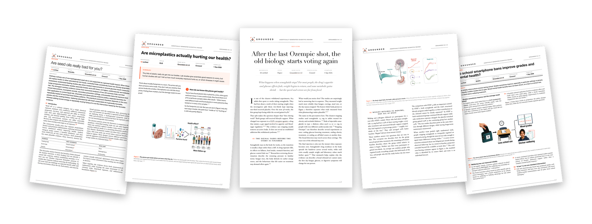

[](#examples)

# Grounded

Ever typed *"look into the scientific evidence on…"* and gotten a beautiful, confident answer?

Two things can be wrong with it, and both are invisible:

1. **The references don't exist.** Papers nobody wrote, DOIs that resolve to nothing, retracted studies quoted as settled fact.
2. **The references exist — but don't say that.** A real paper, correctly formatted, attached to a claim its authors never made.

You can't catch either without checking every reference by hand. Grounded is an agent skill that does exactly that, so you don't have to.

It turns your question into a real literature review with **zero citations from memory**: every source comes from a live OpenAlex/PubMed search, every DOI is verified against Crossref and screened for retractions, and every paper is read before it's cited. The synthesis every review is written from must quote each source verbatim *before* a sentence of prose exists, and afterwards a judge that did not write the text audits **all assertions, including headings and uncited summaries, against evidence or an explicitly checked interpretive basis**, anchored to quotes a deterministic checker string-matches against the source. The review ships with **receipts** — a companion `…-receipts.md` with one entry per cited sentence: source, evidence tier, verdict, quote — and each source in the reference list says how many claims it supports at which tier. An assertion with uncovered factual elements cannot ship: it is dropped, moved, or the sentence is rewritten — never decorated.

**Traceable sources, independently checked assertions, and explicit evidence limits.**

Runs in coding agents with a real shell and network — Claude Code, Codex CLI, and friends. It needs literature API access, Python, artifact storage, and an independent judge context; check actual host capabilities rather than assuming them from its product name. See [Requirements](#requirements).

Grounded is at 0.5.x: the pipeline is complete and every gate is tested, but interfaces still move between minor versions.

## Examples

Ask in plain language, naming a size, a style, and an output format — like this:

> Use the grounded skill to tell me: what happens to your body when you stop taking Ozempic? Popsci, medium, journal PDF.

Missing dimensions are inferred from context and defaults; Grounded asks only when ambiguity materially changes the task. Four real runs, unedited:

- **"What happens to your body when you stop taking Ozempic?"** — popsci · medium → [PDF](examples/ozempic-after-stopping.pdf) · [Markdown](examples/ozempic-after-stopping.md) · [Receipts](examples/ozempic-after-stopping-receipts.md) · 31 verified sources · three cited figures · 6-page journal article
- **"Are microplastics actually harming our health?"** — ELI5 · small → [PDF](examples/microplastics-health-eli5.pdf) · [Markdown](examples/microplastics-health-eli5.md) · [Receipts](examples/microplastics-health-eli5-receipts.md) · 12 verified sources · two cited figures · 3-page journal article
- **"Do school smartphone bans improve grades and mental health?"** — bullets · small → [PDF](examples/school-smartphone-bans.pdf) · [Markdown](examples/school-smartphone-bans.md) · [Receipts](examples/school-smartphone-bans-receipts.md) · 10 verified sources · two cited figures · 3-page journal article
- **"Are seed oils really bad for you?"** — scientific · large → [PDF](examples/seed-oils.pdf) · [Markdown](examples/seed-oils.md) · [Receipts](examples/seed-oils-receipts.md) · 73 verified sources · six cited figures · 10-page journal article

It can also audit text you already have — an LLM answer, a manuscript section, a press release:

> Use the grounded skill to check this draft's claims and references against the literature.

No questions asked: the draft's citations are parsed in whatever form they come (DOI links, `[3]` with a reference list, `(Smith et al., 2020)`), every reference is resolved and verified — a reference no index can find is reported as **NOT FOUND** — and every cited sentence is judged blind against its source's own text. You get a scorecard (*references: 12 cited · 9 verified · 1 retracted · 2 not found; sentences: 30 cited · 18 supported · 7 partial · 5 unsupported*), a line per reference, a receipt per sentence, and the list of citations to fix. Run it on a vanilla model's answer and on Grounded's own review of the same question to compare them on the same terms.

## Sizes, styles, formats

Every review has three independent dimensions — combine them freely. The default is **medium · popsci · journal PDF**.

**Size** — how much evidence:

| | small | medium (default) | large |
|---|---|---|---|
| Words | 600–1,000 | 1,500–2,500 | 3,500–6,000 |
| Verified sources | 10–20 | 30–60 | 70–150 |

**Style** — how it's written; the rigour never changes:

- **scientific** — a journal-register article: abstract, thematic sections, effect sizes, comparison tables.
- **popsci** (default) — a magazine feature with a narrative arc, the contrary evidence as the story's turn — every claim still DOI-linked.
- **bullets** — TL;DR, punchline headings, cited bullets.
- **ELI5** — the simplest possible English, one idea per step.

**Format** — how it's delivered:

- **inline chat** — the review is the reply; every citation is a clickable DOI link, every technical term links to a plain-language explainer, the Sources carry the audit tally, and the receipts file travels alongside.
- **journal PDF** (default) — journal typesetting with superscript citations and up to 2/5/8 communication-first, style-matched figures for small/medium/large reviews, each doing a distinct evidence job; the colophon states the audit tally (cited sentences, source checks, verdicts by evidence tier) and the receipts file is delivered beside the PDF.
- **slides** (experimental) — a 16:9 deck of standalone cited slides; the skill never offers it, you have to ask.

## Installation

Grounded is a standard [Agent Skill](https://github.com/anthropics/skills) — one `SKILL.md` plus its `references/` and `scripts/`.

**Claude Code** — install it as a plugin from this repo:

```
/plugin marketplace add jostelzer/grounded
/plugin install grounded@grounded
```

Or clone the repo and point `~/.claude/skills/grounded` (or a project's `.claude/skills/`) at its `skills/grounded/` directory.

**Codex CLI** — download `grounded.zip` from the [latest release](https://github.com/jostelzer/grounded/releases/latest) and unzip it into `~/.codex/skills/` (or a project's `.codex/skills/`), then start a new session.

**Other CLI agents** — give the agent the `skills/grounded/` folder and use `SKILL.md` as the operating instructions, keeping `references/` and `scripts/` alongside.

## Requirements

Grounded runs the real pipeline or it does not run. That takes a proper coding environment:

- **Outbound network** to `api.openalex.org`, `eutils.ncbi.nlm.nih.gov`, `api.crossref.org`, and `www.ebi.ac.uk` — searching, DOI verification, and the retraction screen all go through them.
- **Python 3** with the pinned packages in `requirements-pdf.txt`, plus WeasyPrint's native Pango libraries for the journal PDF.
- **A writable filesystem** for the working ledger each review builds.

Check these capabilities in the actual host before starting. If literature APIs, artifact storage, or an independent judge context are unavailable, report that limitation instead of presenting an unverified review as verified. The `.skill` and `.zip` bundles are published for environments that meet the requirements above.

## Under the hood

The model does the reading and writing; deterministic scripts do the searching, verification, and rendering. One pipeline, every time:

1. **Scope** — the question is split into the angles a thorough reviewer would cover: existing reviews, largest primary studies, mechanism, contrary and null findings, harms, populations, recent work.
2. **Search** — `find_papers.py` cursor-pages OpenAlex and offset-pages PubMed angle by angle, writing every query to an auditable search manifest; central papers get citation-chased in both directions. Preprints are excluded at the gate.
3. **Read** — every abstract that might be cited; open-access full texts (Europe PMC) for the load-bearing papers, behind an authenticity audit that rejects paywall stubs and challenge pages.
4. **Verify** — `verify_citations.py` checks every DOI against Crossref: title, year, article type, and integrity status — retractions, withdrawals, removals, and expressions of concern via publisher and Retraction Watch update metadata. A failure is a hard stop: the source is fixed or dropped before a word is written. A thin source list on a fringe topic is the skill working, not failing.
5. **Synthesize, write & validate** — the verified evidence is first distilled into a style-neutral claims ledger (every claim with its strength, exact numbers, contrary evidence, boundaries, and a verbatim quote from every source it cites, string-checked before drafting); the styled review is then composed from those claims, citing ledger keys, never remembered references, and never a source the ledger did not quote. Citations and the reference list are generated from the verified records, and a deterministic validator checks structure, citation placement, DOI parity, and figure contracts before delivery.
6. **Explain visually, then render** — every figure first states what the reader should understand, where familiar intuition begins, the eye path that builds the idea, and the one sentence a non-specialist should be able to explain back. Non-quantitative figures compare three detailed concepts for clarity, simplicity, completeness, elegance, and intuitiveness; only the winner reaches the image generator. In-pixel copy stays short, distinct sections use uppercase A–D in every writing style, and explanatory callouts point to exact targets when useful. Verified numbers use bespoke deterministic plots instead. After rendering, the agent states what the pixels actually communicate and must revise when the image requires its caption, leaves jargon unexplained, or fails the explain-back test. The journal PDF is typeset with pinned WeasyPrint, then QA independently proves figures and fonts were not stretched and re-rasterizes every page with Poppler.
7. **Audit and receipt** — inventory all assertions, including headings and uncited summaries. A fresh judge qualifies against unlabelled multi-domain cases, then checks source quotations, quantities, qualifications, and element coverage. Partial source support is accepted only when other evidence covers the remaining elements. The review, classifications, and evidence versions are bound to the checked audit; changed inputs invalidate release. Receipts report source support and access level, while the outcome assessment separately explains certainty and study overlap. The deterministic checks establish consistency, not scientific truth or judge independence.

## License

[MIT](LICENSE)

## Verification contract

Written reviews use schema-v2 assertion audits: exact review/evidence binding, complete element coverage, independent classification of uncited material, and a multi-domain judge qualification set. Outcome certainty and study-family overlap are assessed separately from quotation support. Source counts are advisory; contrary searches are required but disagreement is not. A compact methods disclosure reports scope and access limitations. Canonical budgets live in `skills/grounded/scripts/review_config.py` and generate [the budget table](skills/grounded/references/budgets.md) and evaluation metadata. Historical examples predate this contract and are not retroactively certified by it.
