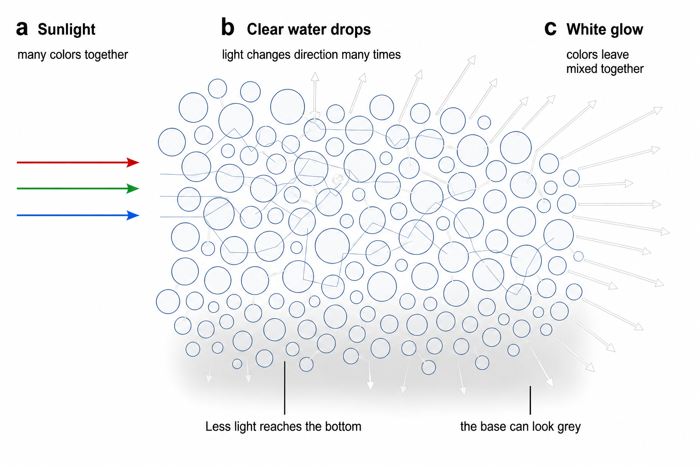

## Why are clouds white, but rain clouds dark?

**TL;DR** — A cloud looks white because its tiny clear drops or bits of ice send the Sun's colors back to us mixed together. A thick rain cloud blocks and loses more light before it reaches the bottom, so the part we see can look grey or dark.

### A cloud is a crowd of clear drops, not a lump of white stuff

An ordinary warm cloud is made of tiny clear water drops. Aircraft measurements show that a usual drop is about **22 millionths of a metre across**. That is much wider than a wave of visible light. [Fu et al. 2022](https://doi.org/10.5194/acp-22-8259-2022), [Kim et al. 2003](https://doi.org/10.1029/2003jd003721)

A drop this size sends red, green, and blue light away with almost the same strength. The exact directions can differ. [Kokhanovsky 2004](https://doi.org/10.1016/s0012-8252%2803%2900042-4), [Bréon & Goloub 1998](https://doi.org/10.1029/98gl01221) High, cold clouds work in a similar way. Their pieces of ice also send light in many directions. The shape and roughness of the ice change the pattern. [Yang et al. 2013](https://doi.org/10.1175/jas-d-12-039.1), [Yang et al. 2018](https://doi.org/10.3390/atmos9120499)

### Many changes of direction make a soft white glow

A cloud's crowd of clear drops turns sunlight again and again. Those many trips mix the Sun's colors and spread a soft white glow instead of making one tiny reflection. [Bohren 1987](https://doi.org/10.1119/1.15109), [Davis & Marshak 2010](https://doi.org/10.1088/0034-4885/73/2/026801), [Kokhanovsky 2004](https://doi.org/10.1016/s0012-8252%2803%2900042-4) You can see the light paths in [Figure 1](#fig-cloud-light-paths).

**Figure 1. A crowd of clear drops makes a white cloud.** Sunlight goes into the cloud, and the drops send it in many new directions. Much of the light escapes as a white glow. Less reaches the bottom of a thick cloud. The lines show the main idea, but real light does not follow these exact drawn paths. [Bohren 1987](https://doi.org/10.1119/1.15109), [Kokhanovsky 2004](https://doi.org/10.1016/s0012-8252%2803%2900042-4), [Kim et al. 2003](https://doi.org/10.1029/2003jd003721), [Kato & Marshak 2009](https://doi.org/10.1029/2008jd010579)

### A thick cloud can shade its own bottom

A cloud gets harder for light to cross when it holds more water, has more drops, or gives the light a longer path. On **13 overcast days**, the amount of liquid water explained most of the changes in how hard the cloud was for light to cross. [Kim et al. 2003](https://doi.org/10.1029/2003jd003721), [Brenguier et al. 2000](https://doi.org/10.1175/1520-0469%282000%29057%3C0803:rpoblc%3E2.0.co;2)

In a deep cloud, lots of light escapes from the top and sides before it reaches the bottom. The base then looks grey because it is dimmer. The drops have not turned grey or black. [Bohren 1987](https://doi.org/10.1119/1.15109), [Kokhanovsky 2004](https://doi.org/10.1016/s0012-8252%2803%2900042-4) Real clouds are also lumpy. The Sun's place and your viewing place change which bright and shaded parts you see. [Kato & Marshak 2009](https://doi.org/10.1029/2008jd010579), [Fu et al. 2022](https://doi.org/10.5194/acp-22-8259-2022)

### White is the usual answer, but clouds can show faint colors

White and grey are the usual cloud colours, but the light can sometimes pick up a faint colour. Measured daylight under thick cloud was not perfectly colourless. After many trips through water drops, a tiny bit more red light was lost. The light below became a little bluer. [Lee & Hernández-Andrés 2005](https://doi.org/10.1364/ao.44.005712)

Thin clouds can also make coloured rings near the Sun when their drops are nearly the same size. Those colours wash into a bright grey background as the cloud gets thicker. [Gedzelman & Lock 2003](https://doi.org/10.1364/ao.42.000497) Some cloud edges show narrow rainbow-like bands. A recent study found that these bands can come from the drop size changing along the edge. [Laven & Hall 2026](https://doi.org/10.1364/ao.580006)

### The drops stay clear; the light's journey changes what we see

A white cloud and a dark rain cloud can be made from the same clear water. The difference is the journey taken by the light. A thinner cloud sends plenty of mixed-colour light toward us, so it looks white. A thicker cloud lets less light reach its base, so that part looks grey or dark. [Bohren 1987](https://doi.org/10.1119/1.15109), [Kokhanovsky 2004](https://doi.org/10.1016/s0012-8252%2803%2900042-4)

**Sources**

**Bohren CF (1987)** Multiple scattering of light and some of its observable consequences. *American Journal of Physics*. https://doi.org/10.1119/1.15109

**Brenguier JL, Pawlowska H, Schüller L, Preusker R, Fischer J, Fouquart Y (2000)** Radiative Properties of Boundary Layer Clouds: Droplet Effective Radius versus Number Concentration. *Journal of the Atmospheric Sciences*. https://doi.org/10.1175/1520-0469%282000%29057%3C0803:rpoblc%3E2.0.co;2

**Bréon F, Goloub P (1998)** Cloud droplet effective radius from spaceborne polarization measurements. *Geophysical Research Letters*. https://doi.org/10.1029/98gl01221

**Davis AB, Marshak A (2010)** Solar radiation transport in the cloudy atmosphere: a 3D perspective on observations and climate impacts. *Reports on Progress in Physics*. https://doi.org/10.1088/0034-4885/73/2/026801

**Fu D, Di Girolamo L, Rauber RM, McFarquhar GM, Nesbitt SW, Loveridge J, Hong Y, van Diedenhoven B, Cairns B, Alexandrov MD, Lawson P, Woods S, Tanelli S, Schmidt S, Hostetler C, Scarino AJ (2022)** An evaluation of the liquid cloud droplet effective radius derived from MODIS, airborne remote sensing, and in situ measurements from CAMP 2 Ex. *Atmospheric Chemistry and Physics*. https://doi.org/10.5194/acp-22-8259-2022

**Gedzelman SD, Lock JA (2003)** Simulating coronas in color. *Applied Optics*. https://doi.org/10.1364/ao.42.000497

**Kato S, Marshak A (2009)** Solar zenith and viewing geometry‐dependent errors in satellite retrieved cloud optical thickness: Marine stratocumulus case. *Journal of Geophysical Research: Atmospheres*. https://doi.org/10.1029/2008jd010579

**Kim B, Schwartz SE, Miller MA, Min Q (2003)** Effective radius of cloud droplets by ground‐based remote sensing: Relationship to aerosol. *Journal of Geophysical Research: Atmospheres*. https://doi.org/10.1029/2003jd003721

**Kokhanovsky A (2004)** Optical properties of terrestrial clouds. *Earth-Science Reviews*. https://doi.org/10.1016/s0012-8252%2803%2900042-4

**Laven P, Hall L (2026)** Iridescent colored bands on clouds. *Applied Optics*. https://doi.org/10.1364/ao.580006

**Lee RL, Hernández-Andrés J (2005)** Colors of the daytime overcast sky. *Applied Optics*. https://doi.org/10.1364/ao.44.005712

**Yang P, Bi L, Baum BA, Liou KN, Kattawar GW, Mishchenko MI, Cole B (2013)** Spectrally Consistent Scattering, Absorption, and Polarization Properties of Atmospheric Ice Crystals at Wavelengths from 0.2 to 100 μm. *Journal of the Atmospheric Sciences*. https://doi.org/10.1175/jas-d-12-039.1

**Yang P, Hioki S, Saito M, Kuo CP, Baum BA, Liou KN (2018)** A Review of Ice Cloud Optical Property Models for Passive Satellite Remote Sensing. *Atmosphere*. https://doi.org/10.3390/atmos9120499
