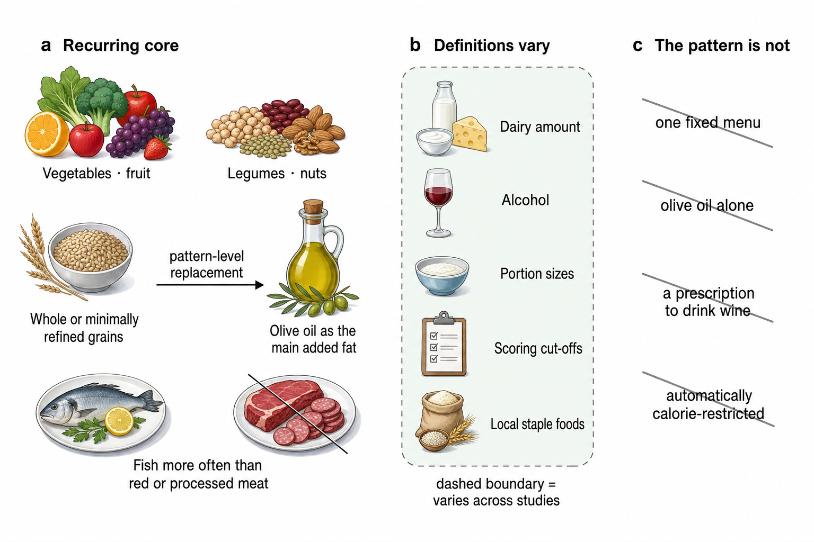

## Which health benefits of the Mediterranean diet are actually supported?

**TL;DR** — The clearest benefit is cardiovascular: supported Mediterranean-diet programmes reduce major events in people at elevated risk, usually by a modest absolute amount. Diabetes prevention is probable, and higher adherence is consistently associated with longer survival. Weight, liver fat, and metabolic markers improve modestly; cancer, dementia, and depression findings are promising but rely much more on observational studies, small trials, or indirect outcomes.

### The intervention is a family of plant-forward patterns, not a fixed menu

- Across definitions, the recurring core is vegetables, fruit, legumes, nuts, minimally refined cereals, olive oil, and fish, with less red or processed meat and sweets; dairy, alcohol, food quantities, and scoring thresholds vary substantially. [Davis et al. 2015](https://doi.org/10.3390/nu7115459), [Bach-Faig et al. 2011](https://doi.org/10.1017/s1368980011002515)
- Epidemiological scores compress this pattern into one adherence value, but reviews identify multiple non-equivalent constructions; even studies using the same label may reward different foods or population-specific median intakes. [Bach et al. 2006](https://doi.org/10.1079/phn2005936), [Hutchins-Wiese et al. 2022](https://doi.org/10.1017/s0007114521002476)
- The 14-item Mediterranean Diet Adherence Screener (MEDAS) used in trials has criterion validity for rapid dietary assessment, but it measures reported behaviour rather than the biological dose received. [Schröder et al. 2011](https://doi.org/10.3945/jn.110.135566)
- The historical hypothesis emerged from long-term cross-population observations in the Seven Countries Study, not from random allocation; it supplied the question that later trials tested rather than causal proof by itself. [Menotti & Puddu 2015](https://doi.org/10.1016/j.numecd.2014.12.001)
- Review quality has also varied: an appraisal of 24 cardiovascular syntheses found complete compliance with only 8%–75% of adapted methodological criteria, with frequent omissions in searches and statistical methods. [Huedo-Medina et al. 2016](https://doi.org/10.3945/ajcn.115.112771)
- The recurring core, variable definitions, and unsupported shortcuts are separated in [Figure 1](#fig-dietary-pattern).

**Figure 1. A Mediterranean diet is a pattern, not one fixed menu.**
- **Shows:** The recurring food-group pattern, the elements that vary across studies, and four interpretations that the intervention evidence does not support.
- **Evidence boundary:** The replacement arrow is pattern-level synthesis, not a serving prescription or proof that one component causes the outcomes.
- **Sources:** [Davis et al. 2015](https://doi.org/10.3390/nu7115459), [Bach-Faig et al. 2011](https://doi.org/10.1017/s1368980011002515), [Hutchins-Wiese et al. 2022](https://doi.org/10.1017/s0007114521002476), [Keshani et al. 2024](https://doi.org/10.1007/s00394-024-03478-9)

### Corrected PREDIMED and two secondary-prevention trials support fewer cardiovascular events

- The original 2013 PREDIMED report is retracted and is not evidence here. A broad statistical audit exposed unusual baseline distributions across published trials; PREDIMED investigators then documented household enrolment and site-level allocation departures and issued a corrected 2018 republication. [Carlisle 2017](https://doi.org/10.1111/anae.13938), [Estruch et al. 2018](https://doi.org/10.1056/nejmoa1800389)
- In the corrected analysis (7,447 high-risk adults; median 4.8 y), the primary composite occurred less often with extra-virgin olive oil ([hazard ratio (HR)](https://en.wikipedia.org/wiki/Hazard_ratio) 0.69, 95% [confidence interval (CI)](https://en.wikipedia.org/wiki/Confidence_interval) 0.53–0.91) and nuts (0.72, 0.54–0.95) than with low-fat advice. Excluding 1,588 participants with known or suspected allocation departures produced essentially the same estimates. [Estruch et al. 2018](https://doi.org/10.1056/nejmoa1800389)
- In the Lyon Diet Heart Study after myocardial infarction (n=605), cardiac death or nonfatal infarction occurred in 14 Mediterranean-pattern participants and 44 controls over 46 months; the magnitude is unusually large and has not been reproduced. [de Lorgeril et al. 1999](https://doi.org/10.1161/01.cir.99.6.779)
- CORDIOPREV randomized 1,002 patients with coronary disease for 7 y: major events occurred in 87 Mediterranean-diet and 111 low-fat participants, with adjusted hazard ratios around 0.72–0.75. [Delgado-Lista et al. 2022](https://doi.org/10.1016/s0140-6736%2822%2900122-2)

| Trial | Population | Comparator | Main result | Evidence key |
|---|---|---|---|---|
| PREDIMED republication | High cardiovascular risk; n=7,447 | Low-fat advice | Major events: HR 0.69 with olive oil; 0.72 with nuts | [Estruch et al. 2018](https://doi.org/10.1056/nejmoa1800389) |
| Lyon Diet Heart | Recent myocardial infarction; n=605 | Prudent Western diet | Cardiac death/nonfatal infarction: 14 vs 44 | [de Lorgeril et al. 1999](https://doi.org/10.1161/01.cir.99.6.779) |
| CORDIOPREV | Established coronary disease; n=1,002 | Low-fat diet | 87 vs 111 major events; HR about 0.72–0.75 | [Delgado-Lista et al. 2022](https://doi.org/10.1016/s0140-6736%2822%2900122-2) |

- The exact trial results—and the reason their magnitudes should not be pooled visually—are shown in [Figure 2](#fig-cardiovascular-endpoints).

**Figure 2. Three endpoint trials support cardiovascular benefit.**
- **Shows:** Corrected PREDIMED hazard ratios and confidence intervals, plus the reported Lyon Diet Heart and CORDIOPREV event counts.
- **Evidence boundary:** Populations, comparators, endpoints, and follow-up differ; the 2013 PREDIMED report is retracted, and only the corrected 2018 republication is plotted.
- **Sources:** [Estruch et al. 2018](https://doi.org/10.1056/nejmoa1800389), [de Lorgeril et al. 1999](https://doi.org/10.1161/01.cir.99.6.779), [Delgado-Lista et al. 2022](https://doi.org/10.1016/s0140-6736%2822%2900122-2), [Karam et al. 2023](https://doi.org/10.1136/bmj-2022-072003)

### Evidence syntheses confirm benefit over minimal support, not clear superiority over every healthy diet

- A [network meta-analysis](https://en.wikipedia.org/wiki/Network_meta-analysis) of 40 trials (35,548 participants at increased risk) found Mediterranean programmes superior to minimal intervention for all-cause mortality (odds ratio 0.72), cardiovascular mortality (0.55), stroke (0.65), and nonfatal infarction (0.48); at intermediate baseline risk this meant about 17 fewer deaths and 17 fewer infarctions per 1,000 over 5 y. [Karam et al. 2023](https://doi.org/10.1136/bmj-2022-072003)
- The same analysis found no convincing mortality or infarction advantage over low-fat programmes, which also outperformed minimal advice. [Karam et al. 2023](https://doi.org/10.1136/bmj-2022-072003)
- Earlier randomized-trial pooling found fewer major vascular events (risk ratio 0.63, 95% CI 0.53–0.75) but no all-cause mortality reduction (1.00, 0.86–1.15); excluding one unreliable trial weakened several secondary results. [Liyanage et al. 2016](https://doi.org/10.1371/journal.pone.0159252)
- Cochrane included 30 trials and 12,461 participants but judged most comparisons low or moderate certainty because interventions, comparators, reporting, and event counts differed. [Rees et al. 2019](https://doi.org/10.1002/14651858.cd009825.pub3)
- Independent reviews generally reproduce lower cardiovascular event rates, while emphasizing that much primary-prevention evidence is inherited from PREDIMED and that programmes frequently include counselling, free foods, or exercise. [Bloomfield et al. 2016](https://doi.org/10.7326/m16-0361), [Sebastian et al. 2024](https://doi.org/10.1016/j.cpcardiol.2024.102509)
- The 2026 Italian-guideline syntheses again found lower primary and recurrent cardiovascular risk, but combined randomized and cohort evidence and reported certainty ranging from low to high by outcome. [Volpe et al. 2026a](https://doi.org/10.1016/j.nut.2025.113038), [Volpe et al. 2026b](https://doi.org/10.1016/j.nut.2025.113053)
- Compared with low-fat diets, Mediterranean patterns yield small favourable changes in weight, blood pressure, glucose, and lipids; between-diet differences are much smaller than comparisons with usual diet. [Nordmann et al. 2011](https://doi.org/10.1016/j.amjmed.2011.04.024)

### Longer survival is a consistent association, but not a randomized mortality result

- In the foundational Greek cohort (22,043 adults), each 2-point adherence increase was associated with 25% lower total mortality; in 74,607 older Europeans the corresponding association was 8%, illustrating how estimates shrink across settings. [Trichopoulou et al. 2003](https://doi.org/10.1056/nejmoa025039), [Trichopoulou et al. 2005](https://doi.org/10.1136/bmj.38415.644155.8f)
- Early pooling of 12 cohorts (1.57 million participants) estimated all-cause mortality risk ratio 0.91 per 2 adherence points; later meta-analyses reached similar 9%–10% reductions per 2 points. [Sofi et al. 2008](https://doi.org/10.1136/bmj.a1344), [Eleftheriou et al. 2018](https://doi.org/10.1017/s0007114518002593), [Soltani et al. 2019](https://doi.org/10.1093/advances/nmz041)
- The newest broad synthesis included 54 cohorts, 1.83 million participants, and 346,034 deaths: risk ratio 0.96 (95% CI 0.95–0.97) per 1-point increase, with moderate certainty. [Nucci et al. 2026](https://doi.org/10.1016/j.nut.2026.113189)
- Two large US health-professional cohorts linked the top adherence category to total mortality HR 0.82 and cardiovascular disease HR 0.83; these are carefully adjusted but remain observational. [Shan et al. 2023](https://doi.org/10.1001/jamainternmed.2022.6117), [Shan et al. 2020](https://doi.org/10.1001/jamainternmed.2020.2176)
- Among 25,315 US women followed for up to 25 y, the highest adherence group had mortality HR 0.77; metabolic, inflammatory, lipoprotein, insulin-resistance, and body-mass pathways explained only part of the association. [Ahmad et al. 2024](https://doi.org/10.1001/jamanetworkopen.2024.14322)
- Associations also appear in people with diabetes (mortality HR 0.63 per 2 points), yet healthier adherers differ in activity, smoking, education, and care access. [Bonaccio et al. 2016](https://doi.org/10.1177/2047487315569409)
- Biomarker-based adherence predicted lower all-cause and cardiovascular mortality in an older Italian cohort, whereas repeated food-questionnaire scoring was weaker; even biomarkers were imperfectly specific and could not eliminate [confounding](https://en.wikipedia.org/wiki/Confounding). [Hidalgo-Liberona et al. 2021](https://doi.org/10.1186/s12916-021-02154-7)

### Weight and metabolic risk factors improve, mostly by small amounts

- A 50-study synthesis associated the pattern with lower metabolic-syndrome risk and pooled changes of roughly −2.4 mm Hg systolic pressure, −6 mg/dL triglycerides, −4 mg/dL glucose, and less than 1 cm waist circumference. [Kastorini et al. 2011](https://doi.org/10.1016/j.jacc.2010.09.073)
- Across 57 controlled trials (36,983 participants), direction favoured the Mediterranean diet for 18 of 28 metabolic measures, but comparator and intervention heterogeneity was often high. [Papadaki et al. 2020](https://doi.org/10.3390/nu12113342)
- In DIRECT (n=322), 2-y weight loss was 4.4 kg with Mediterranean, 2.9 kg with low-fat, and 4.7 kg with low-carbohydrate diets; thus the pattern beat low fat but not low carbohydrate. [Shai et al. 2008](https://doi.org/10.1056/nejmoa0708681)
- A 121-trial comparison found most named diets produced modest 6-mo losses that attenuated by 12 mo; Mediterranean programmes were unusual in retaining some cardiovascular risk-factor improvement, not in producing uniquely large weight loss. [Ge et al. 2020](https://doi.org/10.1136/bmj.m696)
- PREDIMED-Plus combined a 30% energy reduction, activity, and intensive behavioural support. In a 1,521-person imaging substudy, it reduced total and visceral fat and slowed relative lean-mass loss over 3 y, but diet alone cannot receive the credit. [Konieczna et al. 2023](https://doi.org/10.1001/jamanetworkopen.2023.37994)
- A polyphenol-enriched green variant reduced visceral fat by 14.1% versus 6.0% with standard Mediterranean and 4.2% with healthy guidance; 88% of participants were men in a monitored workplace. [Zelicha et al. 2022](https://doi.org/10.1186/s12916-022-02525-8)
- A 2024 review of olive-oil-enriched Mediterranean trials found no consistent cardiometabolic benefit beyond a very small triglyceride reduction, countering claims that extra oil alone reproduces the whole pattern. [Keshani et al. 2024](https://doi.org/10.1007/s00394-024-03478-9)
- In pre-existing metabolic disease, 69-study pooling found modest improvements in [body mass index](https://en.wikipedia.org/wiki/Body_mass_index), waist, [low-density lipoprotein (LDL)](https://en.wikipedia.org/wiki/Low-density_lipoprotein) cholesterol, triglycerides, glucose, insulin resistance, and [C-reactive protein (CRP)](https://en.wikipedia.org/wiki/C-reactive_protein), while [glycated haemoglobin (HbA1c)](https://en.wikipedia.org/wiki/Glycated_hemoglobin) and lean-mass findings remained inconsistent. [Muscogiuri et al. 2026](https://doi.org/10.1016/j.nut.2025.112975)

### Type 2 diabetes has unusually coherent trial, cohort, and biomarker evidence

- In the diabetes-free PREDIMED subgroup, Mediterranean diets reduced incident diabetes relative to low-fat advice; annual adherence analysis gave HR 0.80 (95% CI 0.70–0.92) per 2 MEDAS points and 0.46 (0.25–0.83) for highest versus lowest adherence. [Salas-Salvadó et al. 2014](https://doi.org/10.7326/m13-1725), [Martínez-González et al. 2023](https://doi.org/10.1186/s12933-023-01994-2)
- PREDIMED-Plus later found that adding energy restriction and activity reduced 6-y diabetes incidence by 31% relative to an unrestricted Mediterranean diet (9.5% vs 12.0%), again testing a multicomponent programme rather than diet alone. [Ruiz-Canela et al. 2025](https://doi.org/10.7326/annals-25-00388)
- A Mediterranean biomarker score trained in a feeding trial predicted diabetes HR 0.71 (0.65–0.77) per standard deviation in EPIC-InterAct (22,202 participants), compared with 0.90 for self-report; specificity and residual confounding remain possible. [Sobiecki et al. 2023](https://doi.org/10.1371/journal.pmed.1004221)
- In 112,493 UK Biobank participants, the top Mediterranean-lifestyle quartile had diabetes HR 0.70, but the exposure deliberately included physical activity, rest, and social habits. [Maroto-Rodriguez et al. 2023](https://doi.org/10.1186/s12933-023-01999-x)
- Systematic reviews of prospective studies estimate 19%–23% lower incidence with higher adherence. In established diabetes, randomized evidence shows modest improvements rather than remission by diet alone. [Schwingshackl et al. 2015](https://doi.org/10.1017/s1368980014001542), [Esposito et al. 2015](https://doi.org/10.1136/bmjopen-2015-008222)
- A 2025 synthesis of 11 [randomized controlled trials](https://en.wikipedia.org/wiki/Randomized_controlled_trial) found HbA1c −0.31 percentage points, fasting glucose −0.85 mmol/L, and body mass index −0.83 kg/m² versus control diets. [Wu et al. 2025](https://doi.org/10.3390/nu17243908)

| Cardiometabolic claim | Best estimate | Interpretation | Evidence key |
|---|---:|---|---|
| Incident diabetes, PREDIMED-Plus | 9.5% vs 12.0% over 6 y | Additional benefit from energy restriction + activity | [Ruiz-Canela et al. 2025](https://doi.org/10.7326/annals-25-00388) |
| HbA1c in established diabetes | −0.31 percentage points | Small but clinically useful adjunct | [Wu et al. 2025](https://doi.org/10.3390/nu17243908) |
| Weight in DIRECT | −4.4 kg at 2 y | Better than low fat; similar to low carbohydrate | [Shai et al. 2008](https://doi.org/10.1056/nejmoa0708681) |
| Olive-oil-enriched trials | Mostly null | Oil supplementation is not the whole pattern | [Keshani et al. 2024](https://doi.org/10.1007/s00394-024-03478-9) |

### Cancer associations are broad, but causal evidence is thin

- An [umbrella review](https://en.wikipedia.org/wiki/Umbrella_review) rated support strongest for overall cancer incidence and mortality, while most site-specific findings were only suggestive or weak. [Dinu et al. 2018](https://doi.org/10.1038/ejcn.2017.58)
- The largest updated synthesis (117 studies; 3.20 million participants) associated high adherence with cancer mortality risk ratio 0.87, colorectal cancer 0.83, and breast cancer 0.94; most site-specific certainty was low or very low. [Morze et al. 2021](https://doi.org/10.1007/s00394-020-02346-6)
- Repeated cancer meta-analyses converge on inverse observational associations, but different scoring systems, retrospective case-control data, and lifestyle confounding limit causal interpretation. [Schwingshackl et al. 2017](https://doi.org/10.3390/nu9101063)
- Dose-response pooling supports lower colorectal risk, while a separate postmenopausal breast-cancer cohort/meta-analysis found protection concentrated in estrogen-receptor-negative disease; neither is randomized. [Zhong et al. 2020](https://doi.org/10.1093/ajcn/nqaa083), [van den Brandt & Schulpen 2017](https://doi.org/10.1002/ijc.30654)
- PREDIMED reported fewer invasive breast cancers in the olive-oil arm (hazard ratio 0.32, 95% CI 0.13–0.79), but this secondary analysis contained only 35 cases. [Toledo et al. 2015](https://doi.org/10.1001/jamainternmed.2015.4838)
- Olive-oil intake itself was associated with cardiovascular, diabetes, and mortality benefits but not cancer (risk ratio 0.94, 0.86–1.03), weakening single-ingredient explanations. [Martínez-González et al. 2022](https://doi.org/10.1016/j.clnu.2022.10.001)
- A breast-cancer umbrella review likewise found consistent direction but predominantly observational evidence, leaving prevention trials as the missing test. [González-Palacios Torres et al. 2023](https://doi.org/10.1016/j.clnu.2023.02.012)

### Dementia cohorts are positive; the largest dedicated cognitive trial was null

- Meta-analyses of observational studies associate higher adherence with cognitive impairment HR 0.82, dementia 0.89, and Alzheimer disease 0.70, but report heterogeneity and possible publication bias. [Fekete et al. 2025](https://doi.org/10.1007/s11357-024-01488-3), [Nucci et al. 2024](https://doi.org/10.1007/s40520-024-02718-6)
- UK Biobank followed 60,298 adults for 9.1 y: high adherence predicted dementia HR 0.77 and absolute risk 1.18% versus 1.73%, independent of measured genetic risk. [Shannon et al. 2023](https://doi.org/10.1186/s12916-023-02772-3)
- Earlier synthesis found mild cognitive impairment risk ratio 0.75 and Alzheimer disease 0.71 in cohorts; two small trials yielded episodic-memory [standardized mean difference](https://en.wikipedia.org/wiki/Standardized_mean_difference) 0.20. [Fu et al. 2022](https://doi.org/10.3389/fnut.2022.946361), [Singh et al. 2014](https://doi.org/10.3233/jad-130830)
- A PREDIMED substudy reported better global cognition after 6.5 y, but it was small and inherited the parent trial's allocation concerns. [Martínez-Lapiscina et al. 2013](https://doi.org/10.1136/jnnp-2012-304792)
- In contrast, the 3-y MIND trial (604 older adults; calorie-restricted intervention and control) found a global-cognition difference of 0.035 standard deviations (95% CI −0.022 to 0.092) and no meaningful [magnetic resonance imaging (MRI)](https://en.wikipedia.org/wiki/Magnetic_resonance_imaging) difference. [Barnes et al. 2023](https://doi.org/10.1056/nejmoa2302368)
- A MIND-diet meta-analysis remains favourable because cohort weights dominate, while a 2024 PREVENT analysis found no association with cognition or neuroimaging. [Chen et al. 2023](https://doi.org/10.1001/jamapsychiatry.2023.0800), [Gregory et al. 2024](https://doi.org/10.1111/ene.16345)

### Depression trials point in the same direction, but effect size is unstable

- Prospective dietary-pattern studies associate high adherence with roughly one-third lower incident depression, but reverse causation and social-pattern confounding remain plausible. [Lassale et al. 2019](https://doi.org/10.1038/s41380-018-0237-8), [Shafiei et al. 2019](https://doi.org/10.1093/nutrit/nuy070)
- SMILES randomized 67 adults for 12 wk: the diet arm improved [Montgomery-Åsberg Depression Rating Scale](https://en.wikipedia.org/wiki/Montgomery%E2%80%93%C3%85sberg_Depression_Rating_Scale) scores 7.1 points more than social support; remission was 32% versus 8%. [Jacka et al. 2017](https://doi.org/10.1186/s12916-017-0791-y)
- HELFIMED (n=152) combined Mediterranean advice with fish-oil supplementation and group delivery, producing greater symptom improvement than social groups; the design cannot isolate the diet. [Parletta et al. 2019](https://doi.org/10.1080/1028415x.2017.1411320)
- AMMEND randomized 72 young men and found larger symptom reductions over 12 wk, extending the signal to another small population-specific trial. [Bayes et al. 2022](https://doi.org/10.1093/ajcn/nqac106)
- Five-trial pooling (1,507 participants) estimated symptom standardized mean difference −0.53, but heterogeneity was 87%, the prediction interval crossed zero, and certainty was low. [Bizzozero-Peroni et al. 2025](https://doi.org/10.1093/nutrit/nuad176)
- A 104-study mental-health review found broadly favourable associations across depression, anxiety, stress, and well-being, while stressing that only 16 studies were interventional. [Kabthymer et al. 2026](https://doi.org/10.1017/s0954422425100243)

### Liver fat falls with calorie-restricted variants, without clear superiority to low-fat diets

- An ad libitum Mediterranean diet and a low-fat diet both reduced liver fat in a 12-wk randomized trial, with no decisive between-diet advantage. [Properzi et al. 2018](https://doi.org/10.1002/hep.30076)
- In DIRECT, hepatic-fat reduction statistically mediated part of the Mediterranean diet's cardiometabolic advantage over low fat, but mediation does not identify which foods caused it. [Gepner et al. 2019](https://doi.org/10.1016/j.jhep.2019.04.013)
- DIRECT-PLUS (n=294) found relative liver-fat reductions of 38.9% with green Mediterranean, 19.6% with standard Mediterranean, and 12.2% with healthy guidance at 18 mo; all groups received activity support and the enriched arm included green tea, walnuts, and Mankai. [Yaskolka Meir et al. 2021](https://doi.org/10.1136/gutjnl-2020-323106)
- Earlier randomized-trial pooling suggested improvements in steatosis and insulin resistance, whereas enzyme effects were small and inconsistent. [Kawaguchi et al. 2021](https://doi.org/10.1055/s-0041-1723751), [Sangouni et al. 2022](https://doi.org/10.1017/s0007114521002270)
- A 2024 head-to-head meta-analysis concluded Mediterranean and low-fat diets were similarly effective for short-term liver fat and enzymes, a direct contradiction to claims of unique superiority. [Xiong et al. 2024](https://doi.org/10.1039/d4fo01461h)
- An Asian-adapted randomized trial supports cultural transferability for fatty-liver management, but adaptation changes the tested pattern and long-term clinical outcomes remain unknown. [Chooi et al. 2024](https://doi.org/10.1016/j.ajcnut.2023.11.013)

### Measured biology is plausible and responsive, but does not substitute for clinical outcomes

- Trial meta-analysis finds small improvements in endothelial function and inflammatory markers, though effects differ by assay, population, and comparator. [Schwingshackl & Hoffmann 2014](https://doi.org/10.1016/j.numecd.2014.03.003), [Koelman et al. 2022](https://doi.org/10.1093/advances/nmab086)
- A 2026 synthesis of 33 trials (3,476 participants) found reductions in high-sensitivity CRP, interleukin-6, and interleukin-17, but not conventional CRP, interleukin-10, tumour-necrosis factor, or total antioxidant capacity. [Keshani et al. 2026](https://doi.org/10.1093/nutrit/nuaf213)
- Mechanistic reviews therefore support several converging pathways—fat quality, polyphenols, fibre fermentation, inflammation, endothelial function, insulin sensitivity—without identifying one necessary ingredient. [Itsiopoulos et al. 2022](https://doi.org/10.1097/mco.0000000000000872)
- In an 8-wk isocaloric trial (n=82), the diet lowered total cholesterol and altered bile acids, the microbiome, and metabolome without changing body weight; glucose, insulin, and CRP were null. [Meslier et al. 2020](https://doi.org/10.1136/gutjnl-2019-320438)
- A 1-y older-adult intervention (microbiome subset n=612) shifted microbial taxa and functions that covaried with lower frailty and inflammation, while a separate obesity trial showed that two healthy diets altered gut communities and insulin sensitivity. [Ghosh et al. 2020](https://doi.org/10.1136/gutjnl-2019-319654), [Haro et al. 2016](https://doi.org/10.1210/jc.2015-3351)
- Plasma metabolomic profiles partly tracked adherence and cardiovascular risk, providing objective exposure measures rather than proof that the metabolites mediate events. [Li et al. 2020](https://doi.org/10.1093/eurheartj/ehaa209)
- Multi-omics work shows baseline bile acids and specific microbes modify lipid and adiposity responses; newer PREDIMED-Plus data likewise connect diet-induced microbiome/metabolome shifts with risk factors. These are secondary mechanistic analyses, not independent endpoint trials. [Gao et al. 2024](https://doi.org/10.1080/19490976.2024.2426610), [García-Gavilán et al. 2024](https://doi.org/10.1016/j.ajcnut.2024.02.021)

### Translation depends on culture, cost, support, and what replaces meat or alcohol

- A Mediterranean pattern can be reconstructed outside its birthplace, but food availability, cooking practices, socioeconomic resources, and the meaning of adherence scores change; cultural adaptation is part of the intervention, not a cosmetic step. [Hoffman & Gerber 2013](https://doi.org/10.1111/nure.12040), [Woodside et al. 2022](https://doi.org/10.1017/s0007114522001945)
- Score agreement is limited even within one study population, so an effect per point is not automatically portable between instruments or countries. [Olmedo-Requena et al. 2019](https://doi.org/10.3390/nu11030488)
- MedEx-UK demonstrated that a theory-informed programme could improve adherence and remain acceptable in older adults at dementia risk, but the intervention supplied behavioural maintenance and activity support. [Jennings et al. 2024](https://doi.org/10.1186/s12916-024-03815-z)
- Cross-country research identifies price, access, culinary skills, family norms, and knowledge as recurrent barriers; free oil, nuts, counselling, and frequent contact in efficacy trials set a higher-support condition than routine life. [Biggi et al. 2024](https://doi.org/10.3390/nu16152405)
- Economic modelling in secondary prevention suggests Mediterranean diet plus activity can be cost-effective, but estimates inherit assumptions about adherence and event reduction. [Bonekamp et al. 2024](https://doi.org/10.1093/eurjpc/zwae123)
- A sustainability review (35 studies, mostly models) classified the pattern as environmentally favourable in 91% of comparisons, with results driven mainly by lower ruminant-meat intake; water footprints and local production can reverse particular comparisons. [Lorca-Camara et al. 2024](https://doi.org/10.1016/j.advnut.2024.100322), [Dernini et al. 2017](https://doi.org/10.1017/s1368980016003177)
- Traditional scores reward moderate alcohol, but modern interpretation should not encourage non-drinkers to start: cancer and addiction risk make wine an optional historical component, not a therapeutic ingredient. [Martínez-González 2024](https://doi.org/10.1016/j.ajcnut.2023.12.020)
- Dietary-pattern mortality reviews still identify a much larger observational than randomized evidence base, so residual healthy-user bias remains a central limit even after extensive adjustment. [English et al. 2021](https://doi.org/10.1001/jamanetworkopen.2021.22277)
- The intervention package, adherence conditions, and causal stopping point are traced in [Figure 3](#fig-implementation-boundary).

**Figure 3. Benefits belong to the supported programme as delivered.**
- **Shows:** Trials evaluate a replacement pattern with varying support; real-world conditions influence adherence before risk factors, imaging outcomes, or clinical events are measured.
- **Evidence boundary:** The pathway is programme logic, not a quantified mediation model; it does not isolate one ingredient, prove unsupported diet alone, or guarantee identical effects after adaptation.
- **Sources:** [Estruch et al. 2018](https://doi.org/10.1056/nejmoa1800389), [Jennings et al. 2024](https://doi.org/10.1186/s12916-024-03815-z), [Biggi et al. 2024](https://doi.org/10.3390/nu16152405), [Lorca-Camara et al. 2024](https://doi.org/10.1016/j.advnut.2024.100322), [Ruiz-Canela et al. 2025](https://doi.org/10.7326/annals-25-00388)

### The evidence supports a hierarchy of claims, not a universal health halo

| Outcome | Best-supported conclusion | Main uncertainty |
|---|---|---|
| Major cardiovascular events | Probably reduced in higher-risk adults, especially versus minimal advice | Absolute benefit and superiority to other high-quality diets [Karam et al. 2023](https://doi.org/10.1136/bmj-2022-072003) |
| Type 2 diabetes | Probably prevented; glycaemia improves modestly in established disease | Added effects of calorie restriction, activity, and intensive support [Ruiz-Canela et al. 2025](https://doi.org/10.7326/annals-25-00388) |
| All-cause mortality | Consistently associated with 4% lower risk per adherence point | No mortality trial capable of confirming the cohort estimate [Nucci et al. 2026](https://doi.org/10.1016/j.nut.2026.113189) |
| Weight and metabolic markers | Small, clinically useful changes | Not uniquely better than low-carbohydrate or low-fat diets [Ge et al. 2020](https://doi.org/10.1136/bmj.m696) |
| Cancer | Lower incidence/mortality associations for several sites | Mostly observational; one small secondary randomized signal [Morze et al. 2021](https://doi.org/10.1007/s00394-020-02346-6) |
| Cognition | Cohorts favourable; dedicated 3-y trial null | Duration, population risk, active comparator, residual confounding [Barnes et al. 2023](https://doi.org/10.1056/nejmoa2302368) |
| Depression | Small trials favourable | Low certainty, high heterogeneity, weak blinding [Bizzozero-Peroni et al. 2025](https://doi.org/10.1093/nutrit/nuad176) |
| Fatty liver | Liver fat improves with energy-restricted variants | Similar short-term efficacy to low-fat diets; few hard outcomes [Xiong et al. 2024](https://doi.org/10.1039/d4fo01461h) |

- The most defensible interpretation is selective: use the pattern as a supported cardiovascular and diabetes-prevention programme, not as proof that olive oil, wine, or any single food prevents every chronic disease.
- For outcomes beyond cardiometabolic disease, larger preregistered trials with active comparators, objective adherence measures, diverse populations, and clinical rather than surrogate endpoints would change confidence most.
- The uneven directness and certainty across outcomes are mapped in [Figure 4](#fig-evidence-strength).

**Figure 4. The evidence is strongest for cardiometabolic outcomes.**
- **Shows:** Outcomes are arranged by human evidence directness and certainty, from clinical endpoint trials through consistent but less-direct evidence to limited or surrogate outcomes.
- **Evidence boundary:** This is a narrative-review synthesis, not a formal GRADE score; position, marker area, and colour do not encode effect size or individual benefit.
- **Sources:** [Karam et al. 2023](https://doi.org/10.1136/bmj-2022-072003), [Ruiz-Canela et al. 2025](https://doi.org/10.7326/annals-25-00388), [Nucci et al. 2026](https://doi.org/10.1016/j.nut.2026.113189), [Morze et al. 2021](https://doi.org/10.1007/s00394-020-02346-6), [Barnes et al. 2023](https://doi.org/10.1056/nejmoa2302368)

**Sources**

**Ahmad S, Moorthy MV, Lee IM, Ridker PM, Manson JE, Buring JE, Demler OV, Mora S (2024)** Mediterranean Diet Adherence and Risk of All-Cause Mortality in Women. *JAMA Network Open*. https://doi.org/10.1001/jamanetworkopen.2024.14322

**Bach A, Serra-Majem L, Carrasco JL, Roman B, Ngo J, Bertomeu I, Obrador B (2006)** The use of indexes evaluating the adherence to the Mediterranean diet in epidemiological studies: a review. *Public Health Nutrition*. https://doi.org/10.1079/phn2005936

**Bach-Faig A, Berry EM, Lairon D, Reguant J, Trichopoulou A, Dernini S, Medina FX, Battino M, Belahsen R, Miranda G, Serra-Majem L (2011)** Mediterranean diet pyramid today. Science and cultural updates. *Public Health Nutrition*. https://doi.org/10.1017/s1368980011002515

**Barnes LL, Dhana K, Liu X, Carey VJ, Ventrelle J, Johnson K, Hollings CS, Bishop L, Laranjo N, Stubbs BJ, Reilly X, Agarwal P, Zhang S, Grodstein F, Tangney CC, Holland TM, Aggarwal NT, Arfanakis K, Morris MC, Sacks FM (2023)** Trial of the MIND Diet for Prevention of Cognitive Decline in Older Persons. *New England Journal of Medicine*. https://doi.org/10.1056/nejmoa2302368

**Bayes J, Schloss J, Sibbritt D (2022)** The effect of a Mediterranean diet on the symptoms of depression in young males (the “AMMEND: A Mediterranean Diet in MEN with Depression” study): a randomized controlled trial. *The American Journal of Clinical Nutrition*. https://doi.org/10.1093/ajcn/nqac106

**Biggi C, Biasini B, Ogrinc N, Strojnik L, Endrizzi I, Menghi L, Khémiri I, Mankai A, Slama FB, Jamoussi H, Riviou K, Elfazazi K, Rehman N, Scazzina F, Menozzi D (2024)** Drivers and Barriers Influencing Adherence to the Mediterranean Diet: A Comparative Study across Five Countries. *Nutrients*. https://doi.org/10.3390/nu16152405

**Bizzozero-Peroni B, Martínez-Vizcaíno V, Fernández-Rodríguez R, Jiménez-López E, Núñez de Arenas-Arroyo S, Saz-Lara A, Díaz-Goñi V, Mesas AE (2025)** The impact of the Mediterranean diet on alleviating depressive symptoms in adults: a systematic review and meta-analysis of randomized controlled trials. *Nutrition Reviews*. https://doi.org/10.1093/nutrit/nuad176

**Bloomfield HE, Koeller E, Greer N, MacDonald R, Kane R, Wilt TJ (2016)** Effects on Health Outcomes of a Mediterranean Diet With No Restriction on Fat Intake. *Annals of Internal Medicine*. https://doi.org/10.7326/m16-0361

**Bonaccio M, Di Castelnuovo A, Costanzo S, Persichillo M, De Curtis A, Donati MB, de Gaetano G, Iacoviello L, on behalf of the MOLI-SANI study Investigators (2016)** Adherence to the traditional Mediterranean diet and mortality in subjects with diabetes. Prospective results from the MOLI-SANI study. *European Journal of Preventive Cardiology*. https://doi.org/10.1177/2047487315569409

**Bonekamp NE, Visseren FLJ, van der Schouw YT, van der Meer MG, Teraa M, Ruigrok YM, Geleijnse JM, Koopal C, UCC-SMART study group, Cramer MJ, Nathoe HM, van der Harst P, van de Meer MG, de Borst GJ, Teraa M, Bots ML, van Smeden M, Emmelot-Vonk MH, de Jong PA, Lely AT, van der Kaaij NP, Kappelle LJ, Ruigrok YM, Verhaar MC, Dorresteijn JAN, Visseren FLJ (2024)** Cost-effectiveness of Mediterranean diet and physical activity in secondary cardiovascular disease prevention: results from the UCC-SMART cohort study. *European Journal of Preventive Cardiology*. https://doi.org/10.1093/eurjpc/zwae123

**Carlisle JB (2017)** Data fabrication and other reasons for non‐random sampling in 5087 randomised, controlled trials in anaesthetic and general medical journals. *Anaesthesia*. https://doi.org/10.1111/anae.13938

**Chen H, Dhana K, Huang Y, Huang L, Tao Y, Liu X, Melo van Lent D, Zheng Y, Ascherio A, Willett W, Yuan C (2023)** Association of the Mediterranean Dietary Approaches to Stop Hypertension Intervention for Neurodegenerative Delay (MIND) Diet With the Risk of Dementia. *JAMA Psychiatry*. https://doi.org/10.1001/jamapsychiatry.2023.0800

**Chooi YC, Zhang QA, Magkos F, Ng M, Michael N, Wu X, Volchanskaya VSB, Lai X, Wanjaya ER, Elejalde U, Goh CC, Yap CPL, Wong LH, Lim KJ, Velan SS, Yaligar J, Muthiah MD, Chong YS, Loo EXL, Eriksson JG, Lim KLM, Kouk MSF, Mei Chong EW, Gani MA, Li L, Tay VHK, Kway YM, Kumar M, Sadananthan SA, Khoo K, Koh D, Lim R, Kang CW, Sin KL, Lim JW (2024)** Effect of an Asian-adapted Mediterranean diet and pentadecanoic acid on fatty liver disease: the TANGO randomized controlled trial. *The American Journal of Clinical Nutrition*. https://doi.org/10.1016/j.ajcnut.2023.11.013

**Davis C, Bryan J, Hodgson J, Murphy K (2015)** Definition of the Mediterranean Diet; A Literature Review. *Nutrients*. https://doi.org/10.3390/nu7115459

**de Lorgeril M, Salen P, Martin JL, Monjaud I, Delaye J, Mamelle N (1999)** Mediterranean Diet, Traditional Risk Factors, and the Rate of Cardiovascular Complications After Myocardial Infarction. *Circulation*. https://doi.org/10.1161/01.cir.99.6.779

**Delgado-Lista J, Alcala-Diaz JF, Torres-Peña JD, Quintana-Navarro GM, Fuentes F, Garcia-Rios A, Ortiz-Morales AM, Gonzalez-Requero AI, Perez-Caballero AI, Yubero-Serrano EM, Rangel-Zuñiga OA, Camargo A, Rodriguez-Cantalejo F, Lopez-Segura F, Badimon L, Ordovas JM, Perez-Jimenez F, Perez-Martinez P, Lopez-Miranda J, Alcala-Diaz JF, Almaden Peña Y, Aranda E, Arenas de Larriva AP, Badimon L, Badimon JJ, Blanco-Molina A, Blanco-Rojo R, Bolivar-Muñoz J, Caballero-Villarraso J, Camargo A, Chica J, Corina A, Criado-Garcia J, Cruz-Teno C, Daponte-Codina A, de Teresa Galvan E, Delgado-Casado N, Delgado-Lista J, Estruch R, Fernandez JM, Fernandez-Gandara C, Fuentes-Jimenez F, Garcia-Carpintero Fernandez-Pacheco S, Garcia-Rios A, Gomez-Delgado F, Gomez-Garduño A, Gomez-Luna P, Gomez-Luna MJ, Gonzalez-Guardia L, Gonzalez-Requero AI, Gutierrez-Mariscal FM, Haro-Mariscal CM, Jimenez-Lucena R, Jimenez-Morales AI, Leon-Acuña A, Lopez-Miranda J, Lopez-Segura F, Marin-Hinojosa C, Meneses Alvarez ME, Mesa-Luna D, Moya-Garrido MN, Muñoz-Carvajal I, Navarro-Martos V, Ochoa JJ, Ordovas JM, Ortiz-Minuesa JA, Ortiz-Morales AM, Pan M, Peña-Orihuela P, Perez-Caballero AI, Perez-Corral I, Perez-Jimenez F, Perez-Martinez P, Pi-Sunyer FX, Quintana-Navarro GM, Ramirez-Lara I, Rangel-Zuñiga OA, Rodriguez-Artalejo F, Rodriguez-Cantalejo F, Romero MA, Roncero-Ramos I, Ruano-Ruiz JA, Ruiz de Castroviejo J, Sanchez-Villegas P, Suarez de Lezo J, Suarez de Lezo J, Torres-Peña JD, Vals-Delgado C, Valverde R, Visioli F, Yubero-Serrano EM (2022)** Long-term secondary prevention of cardiovascular disease with a Mediterranean diet and a low-fat diet (CORDIOPREV): a randomised controlled trial. *The Lancet*. https://doi.org/10.1016/s0140-6736%2822%2900122-2

**Dernini S, Berry E, Serra-Majem L, La Vecchia C, Capone R, Medina F, Aranceta-Bartrina J, Belahsen R, Burlingame B, Calabrese G, Corella D, Donini L, Lairon D, Meybeck A, Pekcan A, Piscopo S, Yngve A, Trichopoulou A (2017)** Med Diet 4.0: the Mediterranean diet with four sustainable benefits. *Public Health Nutrition*. https://doi.org/10.1017/s1368980016003177

**Dinu M, Pagliai G, Casini A, Sofi F (2018)** Mediterranean diet and multiple health outcomes: an umbrella review of meta-analyses of observational studies and randomised trials. *European Journal of Clinical Nutrition*. https://doi.org/10.1038/ejcn.2017.58

**Eleftheriou D, Benetou V, Trichopoulou A, La Vecchia C, Bamia C (2018)** Mediterranean diet and its components in relation to all-cause mortality: meta-analysis. *British Journal of Nutrition*. https://doi.org/10.1017/s0007114518002593

**English LK, Ard JD, Bailey RL, Bates M, Bazzano LA, Boushey CJ, Brown C, Butera G, Callahan EH, de Jesus J, Mattes RD, Mayer-Davis EJ, Novotny R, Obbagy JE, Rahavi EB, Sabate J, Snetselaar LG, Stoody EE, Van Horn LV, Venkatramanan S, Heymsfield SB (2021)** Evaluation of Dietary Patterns and All-Cause Mortality. *JAMA Network Open*. https://doi.org/10.1001/jamanetworkopen.2021.22277

**Esposito K, Maiorino MI, Bellastella G, Chiodini P, Panagiotakos D, Giugliano D (2015)** A journey into a Mediterranean diet and type 2 diabetes: a systematic review with meta-analyses. *BMJ Open*. https://doi.org/10.1136/bmjopen-2015-008222

**Estruch R, Ros E, Salas-Salvadó J, Covas MI, Corella D, Arós F, Gómez-Gracia E, Ruiz-Gutiérrez V, Fiol M, Lapetra J, Lamuela-Raventos RM, Serra-Majem L, Pintó X, Basora J, Muñoz MA, Sorlí JV, Martínez JA, Fitó M, Gea A, Hernán MA, Martínez-González MA (2018)** Primary Prevention of Cardiovascular Disease with a Mediterranean Diet Supplemented with Extra-Virgin Olive Oil or Nuts. *New England Journal of Medicine*. https://doi.org/10.1056/nejmoa1800389

**Fekete M, Varga P, Ungvari Z, Fekete JT, Buda A, Szappanos Á, Lehoczki A, Mózes N, Grosso G, Godos J, Menyhart O, Munkácsy G, Tarantini S, Yabluchanskiy A, Ungvari A, Győrffy B (2025)** The role of the Mediterranean diet in reducing the risk of cognitive impairement, dementia, and Alzheimer’s disease: a meta-analysis. *GeroScience*. https://doi.org/10.1007/s11357-024-01488-3

**Fu J, Tan LJ, Lee JE, Shin S (2022)** Association between the mediterranean diet and cognitive health among healthy adults: A systematic review and meta-analysis. *Frontiers in Nutrition*. https://doi.org/10.3389/fnut.2022.946361

**Gao P, Rinott E, Dong D, Mei Z, Wang F, Liu Y, Kamer O, Yaskolka Meir A, Tuohy KM, Blüher M, Stumvoll M, Stampfer MJ, Shai I, Wang DD (2024)** Gut microbial metabolism of bile acids modifies the effect of Mediterranean diet interventions on cardiometabolic risk in a randomized controlled trial. *Gut Microbes*. https://doi.org/10.1080/19490976.2024.2426610

**García-Gavilán JF, Atzeni A, Babio N, Liang L, Belzer C, Vioque J, Corella D, Fitó M, Vidal J, Moreno-Indias I, Torres-Collado L, Coltell O, Toledo E, Clish C, Hernando J, Yun H, Hernández-Cacho A, Jeanfavre S, Dennis C, Gómez-Pérez AM, Martínez MA, Ruiz-Canela M, Tinahones FJ, Hu FB, Salas-Salvadó J (2024)** Effect of 1-year lifestyle intervention with energy-reduced Mediterranean diet and physical activity promotion on the gut metabolome and microbiota: a randomized clinical trial. *The American Journal of Clinical Nutrition*. https://doi.org/10.1016/j.ajcnut.2024.02.021

**Ge L, Sadeghirad B, Ball GDC, da Costa BR, Hitchcock CL, Svendrovski A, Kiflen R, Quadri K, Kwon HY, Karamouzian M, Adams-Webber T, Ahmed W, Damanhoury S, Zeraatkar D, Nikolakopoulou A, Tsuyuki RT, Tian J, Yang K, Guyatt GH, Johnston BC (2020)** Comparison of dietary macronutrient patterns of 14 popular named dietary programmes for weight and cardiovascular risk factor reduction in adults: systematic review and network meta-analysis of randomised trials. *BMJ*. https://doi.org/10.1136/bmj.m696

**Gepner Y, Shelef I, Komy O, Cohen N, Schwarzfuchs D, Bril N, Rein M, Serfaty D, Kenigsbuch S, Zelicha H, Yaskolka Meir A, Tene L, Bilitzky A, Tsaban G, Chassidim Y, Sarusy B, Ceglarek U, Thiery J, Stumvoll M, Blüher M, Stampfer MJ, Rudich A, Shai I (2019)** The beneficial effects of Mediterranean diet over low-fat diet may be mediated by decreasing hepatic fat content. *Journal of Hepatology*. https://doi.org/10.1016/j.jhep.2019.04.013

**Ghosh TS, Rampelli S, Jeffery IB, Santoro A, Neto M, Capri M, Giampieri E, Jennings A, Candela M, Turroni S, Zoetendal EG, Hermes GDA, Elodie C, Meunier N, Brugere CM, Pujos-Guillot E, Berendsen AM, De Groot LCPGM, Feskins EJM, Kaluza J, Pietruszka B, Bielak MJ, Comte B, Maijo-Ferre M, Nicoletti C, De Vos WM, Fairweather-Tait S, Cassidy A, Brigidi P, Franceschi C, O'Toole PW (2020)** Mediterranean diet intervention alters the gut microbiome in older people reducing frailty and improving health status: the NU-AGE 1-year dietary intervention across five European countries. *Gut*. https://doi.org/10.1136/gutjnl-2019-319654

**González-Palacios Torres C, Barrios-Rodríguez R, Muñoz-Bravo C, Toledo E, Dierssen T, Jiménez-Moleón JJ (2023)** Mediterranean diet and risk of breast cancer: An umbrella review. *Clinical Nutrition*. https://doi.org/10.1016/j.clnu.2023.02.012

**Gregory S, Buller‐Peralta I, Bridgeman K, Góngora VDLC, Dounavi M, Low A, Ntailianis G, O'Brien J, Parra MA, Ritchie CW, Ritchie K, Shannon OM, Stevenson EJ, Muniz‐Terrera G (2024)** The Mediterranean diet is not associated with neuroimaging or cognition in middle‐aged adults: a cross‐sectional analysis of the PREVENT dementia programme. *European Journal of Neurology*. https://doi.org/10.1111/ene.16345

**Haro C, Montes-Borrego M, Rangel-Zúñiga OA, Alcalá-Díaz JF, Gómez-Delgado F, Pérez-Martínez P, Delgado-Lista J, Quintana-Navarro GM, Tinahones FJ, Landa BB, López-Miranda J, Camargo A, Pérez-Jiménez F (2016)** Two Healthy Diets Modulate Gut Microbial Community Improving Insulin Sensitivity in a Human Obese Population. *The Journal of Clinical Endocrinology & Metabolism*. https://doi.org/10.1210/jc.2015-3351

**Hidalgo-Liberona N, Meroño T, Zamora-Ros R, Rabassa M, Semba R, Tanaka T, Bandinelli S, Ferrucci L, Andres-Lacueva C, Cherubini A (2021)** Adherence to the Mediterranean diet assessed by a novel dietary biomarker score and mortality in older adults: the InCHIANTI cohort study. *BMC Medicine*. https://doi.org/10.1186/s12916-021-02154-7

**Hoffman R, Gerber M (2013)** Evaluating and adapting the Mediterranean diet for non-Mediterranean populations: A critical appraisal. *Nutrition Reviews*. https://doi.org/10.1111/nure.12040

**Huedo-Medina TB, Garcia M, Bihuniak JD, Kenny A, Kerstetter J (2016)** Methodologic quality of meta-analyses and systematic reviews on the Mediterranean diet and cardiovascular disease outcomes: a review. *The American Journal of Clinical Nutrition*. https://doi.org/10.3945/ajcn.115.112771

**Hutchins-Wiese HL, Bales CW, Porter Starr KN (2022)** Mediterranean diet scoring systems: understanding the evolution and applications for Mediterranean and non-Mediterranean countries. *British Journal of Nutrition*. https://doi.org/10.1017/s0007114521002476

**Itsiopoulos C, Mayr HL, Thomas CJ (2022)** The anti-inflammatory effects of a Mediterranean diet: a review. *Current Opinion in Clinical Nutrition & Metabolic Care*. https://doi.org/10.1097/mco.0000000000000872

**Jacka FN, O’Neil A, Opie R, Itsiopoulos C, Cotton S, Mohebbi M, Castle D, Dash S, Mihalopoulos C, Chatterton ML, Brazionis L, Dean OM, Hodge AM, Berk M (2017)** A randomised controlled trial of dietary improvement for adults with major depression (the ‘SMILES’ trial). *BMC Medicine*. https://doi.org/10.1186/s12916-017-0791-y

**Jennings A, Shannon OM, Gillings R, Lee V, Elsworthy R, Bundy R, Rao G, Hanson S, Hardeman W, Paddick SM, Siervo M, Aldred S, Mathers JC, Hornberger M, Minihane AM (2024)** Effectiveness and feasibility of a theory-informed intervention to improve Mediterranean diet adherence, physical activity and cognition in older adults at risk of dementia: the MedEx-UK randomised controlled trial. *BMC Medicine*. https://doi.org/10.1186/s12916-024-03815-z

**Kabthymer RH, Karimi L, Livesay K, Lee M, Apostolopoulos V, Millar R, McKay S, Barry S, Olga CN, Colomer MF, Soultanakis H, Conduit R, Takac M, Mizzi S, Sidossis LS, Tierney A, Itsiopoulos C, Feehan J, Courten BD (2026)** Effect of Mediterranean diet on mental health outcomes: a systematic review. *Nutrition Research Reviews*. https://doi.org/10.1017/s0954422425100243

**Karam G, Agarwal A, Sadeghirad B, Jalink M, Hitchcock CL, Ge L, Kiflen R, Ahmed W, Zea AM, Milenkovic J, Chedrawe MA, Rabassa M, El Dib R, Goldenberg JZ, Guyatt GH, Boyce E, Johnston BC (2023)** Comparison of seven popular structured dietary programmes and risk of mortality and major cardiovascular events in patients at increased cardiovascular risk: systematic review and network meta-analysis. *BMJ*. https://doi.org/10.1136/bmj-2022-072003

**Kastorini CM, Milionis HJ, Esposito K, Giugliano D, Goudevenos JA, Panagiotakos DB (2011)** The Effect of Mediterranean Diet on Metabolic Syndrome and its Components. *Journal of the American College of Cardiology*. https://doi.org/10.1016/j.jacc.2010.09.073

**Kawaguchi T, Charlton M, Kawaguchi A, Yamamura S, Nakano D, Tsutsumi T, Zafer M, Torimura T (2021)** Effects of Mediterranean Diet in Patients with Nonalcoholic Fatty Liver Disease: A Systematic Review, Meta-Analysis, and Meta-Regression Analysis of Randomized Controlled Trials. *Seminars in Liver Disease*. https://doi.org/10.1055/s-0041-1723751

**Keshani M, Sadeghi N, Tehrani SD, Ahmadi AR, Sharma M (2024)** Mediterranean diet enriched with olive oil shows no consistent benefits on cardiometabolic and anthropometric parameters: a systematic review with meta-analysis of randomized controlled trials. *European Journal of Nutrition*. https://doi.org/10.1007/s00394-024-03478-9

**Keshani M, Rafiee S, Heidari H, Rouhani MH, Sharma M, Bagherniya M (2026)** Mediterranean Diet Reduces Inflammation in Adults: A Systematic Review and Meta-analysis of Randomized Controlled Trials. *Nutrition Reviews*. https://doi.org/10.1093/nutrit/nuaf213

**Koelman L, Egea Rodrigues C, Aleksandrova K (2022)** Effects of Dietary Patterns on Biomarkers of Inflammation and Immune Responses: A Systematic Review and Meta-Analysis of Randomized Controlled Trials. *Advances in Nutrition*. https://doi.org/10.1093/advances/nmab086

**Konieczna J, Ruiz-Canela M, Galmes-Panades AM, Abete I, Babio N, Fiol M, Martín-Sánchez V, Estruch R, Vidal J, Buil-Cosiales P, García-Gavilán JF, Moñino M, Marcos-Delgado A, Casas R, Olbeyra R, Fitó M, Hu FB, Martínez-Gonzalez MÁ, Martínez JA, Romaguera D, Salas-Salvadó J (2023)** An Energy-Reduced Mediterranean Diet, Physical Activity, and Body Composition. *JAMA Network Open*. https://doi.org/10.1001/jamanetworkopen.2023.37994

**Lassale C, Batty GD, Baghdadli A, Jacka F, Sánchez-Villegas A, Kivimäki M, Akbaraly T (2019)** Healthy dietary indices and risk of depressive outcomes: a systematic review and meta-analysis of observational studies. *Molecular Psychiatry*. https://doi.org/10.1038/s41380-018-0237-8

**Li J, Guasch-Ferré M, Chung W, Ruiz-Canela M, Toledo E, Corella D, Bhupathiraju SN, Tobias DK, Tabung FK, Hu J, Zhao T, Turman C, Feng YCA, Clish CB, Mucci L, Eliassen AH, Costenbader KH, Karlson EW, Wolpin BM, Ascherio A, Rimm EB, Manson JE, Qi L, Martínez-González MÁ, Salas-Salvadó J, Hu FB, Liang L (2020)** The Mediterranean diet, plasma metabolome, and cardiovascular disease risk. *European Heart Journal*. https://doi.org/10.1093/eurheartj/ehaa209

**Liyanage T, Ninomiya T, Wang A, Neal B, Jun M, Wong MG, Jardine M, Hillis GS, Perkovic V (2016)** Effects of the Mediterranean Diet on Cardiovascular Outcomes—A Systematic Review and Meta-Analysis. *PLOS ONE*. https://doi.org/10.1371/journal.pone.0159252

**Lorca-Camara V, Bosque-Prous M, Bes-Rastrollo M, O'Callaghan-Gordo C, Bach-Faig A (2024)** Environmental and Health Sustainability of the Mediterranean Diet: A Systematic Review. *Advances in Nutrition*. https://doi.org/10.1016/j.advnut.2024.100322

**Maroto-Rodriguez J, Ortolá R, Carballo-Casla A, Iriarte-Campo V, Salinero-Fort MÁ, Rodríguez-Artalejo F, Sotos-Prieto M (2023)** Association between a mediterranean lifestyle and Type 2 diabetes incidence: a prospective UK biobank study. *Cardiovascular Diabetology*. https://doi.org/10.1186/s12933-023-01999-x

**Martínez-González MA, Sayón-Orea C, Bullón-Vela V, Bes-Rastrollo M, Rodríguez-Artalejo F, Yusta-Boyo MJ, García-Solano M (2022)** Effect of olive oil consumption on cardiovascular disease, cancer, type 2 diabetes, and all-cause mortality: A systematic review and meta-analysis. *Clinical Nutrition*. https://doi.org/10.1016/j.clnu.2022.10.001

**Martínez-González MA, Montero P, Ruiz-Canela M, Toledo E, Estruch R, Gómez-Gracia E, Li J, Ros E, Arós F, Hernáez A, Corella D, Fiol M, Lapetra J, Serra-Majem L, Pintó X, Cofán M, Sorlí JV, Babio N, Márquez-Sandoval YF, Castañer O, Salas-Salvadó J (2023)** Yearly attained adherence to Mediterranean diet and incidence of diabetes in a large randomized trial. *Cardiovascular Diabetology*. https://doi.org/10.1186/s12933-023-01994-2

**Martínez-González MA (2024)** Should we remove wine from the Mediterranean diet?: a narrative review. *The American Journal of Clinical Nutrition*. https://doi.org/10.1016/j.ajcnut.2023.12.020

**Martínez-Lapiscina EH, Clavero P, Toledo E, Estruch R, Salas-Salvadó J, San Julián B, Sanchez-Tainta A, Ros E, Valls-Pedret C, Martinez-Gonzalez MÁ (2013)** Mediterranean diet improves cognition: the PREDIMED-NAVARRA randomised trial. *Journal of Neurology, Neurosurgery & Psychiatry*. https://doi.org/10.1136/jnnp-2012-304792

**Menotti A, Puddu PE (2015)** How the Seven Countries Study contributed to the definition and development of the Mediterranean diet concept: A 50-year journey. *Nutrition, Metabolism and Cardiovascular Diseases*. https://doi.org/10.1016/j.numecd.2014.12.001

**Meslier V, Laiola M, Roager HM, De Filippis F, Roume H, Quinquis B, Giacco R, Mennella I, Ferracane R, Pons N, Pasolli E, Rivellese A, Dragsted LO, Vitaglione P, Ehrlich SD, Ercolini D (2020)** Mediterranean diet intervention in overweight and obese subjects lowers plasma cholesterol and causes changes in the gut microbiome and metabolome independently of energy intake. *Gut*. https://doi.org/10.1136/gutjnl-2019-320438

**Morze J, Danielewicz A, Przybyłowicz K, Zeng H, Hoffmann G, Schwingshackl L (2021)** An updated systematic review and meta-analysis on adherence to mediterranean diet and risk of cancer. *European Journal of Nutrition*. https://doi.org/10.1007/s00394-020-02346-6

**Muscogiuri G, Maiorino MI, Paolini B, Aversano F, Buscemi C, Cappiello I, Caruso I, Ceriani E, Chimienti M, Cicero FAG, Cintoni M, Desideri G, D’Eusebio C, Medea G, Patti MC, Randazzo C, Troiano E, Vitale M, Zimmitti S, Veronese N, Gianfredi V, Volpe M, Ricci M, Maggi S, Onder G, Silano M, Nucci D, Zanetti M, Fontana L, Casirati A, Leonardi F (2026)** Mediterranean diet for the management of pre-existing metabolic diseases: Evidence from a systematic review and meta-analysis featured in the Italian national guidelines “La Dieta Mediterranea”. *Nutrition*. https://doi.org/10.1016/j.nut.2025.112975

**Nordmann AJ, Suter-Zimmermann K, Bucher HC, Shai I, Tuttle KR, Estruch R, Briel M (2011)** Meta-Analysis Comparing Mediterranean to Low-Fat Diets for Modification of Cardiovascular Risk Factors. *The American Journal of Medicine*. https://doi.org/10.1016/j.amjmed.2011.04.024

**Nucci D, Sommariva A, Degoni LM, Gallo G, Mancarella M, Natarelli F, Savoia A, Catalini A, Ferranti R, Pregliasco FE, Castaldi S, Gianfredi V (2024)** Association between Mediterranean diet and dementia and Alzheimer disease: a systematic review with meta-analysis. *Aging Clinical and Experimental Research*. https://doi.org/10.1007/s40520-024-02718-6

**Nucci D, Ragusa FS, Mazza E, Veronese N, Gianfredi V, Volpe M, Maggi S, Onder G, Sieber C, Zanetti M, Silano M, Chernykh A, Lorenzo FD, Romiti GF, Schirò P, Ungar A, Maggi S, Volpe M, Zanetti M, Onder G, Veronese N, Gianfredi V, Nucci D, Silano M, Rossi L, Antonella B, Paolo C, Maria CA, Matteo CM, Giovambattista D, Ferruccio G, Emilia G, Antonella L, Francesco L, Francesco M, Ida MM, Gerardo M, Barbara P, Domenico R, Elena S, Massimiliano S, Immacolata SM, Ersilia T, Andrea U, Roberto V, Giovanni Z, Elena A, Fiorella A, Letizia B, Federico B, Alberto B, Ilarj BM, Carola B, Stefania C, Ilaria C, Massimiliano C, Irene C, Amanda C, Elisa C, Anastasia C, Martina C, Martina C, Giuseppe CAF, Laura C, Marco C, Stefano C, Lucilla C, Chiara D, Andrea D, Francesco DL, Lorenzo E, Maurizio F, Enrica F, Martina F, Armando F, Lucia G, Cristina G, Alessandro G, Paola G, Federica L, Fabrizia L, Elisa M, Alessandro M, Pina MM, Alessia M, Alisha M, Giovanna M, Barbara P, Stefania P, Damiano P, Cristina PM, Costanza P, Saverio RF, Cristiana R, Francesco RG, Alessia S, Piero S, Sara S, Dario TG, Ilaria T, Filippo V, Fernanda V, Marilena V, Salvatore Z, Morsella A, Limongi F, Ragusa FS, Fontana L, Laviano A, Sieber C (2026)** Adherence to the Mediterranean diet and all-cause mortality: A systematic review and meta-analysis within the Italian National Guidelines “La Dieta Mediterranea”. *Nutrition*. https://doi.org/10.1016/j.nut.2026.113189

**Olmedo-Requena R, González-Donquiles C, Dávila-Batista V, Romaguera D, Castelló A, Molina de la Torre AJ, Amiano P, Dierssen-Sotos T, Guevara M, Fernández-Tardón G, Lozano-Lorca M, Alguacil J, Peiró R, Huerta JM, Gracia-Lavedan E, Aragonés N, Fernández-Villa T, Solans M, Gómez-Acebo I, Castaño-Vinyals G, Kogevinas M, Pollán M, Martín V (2019)** Agreement among Mediterranean Diet Pattern Adherence Indexes: MCC-Spain Study. *Nutrients*. https://doi.org/10.3390/nu11030488

**Papadaki A, Nolen-Doerr E, Mantzoros CS (2020)** The Effect of the Mediterranean Diet on Metabolic Health: A Systematic Review and Meta-Analysis of Controlled Trials in Adults. *Nutrients*. https://doi.org/10.3390/nu12113342

**Parletta N, Zarnowiecki D, Cho J, Wilson A, Bogomolova S, Villani A, Itsiopoulos C, Niyonsenga T, Blunden S, Meyer B, Segal L, Baune BT, O’Dea K (2019)** A Mediterranean-style dietary intervention supplemented with fish oil improves diet quality and mental health in people with depression: A randomized controlled trial (HELFIMED). *Nutritional Neuroscience*. https://doi.org/10.1080/1028415x.2017.1411320

**Properzi C, O'Sullivan TA, Sherriff JL, Ching HL, Jeffrey GP, Buckley RF, Tibballs J, MacQuillan GC, Garas G, Adams LA (2018)** Ad Libitum Mediterranean and Low‐Fat Diets Both Significantly Reduce Hepatic Steatosis: A Randomized Controlled Trial. *Hepatology*. https://doi.org/10.1002/hep.30076

**Rees K, Takeda A, Martin N, Ellis L, Wijesekara D, Vepa A, Das A, Hartley L, Stranges S (2019)** Mediterranean-style diet for the primary and secondary prevention of cardiovascular disease. *Cochrane Database of Systematic Reviews*. https://doi.org/10.1002/14651858.cd009825.pub3

**Ruiz-Canela M, Corella D, Martínez-González MÁ, Babio N, Martínez JA, Forga L, Alonso-Gómez ÁM, Wärnberg J, Vioque J, Romaguera D, López-Miranda J, Estruch R, Santos-Lozano JM, Serra-Majem L, Bueno-Cavanillas A, Tur JA, Martín-Sánchez V, Riera-Mestre A, Delgado-Rodríguez M, Matía-Martín P, Vidal J, Vázquez C, Daimiel L, Buil-Cosiales P, Shyam S, Sorlí JV, Castañer O, García-Rios A, Torres-Collado L, Gómez-Gracia E, Zulet MÁ, Konieczna J, Casas R, Cano-Ibáñez N, Tojal-Sierra L, Bernal-López RM, Toledo E, García-Gavilán J, Fernández-Carrión R, Goday A, Arenas-Larriva AP, González-Palacios S, Schröder H, Ros E, Fitó M, Hu FB, Tinahones FJ, Salas-Salvadó J (2025)** Comparison of an Energy-Reduced Mediterranean Diet and Physical Activity Versus an Ad Libitum Mediterranean Diet in the Prevention of Type 2 Diabetes. *Annals of Internal Medicine*. https://doi.org/10.7326/annals-25-00388

**Salas-Salvadó J, Bulló M, Estruch R, Ros E, Covas MI, Ibarrola-Jurado N, Corella D, Arós F, Gómez-Gracia E, Ruiz-Gutiérrez V, Romaguera D, Lapetra J, Lamuela-Raventós RM, Serra-Majem L, Pintó X, Basora J, Muñoz MA, Sorlí JV, Martínez-González MA (2014)** Prevention of Diabetes With Mediterranean Diets. *Annals of Internal Medicine*. https://doi.org/10.7326/m13-1725

**Sangouni AA, Hassani Zadeh S, Mozaffari-Khosravi H, Hosseinzadeh M (2022)** Effect of Mediterranean diet on liver enzymes: a systematic review and meta-analysis of randomised controlled trials. *British Journal of Nutrition*. https://doi.org/10.1017/s0007114521002270

**Schröder H, Fitó M, Estruch R, Martínez-González MA, Corella D, Salas-Salvadó J, Lamuela-Raventós R, Ros E, Salaverría I, Fiol M, Lapetra J, Vinyoles E, Gómez-Gracia E, Lahoz C, Serra-Majem L, Pintó X, Ruiz-Gutierrez V, Covas MI (2011)** A Short Screener Is Valid for Assessing Mediterranean Diet Adherence among Older Spanish Men and Women. *The Journal of Nutrition*. https://doi.org/10.3945/jn.110.135566

**Schwingshackl L, Hoffmann G (2014)** Mediterranean dietary pattern, inflammation and endothelial function: A systematic review and meta-analysis of intervention trials. *Nutrition, Metabolism and Cardiovascular Diseases*. https://doi.org/10.1016/j.numecd.2014.03.003

**Schwingshackl L, Missbach B, König J, Hoffmann G (2015)** Adherence to a Mediterranean diet and risk of diabetes: a systematic review and meta-analysis. *Public Health Nutrition*. https://doi.org/10.1017/s1368980014001542

**Schwingshackl L, Schwedhelm C, Galbete C, Hoffmann G (2017)** Adherence to Mediterranean Diet and Risk of Cancer: An Updated Systematic Review and Meta-Analysis. *Nutrients*. https://doi.org/10.3390/nu9101063

**Sebastian SA, Padda I, Johal G (2024)** Long-term impact of mediterranean diet on cardiovascular disease prevention: A systematic review and meta-analysis of randomized controlled trials. *Current Problems in Cardiology*. https://doi.org/10.1016/j.cpcardiol.2024.102509

**Shafiei F, Salari-Moghaddam A, Larijani B, Esmaillzadeh A (2019)** Adherence to the Mediterranean diet and risk of depression: a systematic review and updated meta-analysis of observational studies. *Nutrition Reviews*. https://doi.org/10.1093/nutrit/nuy070

**Shai I, Schwarzfuchs D, Henkin Y, Shahar DR, Witkow S, Greenberg I, Golan R, Fraser D, Bolotin A, Vardi H, Tangi-Rozental O, Zuk-Ramot R, Sarusi B, Brickner D, Schwartz Z, Sheiner E, Marko R, Katorza E, Thiery J, Fiedler GM, Blüher M, Stumvoll M, Stampfer MJ (2008)** Weight Loss with a Low-Carbohydrate, Mediterranean, or Low-Fat Diet. *New England Journal of Medicine*. https://doi.org/10.1056/nejmoa0708681

**Shan Z, Li Y, Baden MY, Bhupathiraju SN, Wang DD, Sun Q, Rexrode KM, Rimm EB, Qi L, Willett WC, Manson JE, Qi Q, Hu FB (2020)** Association Between Healthy Eating Patterns and Risk of Cardiovascular Disease. *JAMA Internal Medicine*. https://doi.org/10.1001/jamainternmed.2020.2176

**Shan Z, Wang F, Li Y, Baden MY, Bhupathiraju SN, Wang DD, Sun Q, Rexrode KM, Rimm EB, Qi L, Tabung FK, Giovannucci EL, Willett WC, Manson JE, Qi Q, Hu FB (2023)** Healthy Eating Patterns and Risk of Total and Cause-Specific Mortality. *JAMA Internal Medicine*. https://doi.org/10.1001/jamainternmed.2022.6117

**Shannon OM, Ranson JM, Gregory S, Macpherson H, Milte C, Lentjes M, Mulligan A, McEvoy C, Griffiths A, Matu J, Hill TR, Adamson A, Siervo M, Minihane AM, Muniz-Tererra G, Ritchie C, Mathers JC, Llewellyn DJ, Stevenson E (2023)** Mediterranean diet adherence is associated with lower dementia risk, independent of genetic predisposition: findings from the UK Biobank prospective cohort study. *BMC Medicine*. https://doi.org/10.1186/s12916-023-02772-3

**Singh B, Parsaik AK, Mielke MM, Erwin PJ, Knopman DS, Petersen RC, Roberts RO (2014)** Association of Mediterranean Diet with Mild Cognitive Impairment and Alzheimer's Disease: A Systematic Review and Meta-Analysis. *Journal of Alzheimer's Disease*. https://doi.org/10.3233/jad-130830

**Sobiecki JG, Imamura F, Davis CR, Sharp SJ, Koulman A, Hodgson JM, Guevara M, Schulze MB, Zheng JS, Agnoli C, Bonet C, Colorado-Yohar SM, Fagherazzi G, Franks PW, Gundersen TE, Jannasch F, Kaaks R, Katzke V, Molina-Montes E, Nilsson PM, Palli D, Panico S, Papier K, Rolandsson O, Sacerdote C, Tjønneland A, Tong TYN, van der Schouw YT, Danesh J, Butterworth AS, Riboli E, Murphy KJ, Wareham NJ, Forouhi NG (2023)** A nutritional biomarker score of the Mediterranean diet and incident type 2 diabetes: Integrated analysis of data from the MedLey randomised controlled trial and the EPIC-InterAct case-cohort study. *PLOS Medicine*. https://doi.org/10.1371/journal.pmed.1004221

**Sofi F, Cesari F, Abbate R, Gensini GF, Casini A (2008)** Adherence to Mediterranean diet and health status: meta-analysis. *BMJ*. https://doi.org/10.1136/bmj.a1344

**Soltani S, Jayedi A, Shab-Bidar S, Becerra-Tomás N, Salas-Salvadó J (2019)** Adherence to the Mediterranean Diet in Relation to All-Cause Mortality: A Systematic Review and Dose-Response Meta-Analysis of Prospective Cohort Studies. *Advances in Nutrition*. https://doi.org/10.1093/advances/nmz041

**Toledo E, Salas-Salvadó J, Donat-Vargas C, Buil-Cosiales P, Estruch R, Ros E, Corella D, Fitó M, Hu FB, Arós F, Gómez-Gracia E, Romaguera D, Ortega-Calvo M, Serra-Majem L, Pintó X, Schröder H, Basora J, Sorlí JV, Bulló M, Serra-Mir M, Martínez-González MA (2015)** Mediterranean Diet and Invasive Breast Cancer Risk Among Women at High Cardiovascular Risk in the PREDIMED Trial. *JAMA Internal Medicine*. https://doi.org/10.1001/jamainternmed.2015.4838

**Trichopoulou A, Costacou T, Bamia C, Trichopoulos D (2003)** Adherence to a Mediterranean Diet and Survival in a Greek Population. *New England Journal of Medicine*. https://doi.org/10.1056/nejmoa025039

**Trichopoulou A, Orfanos P, Norat T, Bueno-de-Mesquita B, Ocké MC, Peeters PH, van der Schouw YT, Boeing H, Hoffmann K, Boffetta P, Nagel G, Masala G, Krogh V, Panico S, Tumino R, Vineis P, Bamia C, Naska A, Benetou V, Ferrari P, Slimani N, Pera G, Martinez-Garcia C, Navarro C, Rodriguez-Barranco M, Dorronsoro M, Spencer EA, Key TJ, Bingham S, Khaw KT, Kesse E, Clavel-Chapelon F, Boutron-Ruault MC, Berglund G, Wirfalt E, Hallmans G, Johansson I, Tjonneland A, Olsen A, Overvad K, Hundborg HH, Riboli E, Trichopoulos D (2005)** Modified Mediterranean diet and survival: EPIC-elderly prospective cohort study. *BMJ*. https://doi.org/10.1136/bmj.38415.644155.8f

**van den Brandt PA, Schulpen M (2017)** Mediterranean diet adherence and risk of postmenopausal breast cancer: results of a cohort study and meta-analysis. *International Journal of Cancer*. https://doi.org/10.1002/ijc.30654

**Volpe R, Ciccone MM, Pala B, Barbarano F, Camastra S, Caprio M, Casirati A, Ferrera A, Galletti F, Greatti A, Mollica MP, Paolillo S, Parretti D, Nucci D, Veronese N, Fontana L, Maggi S, Onder G, Silano M, Zanetti M, Gianfredi V, Ricci M, Volpe M, Maggi S, Volpe M, Zanetti M, Onder G, Veronese N, Gianfredi V, Nucci D, Silano M, Rossi L, Antonella B, Paolo C, Maria CA, Matteo CM, Giovambattista D, Ferruccio G, Emilia G, Antonella L, Anna POS, Francesco L, Francesco M, Ida MM, Gerardo M, Barbara P, Domenico R, Elena S, Massimiliano S, Immacolata SM, Ersilia T, Andrea U, Roberto V, Giovanni Z, Elena A, Fiorella A, Letizia B, Federico B, Alberto B, Ilarj BM, Carola B, Stefania C, Ilaria C, Massimiliano C, Irene C, Amanda C, Elisa C, Anastasia C, Martina C, Martina C, Giuseppe CAF, Laura C, Marco C, Stefano C, Lucilla C, Chiara D, Andrea D, Francesco DL, Lorenzo E, Maurizio F, Enrica F, Martina F, Armando F, Lucia G, Cristina G, Alessandro G, Paola G, Federica L, Fabrizia L, Elisa M, Alessandro M, Pina MM, Alessia M, Alisha M, Giovanna M, Barbara P, Stefania P, Damiano P, Cristina PM, Costanza P, Saverio RF, Cristiana R, Francesco RG, Alessia S, Piero S, Sara S, Dario TG, Ilaria T, Filippo V, Fernanda V, Marilena V, Salvatore Z, Morsella A, Limongi F, Ragusa FS, Laviano A, Sieber C (2026a)** Effectiveness of Mediterranean diet for the primary prevention of cardiovascular diseases: A systematic review and meta-analysis featured in the Italian National Guidelines “La Dieta Mediterranea”. *Nutrition*. https://doi.org/10.1016/j.nut.2025.113038

**Volpe R, Ciccone MM, Pala B, Barbarano F, Camastra S, Caprio M, Casirati A, Ferrera A, Galletti F, Greatti A, Mollica MP, Paolillo S, Parretti D, Nucci D, Veronese N, Fontana L, Maggi S, Onder G, Silano M, Zanetti M, Gianfredi V, Ricci M, Volpe M (2026b)** Efficacy of Mediterranean diet for the prevention of cardiovascular disease in patients: A systematic review and meta-analysis featured in the Italian National Guidelines “La Dieta Mediterranea”. *Nutrition*. https://doi.org/10.1016/j.nut.2025.113053

**Woodside J, Young IS, McKinley MC (2022)** Culturally adapting the Mediterranean Diet pattern – a way of promoting more ‘sustainable’ dietary change? *British Journal of Nutrition*. https://doi.org/10.1017/s0007114522001945

**Wu MJ, Hung CH, Yong SB, Ching GS, Hsu HJ (2025)** Impact of the Mediterranean Diet on Glycemic Control, Body Mass Index, Lipid Profile, and Blood Pressure in Type 2 Diabetes: A Meta-Analysis of Randomized Controlled Trials. *Nutrients*. https://doi.org/10.3390/nu17243908

**Xiong Y, Shi X, Xiong X, Li S, Zhao H, Song H, Wang J, Zhang L, You S, Ji G, Liu B, Wu N (2024)** A systematic review and meta-analysis of randomized controlled trials: effects of mediterranean diet and low-fat diet on liver enzymes and liver fat content of NAFLD. *Food & Function*. https://doi.org/10.1039/d4fo01461h

**Yaskolka Meir A, Rinott E, Tsaban G, Zelicha H, Kaplan A, Rosen P, Shelef I, Youngster I, Shalev A, Blüher M, Ceglarek U, Stumvoll M, Tuohy K, Diotallevi C, Vrhovsek U, Hu F, Stampfer M, Shai I (2021)** Effect of green-Mediterranean diet on intrahepatic fat: the DIRECT PLUS randomised controlled trial. *Gut*. https://doi.org/10.1136/gutjnl-2020-323106

**Zelicha H, Kloting N, Kaplan A, Yaskolka Meir A, Rinott E, Tsaban G, Chassidim Y, Bluher M, Ceglarek U, Isermann B, Stumvoll M, Quayson RN, von Bergen M, Engelmann B, Rolle-Kampczyk UE, Haange SB, Tuohy KM, Diotallevi C, Shelef I, Hu FB, Stampfer MJ, Shai I (2022)** The effect of high-polyphenol Mediterranean diet on visceral adiposity: the DIRECT PLUS randomized controlled trial. *BMC Medicine*. https://doi.org/10.1186/s12916-022-02525-8

**Zhong Y, Zhu Y, Li Q, Wang F, Ge X, Zhou G, Miao L (2020)** Association between Mediterranean diet adherence and colorectal cancer: a dose-response meta-analysis. *The American Journal of Clinical Nutrition*. https://doi.org/10.1093/ajcn/nqaa083
