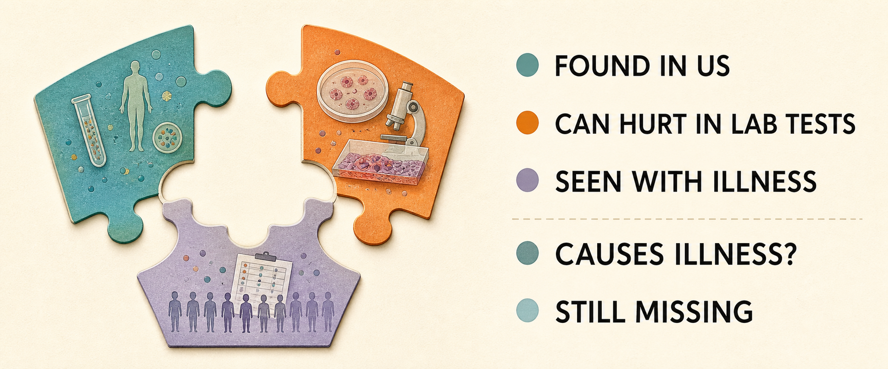
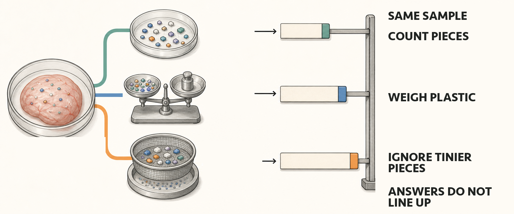

## Are microplastics actually harming our health?

**TL;DR** - They might be, but we still can't measure the danger to you. Tiny plastic pieces turn up in our bodies, and lab work shows ways they could hurt living things. The missing step is proof that ordinary amounts cause illness in people.

Picture a jigsaw with one empty space in the middle. We already have some pieces around it. Scientists report plastic in our bodies, see harm in lab tests, and sometimes find more plastic alongside illness. But the missing middle says, “Did the plastic cause the illness?”

### Which piece do we already have?

Reviews report tiny plastic pieces in blood and samples linked to our heart, gut, lungs, eyes, and reproduction, across 25 studies of living people [Tran et al. 2026](https://doi.org/10.1186/s12940-026-01282-y), [Lee et al. 2025](https://doi.org/10.1038/s41581-025-00971-0). So the first jigsaw piece is real: plastic can get into us.

### Why are scientists worried about harm?

Lab studies report cell stress, gut-cell damage, and kidney damage in mice [Wang et al. 2021](https://doi.org/10.1289/ehp7612), [Mattioda et al. 2023](https://doi.org/10.3390/biom13010140), [Mahmud et al. 2024](https://doi.org/10.3390/cells13211788), [Zhu et al. 2023](https://doi.org/10.1016/j.envint.2022.107662).

That adds a second jigsaw piece: harm is possible.

### What happens when doctors watch people?

Doctors followed people who already needed fatty build-up removed from an artery in their neck. Those whose removed build-up contained plastic were later somewhere between twice and ten times as likely to have a heart attack, a stroke, or die [Marfella et al. 2024](https://doi.org/10.1056/nejmoa2309822). Heart researchers say this is a serious clue, but everyone in the study already had artery disease [Prattichizzo et al. 2024](https://doi.org/10.1093/eurheartj/ehae552).

That gives us a third piece, but it still does not fill the middle. Another team found more plastic in the poo of people with bowel illness. The illness itself might have made plastic stay around longer [Yan et al. 2022](https://doi.org/10.1021/acs.est.1c03924), [Tran et al. 2026](https://doi.org/10.1186/s12940-026-01282-y). You can see all three pieces and the empty space in [Figure 1](#fig-missing-piece).

**Figure 1. The most important piece is still missing.** Plastic in our bodies, harm in lab tests, and worrying links in people all matter. None of them alone proves that ordinary amounts cause illness. The open centre keeps that uncertainty visible. The picture marks an evidence gap; it does not say that the clues are unimportant [Tran et al. 2026](https://doi.org/10.1186/s12940-026-01282-y), [Wang et al. 2021](https://doi.org/10.1289/ehp7612), [Marfella et al. 2024](https://doi.org/10.1056/nejmoa2309822), [Chartres et al. 2024](https://doi.org/10.1021/acs.est.3c09524).

### Wait - do the pieces even fit together?

This is where the picture gets shakier. A review checked more than 200 studies of human tissues and found that basic checks for stray plastic were often missing [Correia et al. 2026](https://doi.org/10.1590/0001-3765202620251113). Teams also use different names, size limits, units, and ways of preparing samples. That can change the answer even before anyone asks about health [Dmitrowicz et al. 2026](https://doi.org/10.1007/s00204-026-04392-1), [Scotton et al. 2026](https://doi.org/10.1016/j.envpol.2026.128298), [Tran et al. 2026](https://doi.org/10.1186/s12940-026-01282-y).

Measurement matters because finding a piece still does not tell us what it did. If one team reports pieces and another reports weight, we cannot tell whether people carried similar amounts. Until units match, health links cannot be compared cleanly. Studies that look alike in a headline may still be asking different questions underneath, so combining them can give a tidy-looking answer that hides messy inputs [Correia et al. 2026](https://doi.org/10.1590/0001-3765202620251113), [Dmitrowicz et al. 2026](https://doi.org/10.1007/s00204-026-04392-1), [Scotton et al. 2026](https://doi.org/10.1016/j.envpol.2026.128298).

The problem is not just untidy paperwork. If dose scales differ, a larger health effect in one study cannot be matched to a smaller effect in another. The puzzle pieces may look similar while their edges are cut differently [Correia et al. 2026](https://doi.org/10.1590/0001-3765202620251113), [Dmitrowicz et al. 2026](https://doi.org/10.1007/s00204-026-04392-1).

In [Figure 2](#fig-measuring-same-sample), one sample reaches several lab benches. Some teams count pieces. Others weigh plastic or ignore pieces below their chosen size. Their answers may not line up, even when they started with the same sample.

**Figure 2. The same sample can give different answers.** Follow the sample to each bench. Counting, weighing, and choosing a size cut-off are not the same job. Until teams agree on those basics, we cannot compare amounts cleanly. The mismatch warns us about methods; it does not say that one bench is automatically right. The result strips carry no scale. They show disagreement between methods, not the size of a measured difference [Correia et al. 2026](https://doi.org/10.1590/0001-3765202620251113), [Dmitrowicz et al. 2026](https://doi.org/10.1007/s00204-026-04392-1), [Scotton et al. 2026](https://doi.org/10.1016/j.envpol.2026.128298), [Tran et al. 2026](https://doi.org/10.1186/s12940-026-01282-y).

### What answer can we take home?

Microplastics may be hurting us, but scientists cannot yet say how much ordinary amounts raise your chance of getting sick. Not proved harmful does not mean proved safe. It means we need better human studies before anyone can give you a trustworthy number.

Clean lab plastic is not the same as the mixed, worn bits we meet in daily life. One careful review called harm “suspected,” yet only three human studies helped it reach that judgment [Chartres et al. 2024](https://doi.org/10.1021/acs.est.3c09524), [Talaie et al. 2025](https://doi.org/10.1016/j.toxlet.2025.06.021).

We do not know which size, shape, or plastic type matters most. Better studies must track exposure before illness and compare people the same way [Tran et al. 2026](https://doi.org/10.1186/s12940-026-01282-y), [Lee et al. 2025](https://doi.org/10.1038/s41581-025-00971-0). That is how the jigsaw's empty middle gets filled.

The jigsaw was only a helper. Our bodies are not flat pictures, and many things can lead to the same illness. Scientists need shared ways to measure plastic, long studies that begin with generally healthy people, and tests of whether lowering what gets into us actually improves health.

**Sources**

**Chartres N, Cooper CB, Bland G, Pelch KE, Gandhi SA, BakenRa A, Woodruff TJ (2024)** Effects of Microplastic Exposure on Human Digestive, Reproductive, and Respiratory Health: A Rapid Systematic Review. *Environmental Science & Technology*. https://doi.org/10.1021/acs.est.3c09524

**Correia TR, Dias APL, Pinto RL, Pereira DB, Sousa AMFD, Calderari MRCM (2026)** Analytical challenges and advances in detecting microplastics in human tissue and organ samples. *Anais da Academia Brasileira de Ciências*. https://doi.org/10.1590/0001-3765202620251113

**Dmitrowicz A, Sacharczuk M, Skiba D (2026)** Micro- and nanoplastics in human biological materials: a systematic review of detection methods and methodological challenges. *Archives of Toxicology*. https://doi.org/10.1007/s00204-026-04392-1

**Lee YH, Zheng CM, Wang YJ, Wang YL, Chiu HW (2025)** Effects of microplastics and nanoplastics on the kidney and cardiovascular system. *Nature Reviews Nephrology*. https://doi.org/10.1038/s41581-025-00971-0

**Mahmud F, Sarker DB, Jocelyn JA, Sang QXA (2024)** Molecular and Cellular Effects of Microplastics and Nanoplastics: Focus on Inflammation and Senescence. *Cells*. https://doi.org/10.3390/cells13211788

**Marfella R, Prattichizzo F, Sardu C, Fulgenzi G, Graciotti L, Spadoni T, D’Onofrio N, Scisciola L, La Grotta R, Frigé C, Pellegrini V, Municinò M, Siniscalchi M, Spinetti F, Vigliotti G, Vecchione C, Carrizzo A, Accarino G, Squillante A, Spaziano G, Mirra D, Esposito R, Altieri S, Falco G, Fenti A, Galoppo S, Canzano S, Sasso FC, Matacchione G, Olivieri F, Ferraraccio F, Panarese I, Paolisso P, Barbato E, Lubritto C, Balestrieri ML, Mauro C, Caballero AE, Rajagopalan S, Ceriello A, D’Agostino B, Iovino P, Paolisso G (2024)** Microplastics and Nanoplastics in Atheromas and Cardiovascular Events. *New England Journal of Medicine*. https://doi.org/10.1056/nejmoa2309822

**Mattioda V, Benedetti V, Tessarolo C, Oberto F, Favole A, Gallo M, Martelli W, Crescio MI, Berio E, Masoero L, Benedetto A, Pezzolato M, Bozzetta E, Grattarola C, Casalone C, Corona C, Giorda F (2023)** Pro-Inflammatory and Cytotoxic Effects of Polystyrene Microplastics on Human and Murine Intestinal Cell Lines. *Biomolecules*. https://doi.org/10.3390/biom13010140

**Prattichizzo F, Ceriello A, Pellegrini V, La Grotta R, Graciotti L, Olivieri F, Paolisso P, D’Agostino B, Iovino P, Balestrieri ML, Rajagopalan S, Landrigan PJ, Marfella R, Paolisso G (2024)** Micro-nanoplastics and cardiovascular diseases: evidence and perspectives. *European Heart Journal*. https://doi.org/10.1093/eurheartj/ehae552

**Scotton JW, Galvão AC, Stolf DO, Robazzi MLDCC, Robazza WDS (2026)** The invisible burden: A meta-analysis of methodological evolutions and the reassessment of microplastic concentrations in human tissues. *Environmental Pollution*. https://doi.org/10.1016/j.envpol.2026.128298

**Talaie A, Alaee S, Hosseini E, Rezania S, Tamadon A (2025)** Toxicological effects of micro/nano-plastics on human reproductive health: A review. *Toxicology Letters*. https://doi.org/10.1016/j.toxlet.2025.06.021

**Tran HAA, Ng JJ, Tang DH, Yong CT, Ho AFW (2026)** Health impacts of micro- and nanoplastics in humans: systematic review of in vivo evidence. *Environmental Health*. https://doi.org/10.1186/s12940-026-01282-y

**Wang YL, Lee YH, Hsu YH, Chiu IJ, Huang CCY, Huang CC, Chia ZC, Lee CP, Lin YF, Chiu HW (2021)** The Kidney-Related Effects of Polystyrene Microplastics on Human Kidney Proximal Tubular Epithelial Cells HK-2 and Male C57BL/6 Mice. *Environmental Health Perspectives*. https://doi.org/10.1289/ehp7612

**Yan Z, Liu Y, Zhang T, Zhang F, Ren H, Zhang Y (2022)** Analysis of Microplastics in Human Feces Reveals a Correlation between Fecal Microplastics and Inflammatory Bowel Disease Status. *Environmental Science & Technology*. https://doi.org/10.1021/acs.est.1c03924

**Zhu X, Wang C, Duan X, Liang B, Genbo Xu E, Huang Z (2023)** Micro- and nanoplastics: A new cardiovascular risk factor? *Environment International*. https://doi.org/10.1016/j.envint.2022.107662
