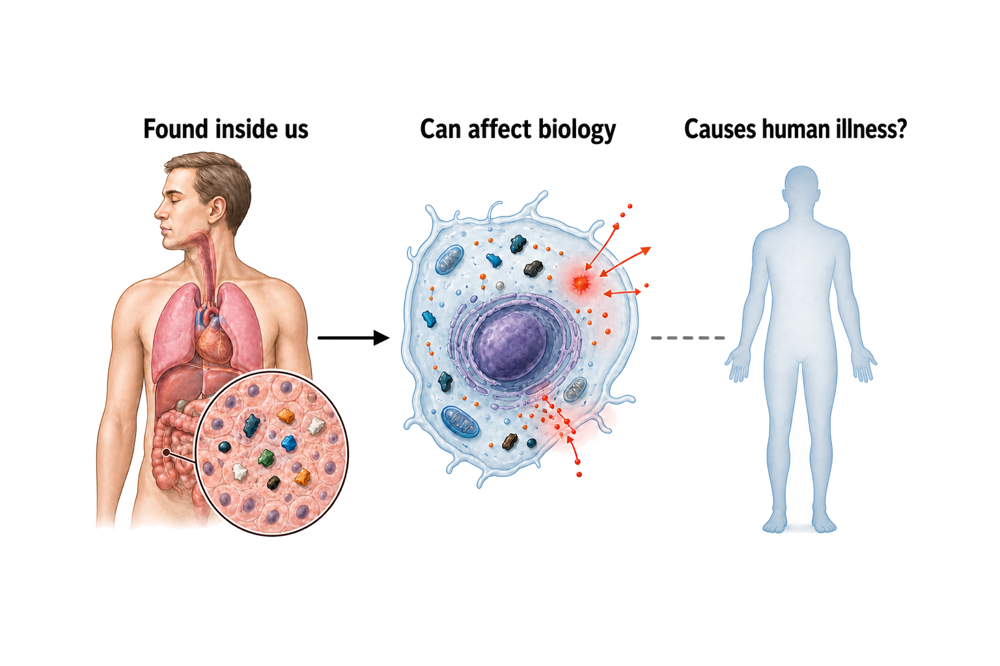
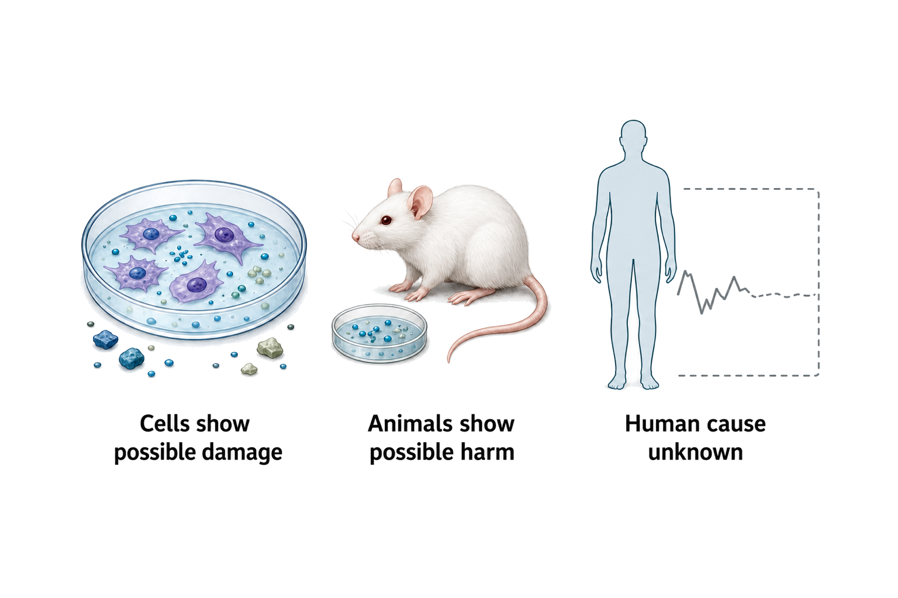

## Are microplastics actually harming our health?

**TL;DR** — Tiny plastic pieces really do get into our bodies. Lab work gives us reasons to worry. But scientists still haven't shown that everyday exposure makes people ill.

Imagine a detective following footprints. Finding a footprint proves someone was there. It doesn't prove what that person did. Microplastics leave a similar trail inside us, and the hard part is working out what that trail means.

### How do we know the pieces get inside us?

Teams have found microplastics in organs and in things such as blood, urine, stool, breast milk, semen, and placenta [Zuri et al. 2023](https://doi.org/10.1016/j.envres.2023.116966). A review of human studies found them in many body systems, though the teams used different ways to look for them [Roslan et al. 2024](https://doi.org/10.7189/jogh.14.04179).

Some studies looked at just one kind of tissue. One team found plastic fragments in four of six placentas [Ragusa et al. 2021](https://doi.org/10.1016/j.envint.2020.106274). Another found them in 11 of 13 lung samples, even after checking the empty lab samples for stray plastic [Jenner et al. 2022](https://doi.org/10.1016/j.scitotenv.2022.154907). These are real footprints. They still don't tell us whether the pieces hurt the body.

You can see that evidence ladder in [Figure 1](#fig-microplastics-whole-answer).

**Figure 1. Finding plastic is not the same as proving harm.** Microplastics have been found in human tissues, but no causal health effect from their uptake has been proved [Janzik et al. 2025](https://doi.org/10.3238/arztebl.m2025.0138).

### Why are scientists worried, then?

When researchers expose mice and rats to these particles, they often see changes in the animals' bodies. The biological effects can be affected by the kind of plastic, the particle size, the concentration, and the exposure time [Liu et al. 2023](https://doi.org/10.3389/fpubh.2023.1103289). Cell studies also report cell death and damage to genetic material [Winiarska et al. 2024](https://doi.org/10.1016/j.envres.2024.118535).

A careful review put those warning signs together and called microplastics a “suspected” danger to breathing, digestion, and reproduction [Chartres et al. 2024](https://doi.org/10.1021/acs.est.3c09524). That word matters. It means the case is worrying enough to investigate, not that harm in people has been proved.

The different kinds of evidence are separated in [Figure 2](#fig-microplastics-evidence-boundary).

**Figure 2. Human evidence boundary.** Direct evidence for effects on human health is still scarce [Feng et al. 2023](https://doi.org/10.1016/j.eehl.2023.08.002).

### So have the pieces made anyone sick?

One important study followed people who already had diseased neck arteries. Those whose artery plaque contained plastic particles later had more heart attacks, strokes, or deaths [Marfella et al. 2024](https://doi.org/10.1056/nejmoa2309822). Because nobody randomly received plastic, the study can't tell whether the particles helped cause the danger or simply travelled with it.

Other striking results have the same problem. A small liver study could not tell whether cirrhosis trapped the particles or the particles helped damage the liver [Horvatits et al. 2022](https://doi.org/10.1016/j.ebiom.2022.104147). A study of donated brain tissue found more plastic in some brains, but its authors said their results did not show that plastic caused illness [Nihart et al. 2025](https://doi.org/10.1038/s41591-024-03453-1). A broad review reached the same bottom line: current human research cannot give a firm answer about health effects [Janzik et al. 2025](https://doi.org/10.3238/arztebl.m2025.0138). The footprints are there. The culprit is not yet proved.

### What can we honestly say now?

Microplastics are inside us, and lab studies show believable ways they might hurt us. We still don't know how much ordinary exposure matters to your health. The detective picture also has a limit: bodies are not crime scenes, and particles can be both passengers and troublemakers. Scientists need long studies that measure exposure before illness starts, then test whether lowering that exposure changes health.

**Sources**

**Chartres N, Cooper CB, Bland G, Pelch KE, Gandhi SA, BakenRa A, Woodruff TJ (2024)** Effects of Microplastic Exposure on Human Digestive, Reproductive, and Respiratory Health: A Rapid Systematic Review. *Environmental Science & Technology*. https://doi.org/10.1021/acs.est.3c09524 · 1 claim · full text

**Feng Y, Tu C, Li R, Wu D, Yang J, Xia Y, Peijnenburg WJGM, Luo Y (2023)** A systematic review of the impacts of exposure to micro- and nano-plastics on human tissue accumulation and health. *Eco-Environment & Health*. https://doi.org/10.1016/j.eehl.2023.08.002 Correction: [10.1016/j.eehl.2025.100137](https://doi.org/10.1016/j.eehl.2025.100137). · 1 claim · full text

**Horvatits T, Tamminga M, Liu B, Sebode M, Carambia A, Fischer L, Püschel K, Huber S, Fischer EK (2022)** Microplastics detected in cirrhotic liver tissue. *eBioMedicine*. https://doi.org/10.1016/j.ebiom.2022.104147 · 1 claim · abstract

**Janzik R, Sieg H, Braeuning A, Böl GF (2025)** Microplastics: State of the evidence on health effects and public perception. *Deutsches Ärzteblatt international*. https://doi.org/10.3238/arztebl.m2025.0138 · 2 claims · abstract

**Jenner LC, Rotchell JM, Bennett RT, Cowen M, Tentzeris V, Sadofsky LR (2022)** Detection of microplastics in human lung tissue using μFTIR spectroscopy. *Science of The Total Environment*. https://doi.org/10.1016/j.scitotenv.2022.154907 · 1 claim · abstract

**Liu W, Zhang B, Yao Q, Feng X, Shen T, Guo P, Wang P, Bai Y, Li B, Wang P, Li R, Qu Z, Liu N (2023)** Toxicological effects of micro/nano-plastics on mouse/rat models: a systematic review and meta-analysis. *Frontiers in Public Health*. https://doi.org/10.3389/fpubh.2023.1103289 · 1 claim · full text

**Marfella R, Prattichizzo F, Sardu C, Fulgenzi G, Graciotti L, Spadoni T, D’Onofrio N, Scisciola L, La Grotta R, Frigé C, Pellegrini V, Municinò M, Siniscalchi M, Spinetti F, Vigliotti G, Vecchione C, Carrizzo A, Accarino G, Squillante A, Spaziano G, Mirra D, Esposito R, Altieri S, Falco G, Fenti A, Galoppo S, Canzano S, Sasso FC, Matacchione G, Olivieri F, Ferraraccio F, Panarese I, Paolisso P, Barbato E, Lubritto C, Balestrieri ML, Mauro C, Caballero AE, Rajagopalan S, Ceriello A, D’Agostino B, Iovino P, Paolisso G (2024)** Microplastics and Nanoplastics in Atheromas and Cardiovascular Events. *New England Journal of Medicine*. https://doi.org/10.1056/nejmoa2309822 · 1 claim · abstract

**Nihart AJ, Garcia MA, El Hayek E, Liu R, Olewine M, Kingston JD, Castillo EF, Gullapalli RR, Howard T, Bleske B, Scott J, Gonzalez-Estrella J, Gross JM, Spilde M, Adolphi NL, Gallego DF, Jarrell HS, Dvorscak G, Zuluaga-Ruiz ME, West AB, Campen MJ (2025)** Bioaccumulation of microplastics in decedent human brains. *Nature Medicine*. https://doi.org/10.1038/s41591-024-03453-1 Correction: [10.1038/s41591-025-03675-x](https://doi.org/10.1038/s41591-025-03675-x). · 1 claim · full text

**Ragusa A, Svelato A, Santacroce C, Catalano P, Notarstefano V, Carnevali O, Papa F, Rongioletti MCA, Baiocco F, Draghi S, D'Amore E, Rinaldo D, Matta M, Giorgini E (2021)** Plasticenta: First evidence of microplastics in human placenta. *Environment International*. https://doi.org/10.1016/j.envint.2020.106274 · 1 claim · abstract

**Roslan NS, Lee YY, Ibrahim YS, Tuan Anuar S, Yusof KMKK, Lai LA, Brentnall T (2024)** Detection of microplastics in human tissues and organs: A scoping review. *Journal of Global Health*. https://doi.org/10.7189/jogh.14.04179 · 1 claim · full text

**Winiarska E, Jutel M, Zemelka-Wiacek M (2024)** The potential impact of nano- and microplastics on human health: Understanding human health risks. *Environmental Research*. https://doi.org/10.1016/j.envres.2024.118535 · 1 claim · abstract

**Zuri G, Karanasiou A, Lacorte S (2023)** Human biomonitoring of microplastics and health implications: A review. *Environmental Research*. https://doi.org/10.1016/j.envres.2023.116966 · 1 claim · abstract

**Receipts**

*13 cited sentences · 13 source checks · 5 supported at full text · 8 at abstract · 0 partial · 0 contradicted — every pair's verbatim quote is in `microplastics-health-eli5-receipts.md`.*
