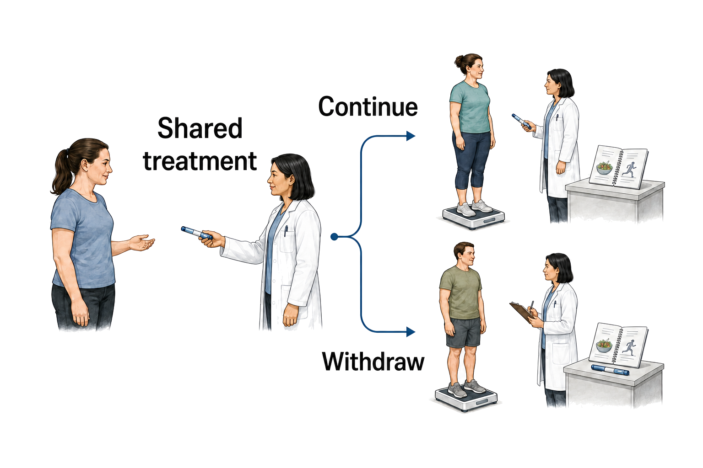
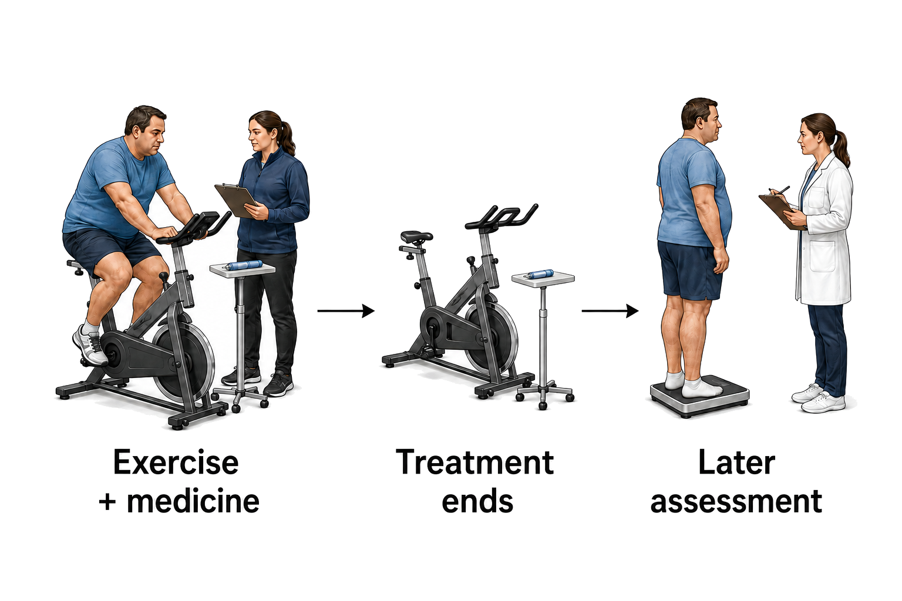

## What remains after Ozempic stops?

*Studies of semaglutide, the medicine in Ozempic, show that weight commonly returns and several metabolic improvements diminish after treatment ends. The extent of that reversal varies, and the evidence for preserving the benefits is less settled than the evidence for losing them.*

Ozempic is an injectable brand of [semaglutide](https://en.wikipedia.org/wiki/Semaglutide), introduced for type 2 diabetes [Yang & Yang 2024](https://doi.org/10.2147/dddt.s470826). A direct experiment on stopping the drug, however, studied a weekly 2.4 mg obesity regimen in adults without diabetes [Rubino et al. 2021](https://doi.org/10.1001/jama.2021.3224). In the trial known as STEP 4, everyone began with semaglutide; after twenty weeks, 803 participants who had reached the study's maintenance dose were randomly assigned either to continue it or to switch to [placebo](https://en.wikipedia.org/wiki/Placebo), an injection without the active drug [Rubino et al. 2021](https://doi.org/10.1001/jama.2021.3224).

Over the next 48 weeks, mean weight changed by −7.9% with continued semaglutide and +6.9% after the placebo switch, both relative to week-20 weight [Rubino et al. 2021](https://doi.org/10.1001/jama.2021.3224). Both groups continued lifestyle support, so the difference arose within a comparison that retained that part of treatment [Rubino et al. 2021](https://doi.org/10.1001/jama.2021.3224). The common start and subsequent split in [Figure 1](#fig-withdrawal-study) express the central question: how much does keeping the drug change what happens next? Random assignment gives a strong answer for people who reached the maintenance dose, while that selection limits how fully the result describes everyone who starts semaglutide [Rubino et al. 2021](https://doi.org/10.1001/jama.2021.3224).

**Figure 1. A shared start separates continuation from withdrawal.** The branches depict STEP 4's random assignment after initial semaglutide treatment, with lifestyle support in both groups [Rubino et al. 2021](https://doi.org/10.1001/jama.2021.3224). The later metabolic analysis used that randomized comparison [Kosiborod et al. 2023](https://doi.org/10.1111/dom.14890). The drawn people and equipment do not encode individual outcomes.

### Weight returns, but not uniformly

A longer treatment period was followed by substantial regain too. In the STEP 1 extension, participants stopped after 68 weeks of semaglutide or placebo and were followed for another year; unlike STEP 4, both the study medication and the lifestyle intervention ended [Wilding et al. 2022](https://doi.org/10.1111/dom.14725). The extension analysis included 327 people from a selected subset of the original trial, so it provides a useful account of the following year without the same direct test of continuing versus stopping [Wilding et al. 2022](https://doi.org/10.1111/dom.14725).

Former semaglutide recipients had lost an average of 17.3% of their original weight [Wilding et al. 2022](https://doi.org/10.1111/dom.14725). Over the year off treatment they regained 11.6 percentage points of that original weight, roughly two-thirds of the preceding loss, and remained 5.6% below their starting weight on average [Wilding et al. 2022](https://doi.org/10.1111/dom.14725). That residual loss also appeared in the individual measurements: 95 of the 197 former semaglutide recipients with weight data at the final visit still weighed at least 5% less than at the start [Wilding et al. 2022](https://doi.org/10.1111/dom.14725). Substantial average regain therefore coexisted with retained benefit for many participants.

The two studies in [Figure 2](#fig-withdrawal-trajectory) agree on the direction of change after withdrawal, but their vertical scales refer to different starting weights. STEP 4 expresses change relative to weight at withdrawal; STEP 1 expresses regained weight as percentage points of the original baseline [Rubino et al. 2021](https://doi.org/10.1001/jama.2021.3224), [Wilding et al. 2022](https://doi.org/10.1111/dom.14725). Treatment length, participant selection and the end of lifestyle support also differed, so the larger STEP 1 number cannot isolate the effect of stopping that support [Rubino et al. 2021](https://doi.org/10.1001/jama.2021.3224), [Wilding et al. 2022](https://doi.org/10.1111/dom.14725).

**Figure 2. Both studies record regain after withdrawal.** In panel A, the horizontal axis is weeks after STEP 4 randomization and the vertical axis is percent change from week-20 weight. “Keep” means continued semaglutide; “Stop” means the placebo switch. In panel B, the horizontal axis is weeks after STEP 1 treatment ended and the vertical axis is regain in percentage points (pp) of original baseline weight; zero marks withdrawal. “Sema” denotes former semaglutide recipients. Lifestyle support continued in STEP 4 [Rubino et al. 2021](https://doi.org/10.1001/jama.2021.3224) and ended in STEP 1 [Wilding et al. 2022](https://doi.org/10.1111/dom.14725). Straight lines join endpoints rather than measured weekly paths; no uncertainty intervals are plotted.

### The limits of a common rate

Broader reviews put these observations in context, while introducing another source of variation: different medicines and follow-up periods. A randomized-trial analysis including adults and adolescents found an average regain of 5.63 kg in participants with overweight or obesity, but differences between studies were extremely large [Tzang et al. 2025](https://doi.org/10.1016/j.eclinm.2025.103680). A separate synthesis estimated 0.8 kg of monthly regain after semaglutide or tirzepatide [West et al. 2026](https://doi.org/10.1136/bmj-2025-085304). Its observations for those newer medicines extended no further than twelve months; the longer trajectory was projected [West et al. 2026](https://doi.org/10.1136/bmj-2025-085304). The table separates those evidence windows because an observed endpoint and a modelled rate answer different questions.

| Evidence | Time after stopping | What the estimate describes |
|---|---|---|
| STEP 4 | 48 weeks | Randomized continuation versus withdrawal, with lifestyle support in both groups [Rubino et al. 2021](https://doi.org/10.1001/jama.2021.3224) |
| STEP 1 extension | 52 weeks | Follow-up after medication and lifestyle support ended; selected trial subset [Wilding et al. 2022](https://doi.org/10.1111/dom.14725) |
| Semaglutide/tirzepatide synthesis | Up to 12 months observed | Estimated regain of 0.8 kg/month (95% [confidence interval](https://en.wikipedia.org/wiki/Confidence_interval) 0.7–0.9); later course projected [West et al. 2026](https://doi.org/10.1136/bmj-2025-085304) |

Together, these findings establish common regain more convincingly than they establish a single rate. They also do not make the pooled rate a forecast for one person: the direct extension recorded varied outcomes, and even participants with larger initial losses tended to retain larger net losses despite regaining more [Wilding et al. 2022](https://doi.org/10.1111/dom.14725).

### Appetite evidence comes from treatment

The weight measurements show what happened after stopping. Appetite studies help explain a possible reason, although they observe a different part of the process. Semaglutide leaves the body gradually: its long elimination [half-life](https://en.wikipedia.org/wiki/Biological_half-life) supports weekly dosing, so exposure does not end with the final injection [Yang & Yang 2024](https://doi.org/10.2147/dddt.s470826). That establishes gradual clearance without fixing a date when hunger returns.

During treatment, people offered meals and snacks they could eat freely consumed about a quarter less energy with semaglutide than with placebo in one randomized experiment [Blundell et al. 2017](https://doi.org/10.1111/dom.12932). A later trial using 2.4 mg also found less hunger, fewer or weaker cravings, and better control of eating [Friedrichsen et al. 2021](https://doi.org/10.1111/dom.14280). These findings identify appetite and intake effects that ongoing treatment provides. Losing these treatment effects is a plausible contributor to regain. The earlier experiment did not map a day-by-day appetite trajectory after the last dose [Blundell et al. 2017](https://doi.org/10.1111/dom.12932); neither did the later trial [Friedrichsen et al. 2021](https://doi.org/10.1111/dom.14280).

The explanation also cannot be reduced to food remaining in the stomach longer. At week 20, the 2.4 mg trial detected no delay in stomach emptying using absorption of paracetamol as an indirect measure, despite the appetite effects [Friedrichsen et al. 2021](https://doi.org/10.1111/dom.14280). The test and timing leave room for earlier or individual stomach effects; they limit the claim that persistent slowing explains the observed appetite suppression [Friedrichsen et al. 2021](https://doi.org/10.1111/dom.14280). Evidence for eating less during treatment is firmer than evidence for exactly how eating changes after it ends.

### Metabolic improvements also recede

Weight was accompanied by changes in other measurements. During STEP 4's shared treatment period, waist size, systolic blood pressure (the top reading), fasting blood sugar, insulin and blood fats improved [Kosiborod et al. 2023](https://doi.org/10.1111/dom.14890). Those improvements were maintained with continued semaglutide but deteriorated after the switch to placebo [Kosiborod et al. 2023](https://doi.org/10.1111/dom.14890). In the STEP 1 extension, most metabolic measures likewise moved back toward baseline, although some benefit remained after a year [Wilding et al. 2022](https://doi.org/10.1111/dom.14725). These analyses support a common loss of benefit across several outcomes, with moderate confidence because many measurements were exploratory.

The diabetes evidence describes a different starting population. In a review pooling trials of semaglutide and related medicines, [glycated haemoglobin](https://en.wikipedia.org/wiki/Glycated_hemoglobin), or HbA1c, rose after treatment stopped [Tzang et al. 2025](https://doi.org/10.1016/j.eclinm.2025.103680). The average increase was 0.25 percentage points in the obesity studies and 0.65 percentage points in studies of type 2 diabetes, with particularly wide variation between the diabetes studies [Tzang et al. 2025](https://doi.org/10.1016/j.eclinm.2025.103680). A selected diabetes cohort receiving continuing nutrition support retained improved blood sugar levels relative to its earlier baseline, although HbA1c rose during follow-up in both those who stopped and those who continued their medicine [McKenzie & Athinarayanan 2024](https://doi.org/10.1007/s13300-024-01547-0). The direction and amount of change depend partly on which population and treatment setting are being described.

Changes in these measures do not establish how long protection against heart attacks or strokes lasts. SELECT found fewer major cardiovascular events among high-risk adults without diabetes assigned to semaglutide than among those assigned to placebo [Lincoff et al. 2023](https://doi.org/10.1056/nejmoa2307563). It was a treatment-assignment trial, not a randomized test of stopping after a common course [Lincoff et al. 2023](https://doi.org/10.1056/nejmoa2307563). Its benefit and the withdrawal studies' worsening measurements therefore leave the duration of event protection after cessation unresolved.

### Prescriptions follow less orderly paths

Outside trials, stopping is often followed by restarting. Among 125,474 US adults who began semaglutide or related medicines, about half of those with type 2 diabetes and almost two-thirds of those without it discontinued within a year; restarting was also frequent [Rodriguez et al. 2025](https://doi.org/10.1001/jamanetworkopen.2024.57349). In a separate review of 288 patients' records, cost or insurance problems were the most commonly documented reason for stopping semaglutide or tirzepatide, followed by side effects and shortages, while some records gave no reason [Gasoyan et al. 2025b](https://doi.org/10.1002/oby.70058).

These interruptions help explain why routine-care studies ask a broader question than planned withdrawal trials. In a health-system cohort, people with available one-year weights who stopped within the first three months averaged 3.6% weight loss, compared with 11.9% among those without discontinuation [Gasoyan et al. 2025a](https://doi.org/10.1002/oby.24331). Both percentages describe change from starting treatment, rather than weight regained from the stopping date [Gasoyan et al. 2025a](https://doi.org/10.1002/oby.24331). The association is consistent with greater benefit during longer exposure, but dose, access and differences between people who continue and stop prevent attributing the entire gap to withdrawal [Gasoyan et al. 2025a](https://doi.org/10.1002/oby.24331).

### Maintenance differs across settings

Some settings show substantially more retained weight loss. Twenty-five women with [polycystic ovary syndrome](https://en.wikipedia.org/wiki/Polycystic_ovary_syndrome) continued [metformin](https://en.wikipedia.org/wiki/Metformin) and lifestyle support after a short course of semaglutide [Jensterle et al. 2024](https://doi.org/10.3389/fendo.2024.1366940). Over two years, they regained about one-third of their semaglutide-associated loss, although several metabolic improvements returned to baseline [Jensterle et al. 2024](https://doi.org/10.3389/fendo.2024.1366940). Their lower dose, brief treatment and absence of a control group distinguish this cohort from the obesity trials [Jensterle et al. 2024](https://doi.org/10.3389/fendo.2024.1366940). It demonstrates a different observed trajectory without establishing that metformin caused the better maintenance [Jensterle et al. 2024](https://doi.org/10.3389/fendo.2024.1366940).

Similarly, a selected diabetes cohort maintained weight after medicines in semaglutide’s drug class were stopped while carbohydrate-restricted nutrition care continued through telemedicine [McKenzie & Athinarayanan 2024](https://doi.org/10.1007/s13300-024-01547-0). The program's participants had not been randomly assigned to stop or continue [McKenzie & Athinarayanan 2024](https://doi.org/10.1007/s13300-024-01547-0). Such cohorts show that substantial regain is not universal, while leaving uncertain whether their results would transfer to other populations or follow from the accompanying intervention itself.

Exercise has been examined in a randomized treatment study, but with [liraglutide](https://en.wikipedia.org/wiki/Liraglutide), a related medicine, rather than semaglutide [Jensen et al. 2024](https://doi.org/10.1016/j.eclinm.2024.102475). After initial diet-induced weight loss, participants received exercise, liraglutide, both, or placebo for a year, followed by another year after treatment ended [Jensen et al. 2024](https://doi.org/10.1016/j.eclinm.2024.102475). The sequence in [Figure 3](#fig-exercise-followup) separates those periods because the study's main comparison covered both years together [Jensen et al. 2024](https://doi.org/10.1016/j.eclinm.2024.102475).

Across that combined period, the exercise-plus-liraglutide group numerically retained more weight and body-fat loss than the liraglutide-only group [Jensen et al. 2024](https://doi.org/10.1016/j.eclinm.2024.102475). Those comparisons did not meet the study's prespecified threshold for accounting for multiple statistical tests [Jensen et al. 2024](https://doi.org/10.1016/j.eclinm.2024.102475). They also do not isolate better maintenance during withdrawal alone: for regain during the year off treatment, the uncertainty interval for combination versus liraglutide included no difference [Jensen et al. 2024](https://doi.org/10.1016/j.eclinm.2024.102475). Only 109 participants attended the later assessment, adding uncertainty from incomplete follow-up [Jensen et al. 2024](https://doi.org/10.1016/j.eclinm.2024.102475).

**Figure 3. Treatment and later maintenance occupy separate periods.** The scenes show the combination arm's supervised exercise with liraglutide, the end of treatment, and assessment one year later [Jensen et al. 2024](https://doi.org/10.1016/j.eclinm.2024.102475). Arrows mark time, and body shapes do not represent measured weight changes. The primary endpoint spanned the treatment year and the following year together; it does not isolate an effect during withdrawal alone [Jensen et al. 2024](https://doi.org/10.1016/j.eclinm.2024.102475).

Across a broader review of stopping weight-management medicines, there was no evidence that post-cessation behavioural support changed regain rates [West et al. 2026](https://doi.org/10.1136/bmj-2025-085304). That result does not establish that every programme is ineffective, but it prevents the selected cohort and liraglutide findings from becoming evidence of a broadly reliable semaglutide maintenance strategy. What persists after treatment is therefore partly clear: substantial weight regain and diminishing metabolic benefits are common, yet retained benefit varies. The evidence is strongest for the value of continued treatment in the studied population and less certain about which benefits can endure after stopping, for whom and for how long.

**Scope and methods.** This narrative review reuses the authenticated corpus searched on 4 September 2026 in PubMed, with backward and forward OpenAlex citation chasing. No new literature search was conducted for this rewrite. It covers peer-reviewed human evidence on semaglutide cessation, focusing on adults while identifying mixed-age syntheses as broader context; related drugs and selected maintenance cohorts are identified explicitly, and anecdotes and preprints were excluded. Twelve full texts are authenticated in the saved access manifest; eleven are cited here. Remaining cited evidence was available at abstract level, including the direct STEP 4 report. Related trial reports and overlapping reviews are not counted as independent confirmation. Source support and confidence in the outcome remain separate judgments.

**Sources**

**Blundell J, Finlayson G, Axelsen M, Flint A, Gibbons C, Kvist T, Hjerpsted JB (2017)** Effects of once‐weekly semaglutide on appetite, energy intake, control of eating, food preference and body weight in subjects with obesity. *Diabetes, Obesity and Metabolism*. https://doi.org/10.1111/dom.12932 · 2 claims · full text

**Friedrichsen M, Breitschaft A, Tadayon S, Wizert A, Skovgaard D (2021)** The effect of semaglutide 2.4 mg once weekly on energy intake, appetite, control of eating, and gastric emptying in adults with obesity. *Diabetes, Obesity and Metabolism*. https://doi.org/10.1111/dom.14280 · 4 claims · full text

**Gasoyan H, Butsch WS, Casacchia NJ, Schulte R, Criswell V, Fox J, Renner H, Le P, Alpert J, Rothberg MB (2025b)** Reasons for Discontinuation of Obesity Pharmacotherapy With Semaglutide or Tirzepatide in Clinical Practice. *Obesity*. https://doi.org/10.1002/oby.70058 · 1 claim · abstract

**Gasoyan H, Butsch WS, Schulte R, Casacchia NJ, Le P, Boyer CB, Griebeler ML, Burguera B, Rothberg MB (2025a)** Changes in weight and glycemic control following obesity treatment with semaglutide or tirzepatide by discontinuation status. *Obesity*. https://doi.org/10.1002/oby.24331 · 3 claims · full text

**Jensen SBK, Blond MB, Sandsdal RM, Olsen LM, Juhl CR, Lundgren JR, Janus C, Stallknecht BM, Holst JJ, Madsbad S, Torekov SS (2024)** Healthy weight loss maintenance with exercise, GLP-1 receptor agonist, or both combined followed by one year without treatment: a post-treatment analysis of a randomised placebo-controlled trial. *eClinicalMedicine*. https://doi.org/10.1016/j.eclinm.2024.102475 · 9 claims · full text

**Jensterle M, Ferjan S, Janez A (2024)** The maintenance of long-term weight loss after semaglutide withdrawal in obese women with PCOS treated with metformin: a 2-year observational study. *Frontiers in Endocrinology*. https://doi.org/10.3389/fendo.2024.1366940 · 4 claims · full text

**Kosiborod MN, Bhatta M, Davies M, Deanfield JE, Garvey WT, Khalid U, Kushner R, Rubino DM, Zeuthen N, Verma S (2023)** Semaglutide improves cardiometabolic risk factors in adults with overweight or obesity: STEP 1 and 4 exploratory analyses. *Diabetes, Obesity and Metabolism*. https://doi.org/10.1111/dom.14890 · 3 claims · full text

**Lincoff AM, Brown-Frandsen K, Colhoun HM, Deanfield J, Emerson SS, Esbjerg S, Hardt-Lindberg S, Hovingh GK, Kahn SE, Kushner RF, Lingvay I, Oral TK, Michelsen MM, Plutzky J, Tornøe CW, Ryan DH (2023)** Semaglutide and Cardiovascular Outcomes in Obesity without Diabetes. *New England Journal of Medicine*. https://doi.org/10.1056/nejmoa2307563 · 2 claims · abstract

**McKenzie AL, Athinarayanan SJ (2024)** Impact of Glucagon-Like Peptide 1 Agonist Deprescription in Type 2 Diabetes in a Real-World Setting: A Propensity Score Matched Cohort Study. *Diabetes Therapy*. https://doi.org/10.1007/s13300-024-01547-0 · 3 claims · abstract

**Rodriguez PJ, Zhang V, Gratzl S, Do D, Goodwin Cartwright B, Baker C, Gluckman TJ, Stucky N, Emanuel EJ (2025)** Discontinuation and Reinitiation of Dual-Labeled GLP-1 Receptor Agonists Among US Adults With Overweight or Obesity. *JAMA Network Open*. https://doi.org/10.1001/jamanetworkopen.2024.57349 · 1 claim · full text

**Rubino D, Abrahamsson N, Davies M, Hesse D, Greenway FL, Jensen C, Lingvay I, Mosenzon O, Rosenstock J, Rubio MA, Rudofsky G, Tadayon S, Wadden TA, Dicker D, STEP 4 Investigators, Friberg M, Sjödin A, Dicker D, Segal G, Mosenzon O, Sabbah M, Sofer Y, Vishlitzky V, Meesters EW, Serlie M, van Bon A, Cardoso H, Freitas P, Carneiro de Melo P, Monteiro M, Monteiro M, Rodrigues D, Badat A, Joshi P, Latiff G, Mitha EA, Snyman HH, van Nieuwenhuizen E, González Albarrán O, Caixas A, de al Cuesta C, Garcia Luna PP, Morales Portillo C, Mezquita Raya P, Rubio MA, Abrahamsson N, Hoffstedt J, von Wowern F, Uddman E, Bach-Kliegel B, Beuschlein F, Bilz S, Golay A, Rudofsky G, Strey C, Fadieienko G, Kosei N, Tatarchuk T, Velychko V, Zinych O, Aronoff SL, Bays HE, Brockmyre AP, Call RS, Crump C, Desouza CV, Espinosa V, Free AL, Gandy WH, Geller SA, Gottschlich GM, Greenway FL, Han-Conrad L, Harper W, Herman L, Hewitt M, Hollander P, Kaster SR, Manessis A, Martin FA, McNeill RE, Murray AV, Norwood PC, Reed JCH, Rosenstock J, Rubino DM, Schear MJ, Warren ML (2021)** Effect of Continued Weekly Subcutaneous Semaglutide vs Placebo on Weight Loss Maintenance in Adults With Overweight or Obesity. *JAMA*. https://doi.org/10.1001/jama.2021.3224 · 10 claims · abstract

**Tzang CC, Wu PH, Luo CA, Chen ZT, Lee YT, Huang ES, Kang YF, Lin WC, Tzang BS, Hsu TC (2025)** Metabolic rebound after GLP-1 receptor agonist discontinuation: a systematic review and meta-analysis. *eClinicalMedicine*. https://doi.org/10.1016/j.eclinm.2025.103680 · 3 claims · full text

**West S, Scragg J, Aveyard P, Oke JL, Willis L, Haffner SJP, Knight H, Wang D, Morrow S, Heath L, Jebb SA, Koutoukidis DA (2026)** Weight regain after cessation of medication for weight management: systematic review and meta-analysis. *BMJ*. https://doi.org/10.1136/bmj-2025-085304 · 4 claims · full text

**Wilding JPH, Batterham RL, Davies M, Van Gaal LF, Kandler K, Konakli K, Lingvay I, McGowan BM, Oral TK, Rosenstock J, Wadden TA, Wharton S, Yokote K, Kushner RF, STEP 1 Study Group (2022)** Weight regain and cardiometabolic effects after withdrawal of semaglutide: The STEP 1 trial extension. *Diabetes, Obesity and Metabolism*. https://doi.org/10.1111/dom.14725 · 11 claims · full text

**Yang XD, Yang YY (2024)** Clinical Pharmacokinetics of Semaglutide: A Systematic Review. *Drug Design, Development and Therapy*. https://doi.org/10.2147/dddt.s470826 · 2 claims · full text

**Receipts**

*58 cited sentences · 62 source checks · 42 supported at full text · 13 at abstract · 7 partial · 0 contradicted — every pair's verbatim quote is in `ozempic-after-stopping-receipts.md`.*
