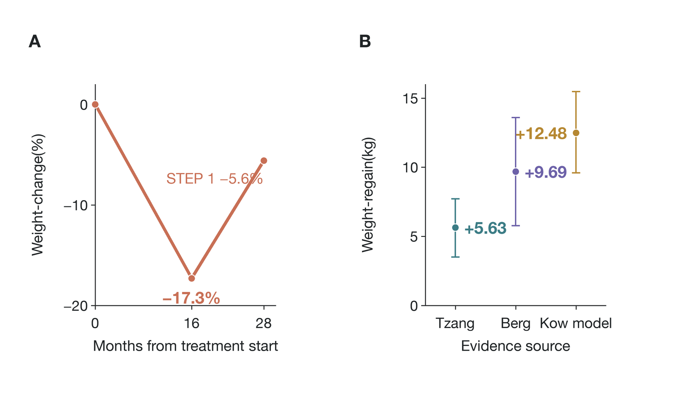
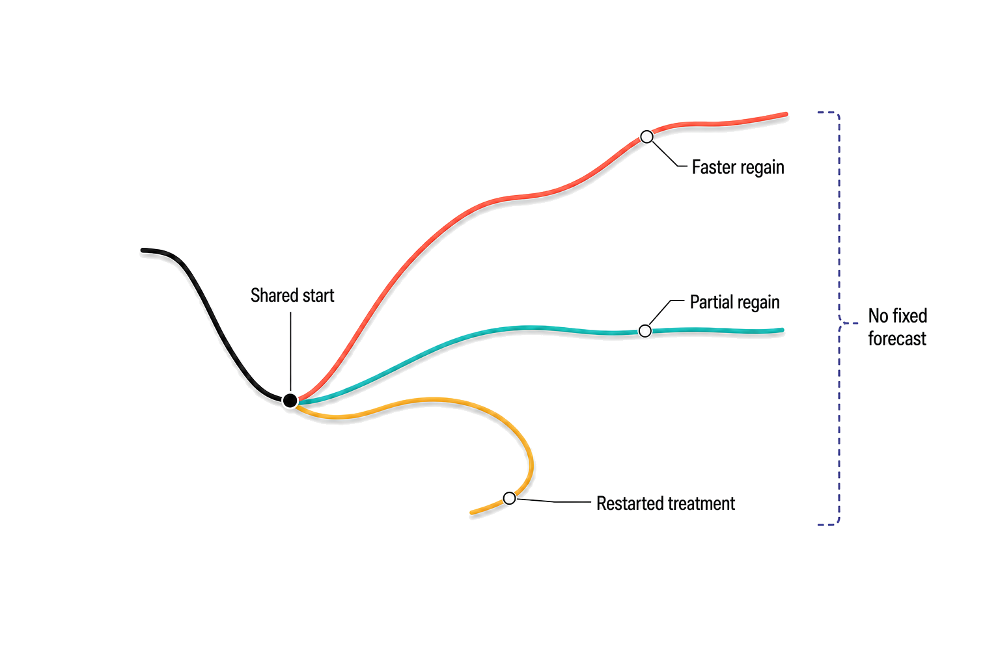

## After the last Ozempic shot, the old biology starts voting again

*What happens when semaglutide stops? For most people, the drug's appetite and glucose effects fade, weight begins to return, and some metabolic gains shrink — but the speed and extent are far from fixed.*

In one of the clearest withdrawal experiments, 803 adults first spent 20 weeks taking semaglutide. They had lost about a tenth of their starting weight when the investigators split them: two-thirds kept injecting; one-third received placebo. Over the next 48 weeks, the first group kept losing while the second gained 6.9% [Rubino et al. 2021](https://doi.org/10.1001/jama.2021.3224).

That split makes the question sharper than “does dieting work?” Both groups still received lifestyle support. What changed was exposure to a [GLP-1 receptor agonist](https://en.wikipedia.org/wiki/GLP-1_receptor_agonist), a drug that mimics a gut signal involved in appetite and blood-sugar regulation [Moore et al. 2023](https://doi.org/10.1007/s12325-022-02394-w), [Rosen & Ingelfinger 2026](https://doi.org/10.1056/nejmra2500106), [Hedrington et al. 2018](https://doi.org/10.1080/14712598.2018.1439014). The evidence says stopping usually removes an active brake. It does not reveal an established addiction-like withdrawal syndrome [Ceriello et al. 2026](https://doi.org/10.1038/s41574-026-01258-5), [Damhof et al. 2026](https://doi.org/10.1111/dom.71075), [Moiz et al. 2026](https://doi.org/10.1016/j.eclinm.2026.103992).

### The signal fades before the story is finished

Semaglutide stays in the body for weeks, so the transition is usually a slope rather than a cliff. As drug exposure falls, its effects on fullness, food intake, stomach function, and glucose control fade too [Moore et al. 2023](https://doi.org/10.1007/s12325-022-02394-w), [Rosen & Ingelfinger 2026](https://doi.org/10.1056/nejmra2500106). Researchers reviewing discontinuation describe the returning pressure in familiar terms: hunger rises, the body defends its earlier energy stores, and the behaviours that felt easier on treatment may demand effort again [Ceriello et al. 2026](https://doi.org/10.1038/s41574-026-01258-5), [Damhof et al. 2026](https://doi.org/10.1111/dom.71075).

What would you notice first? The studies are surprisingly bad at answering that in sequence. They measured weight much more reliably than hunger, cravings, meal size, or the day nausea stopped. The honest whole-body picture in [Figure 1](#fig-whole-answer) therefore separates what trials measured from what pharmacology makes plausible [Wilding et al. 2022](https://doi.org/10.1111/dom.14725), [Tzang et al. 2025](https://doi.org/10.1016/j.eclinm.2025.103680), [Moiz et al. 2026](https://doi.org/10.1016/j.eclinm.2026.103992).

The name on the pen matters here. The cleanest stopping studies used semaglutide 2.4 mg in adults treated for obesity and excluded diabetes [Rubino et al. 2021](https://doi.org/10.1001/jama.2021.3224), [Wilding et al. 2022](https://doi.org/10.1111/dom.14725). Trials of injectable semaglutide in type 2 diabetes often used 0.5 or 1.0 mg in people with very different cardiovascular risk [Marso et al. 2016](https://doi.org/10.1056/nejmoa1607141). “Stopping Ozempic” can therefore describe several experiments at once: ending glucose-lowering treatment, ending obesity treatment, or ending an off-label course at another dose. The broad direction may travel across those settings. The exact size of the rebound may not.

The final injection is also not the instant when exposure becomes zero. Semaglutide's long residence in the body spreads the handover across several weeks, while trial visits usually sample weight and laboratory values much farther apart [Moore et al. 2023](https://doi.org/10.1007/s12325-022-02394-w), [Rosen & Ingelfinger 2026](https://doi.org/10.1056/nejmra2500106). That mismatch helps explain why the evidence can describe a broad rebound yet cannot name the first day hunger, glucose, or digestive symptoms will change for one person.

**Figure 1. The drug's signal fades; the body's older pressures remain.** Follow the path from the final dose to weaker appetite and glucose effects, then to the outcomes researchers actually tracked. The last boundary stays open because group averages cannot forecast one body, and post-stop appetite has been measured less directly than weight [Rubino et al. 2021](https://doi.org/10.1001/jama.2021.3224), [Wilding et al. 2022](https://doi.org/10.1111/dom.14725), [Tzang et al. 2025](https://doi.org/10.1016/j.eclinm.2025.103680), [Ceriello et al. 2026](https://doi.org/10.1038/s41574-026-01258-5).

### Weight returns in months, not all at once

Wilding and colleagues followed 327 participants for a year after STEP 1 ended. Those who had taken semaglutide 2.4 mg had lost 17.3% of their starting weight; a year after treatment and structured lifestyle support stopped, they had regained 11.6 percentage points — roughly two-thirds of the loss [Wilding et al. 2022](https://doi.org/10.1111/dom.14725). They still averaged 5.6% below baseline. “Regain” did not mean instant erasure.

Those numbers answer two questions that are easy to blur. The 11.6-point rise describes how far the group moved upward after treatment; the remaining 5.6% below baseline describes where the group ended relative to where it began. Neither says that every participant regained two-thirds. An average can combine people who regained nearly everything, people who held much of the loss, and people who left the study before the last measurement.

The comparison with STEP 4 adds an important control. In STEP 1, both semaglutide and the trial's structured lifestyle program ended together, so their contributions to the rebound cannot be cleanly separated [Wilding et al. 2022](https://doi.org/10.1111/dom.14725). In STEP 4, both randomized groups continued lifestyle support while only medication exposure changed: the placebo-switched group gained 6.9% as the continuing group lost another 7.9% [Rubino et al. 2021](https://doi.org/10.1001/jama.2021.3224). The two studies therefore point in the same direction through different designs, while leaving longer-term maintenance unanswered.

When another team pooled eight randomized trials, people stopping semaglutide or tirzepatide regained an estimated 9.69 kg, though the interval was wide enough to signal major differences among studies [Berg et al. 2025](https://doi.org/10.1111/obr.13929). A newer reconstruction estimated about one kilogram per month during observed follow-up, but its return-to-baseline projection extended beyond the available 52-week data [Kow et al. 2026](https://doi.org/10.1002/edm2.70325). The evidence-bearing estimates appear in [Figure 2](#fig-weight-trajectory); the modeled value is identified by its source label, and none is an individual forecast.

**Figure 2. Most lost weight returned, but the estimates do not form one universal curve.** Panel A follows percentage weight change from STEP 1 baseline through treatment and one year off. Panel B names three evidence sources as categories and places their kilogram regain estimates, with attached intervals, on one vertical scale. “Kow model” is arithmetic scaling of a monthly estimate, not an observed 12-month mean [Wilding et al. 2022](https://doi.org/10.1111/dom.14725), [Berg et al. 2025](https://doi.org/10.1111/obr.13929), [Kow et al. 2026](https://doi.org/10.1002/edm2.70325), [Tzang et al. 2025](https://doi.org/10.1016/j.eclinm.2025.103680).

### The rest of the metabolic dashboard moves too

Weight was not the only line that bent back. In the STEP 1 extension, waist size, blood pressure, blood fats, and measures of glucose regulation generally drifted toward their pretreatment values as weight returned [Wilding et al. 2022](https://doi.org/10.1111/dom.14725). Across 18 randomized trials, a team led by Tzang estimated that stopping GLP-1 treatment in people with obesity raised [HbA1c](https://en.wikipedia.org/wiki/Glycated_hemoglobin), the roughly three-month blood-sugar average, by 0.25 percentage points; waist circumference, fasting glucose, and systolic blood pressure also worsened [Tzang et al. 2025](https://doi.org/10.1016/j.eclinm.2025.103680).

The diabetes story carries higher stakes and thinner semaglutide-specific evidence. In pooled studies of people with type 2 diabetes, HbA1c rose by 0.65 points after GLP-1 therapy stopped, but the studies mixed drugs and produced very inconsistent estimates [Tzang et al. 2025](https://doi.org/10.1016/j.eclinm.2025.103680). Trials show that semaglutide can improve cardiovascular outcomes during treatment [Marso et al. 2016](https://doi.org/10.1056/nejmoa1607141), [Husain et al. 2019](https://doi.org/10.1056/nejmoa1901118), [Cleto et al. 2025](https://doi.org/10.1038/s41366-024-01646-9). They do not tell us that cardiovascular protection vanishes on the date of the final injection.

| Evidence window | Population and design | What changed after stopping | What it cannot tell you | Source |
|---|---|---|---|---|
| STEP 4 withdrawal | 803 adults, no diabetes | +6.9% off drug; −7.9% continuing | Years of use; diabetes doses | [Rubino et al. 2021](https://doi.org/10.1001/jama.2021.3224) |
| STEP 1 extension | 327 adults | 11.6 points regained; markers drifted back | Drug stop apart from support stop | [Wilding et al. 2022](https://doi.org/10.1111/dom.14725) |
| 18-trial meta-analysis | Obesity and diabetes; mixed drugs | Obesity +5.63 kg; diabetes HbA1c +0.65 points | Personal timing; heterogeneity was high | [Tzang et al. 2025](https://doi.org/10.1016/j.eclinm.2025.103680) |
| Supported follow-up | 25 women with [polycystic ovary syndrome](https://en.wikipedia.org/wiki/Polycystic_ovary_syndrome) | About one-third regained | Whether metformin or support helped | [Jensterle et al. 2024](https://doi.org/10.3389/fendo.2024.1366940) |

### The average curve hides the most important exception

The pooled number is useful, then dangerous. Tzang's obesity estimate carried heterogeneity above 99%: study results differed far more than sampling error alone would explain [Tzang et al. 2025](https://doi.org/10.1016/j.eclinm.2025.103680). A second meta-analysis also found large between-study differences [Kolli et al. 2025](https://doi.org/10.7759/cureus.94926). Dose, drug, time on treatment, initial loss, diabetes, follow-up length, and maintenance support all changed from study to study [Berg et al. 2025](https://doi.org/10.1111/obr.13929), [Kow et al. 2026](https://doi.org/10.1002/edm2.70325).

Jensterle's small cohort supplies the complication a tidy rebound story needs. Twenty-five women with obesity and polycystic ovary syndrome stopped semaglutide after 16 weeks but continued metformin and lifestyle support. Two years later they had regained about one-third of the treatment-associated loss, and 21 remained lighter than at baseline [Jensterle et al. 2024](https://doi.org/10.3389/fendo.2024.1366940). The study was uncontrolled and highly selected. Still, it kills the certainty: rebound is common, not mechanically complete.

The branching paths in [Figure 3](#fig-who-varies) keep that uncertainty visible. They are evidence boundaries, not a menu of proven fixes [Kow et al. 2026](https://doi.org/10.1002/edm2.70325), [Jensterle et al. 2024](https://doi.org/10.3389/fendo.2024.1366940), [Sievenpiper et al. 2026](https://doi.org/10.1016/j.obpill.2025.100228), [Mack et al. 2026](https://doi.org/10.1007/s11154-026-10047-4).

**Figure 3. One average rebound contains several different journeys.** The shared trunk is the well-supported return of weight after exposure ends. Branches show observed patterns, not assigned futures: a small supported cohort had partial regain without establishing why, and real-world regain often preceded restarting. No branch is a proven strategy or reliable personal prediction [Jensterle et al. 2024](https://doi.org/10.3389/fendo.2024.1366940), [Rodriguez et al. 2025](https://doi.org/10.1001/jamanetworkopen.2024.57349), [Kow et al. 2026](https://doi.org/10.1002/edm2.70325), [Van Laren et al. 2026](https://doi.org/10.1111/dom.70579), [Sievenpiper et al. 2026](https://doi.org/10.1016/j.obpill.2025.100228).

### Why people stop changes what happens next

Outside trials, a final dose may mark nausea, cost, shortages, a coverage decision, disappointing loss, or a planned pause. Thomsen's review found that 20–50% of real-world users stopped within a year, while adherent users came closer to trial-level results [Thomsen et al. 2025](https://doi.org/10.1111/dom.16364). In France's early-access program, investigators found a distinct early-discontinuation pattern in 13% of 6,990 semaglutide starters [Haddy et al. 2025](https://doi.org/10.1007/s40259-024-00699-6). Surveys and cohorts also connect persistence with affordability, support, response, and gastrointestinal symptoms [Naveed et al. 2025](https://doi.org/10.1111/dom.16405), [Hepşen et al. 2026](https://doi.org/10.1159/000552104), [Milani et al. 2026](https://doi.org/10.3389/fendo.2026.1819337).

Those stomach and bowel symptoms are common on treatment. In a 2,549-person observational comparison, about half of semaglutide users reported at least one adverse event, chiefly gastrointestinal [Hepşen et al. 2026](https://doi.org/10.1159/000552104). Reviews and comparative studies likewise identify nausea and digestive problems as prominent reasons for dose changes or stopping [Thomsen et al. 2025](https://doi.org/10.1111/dom.16364), [Lee et al. 2023](https://doi.org/10.1016/j.pcd.2023.07.006). Yet the literature rarely follows each symptom after the final dose. It supports “the exposure-related effects usually ease” much better than a precise calendar.

### Stopping often becomes restarting

Rodriguez and colleagues tracked 125,474 adults who began a GLP-1 drug. Within a year, 64.8% without diabetes and 46.5% with diabetes had discontinued; among people who stopped, each 1% of regained weight was associated with a roughly 2–3% higher chance of restarting at any point in time [Rodriguez et al. 2025](https://doi.org/10.1001/jamanetworkopen.2024.57349). A year after discontinuation, more than a third without diabetes and nearly half with diabetes had restarted [Rodriguez et al. 2025](https://doi.org/10.1001/jamanetworkopen.2024.57349).

That loop exposes a real-world divide. Some people stop because the body has changed; others because access has. Characterisation studies find that discontinuers are not one clinical type, and pharmacy records cannot fully reveal intention [Van Laren et al. 2026](https://doi.org/10.1111/dom.70579), [Thomsen et al. 2025](https://doi.org/10.1111/dom.16364). The result is less a clean endpoint than a series of interrupted treatment episodes.

The loop also cautions against reading a prescription gap as a biological success or failure. A person may still be losing when coverage ends, may pause during illness, or may restart under a different name or dose. Electronic records capture dispensing better than appetite, intention, or affordability [Rodriguez et al. 2025](https://doi.org/10.1001/jamanetworkopen.2024.57349), [Thomsen et al. 2025](https://doi.org/10.1111/dom.16364). That measurement gap is why real-world studies can tell us how often treatment stops while remaining less certain about what each stop means.

### What does not snap back on schedule

Regained weight is not a receipt proving that every tissue has returned to its starting state. During treatment, reduced intake, digestive symptoms, and rapid loss may leave some people vulnerable to low nutrient intake or loss of lean tissue [Simancas-Racines et al. 2026](https://doi.org/10.1016/j.obpill.2026.100290), [Prokopidis et al. 2025](https://doi.org/10.1016/j.jnha.2025.100652), [Chen & Batsis 2025](https://doi.org/10.2337/dbi25-0004). The evidence after stopping is too sparse to say whether muscle or micronutrient status recovers at the same pace as appetite.

Researchers have proposed nutrition, exercise, behavioural care, metformin in selected populations, or lower-dose maintenance as ways to hold more of the loss [Sievenpiper et al. 2026](https://doi.org/10.1016/j.obpill.2025.100228), [Mack et al. 2026](https://doi.org/10.1007/s11154-026-10047-4), [Feraco et al. 2026](https://doi.org/10.1007/s13679-026-00695-7). None has yet won a strong post-semaglutide head-to-head trial. Even pooled analyses that hint at slower regain with behavioural support have intervals compatible with little effect [Kow et al. 2026](https://doi.org/10.1002/edm2.70325).

That uncertainty is easy to fill with confident advice, especially because the practical need is immediate. But a plausible plan and a proven plan are different things. The current studies do not establish that tapering prevents rebound, that one diet outperforms another after withdrawal, or that supplements replace careful nutritional assessment [Kow et al. 2026](https://doi.org/10.1002/edm2.70325), [Simancas-Racines et al. 2026](https://doi.org/10.1016/j.obpill.2026.100290), [Sievenpiper et al. 2026](https://doi.org/10.1016/j.obpill.2025.100228).

So the final injection is not the ending that the prescription box suggests. The best evidence predicts a gradual return of appetite pressure, weight, and some metabolic risk markers; it does not predict the exact path of one person. The experiment that would change that answer is now obvious: compare abrupt stopping, tapering, continued low-dose treatment, and specified maintenance programs while measuring hunger, glucose, body composition, and clinical outcomes for several years. Until then, the average curve is a compass, not a clock.

**Sources**

**Berg S, Stickle H, Rose SJ, Nemec EC (2025)** Discontinuing glucagon‐like peptide‐1 receptor agonists and body habitus: A systematic review and meta‐analysis. *Obesity Reviews*. https://doi.org/10.1111/obr.13929

**Ceriello A, Prattichizzo F, Mastan Sheik Abdullah AR, La Grotta R, Berra CC, McGowan B, Jenkins A, Cohen N, Nauck MA, Russo GT (2026)** Causes and consequences of discontinuation of GLP1RAs or tirzepatide. *Nature Reviews Endocrinology*. https://doi.org/10.1038/s41574-026-01258-5

**Chen AS, Batsis JA (2025)** Treating Sarcopenic Obesity in the Era of Incretin Therapies: Perspectives and Challenges. *Diabetes*. https://doi.org/10.2337/dbi25-0004

**Cleto AS, Schirlo JM, Beltrame M, Gomes VHO, Acras IH, Neiverth GS, Silva BB, Juliatto BMS, Machozeki J, Martins CM (2025)** Semaglutide effects on safety and cardiovascular outcomes in patients with overweight or obesity: a systematic review and meta-analysis. *International Journal of Obesity*. https://doi.org/10.1038/s41366-024-01646-9

**Damhof MA, van Bruggen FH, van Roon EN (2026)** Early Weight Regain After GLP ‐1 Receptor Agonist Discontinuation: Mechanisms and Implications for Treatment De‐Escalation Strategies. *Diabetes, Obesity and Metabolism*. https://doi.org/10.1111/dom.71075

**Feraco A, Camajani E, Muscogiuri G, Barrea L, Colao A, Caprio M (2026)** Obesity medications and precision nutrition: synergistic interventions and integrated approach in obesity management. *Current Obesity Reports*. https://doi.org/10.1007/s13679-026-00695-7

**Haddy N, Jourdain H, Desplas D, Bertrand M, Jabagi MJ, Rives-Lange C, Zureik M (2025)** Use of Semaglutide (Wegovy) in Adults in France: A Nationwide Drug Utilization Study. *BioDrugs*. https://doi.org/10.1007/s40259-024-00699-6

**Hedrington MS, Tsiskarishvili A, Davis SN (2018)** Subcutaneous semaglutide (NN9535) for the treatment of type 2 diabetes. *Expert Opinion on Biological Therapy*. https://doi.org/10.1080/14712598.2018.1439014

**Hepşen S, Haymana C, Ertepe Küçükgöde G, Özcan B, Özbaş B, Or Koca A, Aydoğan Bİ, Tura Bahadır Ç, Durcan E, Yumuk V, Toros B, Alphan Üç Z, Önder ÇE, Karaca Karagöz Z, Aşık M, Öztürk Y, Kocabaş M, Karaköse M, Bostan H, Kıyıcı S, Salman S, Gogas Yavuz D, Göksoy Solak Y, Daloğlu OO, Eren MA, Doğanay Ş, Güven M, Kaplan GI, Cesur M, Demir Önal E, Ertek Yalçın S, Ağbaht K, Baloğlu Akyol EM, Genç S, Özer Ö, Şimşek Y, Topaloğlu Ö, Acıbucu F, Bozdoğan ME, Karagün B, Emral R, Tan SB, İnce YE, Akkuş G, Cansu GB, Saltabaş MA, Çakır B, Karaahmetli G, Alkan S, Demirpençe M, Taşkaldıran I, Tanrıkulu S, Bozkırlı E, Turgut S, Dereli Akdeniz D, Gültekin AC, Cerit ET, Omma T, Can B, Soylu H, Uzun YE, İpekçi SH, Telci Çaklılı Ö, Ünal MÇ, Elbüken G, İçin BB, Kır Y, Batman A, Güney SC, Ertürk B, Akhanlı P, Çatak M, Kargılı Çarlıoğlu A, Güzel Esen S, Doğruel H, Yıldız İ, Özsoy K, Demirci İ, Çakal E, Bayram F, Sönmez A (2026)** Real-World Comparison of Short-Term Adverse Events, Treatment Persistence, and Efficacy of Semaglutide and Tirzepatide: A Nationwide Multicenter Study. *Obesity Facts*. https://doi.org/10.1159/000552104

**Husain M, Birkenfeld AL, Donsmark M, Dungan K, Eliaschewitz FG, Franco DR, Jeppesen OK, Lingvay I, Mosenzon O, Pedersen SD, Tack CJ, Thomsen M, Vilsbøll T, Warren ML, Bain SC (2019)** Oral Semaglutide and Cardiovascular Outcomes in Patients with Type 2 Diabetes. *New England Journal of Medicine*. https://doi.org/10.1056/nejmoa1901118

**Jensterle M, Ferjan S, Janez A (2024)** The maintenance of long-term weight loss after semaglutide withdrawal in obese women with PCOS treated with metformin: a 2-year observational study. *Frontiers in Endocrinology*. https://doi.org/10.3389/fendo.2024.1366940

**Kolli RT, Aoutla S, Jyothi N, Mohamed Kalifa MRH, Raju A, Cheenikkal Muralidharan K (2025)** Rebound or Retention: A Meta-Analysis of Weight Regain After the Discontinuation of Glucagon-Like Peptide-1 (GLP-1) Receptor Agonists and Other Anti-obesity Drugs. *Cureus*. https://doi.org/10.7759/cureus.94926

**Kow CS, Thiruchelvam K, Ramachandram DS, Zaihan AF (2026)** Weight Regain Trajectories After Discontinuation of Semaglutide or Tirzepatide: A Reconstructed Aggregate‐Data Bayesian Longitudinal Meta‐Analysis. *Endocrinology, Diabetes & Metabolism*. https://doi.org/10.1002/edm2.70325

**Lee J, Kim R, Kim MH, Lee SH, Cho JH, Lee JM, Jang SA, Kim HS (2023)** Weight loss and side-effects of liraglutide and lixisenatide in obesity and type 2 diabetes mellitus. *Primary Care Diabetes*. https://doi.org/10.1016/j.pcd.2023.07.006

**Mack I, Kullmann S, Le Morvan de Sequeira C, Klos B, Zipfel S, Birkenfeld A, Erschens R (2026)** Beyond weight loss: Integrating GLP-1 RA therapies into psychological and behavioral care for obesity and binge eating disorder. *Reviews in Endocrine and Metabolic Disorders*. https://doi.org/10.1007/s11154-026-10047-4

**Marso SP, Bain SC, Consoli A, Eliaschewitz FG, Jódar E, Leiter LA, Lingvay I, Rosenstock J, Seufert J, Warren ML, Woo V, Hansen O, Holst AG, Pettersson J, Vilsbøll T (2016)** Semaglutide and Cardiovascular Outcomes in Patients with Type 2 Diabetes. *New England Journal of Medicine*. https://doi.org/10.1056/nejmoa1607141

**Milani I, Parrotta ME, Chinucci M, Franzò E, Gintoli E, Franco F, Sbraccia P, Guglielmi V, Capoccia D (2026)** Real-world semaglutide in obesity cohort: effectiveness, safety and persistence across sex, BMI, and prior GLP-1RA treatment. *Frontiers in Endocrinology*. https://doi.org/10.3389/fendo.2026.1819337

**Moiz A, Filion KB, Knäuper B, Tsoukas MA, Brazeau AS, Zolotarova T, Lelièvre A, Eisenberg MJ (2026)** Weight maintenance after discontinuation of GLP-1 therapies. *eClinicalMedicine*. https://doi.org/10.1016/j.eclinm.2026.103992

**Moore PW, Malone K, VanValkenburg D, Rando LL, Williams BC, Matejowsky HG, Ahmadzadeh S, Shekoohi S, Cornett EM, Kaye AD (2023)** GLP-1 Agonists for Weight Loss: Pharmacology and Clinical Implications. *Advances in Therapy*. https://doi.org/10.1007/s12325-022-02394-w

**Naveed M, Perez C, Ahmad E, Russell L, Lees Z, Maybury C (2025)** GLP ‐1 medication and weight loss: Barriers and motivators among 1659 participants managed in a virtual setting. *Diabetes, Obesity and Metabolism*. https://doi.org/10.1111/dom.16405

**Prokopidis K, Daly RM, Suetta C (2025)** Weighing the risk of GLP-1 treatment in older adults: Should we be concerned about sarcopenic obesity? *The Journal of nutrition, health and aging*. https://doi.org/10.1016/j.jnha.2025.100652

**Rodriguez PJ, Zhang V, Gratzl S, Do D, Goodwin Cartwright B, Baker C, Gluckman TJ, Stucky N, Emanuel EJ (2025)** Discontinuation and Reinitiation of Dual-Labeled GLP-1 Receptor Agonists Among US Adults With Overweight or Obesity. *JAMA Network Open*. https://doi.org/10.1001/jamanetworkopen.2024.57349

**Rosen CJ, Ingelfinger JR (2026)** GLP-1 Receptor Agonists. *New England Journal of Medicine*. https://doi.org/10.1056/nejmra2500106

**Rubino D, Abrahamsson N, Davies M, Hesse D, Greenway FL, Jensen C, Lingvay I, Mosenzon O, Rosenstock J, Rubio MA, Rudofsky G, Tadayon S, Wadden TA, Dicker D, STEP 4 Investigators, Friberg M, Sjödin A, Dicker D, Segal G, Mosenzon O, Sabbah M, Sofer Y, Vishlitzky V, Meesters EW, Serlie M, van Bon A, Cardoso H, Freitas P, Carneiro de Melo P, Monteiro M, Monteiro M, Rodrigues D, Badat A, Joshi P, Latiff G, Mitha EA, Snyman HH, van Nieuwenhuizen E, González Albarrán O, Caixas A, de al Cuesta C, Garcia Luna PP, Morales Portillo C, Mezquita Raya P, Rubio MA, Abrahamsson N, Hoffstedt J, von Wowern F, Uddman E, Bach-Kliegel B, Beuschlein F, Bilz S, Golay A, Rudofsky G, Strey C, Fadieienko G, Kosei N, Tatarchuk T, Velychko V, Zinych O, Aronoff SL, Bays HE, Brockmyre AP, Call RS, Crump C, Desouza CV, Espinosa V, Free AL, Gandy WH, Geller SA, Gottschlich GM, Greenway FL, Han-Conrad L, Harper W, Herman L, Hewitt M, Hollander P, Kaster SR, Manessis A, Martin FA, McNeill RE, Murray AV, Norwood PC, Reed JCH, Rosenstock J, Rubino DM, Schear MJ, Warren ML (2021)** Effect of Continued Weekly Subcutaneous Semaglutide vs Placebo on Weight Loss Maintenance in Adults With Overweight or Obesity. *JAMA*. https://doi.org/10.1001/jama.2021.3224

**Sievenpiper JL, Ard J, Blüher M, Chen W, Dixon JB, Fitch A, Gigliotti L, Khunti K, Lecube A, Lean MEJ, Mittendorfer B, Pfeiffer AFH, Ryan DH, Vilsbøll T, Van Gaal LF (2026)** Nutritional and lifestyle supportive care recommendations for management of obesity with GLP-1 - based therapies: An expert consensus statement using a modified Delphi approach. *Obesity Pillars*. https://doi.org/10.1016/j.obpill.2025.100228

**Simancas-Racines D, Campuzano-Donoso M, Rossetti G, Cobellis L, Pilone V, Fascì-Spurio F, Jima Gavilanes D, Soria C, Reytor-González C, Schiavo L (2026)** Micronutrient risk with GLP-1 receptor and dual incretin agonists in obesity: Mechanistic pathways, clinical signals, and a monitoring framework. *Obesity Pillars*. https://doi.org/10.1016/j.obpill.2026.100290

**Thomsen RW, Mailhac A, Løhde JB, Pottegård A (2025)** Real‐world evidence on the utilization, clinical and comparative effectiveness, and adverse effects of newer GLP ‐ 1RA ‐based weight‐loss therapies. *Diabetes, Obesity and Metabolism*. https://doi.org/10.1111/dom.16364

**Tzang CC, Wu PH, Luo CA, Chen ZT, Lee YT, Huang ES, Kang YF, Lin WC, Tzang BS, Hsu TC (2025)** Metabolic rebound after GLP-1 receptor agonist discontinuation: a systematic review and meta-analysis. *eClinicalMedicine*. https://doi.org/10.1016/j.eclinm.2025.103680

**Van Laren J, Friesleben C, Gershovich O, Helm L, Patel RJ, Delate T (2026)** Characterisation of real‐world patients who discontinued a glucagon‐like peptide‐1 agonist. *Diabetes, Obesity and Metabolism*. https://doi.org/10.1111/dom.70579

**Wilding JPH, Batterham RL, Davies M, Van Gaal LF, Kandler K, Konakli K, Lingvay I, McGowan BM, Oral TK, Rosenstock J, Wadden TA, Wharton S, Yokote K, Kushner RF, STEP 1 Study Group (2022)** Weight regain and cardiometabolic effects after withdrawal of semaglutide: The STEP 1 trial extension. *Diabetes, Obesity and Metabolism*. https://doi.org/10.1111/dom.14725
