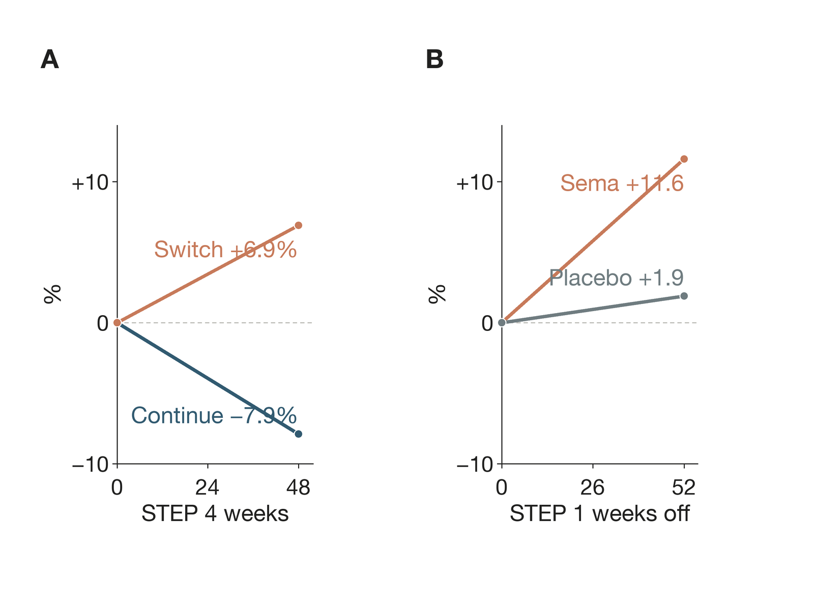
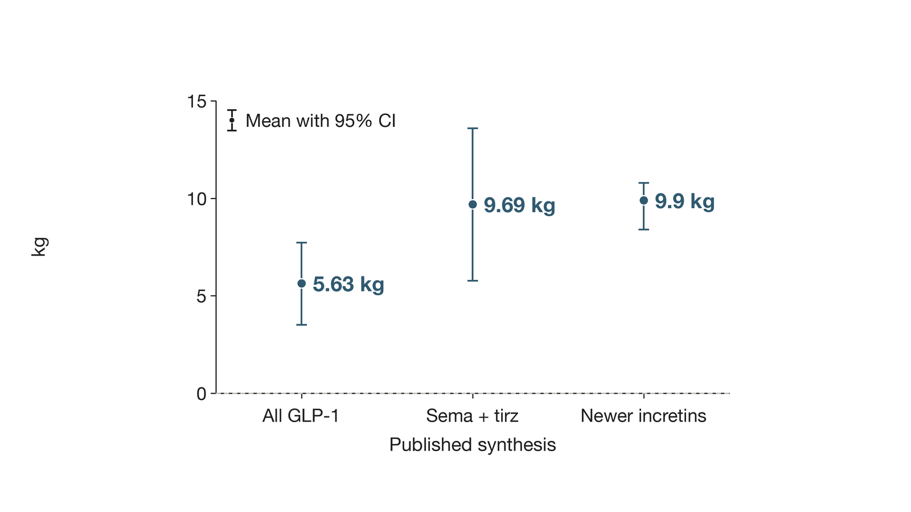
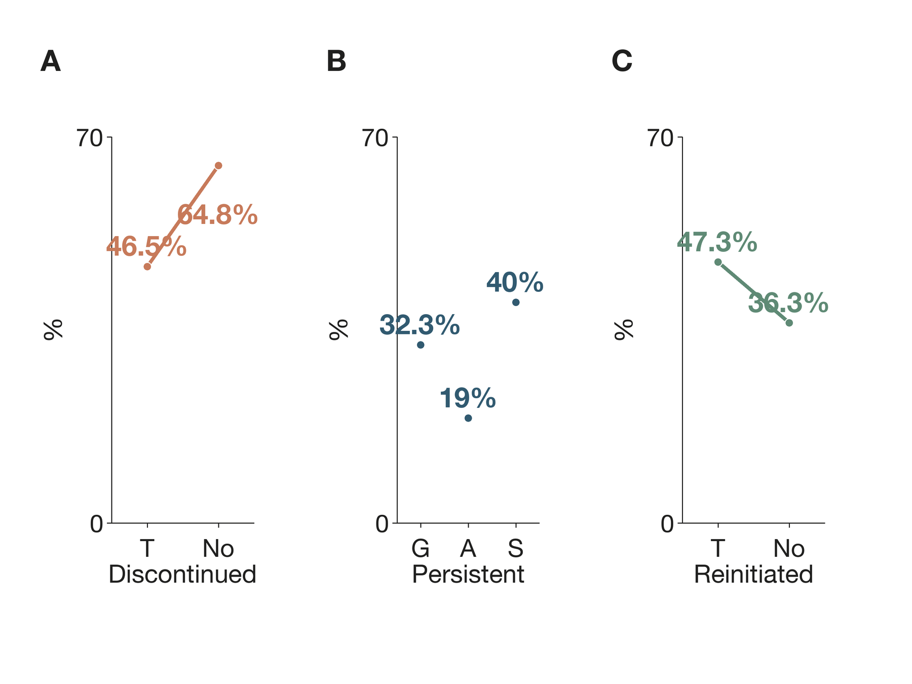

## When the weekly signal fades

*Stopping semaglutide is less like flipping a switch than watching an external biological assist recede. The evidence points to returning appetite pressure, frequent weight regain, and erosion of some metabolic gains—but not to one inevitable timetable.*

Twenty weeks into a large obesity trial, every participant had already received semaglutide. Then chance divided them: some kept taking it, while others were switched to placebo. Over the next 48 weeks, the continuing group lost another 7.9% of body weight, while the switch group gained 6.9% [Rubino et al. 2021](https://doi.org/10.1001/jama.2021.3224). The two paths opened from the same pharmacological starting line.

That split is the cleanest answer to what happens after the final injection. Semaglutide does not usually leave behind a permanent reset. As exposure ebbs, the appetite and eating-control effects demonstrated during treatment can ebb too; weight often rises; and several improvements tied to weight and treatment move back toward baseline. Yet “often” is not “always,” and the average curve is not a forecast for one body.

This direct withdrawal dataset followed participants from a semaglutide 2.4-mg obesity trial that excluded type 1 or type 2 diabetes [Wilding et al. 2022](https://doi.org/10.1111/dom.14725). That boundary matters. So does the difference between stopping under a trial protocol and stopping because a pharmacy cannot fill a prescription.

### First, the drug leaves slowly

Semaglutide was engineered to bind reversibly to albumin, which prolongs its action in the circulation [Knudsen & Lau 2019](https://doi.org/10.3389/fendo.2019.00155). Its long half-life supports once-weekly dosing [Yang & Yang 2024](https://doi.org/10.2147/dddt.s470826). A missed Monday dose therefore does not mean that the molecule has vanished by Tuesday.

The first change is a declining drug signal, not a special “withdrawal syndrome” established by clinical trials. Existing pharmacokinetic evidence cannot tell a person the exact day when hunger, blood sugar, or gastrointestinal sensations will change.

During treatment, small randomized studies repeatedly find lower ad-libitum food intake and better control of eating. One injectable-semaglutide study reported reduced appetite, food cravings, and energy intake at 20 weeks [Friedrichsen et al. 2021](https://doi.org/10.1111/dom.14280). An earlier injectable study likewise found lower energy intake after 12 weeks [Blundell et al. 2017](https://doi.org/10.1111/dom.12932). In adults with obesity, an oral-semaglutide experiment found reduced energy intake and appetite [Gabe et al. 2024](https://doi.org/10.1111/dom.15802). In adults with type 2 diabetes, another oral-semaglutide experiment found greater satiety and fullness [Gibbons et al. 2021](https://doi.org/10.1111/dom.14255). A systematic review reached the same broad conclusion across GLP-1 analogues [Aldawsari et al. 2023](https://doi.org/10.2147/dmso.s387116).

Those are on-treatment findings. They make the return of appetite pressure biologically plausible, but the major withdrawal trials did not continuously measure hunger from the final dose onward. They also complicate a popular explanation. One 20-week injectable-semaglutide study found no detectable delay in gastric emptying by paracetamol absorption at that time point [Friedrichsen et al. 2021](https://doi.org/10.1111/dom.14280). A 20-week oral-semaglutide study reported the same null finding at that time point [Gabe et al. 2024](https://doi.org/10.1111/dom.15802).

### The scale usually turns before it settles

Semaglutide’s active-treatment record is unusually consistent. In STEP 1, participants assigned to 2.4 mg lost 14.9% of baseline weight by week 68 on average [Wilding et al. 2021](https://doi.org/10.1056/nejmoa2032183). In STEP 5, the mean loss was 15.2% at week 104 [Garvey et al. 2022](https://doi.org/10.1038/s41591-022-02026-4). A long-term meta-analysis estimated a 12.3-kg advantage over placebo [Moiz et al. 2024](https://doi.org/10.1016/j.amjcard.2024.04.041). Another review found mean losses of 14.9% to 17.4% across four STEP trials [Bergmann et al. 2023](https://doi.org/10.1111/dom.14863). A broader medication review estimated that semaglutide produced 11.4% more weight loss than placebo [Gudzune & Kushner 2024](https://doi.org/10.1001/jama.2024.10816).

Continuation preserves that pressure on weight; withdrawal removes it. The randomized STEP 4 divergence is not a before-and-after anecdote, because both arms had the same run-in and both retained lifestyle intervention [Rubino et al. 2021](https://doi.org/10.1001/jama.2021.3224).

The randomized and extension trajectories are set side by side in [Figure 1](#fig-withdrawal-trajectory).

**Figure 1. Weight turns upward when treatment ends.** STEP 4 reports change after week-20 randomization [Rubino et al. 2021](https://doi.org/10.1001/jama.2021.3224). “Sema” means semaglutide. The designs and denominators differ, so the panels should not be numerically pooled.

STEP 1 supplies the longer view. During its 52-week extension without study treatment, former semaglutide recipients regained 11.6 percentage points, leaving them 5.6% below their original baseline on average [Wilding et al. 2022](https://doi.org/10.1111/dom.14725). At that one-year mark, 48.2% still retained at least a 5% loss [Wilding et al. 2022](https://doi.org/10.1111/dom.14725). “Regain” therefore does not mean that every participant returned to their starting weight.

Across GLP-1-receptor-agonist trials, however, the direction is remarkably stable. One meta-analysis concluded that regain was proportional to the original loss [Berg et al. 2025](https://doi.org/10.1111/obr.13929). A second found rebound across 11 randomized obesity trials but extreme between-study heterogeneity [Tzang et al. 2025](https://doi.org/10.1016/j.eclinm.2025.103680). A third described rapid regain across GLP-1 and dual GIP/GLP-1 agents after cessation [Quarenghi et al. 2025](https://doi.org/10.3390/jcm14113791).

### A fast average is not your stopwatch

A 2026 synthesis estimated that newer incretin medicines were followed by regain of 0.8 kg per month during observed follow-up [West et al. 2026](https://doi.org/10.1136/bmj-2025-085304). Its estimate is useful as a group-level pace, not a deadline. For the newest medicines, observed post-cessation data extended only to 12 months; later points in that analysis were projected [West et al. 2026](https://doi.org/10.1136/bmj-2025-085304).

The reported pooled magnitudes and their uncertainty appear in [Figure 2](#fig-metabolic-rebound).

The variation is not statistical clutter to be wished away. It reflects different drugs, doses, treatment lengths, populations, and follow-up programs. STEP 1 subgroup patterns were inconsistent across starting-body-size categories [Wilding et al. 2022](https://doi.org/10.1111/dom.14725). A small polycystic-ovary-syndrome cohort also reported highly heterogeneous individual responses after semaglutide [Jensterle et al. 2024](https://doi.org/10.3389/fendo.2024.1366940). No validated calculator can yet turn those averages into your month-by-month curve.

**Figure 2. Across 11 randomized trials in participants with overweight or obesity, GLP-1RA discontinuation was followed by 5.63 kg mean regain.** That plotted value is the meta-analysis’s overweight-or-obesity stratum [Tzang et al. 2025](https://doi.org/10.1016/j.eclinm.2025.103680). The “sema + tirz” estimate pools semaglutide and tirzepatide [Berg et al. 2025](https://doi.org/10.1111/obr.13929). The newer-incretin estimate is a one-year model output [West et al. 2026](https://doi.org/10.1136/bmj-2025-085304). Whiskers show reported 95% confidence intervals; these differently scoped points are not interchangeable personal forecasts.

| Evidence window | What changed after stopping | Key limitation or boundary |
|---|---|---|
| STEP 4 randomized withdrawal | Switch-to-placebo participants gained 6.9% over 48 weeks | Only participants who reached the 2.4-mg weekly maintenance dose were randomized |
| STEP 1 extension | Former semaglutide participants regained 11.6 percentage points in one year [Wilding et al. 2022](https://doi.org/10.1111/dom.14725) | Semaglutide and the lifestyle intervention both ended |
| Newer-incretin synthesis | Mean regain rate was 0.8 kg per month during observed follow-up | Observed follow-up ended at 12 months; later values were projections |
| PCOS cohort continuing metformin | Participants regained about one-third of prior loss over two years [Jensterle et al. 2024](https://doi.org/10.3389/fendo.2024.1366940) | What would happen without metformin or in other populations |

### More than weight moves

The body changes tracked after discontinuation are not confined to the scale. In STEP 4, waist circumference, systolic blood pressure, fasting glucose, fasting insulin, and lipids improved during the semaglutide run-in, stayed improved with continued treatment, and deteriorated after the switch to placebo [Kosiborod et al. 2023](https://doi.org/10.1111/dom.14890). In the STEP 1 extension, most cardiometabolic variables moved back toward baseline after withdrawal, though some net benefit remained at one year [Wilding et al. 2022](https://doi.org/10.1111/dom.14725). A modeled ten-year type 2 diabetes risk score likewise fell during treatment and rose after withdrawal [Wilkinson et al. 2023](https://doi.org/10.1002/oby.23842).

The direction is clearer than the clinical meaning for any individual. A meta-analysis estimated that [glycated hemoglobin](https://en.wikipedia.org/wiki/Glycated_hemoglobin), or HbA1c—a months-long measure of average blood sugar—rose by 0.25 percentage points in obesity cohorts after GLP-1-agonist cessation [Tzang et al. 2025](https://doi.org/10.1016/j.eclinm.2025.103680). The same analysis estimated a 0.65-point rise in type 2 diabetes cohorts [Tzang et al. 2025](https://doi.org/10.1016/j.eclinm.2025.103680). Those pooled values were highly heterogeneous.

Continuous semaglutide reduced major cardiovascular events in 17,604 high-risk adults without diabetes in SELECT [Lincoff et al. 2023](https://doi.org/10.1056/nejmoa2307563). SELECT did not test whether that event protection persists after stopping. Marker rebound cannot fill that evidentiary gap.

### Outside trials, stopping has many meanings

In everyday care, “stopped” may mean a planned transition, an intolerable adverse effect, an insurance denial, a shortage, or a long refill gap. Routine-care cohorts therefore report several different endpoints rather than one universal stopping rate.

Those endpoints are set side by side in [Figure 3](#fig-real-world-stopping).

**Figure 3. In a 125,474-person cohort, one-year discontinuation was 46.5% with and 64.8% without type 2 diabetes; reinitiation was 47.3% and 36.3%, respectively.** The study stratified results by type 2 diabetes status [Rodriguez et al. 2025](https://doi.org/10.1001/jamanetworkopen.2024.57349). A GLP-1 study reported 32.3% one-year persistence [Gleason et al. 2024](https://doi.org/10.18553/jmcp.2024.23332). An anti-obesity-medication cohort reported 19% overall and 40% for semaglutide [Gasoyan et al. 2024a](https://doi.org/10.1002/oby.23952). Panel B abbreviates these as “GLP,” “All,” and “sema.” Definitions and denominators differ.

Why do people stop? In a 288-person chart review, cost or insurance problems accounted for 47.6% of documented first-year discontinuations; side effects accounted for 14.6%, and shortages for 11.8% [Gasoyan et al. 2025b](https://doi.org/10.1002/oby.70058). In another clinical cohort, notes most often named adverse effects and cost [Rodriguez et al. 2025](https://doi.org/10.1001/jamanetworkopen.2024.57349). These records capture access as much as biology.

Routine-care weight outcomes track exposure, but not with experimental control. One cohort reported one-year weight reductions of 3.6% with early discontinuation, 6.8% with late discontinuation, and 11.9% without discontinuation [Gasoyan et al. 2025a](https://doi.org/10.1002/oby.24331). Another found a 5.5% loss with persistent coverage, compared with 1.8% among patients with fewer than 90 covered days [Gasoyan et al. 2024b](https://doi.org/10.1001/jamanetworkopen.2024.33326). Selection, dose, indication, and access can contribute to those gaps.

### Can anything make the landing gentler?

Here the evidence changes character. It becomes smaller, less semaglutide-specific, and more dependent on selected populations.

The strongest randomized clue comes from liraglutide, a different [glucagon-like peptide-1 receptor agonist](https://en.wikipedia.org/wiki/GLP-1_receptor_agonist), or GLP-1 drug. People who combined supervised exercise with liraglutide during treatment maintained weight and fat loss better one year after both interventions ended than people who had used liraglutide alone [Jensen et al. 2024](https://doi.org/10.1016/j.eclinm.2024.102475). Some regain still occurred.

In 25 women with polycystic ovary syndrome who continued metformin and lifestyle support, about one-third of semaglutide-induced weight loss returned over two years [Jensterle et al. 2024](https://doi.org/10.3389/fendo.2024.1366940). In a propensity-matched telemedicine cohort for type 2 diabetes, more than 70% of deprescribed participants maintained at least 5% weight loss at 12 months while continuing a carbohydrate-restricted nutrition program [McKenzie & Athinarayanan 2024](https://doi.org/10.1007/s13300-024-01547-0). Neither cohort proves that its approach will generalize.

What about tapering, a particular diet, or a handoff to exercise? A review says the efficacy of proposed lifestyle measures still awaits well-designed randomized trials [Dash 2024](https://doi.org/10.1111/dom.15829). There is no broadly validated semaglutide off-ramp yet.

### The practical question is not “Will I fail?”

The evidence does not support framing regain as a moral verdict. Semaglutide alters appetite and eating while exposure continues; removing that pharmacological help changes the conditions under which weight was lost. Continued treatment can maintain large average losses, but gastrointestinal events cause some trial participants to discontinue [Wilding et al. 2021](https://doi.org/10.1056/nejmoa2032183). Real-world access creates another layer of interruption.

A safer question is: which benefits is the person trying to preserve, and what monitoring or replacement support fits that reason? Someone taking semaglutide for type 2 diabetes has a different glucose risk from someone using it only for obesity. A person stopping for nausea has a different problem from someone confronting a denied refill. The pooled evidence cannot decide an individual medication plan.

The honest forecast has two levels. At the population level, appetite control is likely to loosen, weight regain is common, and some metabolic markers tend to deteriorate. At the personal level, magnitude and timing remain uncertain—and the smaller studies that beat the average did so with continuing structure, not with a biological reset.

**Sources**

**Aldawsari M, Almadani FA, Almuhammadi N, Algabsani S, Alamro Y, Aldhwayan M (2023)** The Efficacy of GLP-1 Analogues on Appetite Parameters, Gastric Emptying, Food Preference and Taste Among Adults with Obesity: Systematic Review of Randomized Controlled Trials. *Diabetes, Metabolic Syndrome and Obesity*. https://doi.org/10.2147/dmso.s387116 · 1 claim · abstract

**Berg S, Stickle H, Rose SJ, Nemec EC (2025)** Discontinuing glucagon‐like peptide‐1 receptor agonists and body habitus: A systematic review and meta‐analysis. *Obesity Reviews*. https://doi.org/10.1111/obr.13929 · 2 claims · abstract

**Bergmann NC, Davies MJ, Lingvay I, Knop FK (2023)** Semaglutide for the treatment of overweight and obesity: A review. *Diabetes, Obesity and Metabolism*. https://doi.org/10.1111/dom.14863 · 1 claim · abstract

**Blundell J, Finlayson G, Axelsen M, Flint A, Gibbons C, Kvist T, Hjerpsted JB (2017)** Effects of once‐weekly semaglutide on appetite, energy intake, control of eating, food preference and body weight in subjects with obesity. *Diabetes, Obesity and Metabolism*. https://doi.org/10.1111/dom.12932 · 1 claim · full text

**Dash S (2024)** Opportunities to optimize lifestyle interventions in combination with glucagon‐like peptide ‐1‐based therapy. *Diabetes, Obesity and Metabolism*. https://doi.org/10.1111/dom.15829 · 1 claim · abstract

**Friedrichsen M, Breitschaft A, Tadayon S, Wizert A, Skovgaard D (2021)** The effect of semaglutide 2.4 mg once weekly on energy intake, appetite, control of eating, and gastric emptying in adults with obesity. *Diabetes, Obesity and Metabolism*. https://doi.org/10.1111/dom.14280 · 2 claims · full text

**Gabe MBN, Breitschaft A, Knop FK, Hansen MR, Kirkeby K, Rathor N, Adrian CL (2024)** Effect of oral semaglutide on energy intake, appetite, control of eating and gastric emptying in adults living with obesity: A randomized controlled trial. *Diabetes, Obesity and Metabolism*. https://doi.org/10.1111/dom.15802 · 2 claims · abstract

**Garvey WT, Batterham RL, Bhatta M, Buscemi S, Christensen LN, Frias JP, Jódar E, Kandler K, Rigas G, Wadden TA, Wharton S, the STEP 5 Study Group (2022)** Two-year effects of semaglutide in adults with overweight or obesity: the STEP 5 trial. *Nature Medicine*. https://doi.org/10.1038/s41591-022-02026-4 · 1 claim · abstract

**Gasoyan H, Pfoh ER, Schulte R, Le P, Rothberg MB (2024a)** Early‐ and later‐stage persistence with antiobesity medications: A retrospective cohort study. *Obesity*. https://doi.org/10.1002/oby.23952 · 1 claim · abstract

**Gasoyan H, Pfoh ER, Schulte R, Le P, Butsch WS, Rothberg MB (2024b)** One-Year Weight Reduction With Semaglutide or Liraglutide in Clinical Practice. *JAMA Network Open*. https://doi.org/10.1001/jamanetworkopen.2024.33326 · 1 claim · abstract

**Gasoyan H, Butsch WS, Casacchia NJ, Schulte R, Criswell V, Fox J, Renner H, Le P, Alpert J, Rothberg MB (2025b)** Reasons for Discontinuation of Obesity Pharmacotherapy With Semaglutide or Tirzepatide in Clinical Practice. *Obesity*. https://doi.org/10.1002/oby.70058 · 1 claim · abstract

**Gasoyan H, Butsch WS, Schulte R, Casacchia NJ, Le P, Boyer CB, Griebeler ML, Burguera B, Rothberg MB (2025a)** Changes in weight and glycemic control following obesity treatment with semaglutide or tirzepatide by discontinuation status. *Obesity*. https://doi.org/10.1002/oby.24331 · 1 claim · full text

**Gibbons C, Blundell J, Tetens Hoff S, Dahl K, Bauer R, Bækdal T (2021)** Effects of oral semaglutide on energy intake, food preference, appetite, control of eating and body weight in subjects with type 2 diabetes. *Diabetes, Obesity and Metabolism*. https://doi.org/10.1111/dom.14255 · 1 claim · abstract

**Gleason PP, Urick BY, Marshall LZ, Friedlander N, Qiu Y, Leslie RS (2024)** Real-world persistence and adherence to glucagon-like peptide-1 receptor agonists among obese commercially insured adults without diabetes. *Journal of Managed Care & Specialty Pharmacy*. https://doi.org/10.18553/jmcp.2024.23332 · 1 claim · abstract

**Gudzune KA, Kushner RF (2024)** Medications for Obesity. *JAMA*. https://doi.org/10.1001/jama.2024.10816 · 1 claim · abstract

**Jensen SBK, Blond MB, Sandsdal RM, Olsen LM, Juhl CR, Lundgren JR, Janus C, Stallknecht BM, Holst JJ, Madsbad S, Torekov SS (2024)** Healthy weight loss maintenance with exercise, GLP-1 receptor agonist, or both combined followed by one year without treatment: a post-treatment analysis of a randomised placebo-controlled trial. *eClinicalMedicine*. https://doi.org/10.1016/j.eclinm.2024.102475 · 1 claim · full text

**Jensterle M, Ferjan S, Janez A (2024)** The maintenance of long-term weight loss after semaglutide withdrawal in obese women with PCOS treated with metformin: a 2-year observational study. *Frontiers in Endocrinology*. https://doi.org/10.3389/fendo.2024.1366940 · 3 claims · full text

**Knudsen LB, Lau J (2019)** The Discovery and Development of Liraglutide and Semaglutide. *Frontiers in Endocrinology*. https://doi.org/10.3389/fendo.2019.00155 · 1 claim · abstract

**Kosiborod MN, Bhatta M, Davies M, Deanfield JE, Garvey WT, Khalid U, Kushner R, Rubino DM, Zeuthen N, Verma S (2023)** Semaglutide improves cardiometabolic risk factors in adults with overweight or obesity: STEP 1 and 4 exploratory analyses. *Diabetes, Obesity and Metabolism*. https://doi.org/10.1111/dom.14890 · 1 claim · full text

**Lincoff AM, Brown-Frandsen K, Colhoun HM, Deanfield J, Emerson SS, Esbjerg S, Hardt-Lindberg S, Hovingh GK, Kahn SE, Kushner RF, Lingvay I, Oral TK, Michelsen MM, Plutzky J, Tornøe CW, Ryan DH (2023)** Semaglutide and Cardiovascular Outcomes in Obesity without Diabetes. *New England Journal of Medicine*. https://doi.org/10.1056/nejmoa2307563 · 1 claim · abstract

**McKenzie AL, Athinarayanan SJ (2024)** Impact of Glucagon-Like Peptide 1 Agonist Deprescription in Type 2 Diabetes in a Real-World Setting: A Propensity Score Matched Cohort Study. *Diabetes Therapy*. https://doi.org/10.1007/s13300-024-01547-0 · 1 claim · abstract

**Moiz A, Levett JY, Filion KB, Peri K, Reynier P, Eisenberg MJ (2024)** Long-Term Efficacy and Safety of Once-Weekly Semaglutide for Weight Loss in Patients Without Diabetes: A Systematic Review and Meta-Analysis of Randomized Controlled Trials. *The American Journal of Cardiology*. https://doi.org/10.1016/j.amjcard.2024.04.041 · 1 claim · abstract

**Quarenghi M, Capelli S, Galligani G, Giana A, Preatoni G, Turri Quarenghi R (2025)** Weight Regain After Liraglutide, Semaglutide or Tirzepatide Interruption: A Narrative Review of Randomized Studies. *Journal of Clinical Medicine*. https://doi.org/10.3390/jcm14113791 · 1 claim · abstract

**Rodriguez PJ, Zhang V, Gratzl S, Do D, Goodwin Cartwright B, Baker C, Gluckman TJ, Stucky N, Emanuel EJ (2025)** Discontinuation and Reinitiation of Dual-Labeled GLP-1 Receptor Agonists Among US Adults With Overweight or Obesity. *JAMA Network Open*. https://doi.org/10.1001/jamanetworkopen.2024.57349 · 2 claims · full text

**Rubino D, Abrahamsson N, Davies M, Hesse D, Greenway FL, Jensen C, Lingvay I, Mosenzon O, Rosenstock J, Rubio MA, Rudofsky G, Tadayon S, Wadden TA, Dicker D, STEP 4 Investigators, Friberg M, Sjödin A, Dicker D, Segal G, Mosenzon O, Sabbah M, Sofer Y, Vishlitzky V, Meesters EW, Serlie M, van Bon A, Cardoso H, Freitas P, Carneiro de Melo P, Monteiro M, Monteiro M, Rodrigues D, Badat A, Joshi P, Latiff G, Mitha EA, Snyman HH, van Nieuwenhuizen E, González Albarrán O, Caixas A, de al Cuesta C, Garcia Luna PP, Morales Portillo C, Mezquita Raya P, Rubio MA, Abrahamsson N, Hoffstedt J, von Wowern F, Uddman E, Bach-Kliegel B, Beuschlein F, Bilz S, Golay A, Rudofsky G, Strey C, Fadieienko G, Kosei N, Tatarchuk T, Velychko V, Zinych O, Aronoff SL, Bays HE, Brockmyre AP, Call RS, Crump C, Desouza CV, Espinosa V, Free AL, Gandy WH, Geller SA, Gottschlich GM, Greenway FL, Han-Conrad L, Harper W, Herman L, Hewitt M, Hollander P, Kaster SR, Manessis A, Martin FA, McNeill RE, Murray AV, Norwood PC, Reed JCH, Rosenstock J, Rubino DM, Schear MJ, Warren ML (2021)** Effect of Continued Weekly Subcutaneous Semaglutide vs Placebo on Weight Loss Maintenance in Adults With Overweight or Obesity. *JAMA*. https://doi.org/10.1001/jama.2021.3224 · 3 claims · abstract

**Tzang CC, Wu PH, Luo CA, Chen ZT, Lee YT, Huang ES, Kang YF, Lin WC, Tzang BS, Hsu TC (2025)** Metabolic rebound after GLP-1 receptor agonist discontinuation: a systematic review and meta-analysis. *eClinicalMedicine*. https://doi.org/10.1016/j.eclinm.2025.103680 · 4 claims · full text

**West S, Scragg J, Aveyard P, Oke JL, Willis L, Haffner SJP, Knight H, Wang D, Morrow S, Heath L, Jebb SA, Koutoukidis DA (2026)** Weight regain after cessation of medication for weight management: systematic review and meta-analysis. *BMJ*. https://doi.org/10.1136/bmj-2025-085304 · 3 claims · full text

**Wilding JPH, Batterham RL, Calanna S, Davies M, Van Gaal LF, Lingvay I, McGowan BM, Rosenstock J, Tran MTD, Wadden TA, Wharton S, Yokote K, Zeuthen N, Kushner RF (2021)** Once-Weekly Semaglutide in Adults with Overweight or Obesity. *New England Journal of Medicine*. https://doi.org/10.1056/nejmoa2032183 · 2 claims · abstract

**Wilding JPH, Batterham RL, Davies M, Van Gaal LF, Kandler K, Konakli K, Lingvay I, McGowan BM, Oral TK, Rosenstock J, Wadden TA, Wharton S, Yokote K, Kushner RF, STEP 1 Study Group (2022)** Weight regain and cardiometabolic effects after withdrawal of semaglutide: The STEP 1 trial extension. *Diabetes, Obesity and Metabolism*. https://doi.org/10.1111/dom.14725 · 6 claims · full text

**Wilkinson L, Holst‐Hansen T, Laursen PN, Rinnov AR, Batterham RL, Garvey WT (2023)** Effect of semaglutide 2.4 mg once weekly on 10‐year type 2 diabetes risk in adults with overweight or obesity. *Obesity*. https://doi.org/10.1002/oby.23842 · 1 claim · abstract

**Yang XD, Yang YY (2024)** Clinical Pharmacokinetics of Semaglutide: A Systematic Review. *Drug Design, Development and Therapy*. https://doi.org/10.2147/dddt.s470826 · 1 claim · full text

**Receipts**

*50 cited sentences · 50 source checks · 25 supported at full text · 25 at abstract · 0 partial · 0 contradicted — every pair's verbatim quote is in `ozempic-after-stopping-receipts.md`.*
