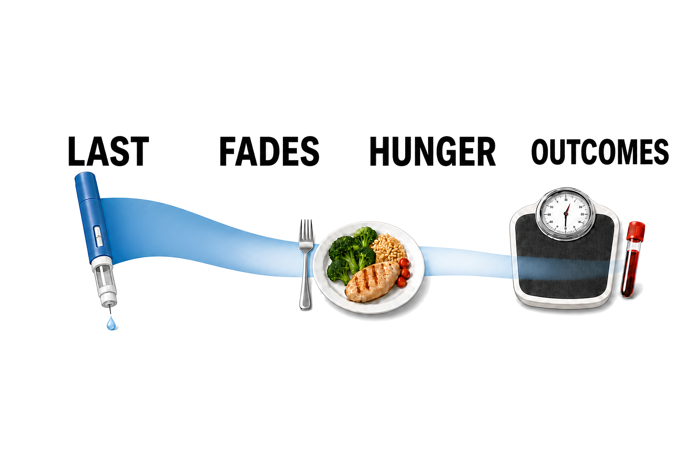

## After the last Ozempic shot, several clocks start ticking

*Stopping Ozempic does not flip one switch. The drug fades over weeks; appetite, weight, and blood tests can change over months; and the best evidence describes an average return of treated biology, not a guaranteed fate for one body.*

Rubino's trial investigators made the moment unusually clean. After a run-in, several hundred adults who had reached the obesity dose were randomized: two-thirds kept taking semaglutide, while the rest received placebo; both groups kept lifestyle support [Rubino et al. 2021](https://doi.org/10.1001/jama.2021.3224). From that fork, the people switched off semaglutide gained 6.9% of their randomization weight; those who stayed on it lost another 7.9% [Rubino et al. 2021](https://doi.org/10.1001/jama.2021.3224).

That experiment supplies the clearest answer—and its biggest trap. Ozempic and Wegovy contain semaglutide, but the strongest withdrawal trials used the higher obesity dose associated with Wegovy in people without diabetes [Rubino et al. 2021](https://doi.org/10.1001/jama.2021.3224), [Wilding et al. 2022](https://doi.org/10.1111/dom.14725). Those trials do not directly tell us what happens after lower Ozempic doses or in diabetes [Rubino et al. 2021](https://doi.org/10.1001/jama.2021.3224), [Wilding et al. 2022](https://doi.org/10.1111/dom.14725). The active drug is the same; the tested dose, starting point, and stakes are not [Rubino et al. 2021](https://doi.org/10.1001/jama.2021.3224), [Wilding et al. 2022](https://doi.org/10.1111/dom.14725). What happens after the last injection is best understood as a sequence of clocks, each running at a different speed.

### The drug clock runs for weeks

The final injection keeps working after the pen is put away [Overgaard et al. 2021](https://doi.org/10.1007/s40262-021-01025-x), [Yang & Yang 2024](https://doi.org/10.2147/dddt.s470826). Overgaard's team modeled semaglutide in blood after oral, subcutaneous, and intravenous dosing; Yang's group later gathered the human pharmacokinetic studies [Overgaard et al. 2021](https://doi.org/10.1007/s40262-021-01025-x), [Yang & Yang 2024](https://doi.org/10.2147/dddt.s470826). Both put its plasma half-life near one week, with measurable exposure lingering for several weeks [Overgaard et al. 2021](https://doi.org/10.1007/s40262-021-01025-x), [Yang & Yang 2024](https://doi.org/10.2147/dddt.s470826). Biology gets a fade, not a cliff [Overgaard et al. 2021](https://doi.org/10.1007/s40262-021-01025-x), [Yang & Yang 2024](https://doi.org/10.2147/dddt.s470826).

As the exposure ebbs, some unwanted effects can recede too [Wharton et al. 2022](https://doi.org/10.1111/dom.14551). Wharton and colleagues found that nausea, diarrhoea, vomiting, and constipation clustered during active treatment and dose escalation [Wharton et al. 2022](https://doi.org/10.1111/dom.14551). In the withdrawal phase, new gut events were less common after the switch to placebo [Wharton et al. 2022](https://doi.org/10.1111/dom.14551). The evidence therefore looks less like a classic acute withdrawal syndrome than the gradual loss of a drug's ongoing effects [Rubino et al. 2021](https://doi.org/10.1001/jama.2021.3224), [Wharton et al. 2022](https://doi.org/10.1111/dom.14551), [Wilding et al. 2022](https://doi.org/10.1111/dom.14725). The trials did not, however, record every symptom from every person's final dose [Wilding et al. 2022](https://doi.org/10.1111/dom.14725).

The staggered sequence is mapped in [Figure 1](#fig-signal-fades): exposure fades first, while the outcomes it had been holding change on their own clocks [Overgaard et al. 2021](https://doi.org/10.1007/s40262-021-01025-x), [Blundell et al. 2017](https://doi.org/10.1111/dom.12932), [Wilding et al. 2022](https://doi.org/10.1111/dom.14725), [Tzang et al. 2025](https://doi.org/10.1016/j.eclinm.2025.103680).

**Figure 1. One injection ends; its effects unwind on different clocks.** Follow the blue ribbon from the final dose: semaglutide exposure falls over weeks, appetite can re-emerge as that signal thins, and average weight and metabolic changes unfold later. The spacing is schematic, not a schedule for one person [Overgaard et al. 2021](https://doi.org/10.1007/s40262-021-01025-x), [Blundell et al. 2017](https://doi.org/10.1111/dom.12932), [Wilding et al. 2022](https://doi.org/10.1111/dom.14725), [Tzang et al. 2025](https://doi.org/10.1016/j.eclinm.2025.103680).

### Hunger can return before the scale moves

What disappears with the drug? While semaglutide is active, the [GLP-1 receptor agonist](https://en.wikipedia.org/wiki/Glucagon-like_peptide-1_receptor_agonist), a medicine that mimics a gut-hormone signal involved in appetite and glucose control, tamped down appetite and food intake across three controlled feeding studies [Blundell et al. 2017](https://doi.org/10.1111/dom.12932), [Friedrichsen et al. 2021](https://doi.org/10.1111/dom.14280), [Gabe et al. 2024](https://doi.org/10.1111/dom.15802). In the measured meals, people ate roughly one-quarter to one-third less [Blundell et al. 2017](https://doi.org/10.1111/dom.12932), [Friedrichsen et al. 2021](https://doi.org/10.1111/dom.14280).

The stomach story is subtler. Two controlled studies found no durable delay in gastric emptying by their indirect paracetamol test [Friedrichsen et al. 2021](https://doi.org/10.1111/dom.14280), [Gabe et al. 2024](https://doi.org/10.1111/dom.15802). Appetite, cravings, and control of eating carry the better-supported explanation [Blundell et al. 2017](https://doi.org/10.1111/dom.12932), [Friedrichsen et al. 2021](https://doi.org/10.1111/dom.14280), [Gabe et al. 2024](https://doi.org/10.1111/dom.15802). When the pharmacological signal fades, those effects can fade with it [Damhof et al. 2026](https://doi.org/10.1111/dom.71075), [Piguet et al. 2026](https://doi.org/10.1113/jp291081).

But here the evidence jumps a missing stair. Researchers have measured hunger carefully while semaglutide is active [Blundell et al. 2017](https://doi.org/10.1111/dom.12932), [Friedrichsen et al. 2021](https://doi.org/10.1111/dom.14280), [Gabe et al. 2024](https://doi.org/10.1111/dom.15802). They have rarely repeated those measurements after it stops [Damhof et al. 2026](https://doi.org/10.1111/dom.71075), [Piguet et al. 2026](https://doi.org/10.1113/jp291081). Reviews propose returning appetite, counter-regulatory hormones, and energy-balance adaptations as drivers [Damhof et al. 2026](https://doi.org/10.1111/dom.71075), [Piguet et al. 2026](https://doi.org/10.1113/jp291081). The week-by-week return of hunger remains largely uncharted [Damhof et al. 2026](https://doi.org/10.1111/dom.71075), [Piguet et al. 2026](https://doi.org/10.1113/jp291081).

### By months, the average weight curve points uphill

Rubino's randomized split shows that lifestyle support did not stop the average curve from turning [Rubino et al. 2021](https://doi.org/10.1001/jama.2021.3224). Wilding's team watched selected trial completers for a full year after semaglutide and structured counseling both ended [Wilding et al. 2022](https://doi.org/10.1111/dom.14725). They had lost about one-sixth of their starting weight, then regained roughly two-thirds of that loss; nearly half still retained a clinically meaningful loss [Wilding et al. 2022](https://doi.org/10.1111/dom.14725). Regain was common, but complete erasure was not [Wilding et al. 2022](https://doi.org/10.1111/dom.14725).

Panel A of [Figure 2](#fig-weight-curves) shows the randomized fork; panel B follows the longer out-and-back path.

**Figure 2. The group average turns upward after semaglutide stops.** In panel A, the x-axis is STEP 4 trial week 20 to 68 and the y-axis is mean percentage change from week-20 weight; the direct labels mark the continued and withdrawn endpoints. The table below reports their contrast and interval. In panel B, the x-axis is STEP 1 week 0 to 120 and the y-axis is mean percentage change from pretreatment baseline. Points are group means, not individual tracks [Rubino et al. 2021](https://doi.org/10.1001/jama.2021.3224), [Wilding et al. 2022](https://doi.org/10.1111/dom.14725), [Berg et al. 2025](https://doi.org/10.1111/obr.13929), [Budini et al. 2026](https://doi.org/10.1016/j.eclinm.2026.103796).

The pooled literature agrees on the direction and quarrels about the amount [Berg et al. 2025](https://doi.org/10.1111/obr.13929), [Tzang et al. 2025](https://doi.org/10.1016/j.eclinm.2025.103680), [West et al. 2026](https://doi.org/10.1136/bmj-2025-085304), [Budini et al. 2026](https://doi.org/10.1016/j.eclinm.2026.103796). Berg's and Tzang's teams both found regain after incretin drugs stopped, with sharp differences among drugs, populations, and trials [Berg et al. 2025](https://doi.org/10.1111/obr.13929), [Tzang et al. 2025](https://doi.org/10.1016/j.eclinm.2025.103680). West's broader review and Budini's nonlinear model likewise traced an average path back upward [West et al. 2026](https://doi.org/10.1136/bmj-2025-085304), [Budini et al. 2026](https://doi.org/10.1016/j.eclinm.2026.103796). Models that project a plateau go beyond direct data, which stop at roughly a year [Budini et al. 2026](https://doi.org/10.1016/j.eclinm.2026.103796), [West et al. 2026](https://doi.org/10.1136/bmj-2025-085304).

| Evidence | Stop | Average | Limit |
|---|---|---|---|
| STEP 4 [Rubino et al. 2021](https://doi.org/10.1001/jama.2021.3224) | 803; 2.4 mg continued or stopped | Weeks 20–68: −7.9% vs +6.9%; −14.8-point difference (95% [confidence interval](https://en.wikipedia.org/wiki/Confidence_interval), plausible range −16.0 to −13.5) | Not Ozempic doses; run-in intolerance |
| STEP 1 extension [Wilding et al. 2022](https://doi.org/10.1111/dom.14725) | 327; 2.4 mg stopped | −17.3%, then +11.6 points: −5.6% net after a year | No longer-term outcomes; no diabetes-specific inference; no individual prediction |
| HIV cohort [Erlandson et al. 2026](https://doi.org/10.1093/cid/ciaf652) | 49; 1 mg stopped | −7.8 then +2.9 kg in 24 weeks | No control; limited generalisability |
| PCOS cohort [Jensterle et al. 2024](https://doi.org/10.3389/fendo.2024.1366940) | 25; 1 mg stopped; metformin | 101→92→95 kg over two years | Metformin or selection |

### Blood tests follow, but on another clock

Weight is only the visible dial. In the STEP 1 extension, blood pressure returned to baseline and improvements in glucose, inflammation, and several lipids narrowed as weight came back, although some advantages remained [Wilding et al. 2022](https://doi.org/10.1111/dom.14725). Tzang's randomized-trial synthesis found the same overall direction, but not a synchronized march [Tzang et al. 2025](https://doi.org/10.1016/j.eclinm.2025.103680). In obesity studies, systolic pressure and [HbA1c](https://en.wikipedia.org/wiki/Glycated_hemoglobin)—a measure of average blood sugar over recent months—rose on average, while HDL cholesterol and diastolic pressure did not clearly worsen [Tzang et al. 2025](https://doi.org/10.1016/j.eclinm.2025.103680).

Diabetes changes the balance. Across randomized diabetes trials, average weight regain was smaller than in obesity trials, while average HbA1c worsened more [Tzang et al. 2025](https://doi.org/10.1016/j.eclinm.2025.103680). The fasting-glucose estimate was too imprecise to rule out little change [Tzang et al. 2025](https://doi.org/10.1016/j.eclinm.2025.103680). An active-treatment trial also found that far more participants with prediabetes returned to normal-range measures on semaglutide than on placebo [McGowan et al. 2024](https://doi.org/10.1016/s2213-8587%2824%2900182-7). Losing that control can matter even when the scale moves modestly [Tzang et al. 2025](https://doi.org/10.1016/j.eclinm.2025.103680), [Ceriello et al. 2026](https://doi.org/10.1038/s41574-026-01258-5).

Could stopping also change heart attacks or strokes? Xie's team emulated a target trial in Veterans Affairs records and found progressively higher cardiovascular-event risk with longer GLP-1 treatment gaps versus continuous use [Xie et al. 2026](https://doi.org/10.1136/bmjmed-2025-002150). That pattern is concerning, but it remains observational [Xie et al. 2026](https://doi.org/10.1136/bmjmed-2025-002150). Prescriptions are not ingestion, the population was mostly veterans with diabetes, and unmeasured differences may remain [Xie et al. 2026](https://doi.org/10.1136/bmjmed-2025-002150). Current reviews still call hard outcomes after discontinuation an open question [Ceriello et al. 2026](https://doi.org/10.1038/s41574-026-01258-5).

### Then the neat average breaks apart

Gasoyan and colleagues supplied the plot twist. In a large health-record cohort using injectable semaglutide or tirzepatide, people who stopped early lost less weight by one year than those who continued [Gasoyan et al. 2025](https://doi.org/10.1002/oby.24331). Yet the recorded weights after discontinuation looked surprisingly stable [Gasoyan et al. 2025](https://doi.org/10.1002/oby.24331). That does not overturn the randomized trials [Rubino et al. 2021](https://doi.org/10.1001/jama.2021.3224), [Wilding et al. 2022](https://doi.org/10.1111/dom.14725), [Gasoyan et al. 2025](https://doi.org/10.1002/oby.24331). Most patients used lower maintenance doses, clinical weights were sparse, prescription gaps could reflect shortages, and diet, another medicine, or a restart could happen offstage [Gasoyan et al. 2025](https://doi.org/10.1002/oby.24331).

Smaller prospective studies widen the range [Erlandson et al. 2026](https://doi.org/10.1093/cid/ciaf652), [Jensterle et al. 2024](https://doi.org/10.3389/fendo.2024.1366940). Erlandson's lower-dose cohort regained some, not all, of its loss over the following months [Erlandson et al. 2026](https://doi.org/10.1093/cid/ciaf652). In Jensterle's small PCOS cohort, participants continued metformin and retained about two-thirds of the semaglutide loss two years later [Jensterle et al. 2024](https://doi.org/10.3389/fendo.2024.1366940). These studies cannot prove that a lower dose is easier to stop [Erlandson et al. 2026](https://doi.org/10.1093/cid/ciaf652), [Jensterle et al. 2024](https://doi.org/10.3389/fendo.2024.1366940). They do show that “everyone returns to baseline” is too strong [Erlandson et al. 2026](https://doi.org/10.1093/cid/ciaf652), [Jensterle et al. 2024](https://doi.org/10.3389/fendo.2024.1366940).

The scale hides another unknown. During active treatment, [dual-energy X-ray absorptiometry](https://en.wikipedia.org/wiki/Dual-energy_X-ray_absorptiometry), an imaging method that separates fat from lean tissue, showed semaglutide can reduce both [McCrimmon et al. 2020](https://doi.org/10.1007/s00125-019-05065-8), [Alissou et al. 2026](https://doi.org/10.1111/dom.70141). Reviews warn that “lean mass” also includes water and organs and need not mean lost muscle function [Neeland et al. 2024](https://doi.org/10.1111/dom.15728), [Locatelli et al. 2024](https://doi.org/10.2337/dci23-0100). Almost no study has repeated those scans after withdrawal [Alissou et al. 2026](https://doi.org/10.1111/dom.70141), [Neeland et al. 2024](https://doi.org/10.1111/dom.15728), [Locatelli et al. 2024](https://doi.org/10.2337/dci23-0100). The returning kilograms do not arrive with labels.

This unfinished question reaches ordinary care [Rodriguez et al. 2025](https://doi.org/10.1001/jamanetworkopen.2024.57349), [Lim et al. 2025](https://doi.org/10.1007/s00125-025-06439-x). In a US cohort, stopping within a year was common—especially without diabetes—and many people later restarted [Rodriguez et al. 2025](https://doi.org/10.1001/jamanetworkopen.2024.57349). Swedish diabetes registers likewise showed that refill gaps often ended in reinitiation [Lim et al. 2025](https://doi.org/10.1007/s00125-025-06439-x). “Stopped” is often a chapter, not an ending [Rodriguez et al. 2025](https://doi.org/10.1001/jamanetworkopen.2024.57349), [Lim et al. 2025](https://doi.org/10.1007/s00125-025-06439-x).

Why can a clean randomized mean and steadier clinic records both be true? The studies ask different questions. Withdrawal trials fix the switch and follow selected groups [Rubino et al. 2021](https://doi.org/10.1001/jama.2021.3224), [Wilding et al. 2022](https://doi.org/10.1111/dom.14725). Health records mix doses, shortages, restarts, replacement medicines, sparse weigh-ins, and many reasons for stopping [Gasoyan et al. 2025](https://doi.org/10.1002/oby.24331), [Rodriguez et al. 2025](https://doi.org/10.1001/jamanetworkopen.2024.57349), [Lim et al. 2025](https://doi.org/10.1007/s00125-025-06439-x). Smaller cohorts add still more selected populations [Erlandson et al. 2026](https://doi.org/10.1093/cid/ciaf652), [Jensterle et al. 2024](https://doi.org/10.3389/fendo.2024.1366940). Together, these designs can describe a group direction, but none can assign one person's path [Wilding et al. 2022](https://doi.org/10.1111/dom.14725), [Tzang et al. 2025](https://doi.org/10.1016/j.eclinm.2025.103680), [Gasoyan et al. 2025](https://doi.org/10.1002/oby.24331).

[Figure 3](#fig-many-paths) separates what the evidence can predict from what it cannot.

**Figure 3. A reliable average still makes a poor personal forecast.** The crowd and coral arrow carry the randomized group finding: withdrawal usually bends the average toward regain. The lone person faces three deliberately unranked paths, while the dashed boundary marks the missing rule that would assign one person to one course [Rubino et al. 2021](https://doi.org/10.1001/jama.2021.3224), [Gasoyan et al. 2025](https://doi.org/10.1002/oby.24331), [Erlandson et al. 2026](https://doi.org/10.1093/cid/ciaf652), [Jensterle et al. 2024](https://doi.org/10.3389/fendo.2024.1366940).

### The off-ramp remains an experiment

One randomized clue comes from a related drug [Jensen et al. 2024](https://doi.org/10.1016/j.eclinm.2024.102475). Jensen's team followed people for a year after liraglutide, supervised exercise, both, or placebo ended [Jensen et al. 2024](https://doi.org/10.1016/j.eclinm.2024.102475). Those previously assigned exercise plus liraglutide maintained more weight loss than those previously assigned liraglutide alone; prior exercise also beat prior liraglutide after treatment stopped [Jensen et al. 2024](https://doi.org/10.1016/j.eclinm.2024.102475). This was a demanding supervised program and a different drug [Jensen et al. 2024](https://doi.org/10.1016/j.eclinm.2024.102475). It does not show that ordinary advice, or a few gym visits, cancels semaglutide rebound [Jensen et al. 2024](https://doi.org/10.1016/j.eclinm.2024.102475), [West et al. 2026](https://doi.org/10.1136/bmj-2025-085304).

Broad reviews have not found a clear average shield from routine behavioral support after medication cessation [West et al. 2026](https://doi.org/10.1136/bmj-2025-085304). No high-quality randomized semaglutide trial has shown that tapering, intermittent dosing, or lower-dose maintenance beats abrupt stopping [Damhof et al. 2026](https://doi.org/10.1111/dom.71075), [Barenbaum et al. 2026](https://doi.org/10.1210/clinem/dgaf641), [Quarenghi et al. 2025](https://doi.org/10.3390/jcm14113791). Clinical reviews discuss those routes because the gap is real, not because the answer is settled [Damhof et al. 2026](https://doi.org/10.1111/dom.71075), [Barenbaum et al. 2026](https://doi.org/10.1210/clinem/dgaf641), [Quarenghi et al. 2025](https://doi.org/10.3390/jcm14113791). Continued treatment with the related dual agonist tirzepatide preserves far more weight loss than withdrawal [Aronne et al. 2024](https://doi.org/10.1001/jama.2023.24945). Its metabolic rebound tracks the amount regained, but that reinforces chronic-treatment biology rather than solving the off-ramp [Horn et al. 2026](https://doi.org/10.1001/jamainternmed.2025.6112).

### The last shot is a starting gun, not a forecast

Return to Rubino's trial. The last injection did not trigger one event [Overgaard et al. 2021](https://doi.org/10.1007/s40262-021-01025-x), [Rubino et al. 2021](https://doi.org/10.1001/jama.2021.3224), [Wilding et al. 2022](https://doi.org/10.1111/dom.14725). Semaglutide exposure ebbed first [Overgaard et al. 2021](https://doi.org/10.1007/s40262-021-01025-x), [Yang & Yang 2024](https://doi.org/10.2147/dddt.s470826). Its appetite effects could fade next [Blundell et al. 2017](https://doi.org/10.1111/dom.12932), [Friedrichsen et al. 2021](https://doi.org/10.1111/dom.14280), [Gabe et al. 2024](https://doi.org/10.1111/dom.15802), [Damhof et al. 2026](https://doi.org/10.1111/dom.71075). Weight and metabolic markers followed on slower clocks [Rubino et al. 2021](https://doi.org/10.1001/jama.2021.3224), [Wilding et al. 2022](https://doi.org/10.1111/dom.14725), [Tzang et al. 2025](https://doi.org/10.1016/j.eclinm.2025.103680). The person-level paths spread beyond the bold trial mean [Wilding et al. 2022](https://doi.org/10.1111/dom.14725), [Gasoyan et al. 2025](https://doi.org/10.1002/oby.24331).

The evidence lands firmly on direction and softly on destiny [Rubino et al. 2021](https://doi.org/10.1001/jama.2021.3224), [Wilding et al. 2022](https://doi.org/10.1111/dom.14725), [Tzang et al. 2025](https://doi.org/10.1016/j.eclinm.2025.103680), [Gasoyan et al. 2025](https://doi.org/10.1002/oby.24331). After semaglutide stops, gastrointestinal effects often ease [Wharton et al. 2022](https://doi.org/10.1111/dom.14551). Appetite effects can fade [Blundell et al. 2017](https://doi.org/10.1111/dom.12932), [Friedrichsen et al. 2021](https://doi.org/10.1111/dom.14280), [Gabe et al. 2024](https://doi.org/10.1111/dom.15802), [Damhof et al. 2026](https://doi.org/10.1111/dom.71075). Average weight commonly rises [Rubino et al. 2021](https://doi.org/10.1001/jama.2021.3224), [Wilding et al. 2022](https://doi.org/10.1111/dom.14725). Gains in glucose, blood pressure, and lipids can shrink [Wilding et al. 2022](https://doi.org/10.1111/dom.14725), [Tzang et al. 2025](https://doi.org/10.1016/j.eclinm.2025.103680). Many people retain some weight loss, and selected lower-dose cohorts sometimes retain more [Wilding et al. 2022](https://doi.org/10.1111/dom.14725), [Erlandson et al. 2026](https://doi.org/10.1093/cid/ciaf652), [Jensterle et al. 2024](https://doi.org/10.3389/fendo.2024.1366940). At Ozempic doses and in diabetes, the evidence is thinner, and loss of glucose control may matter more than the kilograms [Tzang et al. 2025](https://doi.org/10.1016/j.eclinm.2025.103680), [Ceriello et al. 2026](https://doi.org/10.1038/s41574-026-01258-5).

A trial that randomizes semaglutide users to abrupt stopping, tapering, lower-dose maintenance, or continuation—while repeatedly measuring appetite, drug concentration, body composition, glucose, and symptoms for more than a year—would finally synchronize the clocks [Damhof et al. 2026](https://doi.org/10.1111/dom.71075), [Barenbaum et al. 2026](https://doi.org/10.1210/clinem/dgaf641), [Piguet et al. 2026](https://doi.org/10.1113/jp291081). Until then, the last shot tells you when the question begins, not where one body will finish.

**Sources**

**Alissou M, Demangeat T, Folope V, Van Elslande H, Lelandais H, Blanchemaison J, Cailleaux P, Guney S, Aupetit A, Aubourg A, Rapp C, Petit A, Godin M, Vignal L, Grigioni S, Déchelotte P, Colange G, Coëffier M, Achamrah N (2026)** Impact of Semaglutide on fat mass, lean mass and muscle function in patients with obesity: The SEMALEAN study. *Diabetes, Obesity and Metabolism*. https://doi.org/10.1111/dom.70141

**Aronne LJ, Sattar N, Horn DB, Bays HE, Wharton S, Lin WY, Ahmad NN, Zhang S, Liao R, Bunck MC, Jouravskaya I, Murphy MA, SURMOUNT-4 Investigators, Fretes JO, Coronel MJ, Gutnisky LL, Frechtel GD, Gelersztein E, Aizenberg D, Maldonado N, Pereira M, Santos QG, Calil Salim C, Canani LH, Halpern B, Russo LA, Bodart J, Neto DV, Augusto G, Leite S, Yang YC, Lin WY, Huang CN, Huang KC, Fitz-Patrick D, Pau CH, Toth PD, Freeman GH, Gardner DF, Wynne AG, Loy J, Horn DB, Mehra PK, Layle S, Bergthold JH, de Souza J, Nadar VK, Albizu Angulo GR, Cohen KR, Smith TR, Aronne LJ, Vaughn M, Alcantara-Gonzalez AA, Forman SB, Agaiby JM, Geller SA, Fraser NJ, Jenders RA, Barbel-Johnson KM, Mayfield RK, Vance CD, Prier KT, Murray AV, Lillestol MJ, Denham DS, Park JY, Klein EJ, Bays HE, Philis-Tsimikas A, Bressler PE, Reed JC, Aslam S, Rosenstock J, Frias JP, Klaff LJ, Brazg R, Gomez-Cuellar M, Connery L, Van JT, Selam JL, Kim J, Blake D, Gabriel J, Arora S, McCartney MJ, Solano RK, Brodie SK, Nardandrea JP (2024)** Continued Treatment With Tirzepatide for Maintenance of Weight Reduction in Adults With Obesity. *JAMA*. https://doi.org/10.1001/jama.2023.24945

**Barenbaum SR, Aras M, Kashyap S, Aronne LJ (2026)** Approach to the Patient: Clinical Outcomes and Interim Strategies Following Discontinuation of Incretin Agonists. *The Journal of Clinical Endocrinology & Metabolism*. https://doi.org/10.1210/clinem/dgaf641

**Berg S, Stickle H, Rose SJ, Nemec EC (2025)** Discontinuing glucagon‐like peptide‐1 receptor agonists and body habitus: A systematic review and meta‐analysis. *Obesity Reviews*. https://doi.org/10.1111/obr.13929

**Blundell J, Finlayson G, Axelsen M, Flint A, Gibbons C, Kvist T, Hjerpsted JB (2017)** Effects of once‐weekly semaglutide on appetite, energy intake, control of eating, food preference and body weight in subjects with obesity. *Diabetes, Obesity and Metabolism*. https://doi.org/10.1111/dom.12932

**Budini B, Luo S, Tam M, Stead I, Lee A, Akrami A, Vidal-Puig A, Park A (2026)** Trajectory of weight regain after cessation of GLP-1 receptor agonists: a systematic review and nonlinear meta-regression. *eClinicalMedicine*. https://doi.org/10.1016/j.eclinm.2026.103796

**Ceriello A, Prattichizzo F, Mastan Sheik Abdullah AR, La Grotta R, Berra CC, McGowan B, Jenkins A, Cohen N, Nauck MA, Russo GT (2026)** Causes and consequences of discontinuation of GLP1RAs or tirzepatide. *Nature Reviews Endocrinology*. https://doi.org/10.1038/s41574-026-01258-5

**Damhof MA, van Bruggen FH, van Roon EN (2026)** Early Weight Regain After GLP ‐1 Receptor Agonist Discontinuation: Mechanisms and Implications for Treatment De‐Escalation Strategies. *Diabetes, Obesity and Metabolism*. https://doi.org/10.1111/dom.71075

**Erlandson KM, Kitch DW, Kantor A, Belaunzaran-Zamudio PF, Brown TT, Fichtenbaum CJ, Heath SL, Sattler FR, Lake JE (2026)** The Bounce-back Effect: What Happens After Cessation of Low-dose Semaglutide in People With HIV. *Clinical Infectious Diseases*. https://doi.org/10.1093/cid/ciaf652

**Friedrichsen M, Breitschaft A, Tadayon S, Wizert A, Skovgaard D (2021)** The effect of semaglutide 2.4 mg once weekly on energy intake, appetite, control of eating, and gastric emptying in adults with obesity. *Diabetes, Obesity and Metabolism*. https://doi.org/10.1111/dom.14280

**Gabe MBN, Breitschaft A, Knop FK, Hansen MR, Kirkeby K, Rathor N, Adrian CL (2024)** Effect of oral semaglutide on energy intake, appetite, control of eating and gastric emptying in adults living with obesity: A randomized controlled trial. *Diabetes, Obesity and Metabolism*. https://doi.org/10.1111/dom.15802

**Gasoyan H, Butsch WS, Schulte R, Casacchia NJ, Le P, Boyer CB, Griebeler ML, Burguera B, Rothberg MB (2025)** Changes in weight and glycemic control following obesity treatment with semaglutide or tirzepatide by discontinuation status. *Obesity*. https://doi.org/10.1002/oby.24331

**Horn DB, Linetzky B, Davies MJ, Laffin LJ, Wang H, Murphy MA, Zimner-Rapuch S, Lau E, Arad AD, Lee CJ (2026)** Cardiometabolic Parameter Change by Weight Regain on Tirzepatide Withdrawal in Adults With Obesity. *JAMA Internal Medicine*. https://doi.org/10.1001/jamainternmed.2025.6112

**Jensen SBK, Blond MB, Sandsdal RM, Olsen LM, Juhl CR, Lundgren JR, Janus C, Stallknecht BM, Holst JJ, Madsbad S, Torekov SS (2024)** Healthy weight loss maintenance with exercise, GLP-1 receptor agonist, or both combined followed by one year without treatment: a post-treatment analysis of a randomised placebo-controlled trial. *eClinicalMedicine*. https://doi.org/10.1016/j.eclinm.2024.102475

**Jensterle M, Ferjan S, Janez A (2024)** The maintenance of long-term weight loss after semaglutide withdrawal in obese women with PCOS treated with metformin: a 2-year observational study. *Frontiers in Endocrinology*. https://doi.org/10.3389/fendo.2024.1366940

**Lim CE, Pasternak B, Eliasson B, Ueda P (2025)** Treatment discontinuation among users of GLP-1 receptor agonists and SGLT2 inhibitors in a national population of individuals with type 2 diabetes. *Diabetologia*. https://doi.org/10.1007/s00125-025-06439-x

**Locatelli JC, Costa JG, Haynes A, Naylor LH, Fegan PG, Yeap BB, Green DJ (2024)** Incretin-Based Weight Loss Pharmacotherapy: Can Resistance Exercise Optimize Changes in Body Composition? *Diabetes Care*. https://doi.org/10.2337/dci23-0100

**McCrimmon RJ, Catarig AM, Frias JP, Lausvig NL, le Roux CW, Thielke D, Lingvay I (2020)** Effects of once-weekly semaglutide vs once-daily canagliflozin on body composition in type 2 diabetes: a substudy of the SUSTAIN 8 randomised controlled clinical trial. *Diabetologia*. https://doi.org/10.1007/s00125-019-05065-8

**McGowan BM, Bruun JM, Capehorn M, Pedersen SD, Pietiläinen KH, Muniraju HAK, Quiroga M, Varbo A, Lau DCW (2024)** Efficacy and safety of once-weekly semaglutide 2·4 mg versus placebo in people with obesity and prediabetes (STEP 10): a randomised, double-blind, placebo-controlled, multicentre phase 3 trial. *The Lancet Diabetes & Endocrinology*. https://doi.org/10.1016/s2213-8587%2824%2900182-7

**Neeland IJ, Linge J, Birkenfeld AL (2024)** Changes in lean body mass with glucagon‐like peptide ‐1‐based therapies and mitigation strategies. *Diabetes, Obesity and Metabolism*. https://doi.org/10.1111/dom.15728

**Overgaard RV, Navarria A, Ingwersen SH, Bækdal TA, Kildemoes RJ (2021)** Clinical Pharmacokinetics of Oral Semaglutide: Analyses of Data from Clinical Pharmacology Trials. *Clinical Pharmacokinetics*. https://doi.org/10.1007/s40262-021-01025-x

**Piguet CEM, Nucci R, Beaudry JL (2026)** Adaptations of glucagon‐like peptide‐1 receptor agonist‐induced weight loss, drivers of weight regain and future directions of therapeutics. *The Journal of Physiology*. https://doi.org/10.1113/jp291081

**Quarenghi M, Capelli S, Galligani G, Giana A, Preatoni G, Turri Quarenghi R (2025)** Weight Regain After Liraglutide, Semaglutide or Tirzepatide Interruption: A Narrative Review of Randomized Studies. *Journal of Clinical Medicine*. https://doi.org/10.3390/jcm14113791

**Rodriguez PJ, Zhang V, Gratzl S, Do D, Goodwin Cartwright B, Baker C, Gluckman TJ, Stucky N, Emanuel EJ (2025)** Discontinuation and Reinitiation of Dual-Labeled GLP-1 Receptor Agonists Among US Adults With Overweight or Obesity. *JAMA Network Open*. https://doi.org/10.1001/jamanetworkopen.2024.57349

**Rubino D, Abrahamsson N, Davies M, Hesse D, Greenway FL, Jensen C, Lingvay I, Mosenzon O, Rosenstock J, Rubio MA, Rudofsky G, Tadayon S, Wadden TA, Dicker D, STEP 4 Investigators, Friberg M, Sjödin A, Dicker D, Segal G, Mosenzon O, Sabbah M, Sofer Y, Vishlitzky V, Meesters EW, Serlie M, van Bon A, Cardoso H, Freitas P, Carneiro de Melo P, Monteiro M, Monteiro M, Rodrigues D, Badat A, Joshi P, Latiff G, Mitha EA, Snyman HH, van Nieuwenhuizen E, González Albarrán O, Caixas A, de al Cuesta C, Garcia Luna PP, Morales Portillo C, Mezquita Raya P, Rubio MA, Abrahamsson N, Hoffstedt J, von Wowern F, Uddman E, Bach-Kliegel B, Beuschlein F, Bilz S, Golay A, Rudofsky G, Strey C, Fadieienko G, Kosei N, Tatarchuk T, Velychko V, Zinych O, Aronoff SL, Bays HE, Brockmyre AP, Call RS, Crump C, Desouza CV, Espinosa V, Free AL, Gandy WH, Geller SA, Gottschlich GM, Greenway FL, Han-Conrad L, Harper W, Herman L, Hewitt M, Hollander P, Kaster SR, Manessis A, Martin FA, McNeill RE, Murray AV, Norwood PC, Reed JCH, Rosenstock J, Rubino DM, Schear MJ, Warren ML (2021)** Effect of Continued Weekly Subcutaneous Semaglutide vs Placebo on Weight Loss Maintenance in Adults With Overweight or Obesity. *JAMA*. https://doi.org/10.1001/jama.2021.3224

**Tzang CC, Wu PH, Luo CA, Chen ZT, Lee YT, Huang ES, Kang YF, Lin WC, Tzang BS, Hsu TC (2025)** Metabolic rebound after GLP-1 receptor agonist discontinuation: a systematic review and meta-analysis. *eClinicalMedicine*. https://doi.org/10.1016/j.eclinm.2025.103680

**West S, Scragg J, Aveyard P, Oke JL, Willis L, Haffner SJP, Knight H, Wang D, Morrow S, Heath L, Jebb SA, Koutoukidis DA (2026)** Weight regain after cessation of medication for weight management: systematic review and meta-analysis. *BMJ*. https://doi.org/10.1136/bmj-2025-085304

**Wharton S, Calanna S, Davies M, Dicker D, Goldman B, Lingvay I, Mosenzon O, Rubino DM, Thomsen M, Wadden TA, Pedersen SD (2022)** Gastrointestinal tolerability of once‐weekly semaglutide 2.4 mg in adults with overweight or obesity, and the relationship between gastrointestinal adverse events and weight loss. *Diabetes, Obesity and Metabolism*. https://doi.org/10.1111/dom.14551

**Wilding JPH, Batterham RL, Davies M, Van Gaal LF, Kandler K, Konakli K, Lingvay I, McGowan BM, Oral TK, Rosenstock J, Wadden TA, Wharton S, Yokote K, Kushner RF, STEP 1 Study Group (2022)** Weight regain and cardiometabolic effects after withdrawal of semaglutide: The STEP 1 trial extension. *Diabetes, Obesity and Metabolism*. https://doi.org/10.1111/dom.14725

**Xie Y, Choi T, Al-Aly Z (2026)** Glucagon-like peptide 1 receptor agonist discontinuation and risks of major adverse cardiovascular events in adults with type 2 diabetes: target trial emulation. *BMJ Medicine*. https://doi.org/10.1136/bmjmed-2025-002150

**Yang XD, Yang YY (2024)** Clinical Pharmacokinetics of Semaglutide: A Systematic Review. *Drug Design, Development and Therapy*. https://doi.org/10.2147/dddt.s470826
