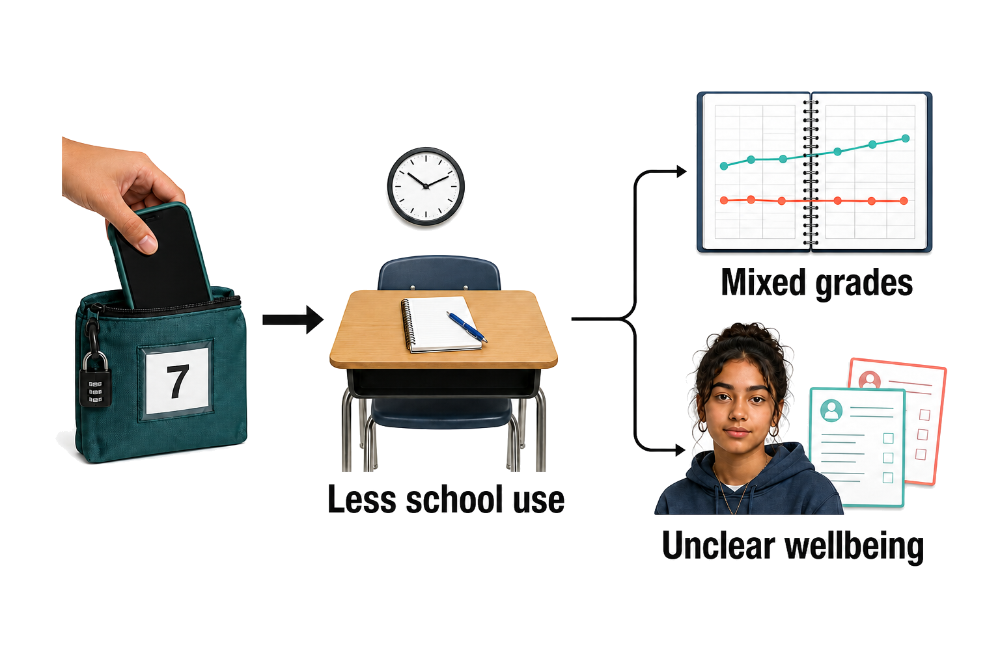

## Do school smartphone bans improve grades and mental health?

**TL;DR** — They reliably reduce phone access during school. Grades sometimes improve, especially in particular settings or groups, but equally credible studies find no gain. Broad mental-health benefits have not been shown, so a ban is a school rule, not a stand-alone wellbeing treatment.

### Grades sometimes improve, but the average result is mixed

- An English policy study linked bans to a **0.07-standard-deviation** exam-score rise across 130,482 pupils, with the clearest gains among lower-achieving students [Beland & Murphy 2016](https://doi.org/10.1016/j.labeco.2016.04.004).
- A Spanish regional analysis reported higher PISA performance after restrictions in one region, but the result did not repeat cleanly across both regions studied [Beneito & Vicente-Chirivella 2022](https://doi.org/10.1108/AEA-05-2021-0112).
- A Swedish national replication found no academic effect and could reject even small gains, while a South Australian rollout found no policy-specific improvement in academic engagement after one month [Kessel et al. 2020](https://doi.org/10.1016/j.econedurev.2020.102009), [King et al. 2024](https://doi.org/10.1556/2006.2024.00058).

[Figure 1](#fig-whole-answer) keeps those results in proportion: the policy changes access first, while the two outcomes remain separate questions.

**Figure 1. The rule is clearer than its downstream effects.** Schools can make phones less available during the day. Academic studies point in both directions, and recent wellbeing comparisons do not show a dependable overall benefit [Beland & Murphy 2016](https://doi.org/10.1016/j.labeco.2016.04.004), [Kessel et al. 2020](https://doi.org/10.1016/j.econedurev.2020.102009), [Goodyear et al. 2025](https://doi.org/10.1016/j.lanepe.2025.101211).

### Wellbeing has not improved reliably

- In 30 English schools, restrictive policies reduced in-school phone time by **0.67 hours**, but wellbeing was essentially unchanged (adjusted difference −0.48 points) [Goodyear et al. 2025](https://doi.org/10.1016/j.lanepe.2025.101211).
- The South Australian rollout found no policy-specific gain in school belonging, and a Dutch comparison of 24 schools found no wellbeing or bullying advantage for full rather than partial bans [King et al. 2024](https://doi.org/10.1556/2006.2024.00058), [Vanluydt et al. 2026](https://doi.org/10.1007/s10964-025-02313-6).
- A newer emulated Australian trial reported modest psychological effects, but its authors positioned bans as one component of broader adolescent support rather than a complete mental-health response [Baggio et al. 2025](https://doi.org/10.1016/j.chb.2025.108767).

### “A ban” is not one standard intervention

- Full and classroom-only Dutch bans produced similar wellbeing outcomes; full bans were also associated with lower student–teacher connectedness and, for girls, lower school belonging [Vanluydt et al. 2026](https://doi.org/10.1007/s10964-025-02313-6).
- Interviews across seven English schools found positive and negative experiences shaped by enforcement, agency, relationships, learning needs, and what happened outside school [Goodyear et al. 2026](https://doi.org/10.1016/j.socscimed.2026.119094).
- [Figure 2](#fig-implementation-chain) shows why the strongest link runs from a clear rule to less access; later links to grades or health depend on implementation and context.

**Figure 2. Policy labels do not reveal what pupils experience.** Scope, enforcement, exemptions, and out-of-school displacement sit between the written rule and its hoped-for outcomes [Goodyear et al. 2025](https://doi.org/10.1016/j.lanepe.2025.101211), [Goodyear et al. 2026](https://doi.org/10.1016/j.socscimed.2026.119094), [Vanluydt et al. 2026](https://doi.org/10.1007/s10964-025-02313-6).

### The evidence supports local goals, not universal promises

- A preregistered scoping review found **22 studies** across 12 countries, no randomized school-policy trials, and major differences in ban definitions, samples, and outcomes [Campbell et al. 2024](https://doi.org/10.1177/20556365241270394).
- A rapid review of five policy studies estimated a positive overall direction, but its small and heterogeneous evidence base limits how confidently that average can guide one school [Böttger & Zierer 2024](https://doi.org/10.3390/educsci14080906).
- The practical pattern is consistent: measure the intended outcome directly. A school seeking fewer classroom interruptions should track use and disruption; one promising better grades or wellbeing should also track those outcomes, compliance, exclusions, and unintended effects.

**Sources**

**Baggio S, Wade T, Radunz M, Galanis CR, Billieux J, Starcevic V, Quinney B, King DL (2025)** Psychological consequences of school mobile phone bans: Emulated trial of a natural experiment in South Australia. *Computers in Human Behavior*. https://doi.org/10.1016/j.chb.2025.108767

**Beland LP, Murphy R (2016)** Ill Communication: Technology, distraction & student performance. *Labour Economics*. https://doi.org/10.1016/j.labeco.2016.04.004

**Beneito P, Vicente-Chirivella Ó (2022)** Banning mobile phones in schools: evidence from regional-level policies in Spain. *Applied Economic Analysis*. https://doi.org/10.1108/AEA-05-2021-0112

**Böttger T, Zierer K (2024)** To Ban or Not to Ban? A Rapid Review on the Impact of Smartphone Bans in Schools on Social Well-Being and Academic Performance. *Education Sciences*. https://doi.org/10.3390/educsci14080906

**Campbell M, Edwards EJ, Pennell D, Poed S, Lister V, Gillett-Swan J, Kelly A, Zec D, Nguyen TA (2024)** Evidence for and against banning mobile phones in schools: A scoping review. *Journal of Psychologists and Counsellors in Schools*. https://doi.org/10.1177/20556365241270394

**Goodyear VA, Randhawa A, Adab P, Al-Janabi H, Fenton S, Jones K, Michail M, Morrison B, Patterson P, Quinlan J, Sitch A, Twardochleb R, Wade M, Pallan M (2025)** School phone policies and their association with mental wellbeing, phone use, and social media use (SMART Schools): a cross-sectional observational study. *The Lancet Regional Health - Europe*. https://doi.org/10.1016/j.lanepe.2025.101211

**Goodyear VA, Randhawa A, Adab P, Al-Janabi H, Fenton S, Michail M, Patterson P, Sitch A, Wade M, Pallan M (2026)** How school phone policies influence adolescent phone use and wellbeing (SMART Schools): a qualitative comparative case study. *Social Science & Medicine*. https://doi.org/10.1016/j.socscimed.2026.119094

**Kessel D, Hardardottir HL, Tyrefors B (2020)** The impact of banning mobile phones in Swedish secondary schools. *Economics of Education Review*. https://doi.org/10.1016/j.econedurev.2020.102009

**King DL, Radunz M, Galanis CR, Quinney B, Wade T (2024)** “Phones off while school's on”: Evaluating problematic phone use and the social, wellbeing, and academic effects of banning phones in schools. *Journal of Behavioral Addictions*. https://doi.org/10.1556/2006.2024.00058

**Vanluydt E, van den Eijnden R, Vonk L, Putrik P, van Amelsvoort T, Delespaul P, Levels M, Huijts T (2026)** Disconnect To Reconnect: How Variations between Types of Smartphone Bans Influence Students’ Well-being and Social Connectedness in Dutch Secondary Education. *Journal of Youth and Adolescence*. https://doi.org/10.1007/s10964-025-02313-6
