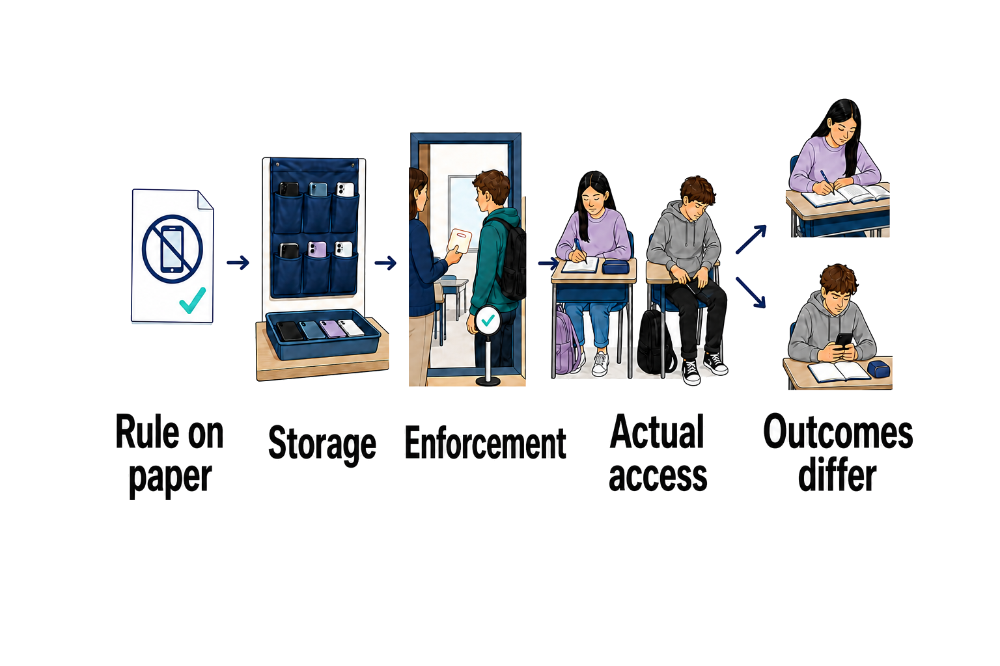

## Do school smartphone bans improve grades and mental health?

**TL;DR** — Bans usually reduce phone access during school. Better grades and mental health do not follow reliably: some studies find benefits, others find no change, and a few suggest social costs. Schools should treat a ban as a testable policy, not a guaranteed cure.

### Bans change access more reliably than total use

- Across 30 English schools, restrictive policies cut reported school-time phone use by **0.67 hours per day**, yet overall weekday and weekend use did not differ [Goodyear et al. 2025](https://doi.org/10.1016/j.lanepe.2025.101211).
- This gap matters: taking a phone away during lessons can remove an immediate distraction even when students shift their use to another time [Beland & Murphy 2016](https://doi.org/10.1016/j.labeco.2016.04.004), [Goodyear et al. 2025](https://doi.org/10.1016/j.lanepe.2025.101211).
- [Figure 1](#fig-policy-outcomes) separates the immediate change from the later outcomes, showing why less access should not be read as proof of better grades or wellbeing [Goodyear et al. 2025](https://doi.org/10.1016/j.lanepe.2025.101211), [King et al. 2024](https://doi.org/10.1556/2006.2024.00058).

**Figure 1. Phone access falls, but downstream benefits are not guaranteed.** Restrictive policies can change school-time access quickly. Academic and wellbeing studies then split across positive, null, and possibly adverse findings; the open bracket marks that a ban is not a universal benefit [Böttger & Zierer 2024](https://doi.org/10.3390/educsci14080906), [King et al. 2024](https://doi.org/10.1556/2006.2024.00058), [Goodyear et al. 2025](https://doi.org/10.1016/j.lanepe.2025.101211), [Vanluydt et al. 2026](https://doi.org/10.1007/s10964-025-02313-6).

### Grade gains appear in some settings, not others

- A four-city English comparison linked bans to higher test scores, especially among previously low-achieving students, and a Spanish regional study found mathematics and science gains in one of two regions [Beland & Murphy 2016](https://doi.org/10.1016/j.labeco.2016.04.004), [Beneito & Vicente-Chirivella 2022](https://doi.org/10.1108/AEA-05-2021-0112).
- A study covering **1,086 Swedish schools** found no improvement in grades or national mathematics tests, while the recent English school comparison also found no attainment advantage [Kessel et al. 2020](https://doi.org/10.1016/j.econedurev.2020.102009), [Goodyear et al. 2025](https://doi.org/10.1016/j.lanepe.2025.101211).
- A rapid review of five quantitative studies estimated a small average benefit across academic and social outcomes [Böttger & Zierer 2024](https://doi.org/10.3390/educsci14080906).
- A 22-study scoping review found no randomized trials, widely differing policies and outcomes, and more than half of the evidence unpublished [Campbell et al. 2024](https://doi.org/10.1177/20556365241270394).

### Mental-health and social findings are mixed too

- An emulated South Australian trial of 1,062 students linked the ban to small reductions in distress and negative mood, without a gain in positive mood [Baggio et al. 2025](https://doi.org/10.1016/j.chb.2025.108767).
- The 30-school English study found no difference in wellbeing, anxiety, or depression [Goodyear et al. 2025](https://doi.org/10.1016/j.lanepe.2025.101211).
- A one-month South Australian study found no change in school belonging or academic engagement [King et al. 2024](https://doi.org/10.1556/2006.2024.00058).
- Across 1,398 Dutch adolescents, full rather than classroom-only bans did not improve wellbeing or bullying and were linked to weaker teacher connectedness and, among girls, lower school belonging [Vanluydt et al. 2026](https://doi.org/10.1007/s10964-025-02313-6).
- Bullying also resists a simple verdict: recorded incidents fell in the Spanish study, while bullying declined in both Australian groups and did not differ between full and partial Dutch bans [Beneito & Vicente-Chirivella 2022](https://doi.org/10.1108/AEA-05-2021-0112), [King et al. 2024](https://doi.org/10.1556/2006.2024.00058), [Vanluydt et al. 2026](https://doi.org/10.1007/s10964-025-02313-6).

### Implementation is part of the intervention

- Thirty English schools used different storage rules, exceptions, and enforcement; students, staff, and leaders also disagreed about support and compliance [Randhawa et al. 2025](https://doi.org/10.1080/15391523.2024.2363204).
- In South Australia, **87%** initially reported following the rule, but older students and heavier social-media users were less compliant [King et al. 2024](https://doi.org/10.1556/2006.2024.00058).
- A rule can look the same on paper while storage, exceptions, staff consistency, and student workarounds create a different school day [Randhawa et al. 2025](https://doi.org/10.1080/15391523.2024.2363204), [King et al. 2024](https://doi.org/10.1556/2006.2024.00058).
- [Figure 2](#fig-policy-implementation) follows the rule from paper through storage and enforcement to actual access, making those hidden policy differences visible [Randhawa et al. 2025](https://doi.org/10.1080/15391523.2024.2363204), [King et al. 2024](https://doi.org/10.1556/2006.2024.00058).

**Figure 2. The rule works through storage and enforcement before outcomes can change.** Policies with the same “ban” label can create different access because storage, exceptions, staff consistency, and student compliance differ. The pathway shows why the rule on paper may differ from what students actually experience; it does not identify one best policy [Randhawa et al. 2025](https://doi.org/10.1080/15391523.2024.2363204), [King et al. 2024](https://doi.org/10.1556/2006.2024.00058), [Goodyear et al. 2025](https://doi.org/10.1016/j.lanepe.2025.101211).

**Sources**

**Baggio S, Wade T, Radunz M, Galanis CR, Billieux J, Starcevic V, Quinney B, King DL (2025)** Psychological consequences of school mobile phone bans: Emulated trial of a natural experiment in South Australia. *Computers in Human Behavior*. https://doi.org/10.1016/j.chb.2025.108767

**Beland LP, Murphy R (2016)** Ill Communication: Technology, distraction & student performance. *Labour Economics*. https://doi.org/10.1016/j.labeco.2016.04.004

**Beneito P, Vicente-Chirivella Ó (2022)** Banning mobile phones in schools: evidence from regional-level policies in Spain. *Applied Economic Analysis*. https://doi.org/10.1108/AEA-05-2021-0112

**Böttger T, Zierer K (2024)** To Ban or Not to Ban? A Rapid Review on the Impact of Smartphone Bans in Schools on Social Well-Being and Academic Performance. *Education Sciences*. https://doi.org/10.3390/educsci14080906

**Campbell M, Edwards EJ, Pennell D, Poed S, Lister V, Gillett-Swan J, Kelly A, Zec D, Nguyen TA (2024)** Evidence for and against banning mobile phones in schools: A scoping review. *Journal of Psychologists and Counsellors in Schools*. https://doi.org/10.1177/20556365241270394

**Goodyear VA, Randhawa A, Adab P, Al-Janabi H, Fenton S, Jones K, Michail M, Morrison B, Patterson P, Quinlan J, Sitch A, Twardochleb R, Wade M, Pallan M (2025)** School phone policies and their association with mental wellbeing, phone use, and social media use (SMART Schools): a cross-sectional observational study. *The Lancet Regional Health - Europe*. https://doi.org/10.1016/j.lanepe.2025.101211

**Kessel D, Hardardottir HL, Tyrefors B (2020)** The impact of banning mobile phones in Swedish secondary schools. *Economics of Education Review*. https://doi.org/10.1016/j.econedurev.2020.102009

**King DL, Radunz M, Galanis CR, Quinney B, Wade T (2024)** “Phones off while school's on”: Evaluating problematic phone use and the social, wellbeing, and academic effects of banning phones in schools. *Journal of Behavioral Addictions*. https://doi.org/10.1556/2006.2024.00058

**Randhawa A, Pallan M, Twardochleb R, Adab P, Al-Janabi H, Fenton S, Jones K, Michail M, Patterson P, Sitch A, Wade M, Goodyear VA (2025)** Secondary school smartphone policies in England: a descriptive analysis of how schools rationalize, design, and implement restrictive and permissive phone policies. *Journal of Research on Technology in Education*. https://doi.org/10.1080/15391523.2024.2363204

**Vanluydt E, van den Eijnden R, Vonk L, Putrik P, van Amelsvoort T, Delespaul P, Levels M, Huijts T (2026)** Disconnect To Reconnect: How Variations between Types of Smartphone Bans Influence Students’ Well-being and Social Connectedness in Dutch Secondary Education. *Journal of Youth and Adolescence*. https://doi.org/10.1007/s10964-025-02313-6
