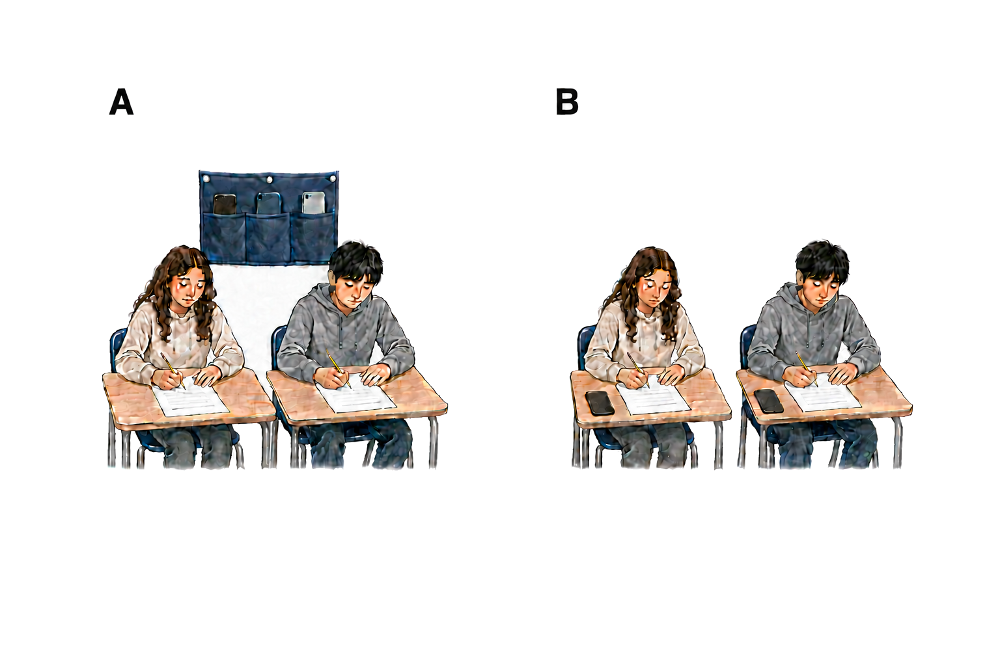
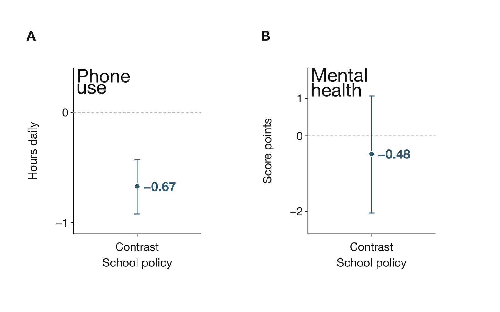

## Do school smartphone bans improve grades and mental health?

**TL;DR** — School phone restrictions may improve some academic or emotional outcomes, but reliable gains in grades or mental health remain uncertain. Confidence is low because studies compare different restrictions, measure different outcomes, and largely cannot isolate policy effects from other school differences.

### Phone access and student outcomes are separate tests

- In a laboratory task, undergraduates recalled more accurately when phones were kept out of sight [Tanil & Yong 2020](https://doi.org/10.1371/journal.pone.0219233). This supports a distraction mechanism, but does not test school grades or lasting mental-health effects [Tanil & Yong 2020](https://doi.org/10.1371/journal.pone.0219233). A review likewise found mostly negative associations between general smartphone use and academic performance, without establishing causality [Amez & Baert 2020](https://doi.org/10.1016/j.ijer.2020.101618).
- The school-policy question is whether changing access improves student outcomes. [Figure 1](#fig-school-smartphone-bans-policy-comparison) separates an access rule from the assessment of benefit.

**Figure 1. An access rule is distinct from an outcome assessment.** Panel A illustrates phone storage; panel B illustrates questionnaire-based assessment. The scenes represent neither treatment groups nor an effect size. These policy evaluations compared different restrictions and measured student outcomes separately [Goodyear et al. 2025](https://doi.org/10.1016/j.lanepe.2025.101211), [King et al. 2024](https://doi.org/10.1556/2006.2024.00058).

### Less school-time use without a detected wellbeing advantage

- In the English SMART Schools comparison, most permissive schools allowed phones during breaks or in designated zones [Goodyear et al. 2025](https://doi.org/10.1016/j.lanepe.2025.101211). Pupils in restrictive schools reported less school-time use: an adjusted difference of −0.67 hours daily, with a 95% [confidence interval](https://en.wikipedia.org/wiki/Confidence_interval) from −0.92 to −0.43 [Goodyear et al. 2025](https://doi.org/10.1016/j.lanepe.2025.101211). Overall weekday and weekend use showed no detectable policy-group difference [Goodyear et al. 2025](https://doi.org/10.1016/j.lanepe.2025.101211).
- The same comparison found no evidence of better mental wellbeing, with uncertainty spanning benefit and harm ([Figure 2](#fig-school-smartphone-bans-observed)) [Goodyear et al. 2025](https://doi.org/10.1016/j.lanepe.2025.101211). Unmeasured school differences and possible under-reporting of use in restrictive schools limit what these [cross-sectional](https://en.wikipedia.org/wiki/Cross-sectional_study) findings establish about policy effects [Goodyear et al. 2025](https://doi.org/10.1016/j.lanepe.2025.101211).

**Figure 2. Lower school-time use did not establish better wellbeing.** Both panels report the restrictive-minus-permissive school comparison. Vertical axes show adjusted differences in phone hours per school day (A) and Warwick–Edinburgh Mental Wellbeing Scale points (B). Panel A is −0.67 hours, with a 95% confidence interval of −0.92 to −0.43 [Goodyear et al. 2025](https://doi.org/10.1016/j.lanepe.2025.101211). Points mark estimates, whiskers mark intervals, and dashed zero lines mark no difference; the panels use different units. Panel B is −0.48 points, with a 95% confidence interval of −2.05 to 1.06; the observational comparison does not establish causality [Goodyear et al. 2025](https://doi.org/10.1016/j.lanepe.2025.101211).

### Academic gains and engagement answer different questions

- A Spanish regional comparison found test-score gains after bans in Galicia; the authors expressed the maths gains as 0.6–0.8 years of learning [Beneito & Vicente-Chirivella 2022](https://doi.org/10.1108/aea-05-2021-0112). Its comparison of regional changes before and after implementation supports a setting-specific finding rather than a uniform effect across schools [Beneito & Vicente-Chirivella 2022](https://doi.org/10.1108/aea-05-2021-0112).
- A South Australian evaluation instead measured self-reported academic engagement over one month [King et al. 2024](https://doi.org/10.1556/2006.2024.00058). Earlier versus newly introduced bans showed no detectable follow-up advantage: a [standardized difference](https://en.wikipedia.org/wiki/Effect_size) of 0.03, with a 95% confidence interval of −0.14 to 0.20 [King et al. 2024](https://doi.org/10.1556/2006.2024.00058). Both groups had bans by follow-up, and registration occurred after data collection; this does not settle the effect of bans versus no bans on examination performance [King et al. 2024](https://doi.org/10.1556/2006.2024.00058).
- A rapid review pooled a small benefit across academic and social outcomes from five studies, while describing the academic evidence as limited [Böttger & Zierer 2024](https://doi.org/10.3390/educsci14080906). That combined estimate cannot resolve the difference between improved test scores and no detected follow-up advantage in engagement.

### Emotional outcomes remain mixed

- An Australian secondary analysis of a [natural experiment](https://en.wikipedia.org/wiki/Natural_experiment) associated already implemented bans with small reductions in psychological distress, while reporting no significant improvement in positive mood [Baggio et al. 2025](https://doi.org/10.1016/j.chb.2025.108767). Its observational design leaves the causal effect uncertain [Baggio et al. 2025](https://doi.org/10.1016/j.chb.2025.108767).
- A Dutch comparison tested the added restriction of a full ban over a classroom-only ban and found no detectable wellbeing or bullying advantage [Vanluydt et al. 2026](https://doi.org/10.1007/s10964-025-02313-6). With no unrestricted comparator and a cross-sectional design, it cannot establish a general ban effect [Vanluydt et al. 2026](https://doi.org/10.1007/s10964-025-02313-6).
- The Hungarian study measured a more immediate response: anxiety rose during a mobile-free day [Gajdics & Jagodics 2022](https://doi.org/10.1007/s10758-021-09539-w). The single-school comparison lacked a separate control school and had substantial dropout, limiting conclusions about permanent policies [Gajdics & Jagodics 2022](https://doi.org/10.1007/s10758-021-09539-w).
- Qualitative SMART Schools accounts described benefits and drawbacks under both policy types; these experiences cannot establish an effect size [Goodyear et al. 2026](https://doi.org/10.1016/j.socscimed.2026.119094). Across the comparisons, possible benefits remain compatible with low confidence in a dependable improvement in grades or mental health.

**Scope and methods** — Narrative review rebuilt from OpenAlex and PubMed searches dated 4 September 2026, including recent and contrary findings; no new literature search was conducted. Peer-reviewed school-policy comparisons informed conclusions, with laboratory and general-use studies supplying context. Five cited papers were read in full and five through abstracts. Australian analyses and SMART Schools publications were grouped by study family; review overlap was not treated as independent replication. Crossref screening found no integrity signal on the search date.

**Sources**

**Amez S, Baert S (2020)** Smartphone use and academic performance: A literature review. *International Journal of Educational Research*. https://doi.org/10.1016/j.ijer.2020.101618 · 1 claim · abstract

**Baggio S, Wade T, Radunz M, Galanis CR, Billieux J, Starcevic V, Quinney B, King DL (2025)** Psychological consequences of school mobile phone bans: Emulated trial of a natural experiment in South Australia. *Computers in Human Behavior*. https://doi.org/10.1016/j.chb.2025.108767 · 2 claims · abstract

**Beneito P, Vicente-Chirivella Ó (2022)** Banning mobile phones in schools: evidence from regional-level policies in Spain. *Applied Economic Analysis*. https://doi.org/10.1108/aea-05-2021-0112 · 2 claims · abstract

**Böttger T, Zierer K (2024)** To Ban or Not to Ban? A Rapid Review on the Impact of Smartphone Bans in Schools on Social Well-Being and Academic Performance. *Education Sciences*. https://doi.org/10.3390/educsci14080906 · 1 claim · abstract

**Gajdics J, Jagodics B (2022)** Mobile Phones in Schools: With or Without you? Comparison of Students’ Anxiety Level and Class Engagement After Regular and Mobile-Free School Days. *Technology, Knowledge and Learning*. https://doi.org/10.1007/s10758-021-09539-w · 2 claims · full text

**Goodyear VA, Randhawa A, Adab P, Al-Janabi H, Fenton S, Jones K, Michail M, Morrison B, Patterson P, Quinlan J, Sitch A, Twardochleb R, Wade M, Pallan M (2025)** School phone policies and their association with mental wellbeing, phone use, and social media use (SMART Schools): a cross-sectional observational study. *The Lancet Regional Health - Europe*. https://doi.org/10.1016/j.lanepe.2025.101211 · 8 claims · full text

**Goodyear VA, Randhawa A, Adab P, Al-Janabi H, Fenton S, Michail M, Patterson P, Sitch A, Wade M, Pallan M (2026)** How school phone policies influence adolescent phone use and wellbeing (SMART Schools): a qualitative comparative case study. *Social Science & Medicine*. https://doi.org/10.1016/j.socscimed.2026.119094 · 1 claim · abstract

**King DL, Radunz M, Galanis CR, Quinney B, Wade T (2024)** “Phones off while school's on”: Evaluating problematic phone use and the social, wellbeing, and academic effects of banning phones in schools. *Journal of Behavioral Addictions*. https://doi.org/10.1556/2006.2024.00058 · 4 claims · full text

**Tanil CT, Yong MH (2020)** Mobile phones: The effect of its presence on learning and memory. *PLOS ONE*. https://doi.org/10.1371/journal.pone.0219233 · 2 claims · full text

**Vanluydt E, van den Eijnden R, Vonk L, Putrik P, van Amelsvoort T, Delespaul P, Levels M, Huijts T (2026)** Disconnect To Reconnect: How Variations between Types of Smartphone Bans Influence Students’ Well-being and Social Connectedness in Dutch Secondary Education. *Journal of Youth and Adolescence*. https://doi.org/10.1007/s10964-025-02313-6 · 2 claims · full text

**Receipts**

*24 cited sentences · 25 source checks · 18 supported at full text · 7 at abstract · 0 partial · 0 contradicted — every pair's verbatim quote is in `school-smartphone-bans-receipts.md`.*
