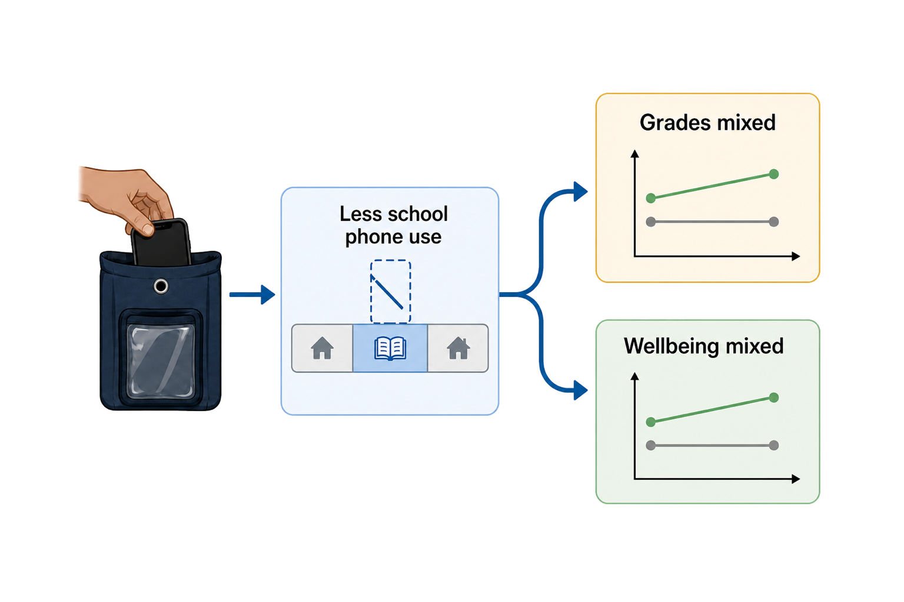
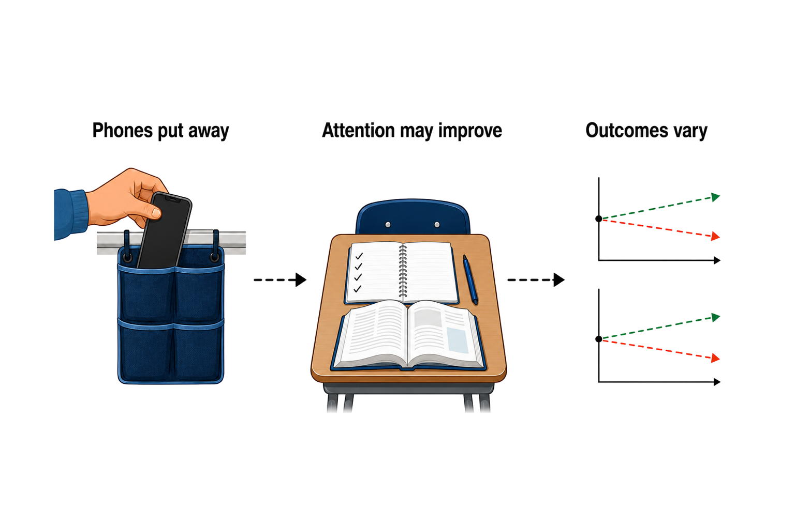

## Do school smartphone bans improve grades and mental health?

**TL;DR** — Sometimes, but not reliably. Bans reduce access to phones at school, while studies disagree about grades, bullying, belonging, and mental health.

### Bans change phone access more consistently than student outcomes

- Restrictive English schools cut phone use during school by 0.67 hours a day, but students' total weekday and weekend use did not differ [Goodyear et al. 2025](https://doi.org/10.1016/j.lanepe.2025.101211).

- A rapid review of five quantitative studies found a **small overall benefit** from bans, with a pooled effect of d=0.162 [Böttger & Zierer 2024](https://doi.org/10.3390/educsci14080906).

- The whole pattern is shown in [Figure 1](#fig-school-smartphone-bans-whole-answer): access changes first, while academic and wellbeing results split. Read it left to right: the immediate school-time change and the later outcomes stay separate.

**Figure 1. School-time phone use and outcomes.** Restrictive English schools had lower school-time phone use but no better mental wellbeing [Goodyear et al. 2025](https://doi.org/10.1016/j.lanepe.2025.101211).

### Academic results range from gains to no detectable change

- A Spanish regional comparison linked bans in Galicia with gains equal to **0.6–0.8 years of maths learning** [Beneito & Vicente-Chirivella 2022](https://doi.org/10.1108/aea-05-2021-0112).

- A preregistered South Australian comparison found virtually no difference in academic engagement after one month (d=0.03; 95% range −0.14 to 0.20) [King et al. 2024](https://doi.org/10.1556/2006.2024.00058).

- In a laboratory experiment, undergraduates had higher task accuracy when their phones were out of sight [Tanil & Yong 2020](https://doi.org/10.1371/journal.pone.0219233). It did not test a school ban.

- Reviews of general smartphone use find mostly negative links with academic performance, but warn that those links are not causal [Amez & Baert 2020](https://doi.org/10.1016/j.ijer.2020.101618).

### Mental-health and social results also conflict

- An adjusted South Australian analysis associated a ban with a small reduction in psychological distress (b=−0.94) [Baggio et al. 2025](https://doi.org/10.1016/j.chb.2025.108767).

- The English SMART Schools comparison found no wellbeing difference between restrictive and permissive schools (adjusted difference −0.48; 95% range −2.05 to 1.06) [Goodyear et al. 2025](https://doi.org/10.1016/j.lanepe.2025.101211).

- A Dutch comparison found no significant wellbeing or bullying differences across ban types [Vanluydt et al. 2026](https://doi.org/10.1007/s10964-025-02313-6). Full bans were also associated with weaker student–teacher connectedness [Vanluydt et al. 2026](https://doi.org/10.1007/s10964-025-02313-6).

- During one Hungarian mobile-free day, pupils' anxiety rose while class engagement did not improve [Gajdics & Jagodics 2022](https://doi.org/10.1007/s10758-021-09539-w).

### The policy chain has several places to break

- Removing a phone can reduce one source of distraction, but it may not change total use, teaching quality, sleep, social-media habits, or what happens after school.

- The evidence path and its breakpoints appear in [Figure 2](#fig-school-smartphone-bans-policy-chain). The dashed links mark open questions, not measured causal effects.

**Figure 2. Policy preferences.** New Zealand students and educators generally favoured school-level regulation but were less supportive of a total ban [Gath et al. 2024](https://doi.org/10.3390/educsci14040351).

- The most defensible conclusion is conditional: bans can help in some settings, but schools should define the outcome they want, measure implementation, and evaluate the result rather than assuming that “phones away” means “problem solved.” A useful evaluation should name success before the policy starts.

**Sources**

**Amez S, Baert S (2020)** Smartphone use and academic performance: A literature review. *International Journal of Educational Research*. https://doi.org/10.1016/j.ijer.2020.101618 · 1 claim · abstract

**Baggio S, Wade T, Radunz M, Galanis CR, Billieux J, Starcevic V, Quinney B, King DL (2025)** Psychological consequences of school mobile phone bans: Emulated trial of a natural experiment in South Australia. *Computers in Human Behavior*. https://doi.org/10.1016/j.chb.2025.108767 · 1 claim · abstract

**Beneito P, Vicente-Chirivella Ó (2022)** Banning mobile phones in schools: evidence from regional-level policies in Spain. *Applied Economic Analysis*. https://doi.org/10.1108/aea-05-2021-0112 · 1 claim · abstract

**Böttger T, Zierer K (2024)** To Ban or Not to Ban? A Rapid Review on the Impact of Smartphone Bans in Schools on Social Well-Being and Academic Performance. *Education Sciences*. https://doi.org/10.3390/educsci14080906 · 1 claim · abstract

**Gajdics J, Jagodics B (2022)** Mobile Phones in Schools: With or Without you? Comparison of Students’ Anxiety Level and Class Engagement After Regular and Mobile-Free School Days. *Technology, Knowledge and Learning*. https://doi.org/10.1007/s10758-021-09539-w · 1 claim · full text

**Gath ME, Monk L, Scott A, Gillon GT (2024)** Smartphones at School: A Mixed-Methods Analysis of Educators’ and Students’ Perspectives on Mobile Phone Use at School. *Education Sciences*. https://doi.org/10.3390/educsci14040351 · 1 claim · abstract

**Goodyear VA, Randhawa A, Adab P, Al-Janabi H, Fenton S, Jones K, Michail M, Morrison B, Patterson P, Quinlan J, Sitch A, Twardochleb R, Wade M, Pallan M (2025)** School phone policies and their association with mental wellbeing, phone use, and social media use (SMART Schools): a cross-sectional observational study. *The Lancet Regional Health - Europe*. https://doi.org/10.1016/j.lanepe.2025.101211 · 3 claims · full text

**King DL, Radunz M, Galanis CR, Quinney B, Wade T (2024)** “Phones off while school's on”: Evaluating problematic phone use and the social, wellbeing, and academic effects of banning phones in schools. *Journal of Behavioral Addictions*. https://doi.org/10.1556/2006.2024.00058 · 1 claim · full text

**Tanil CT, Yong MH (2020)** Mobile phones: The effect of its presence on learning and memory. *PLOS ONE*. https://doi.org/10.1371/journal.pone.0219233 · 1 claim · full text

**Vanluydt E, van den Eijnden R, Vonk L, Putrik P, van Amelsvoort T, Delespaul P, Levels M, Huijts T (2026)** Disconnect To Reconnect: How Variations between Types of Smartphone Bans Influence Students’ Well-being and Social Connectedness in Dutch Secondary Education. *Journal of Youth and Adolescence*. https://doi.org/10.1007/s10964-025-02313-6 · 2 claims · abstract

**Receipts**

*13 cited sentences · 13 source checks · 6 supported at full text · 7 at abstract · 0 partial · 0 contradicted — every pair's verbatim quote is in `school-smartphone-bans-receipts.md`.*
