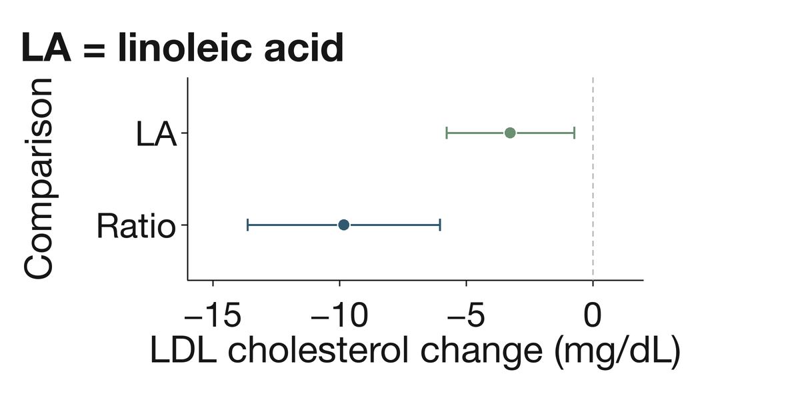
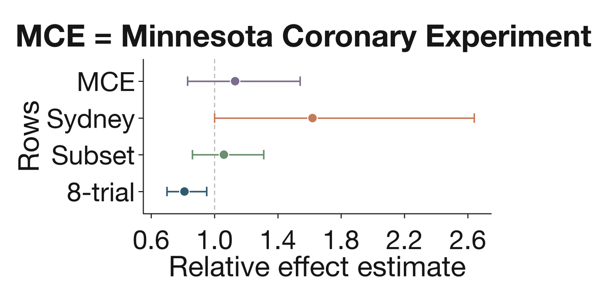
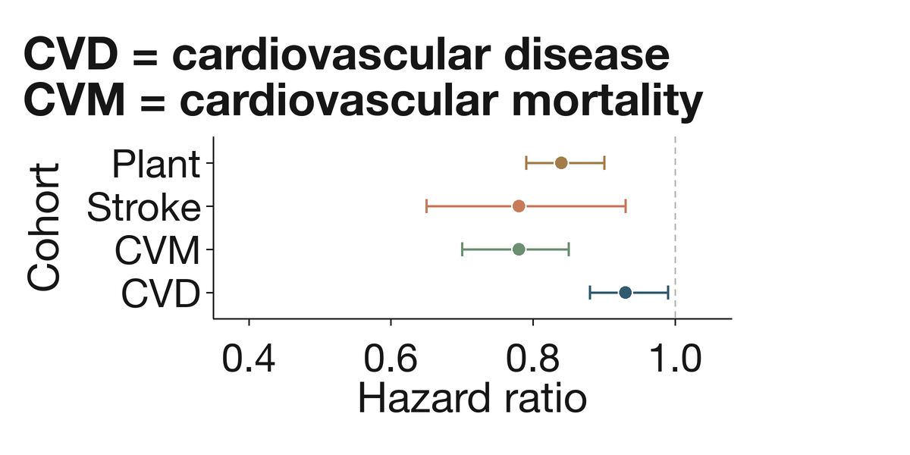
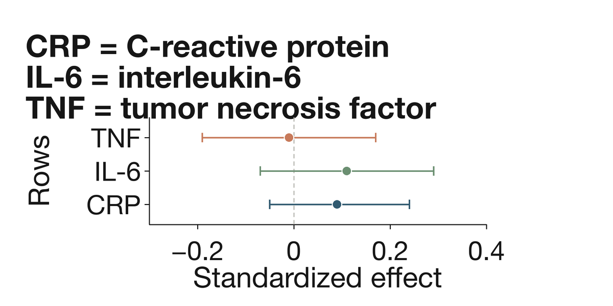
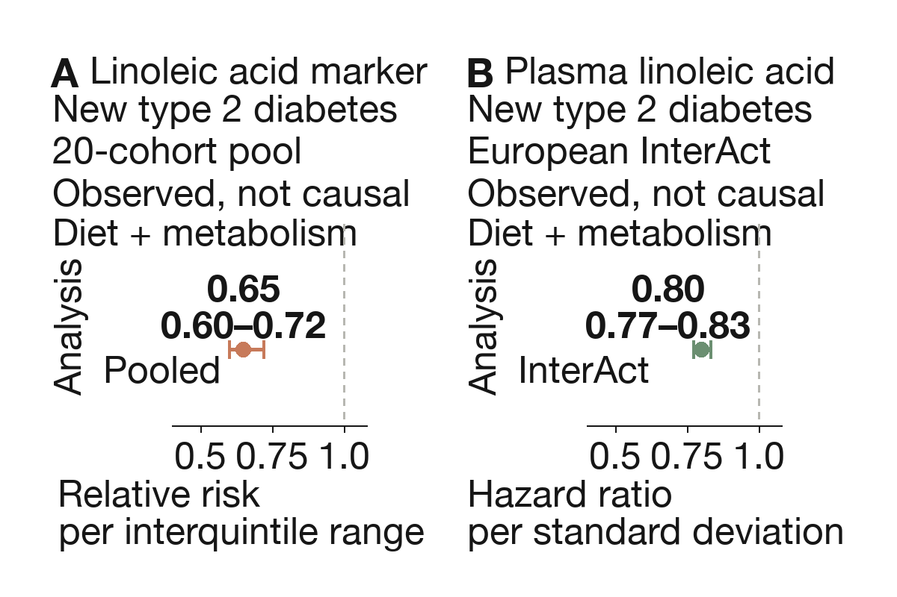
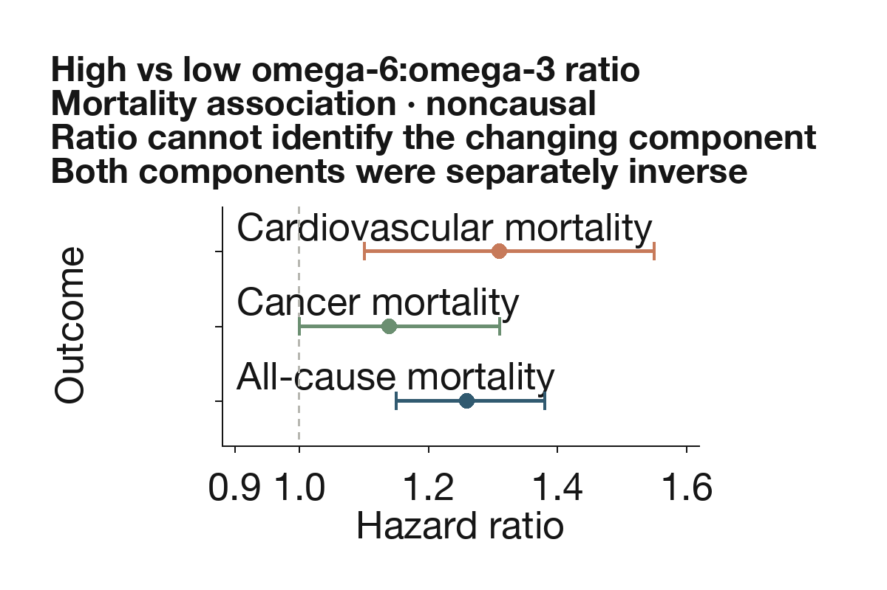

## Are seed oils really bad for you?

**Abstract** — For generally healthy adults, fresh, [unhydrogenated](https://en.wikipedia.org/wiki/Hydrogenation) seed oils are reasonable culinary fats when they replace foods rich in saturated fat. Controlled feeding trials consistently lower [low-density lipoprotein](https://en.wikipedia.org/wiki/Low-density_lipoprotein) (LDL) cholesterol and generally improve short-term glucose–insulin markers; prospective intake and [biomarker](https://en.wikipedia.org/wiki/Biomarker) studies are mostly neutral or favorable, and randomized trials do not show a consistent rise in systemic inflammatory markers. One synthesis estimated a 9.83 mg/dL LDL reduction (95% [confidence interval](https://en.wikipedia.org/wiki/Confidence_interval) [CI]: 6.04–13.63 mg/dL lower) with a higher ratio of polyunsaturated to saturated fat. Clinical cardiovascular-event trials remain old and discordant, so they cannot establish a precise event benefit, but they do not support a large class-wide hazard. This answer is conditional on the replacement food and preparation: adding oil as surplus energy is different from substitution, repeatedly heated frying oil accumulates oxidation products, chronic human risk from those products is not quantified, and an oil ingredient cannot explain the risk of an entire [ultra-processed food](https://en.wikipedia.org/wiki/Ultra-processed_food) pattern.

### Introduction

“Seed oils” is a culinary and internet category, not a standardized exposure [Voon et al. 2024](https://doi.org/10.1016/j.advnut.2024.100276). It usually includes soybean, corn, sunflower, safflower, canola, grapeseed, rice-bran, and cottonseed oils, but those oils differ in [linoleic acid](https://en.wikipedia.org/wiki/Linoleic_acid), [alpha-linolenic acid](https://en.wikipedia.org/wiki/Alpha-Linolenic_acid), [oleic acid](https://en.wikipedia.org/wiki/Oleic_acid), saturated fat, antioxidants, cultivar, and refining [Orsavova et al. 2015](https://doi.org/10.3390/ijms160612871), [Voon et al. 2024](https://doi.org/10.1016/j.advnut.2024.100276). Some newer cultivars are high-oleic—bred to contain more oleic acid [Voon et al. 2024](https://doi.org/10.1016/j.advnut.2024.100276), [Rosqvist & Niinistö 2024](https://doi.org/10.29219/fnr.v68.10487). Some foods contain fresh oil; others contain oil that has spent hours in a commercial fryer [Voon et al. 2024](https://doi.org/10.1016/j.advnut.2024.100276). A bottle used to sauté vegetables once is biologically different from repeatedly reused deep-frying oil, and both are different from a packaged food whose risk profile also includes energy density, starch, salt, sugar, additives, texture, and eating pattern [Voon et al. 2024](https://doi.org/10.1016/j.advnut.2024.100276), [Rosqvist & Niinistö 2024](https://doi.org/10.29219/fnr.v68.10487).

This review therefore treats the claim “seed oils are bad” as a set of testable questions. What happens when unsaturated oil replaces butter or another saturated-fat-rich food? Do linoleic-acid interventions raise inflammatory markers? Do intake and tissue biomarkers predict cardiovascular disease, diabetes, cancer, or death? What is established about heating and oxidation? The distinction between replacing and adding fat is central: an isocaloric (equal-calorie) substitution can improve a risk marker even though adding the same oil on top of an energy-surplus diet could promote weight gain [Wang & Hu 2017](https://doi.org/10.1146/annurev-nutr-071816-064614), [Tindall et al. 2019](https://doi.org/10.1161/jaha.118.011512). The [food matrix](https://en.wikipedia.org/wiki/Food_matrix) and processing context can also modify outcomes independently of the oil [Liu et al. 2017](https://doi.org/10.1186/s12937-017-0271-4), [Tindall et al. 2019](https://doi.org/10.1161/jaha.118.011512).

The hierarchy of evidence differs by outcome. Randomized feeding trials provide direct evidence for lipids and short-term metabolic markers [Hart et al. 2025](https://doi.org/10.1016/j.advnut.2025.100502), [Imamura et al. 2016](https://doi.org/10.1371/journal.pmed.1002087). Clinical-event trials are harder to interpret because they were performed decades ago with mixed interventions, institutional diets, imperfect adherence, and sometimes [trans-fat](https://en.wikipedia.org/wiki/Trans_fat)-containing margarines [Ramsden et al. 2013](https://doi.org/10.1136/bmj.e8707), [Ramsden et al. 2016](https://doi.org/10.1136/bmj.i1246), [Frantz et al. 1989](https://doi.org/10.1161/01.atv.9.1.129). Large prospective cohorts and biomarker consortia add duration and event numbers but cannot eliminate confounding [Marklund et al. 2019](https://doi.org/10.1161/circulationaha.118.038908). Mechanistic and thermal-chemistry experiments establish plausibility, not the size of chronic human risk [Zhuang et al. 2022](https://doi.org/10.3389/fnut.2022.913297), [Grootveld 2022](https://doi.org/10.3389/fnut.2021.711640). The conditional answer therefore depends on matching each claim to the design that can test it.

### “Seed oils” does not name one biological exposure

The first failure of the blanket claim is compositional. Reviews of edible oils distinguish linoleic-rich oils from high-oleic oils, oils that contain appreciable alpha-linolenic acid, and relatively saturated plant fats [Orsavova et al. 2015](https://doi.org/10.3390/ijms160612871), [Voon et al. 2024](https://doi.org/10.1016/j.advnut.2024.100276). Refining removes some minor compounds and changes flavor and stability; breeding can shift the fatty-acid profile enough that two sunflower oils behave differently under heat [Voon et al. 2024](https://doi.org/10.1016/j.advnut.2024.100276), [Rosqvist & Niinistö 2024](https://doi.org/10.29219/fnr.v68.10487). The umbrella evidence accordingly ranges from moderate to very low certainty across oil–outcome pairs rather than licensing a class-wide verdict [Voon et al. 2024](https://doi.org/10.1016/j.advnut.2024.100276), [Rosqvist & Niinistö 2024](https://doi.org/10.29219/fnr.v68.10487), [Huth et al. 2015](https://doi.org/10.3945/an.115.008979).

Hydrogenation is another essential boundary. Older partially hydrogenated shortenings and margarines could contain trans fatty acids, whose molecular geometry and lipid effects differ from the ordinary non-trans form of linoleic acid [Zock & Katan 1992](https://doi.org/10.1016/s0022-2275%2820%2941530-5), [Wang & Hu 2017](https://doi.org/10.1146/annurev-nutr-071816-064614). Trials comparing linoleic acid, stearic acid, and trans fat demonstrate why historical products cannot simply be relabeled as modern unhydrogenated oil [Zock & Katan 1992](https://doi.org/10.1016/s0022-2275%2820%2941530-5), [Wang & Hu 2017](https://doi.org/10.1146/annurev-nutr-071816-064614). “Omega-6” is also broader than linoleic acid: its metabolites need not share the same associations, and tissue levels reflect endogenous conversion—metabolism within the body—as well as diet [Forouhi et al. 2016](https://doi.org/10.1371/journal.pmed.1002094), [Harris et al. 2006](https://doi.org/10.1016/j.amjcard.2005.12.023).

The evidence is most interpretable when exposure is specified along three axes: the named oil or fatty acid, what it replaces, and how the oil-containing food is prepared. Controlled feeding establishes short-term marker responses; cohorts establish associations; heating experiments establish chemistry; none can silently substitute for the others [Mensink & Katan 1992](https://doi.org/10.1161/01.atv.12.8.911), [Marklund et al. 2019](https://doi.org/10.1161/circulationaha.118.038908), [Zhuang et al. 2022](https://doi.org/10.3389/fnut.2022.913297), [Lane et al. 2024](https://doi.org/10.1136/bmj-2023-077310).

### The replacement food determines the direction of effect

Dietary fats do not enter a vacuum. If oil replaces butter, saturated fat falls and polyunsaturated or monounsaturated fat rises [Mattson & Grundy 1985](https://doi.org/10.1016/s0022-2275%2820%2934389-3), [Gardner & Kraemer 1995](https://doi.org/10.1161/01.atv.15.11.1917). If oil replaces another unsaturated oil, the contrast can be small [Gardner & Kraemer 1995](https://doi.org/10.1161/01.atv.15.11.1917), [Hodson et al. 2001](https://doi.org/10.1038/sj.ejcn.1601234). If oil is added without reducing anything else, total energy rises [Hodson et al. 2001](https://doi.org/10.1038/sj.ejcn.1601234). These are different interventions, and the literature changes direction accordingly [Mattson & Grundy 1985](https://doi.org/10.1016/s0022-2275%2820%2934389-3), [Gardner & Kraemer 1995](https://doi.org/10.1161/01.atv.15.11.1917), [Hodson et al. 2001](https://doi.org/10.1038/sj.ejcn.1601234).

Classic metabolic-ward and controlled-feeding work established that exchanging saturated for unsaturated fat improves total and LDL cholesterol more reliably than merely reducing fat [Kris-Etherton et al. 1993](https://doi.org/10.1016/0026-0495%2893%2990182-n), [Wardlaw & Snook 1990](https://doi.org/10.1093/ajcn/51.5.815). Whole-food comparisons reached the same broad conclusion while also revealing matrix effects: soybean oil, olive oil, dairy butter, cocoa butter, walnuts, and matched vegetable-oil diets do not collapse perfectly onto their fatty-acid totals [Ginsberg et al. 1998](https://doi.org/10.1161/01.atv.18.3.441), [Tindall et al. 2019](https://doi.org/10.1161/jaha.118.011512). In the Dietary Intervention and Vascular Function (DIVAS) trial, replacing saturated with unsaturated fat improved lipid biomarkers and blood pressure without a detectable vascular-function change, an example of a favorable marker result that should not be inflated into a clinical-event claim [Vafeiadou et al. 2015](https://doi.org/10.3945/ajcn.114.097089).

The practical implication is narrow but important. A spoonful of unhydrogenated soybean, corn, canola, sunflower, or safflower oil used instead of butter is supported by a different evidence base from the same spoonful added to a deep-fried, energy-dense meal [Wang & Hu 2017](https://doi.org/10.1146/annurev-nutr-071816-064614), [Tindall et al. 2019](https://doi.org/10.1161/jaha.118.011512). “What did it replace?” is not a statistical technicality; it identifies the intervention.

### Replacing saturated fat with unsaturated oil lowers LDL cholesterol

The most consistent human result concerns LDL cholesterol [Schwingshackl et al. 2018](https://doi.org/10.1194/jlr.p085522), [Hart et al. 2025](https://doi.org/10.1016/j.advnut.2025.100502). A [network meta-analysis](https://en.wikipedia.org/wiki/Network_meta-analysis), which combines direct and indirect treatment comparisons, of 54 randomized trials found that most unsaturated oils lowered LDL by roughly 0.23–0.42 mmol/L compared with butter [Schwingshackl et al. 2018](https://doi.org/10.1194/jlr.p085522). A more recent synthesis of 24 controlled-feeding trials estimated that a higher ratio of polyunsaturated to saturated fat lowered LDL by 9.83 mg/dL, with a 95% CI from −13.63 to −6.04 mg/dL [Hart et al. 2025](https://doi.org/10.1016/j.advnut.2025.100502). Trials of corn oil, walnuts or matched oils, and saturated-to-unsaturated replacement agree on direction even when their secondary outcomes differ [Maki et al. 2015](https://doi.org/10.1016/j.jacl.2014.10.006), [Tindall et al. 2019](https://doi.org/10.1161/jaha.118.011512).

Direct linoleic-acid trials show a smaller effect because their comparators often contain other unsaturated fats [Wang et al. 2023](https://doi.org/10.3390/foods12112129), [Huth et al. 2015](https://doi.org/10.3945/an.115.008979). Across 40 randomized trials and 2,175 participants, higher linoleic acid reduced LDL by 3.26 mg/dL (95% CI −5.78 to −0.74) and slightly reduced high-density lipoprotein cholesterol, while total cholesterol and triglycerides were not clearly changed [Wang et al. 2023](https://doi.org/10.3390/foods12112129). Reviews of healthy adults and high-oleic substitutions make the same comparator-dependent point [Huth et al. 2015](https://doi.org/10.3945/an.115.008979).

[Figure 1](#fig-ldl) compares the two estimates on their reported mg/dL scale.

**Figure 1. Unsaturated-fat substitutions lower LDL cholesterol.** Top: direct linoleic-acid estimate, −3.26 mg/dL (95% CI −5.78 to −0.74). Bottom: higher-versus-lower polyunsaturated-to-saturated-fat ratio, −9.83 mg/dL (−13.63 to −6.04). The x-axis shows low-density lipoprotein cholesterol change; whiskers are 95% confidence intervals and the dashed line is no difference. Interventions and comparators differ [Hart et al. 2025](https://doi.org/10.1016/j.advnut.2025.100502), [Wang et al. 2023](https://doi.org/10.3390/foods12112129), [Schwingshackl et al. 2018](https://doi.org/10.1194/jlr.p085522).

These are surrogate outcomes, usually measured over weeks [Hart et al. 2025](https://doi.org/10.1016/j.advnut.2025.100502), [Wang et al. 2023](https://doi.org/10.3390/foods12112129). Low-density lipoprotein cholesterol is causally relevant to atherosclerotic risk, but a short trial cannot itself show that an oil prevents myocardial infarction [Wang & Hu 2017](https://doi.org/10.1146/annurev-nutr-071816-064614), [Hart et al. 2025](https://doi.org/10.1016/j.advnut.2025.100502). That distinction becomes decisive in the older clinical-event literature.

### Clinical-event trials disagree about the size of cardiovascular benefit

One meta-analysis of eight randomized trials, 13,614 participants, and 1,042 coronary events estimated a coronary-event [relative risk](https://en.wikipedia.org/wiki/Relative_risk) (RR) of 0.81 (95% CI 0.70–0.95) when polyunsaturated fat replaced saturated fat [Mozaffarian et al. 2010](https://doi.org/10.1371/journal.pmed.1000252). Expressed per 5% of energy replaced, the estimate was 0.90 [Mozaffarian et al. 2010](https://doi.org/10.1371/journal.pmed.1000252). Cochrane syntheses similarly conclude that reducing saturated fat or increasing polyunsaturated fat probably reduces cardiovascular events, although effects on total mortality are small or uncertain [Hooper et al. 2020](https://doi.org/10.1002/14651858.cd011737.pub2), [Abdelhamid et al. 2018](https://doi.org/10.1002/14651858.cd012345.pub2), [Hooper et al. 2018](https://doi.org/10.1002/14651858.cd011094.pub4).

The estimate changes when analysts restrict the trial set [Hamley 2017](https://doi.org/10.1186/s12937-017-0254-5). A review limited to trials judged adequately controlled estimated major coronary events at 1.06 (0.86–1.31), compatible with benefit or harm [Hamley 2017](https://doi.org/10.1186/s12937-017-0254-5). An earlier analysis argued that interventions specific to omega-6 linoleic acid should be separated from mixtures that also raised omega-3 fats [Ramsden et al. 2010](https://doi.org/10.1017/s0007114510004010). The disagreement reflects trial selection, intervention composition, adherence, and outcome definition—not merely random noise [Hamley 2017](https://doi.org/10.1186/s12937-017-0254-5), [Ramsden et al. 2010](https://doi.org/10.1017/s0007114510004010).

Recovered data sharpened the uncertainty. In the Sydney Diet Heart Study, the linoleic-acid intervention group had mortality of 17.6% versus 11.8%, [hazard ratio](https://en.wikipedia.org/wiki/Hazard_ratio) (HR) 1.62 (1.00–2.64) [Ramsden et al. 2013](https://doi.org/10.1136/bmj.e8707). In the Minnesota Coronary Experiment, serum cholesterol fell by 13.8% without a mortality or autopsy benefit; the accompanying meta-analysis estimated coronary-heart-disease mortality at 1.13 (0.83–1.54) [Ramsden et al. 2016](https://doi.org/10.1136/bmj.i1246), [Frantz et al. 1989](https://doi.org/10.1161/01.atv.9.1.129). Both trials involved historically specific institutional or secondary-prevention settings [Ramsden et al. 2013](https://doi.org/10.1136/bmj.e8707), [Ramsden et al. 2016](https://doi.org/10.1136/bmj.i1246), [Frantz et al. 1989](https://doi.org/10.1161/01.atv.9.1.129). Other legacy trials—the Los Angeles Veterans trial and Oslo Diet-Heart Study among them—favored coronary outcomes, while a small corn-oil trial did not [Dayton et al. 1969](https://doi.org/10.1161/01.cir.40.1s2.ii-1), [Leren 1970](https://doi.org/10.1161/01.cir.42.5.935), [Rose et al. 1965](https://doi.org/10.1136/bmj.1.5449.1531).

[Figure 2](#fig-events) places four headline estimates on one axis while preserving their non-equivalence.

**Figure 2. Legacy clinical-event estimates disagree.** Top to bottom: Minnesota-linked coronary mortality, 1.13 (95% CI 0.83–1.54); Sydney all-cause mortality, 1.62 (1.00–2.64); adequately controlled subset, 1.06 (0.86–1.31); favorable eight-trial coronary-event pool, 0.81 (0.70–0.95). The x-axis gives the reported relative effect; whiskers are 95% confidence intervals and 1.0 is the null. Outcomes and designs differ [Mozaffarian et al. 2010](https://doi.org/10.1371/journal.pmed.1000252), [Hamley 2017](https://doi.org/10.1186/s12937-017-0254-5), [Ramsden et al. 2013](https://doi.org/10.1136/bmj.e8707), [Ramsden et al. 2016](https://doi.org/10.1136/bmj.i1246).

The trials exclude a many-fold general benefit or hazard more confidently than they identify a small effect [Mozaffarian et al. 2010](https://doi.org/10.1371/journal.pmed.1000252), [Hamley 2017](https://doi.org/10.1186/s12937-017-0254-5), [Ramsden et al. 2013](https://doi.org/10.1136/bmj.e8707), [Ramsden et al. 2016](https://doi.org/10.1136/bmj.i1246). Their original reports span 1965–1989 and tested historically specific diets or products, so they predate statins, contemporary hypertension care, and current oil formulations [Rose et al. 1965](https://doi.org/10.1136/bmj.1.5449.1531), [Dayton et al. 1969](https://doi.org/10.1161/01.cir.40.1s2.ii-1), [Leren 1970](https://doi.org/10.1161/01.cir.42.5.935), [Frantz et al. 1989](https://doi.org/10.1161/01.atv.9.1.129). The Women’s Health Initiative low-fat pattern adds scale but does not isolate seed oil or an isocaloric saturated-fat substitution [Howard et al. 2006](https://doi.org/10.1001/jama.295.6.655). A modern long-duration trial of named unhydrogenated oils would be more informative than another reanalysis of mixed mid-century interventions.

| Analysis | Estimate | Boundary |
|---|---|---|
| Pooled [Mozaffarian et al. 2010](https://doi.org/10.1371/journal.pmed.1000252) | Relative risk 0.81 | Mixed trials |
| Strict [Hamley 2017](https://doi.org/10.1186/s12937-017-0254-5) | Relative risk 1.06 | Low power |
| Sydney [Ramsden et al. 2013](https://doi.org/10.1136/bmj.e8707) | Hazard ratio 1.62 | Historical product |
| Minnesota [Ramsden et al. 2016](https://doi.org/10.1136/bmj.i1246) | Relative risk 1.13 | Institutional exposure |

### Prospective intake and biomarker evidence does not support broad vascular harm

Large prospective cohorts generally associate linoleic acid, plant fat, or plant oils with neutral or lower cardiovascular and mortality risk [Farvid et al. 2014](https://doi.org/10.1161/circulationaha.114.010236), [Wang et al. 2016](https://doi.org/10.1001/jamainternmed.2016.2417), [Marklund et al. 2019](https://doi.org/10.1161/circulationaha.118.038908). A meta-analysis of dietary linoleic acid, the Nurses’ Health Study, and mortality cohorts point in a similar direction when polyunsaturated fat replaces saturated fat [Farvid et al. 2014](https://doi.org/10.1161/circulationaha.114.010236), [Oh 2005](https://doi.org/10.1093/aje/kwi085), [Wang et al. 2016](https://doi.org/10.1001/jamainternmed.2016.2417). A 521,120-person cohort likewise found different mortality associations for specific dietary fats rather than a single class effect [Zhuang et al. 2019a](https://doi.org/10.1161/circresaha.118.314038).

Recent oil-level analyses are unusually direct, though still observational. Across three US cohorts with repeated diet measures, the highest plant-oil intake was associated with total-mortality HR 0.84 (0.79–0.90), and replacing 10 g/day of butter with plant oil was associated with HR 0.83 (0.79–0.86) [Zhang et al. 2025](https://doi.org/10.1001/jamainternmed.2025.0205). In 407,531 Diet and Health Study participants, vegetable-oil fat was associated with HR 0.88 for total and 0.85 for cardiovascular mortality, and modeled replacement of animal fat with plant fat was favorable [Zhao et al. 2024](https://doi.org/10.1001/jamainternmed.2024.3799). Healthy-user confounding and food-frequency error remain plausible, so these estimates should not be sold as prescription effects [Zhang et al. 2025](https://doi.org/10.1001/jamainternmed.2025.0205), [Zhao et al. 2024](https://doi.org/10.1001/jamainternmed.2024.3799).

Biomarkers reduce some self-report error [Marklund et al. 2019](https://doi.org/10.1161/circulationaha.118.038908). A harmonized consortium of 30 prospective studies, 68,659 participants, and 15,198 events associated higher circulating or tissue linoleic acid with total cardiovascular HR 0.93 (0.88–0.99), cardiovascular-mortality HR 0.78 (0.70–0.85), and ischemic-stroke HR 0.88 (0.79–0.98) [Marklund et al. 2019](https://doi.org/10.1161/circulationaha.118.038908). Other biomarker cohorts are consistent [Wu et al. 2014](https://doi.org/10.1161/circulationaha.114.011590). In Danish adipose tissue, the highest versus lowest linoleic-acid quartile predicted total ischemic-stroke HR 0.78 (0.65–0.93) and large-artery stroke HR 0.61 (0.43–0.88) [Venø et al. 2018](https://doi.org/10.1161/jaha.118.009820).

[Figure 3](#fig-prospective) summarizes representative prospective estimates. It should be read as consistency across observational lenses, not as proof that adding oil prevents disease.

**Figure 3. Prospective estimates point below the null.** Top to bottom: plant-oil intake and mortality, hazard ratio 0.84 (95% CI 0.79–0.90); adipose linoleic acid and ischemic stroke, 0.78 (0.65–0.93); circulating or tissue linoleic acid and cardiovascular mortality, 0.78 (0.70–0.85); and total cardiovascular disease, 0.93 (0.88–0.99). The x-axis is the hazard ratio; whiskers are 95% confidence intervals and 1.0 is the null. All are observational [Marklund et al. 2019](https://doi.org/10.1161/circulationaha.118.038908), [Venø et al. 2018](https://doi.org/10.1161/jaha.118.009820), [Zhang et al. 2025](https://doi.org/10.1001/jamainternmed.2025.0205).

A [Mendelian-randomization](https://en.wikipedia.org/wiki/Mendelian_randomization) study, which uses genetic variants as proxies for an exposure, adds a different limitation. Genetically predicted linoleic acid was not associated with ischemic heart disease across up to 76,014 cases and 264,785 controls, even though the instruments predicted slightly lower diabetes odds and cholesterol [Zhao & Schooling 2019](https://doi.org/10.1186/s12916-019-1293-x). Lifelong fatty-acid metabolism is not the same intervention as replacing butter with oil, but the null result argues against an easily detectable direct effect of large magnitude [Zhao & Schooling 2019](https://doi.org/10.1186/s12916-019-1293-x).

### Randomized trials do not show a consistent rise in systemic inflammation

The common mechanistic story is that dietary linoleic acid supplies arachidonic-acid pathways and therefore drives chronic inflammation [Johnson & Fritsche 2012](https://doi.org/10.1016/j.jand.2012.03.029), [Poli et al. 2023](https://doi.org/10.3390/ijms24054567). Human intervention data do not support that simple chain [Johnson & Fritsche 2012](https://doi.org/10.1016/j.jand.2012.03.029), [Su et al. 2017](https://doi.org/10.1039/c7fo00433h). A systematic review of 15 trials found no consistent increase in C-reactive protein, cytokines, fibrinogen, adhesion molecules, or tumor necrosis factor [Johnson & Fritsche 2012](https://doi.org/10.1016/j.jand.2012.03.029). A later meta-analysis of 30 randomized trials and 1,377 participants estimated C-reactive protein [standardized mean difference](https://en.wikipedia.org/wiki/Effect_size) (SMD) 0.09 (−0.05 to 0.24), interleukin-6 0.11 (−0.07 to 0.29), and tumor-necrosis-factor SMD −0.01 (−0.19 to 0.17) [Su et al. 2017](https://doi.org/10.1039/c7fo00433h).

[Figure 4](#fig-inflammation) shows why “no consistent increase” is more accurate than “anti-inflammatory” [Su et al. 2017](https://doi.org/10.1039/c7fo00433h), [Johnson & Fritsche 2012](https://doi.org/10.1016/j.jand.2012.03.029). Every interval crosses zero, and the trials were generally short and often enrolled healthy adults [Su et al. 2017](https://doi.org/10.1039/c7fo00433h), [Johnson & Fritsche 2012](https://doi.org/10.1016/j.jand.2012.03.029).

**Figure 4. Randomized inflammation-marker estimates cross the null.** Top to bottom: tumor necrosis factor, standardized mean difference −0.01 (95% CI −0.19 to 0.17); interleukin-6, 0.11 (−0.07 to 0.29); C-reactive protein, 0.09 (−0.05 to 0.24). The x-axis gives standardized effects; whiskers are 95% confidence intervals and zero is no difference. Short trials do not exclude tissue-specific or long-latency effects [Su et al. 2017](https://doi.org/10.1039/c7fo00433h), [Johnson & Fritsche 2012](https://doi.org/10.1016/j.jand.2012.03.029), [Poli et al. 2023](https://doi.org/10.3390/ijms24054567).

Human feeding data also weaken the assumed precursor chain. Across trials that decreased linoleic acid by as much as 90% or increased it up to six-fold, changes in dietary linoleic acid did not correlate with plasma, serum, or erythrocyte arachidonic acid [Rett & Whelan 2011](https://doi.org/10.1186/1743-7075-8-36). Observational studies of plasma fatty acids and habitual intake report heterogeneous inflammatory associations rather than a uniform omega-6 signal [Ferrucci et al. 2006](https://doi.org/10.1210/jc.2005-1303), [Pischon et al. 2003](https://doi.org/10.1161/01.cir.0000079224.46084.c2).

Mechanistic caution is still warranted. Reviews describe oxidized linoleic-acid metabolites and context-dependent inflammatory pathways, and advocates of the oxidized-linoleic hypothesis identify plausible vascular mechanisms [Poli et al. 2023](https://doi.org/10.3390/ijms24054567), [DiNicolantonio & O’Keefe 2018](https://doi.org/10.1136/openhrt-2018-000898). Plausibility is strongest where oxidation is demonstrated—especially prolonged high heat—not as a reason to override randomized systemic-marker results for ordinary fresh-oil intake [Poli et al. 2023](https://doi.org/10.3390/ijms24054567), [Zhuang et al. 2022](https://doi.org/10.3389/fnut.2022.913297).

### Metabolic evidence is favorable for markers but not definitive for disease prevention

In a meta-analysis of 102 controlled feeding trials, 239 diet arms, and 4,220 adults, replacing 5% of energy from carbohydrate with polyunsaturated fat lowered [glycated hemoglobin](https://en.wikipedia.org/wiki/Glycated_hemoglobin), a marker of average blood glucose, by 0.11 percentage points (95% CI −0.17 to −0.05) and lowered fasting insulin [Imamura et al. 2016](https://doi.org/10.1371/journal.pmed.1002087). Replacing saturated fat with polyunsaturated fat improved glucose, glycated hemoglobin, [C-peptide](https://en.wikipedia.org/wiki/C-peptide), and homeostatic measures [Imamura et al. 2016](https://doi.org/10.1371/journal.pmed.1002087). These are short-term markers, not diabetes incidence [Imamura et al. 2016](https://doi.org/10.1371/journal.pmed.1002087).

Longer-duration randomized evidence is less decisive [Brown et al. 2019](https://doi.org/10.1136/bmj.l4697). A synthesis of 83 randomized trials found little or no effect of omega-6 or total polyunsaturated fat on glycemic markers and very uncertain evidence for new diabetes; only 10 trials were at low summary risk of bias [Brown et al. 2019](https://doi.org/10.1136/bmj.l4697). The apparent tension is explained partly by different interventions: tightly controlled equal-calorie feeding can detect small physiological changes that heterogeneous long trials were not designed to isolate [Imamura et al. 2016](https://doi.org/10.1371/journal.pmed.1002087), [Brown et al. 2019](https://doi.org/10.1136/bmj.l4697).

Prospective biomarkers are consistently favorable [Forouhi et al. 2016](https://doi.org/10.1371/journal.pmed.1002094), [Wu et al. 2017](https://doi.org/10.1016/s2213-8587%2817%2930307-8). In the European Prospective Investigation into Cancer and Nutrition–InterAct (EPIC-InterAct) study, plasma linoleic acid predicted incident-diabetes HR 0.80 (0.77–0.83) per standard deviation [Forouhi et al. 2016](https://doi.org/10.1371/journal.pmed.1002094). A pooled analysis of 20 cohorts and 39,740 adults estimated RR 0.65 (0.60–0.72) across the interquintile biomarker range [Wu et al. 2017](https://doi.org/10.1016/s2213-8587%2817%2930307-8). Intake meta-analyses likewise associate linoleic acid or vegetable fat with lower diabetes risk, with the ordinary caveats of diet measurement and residual confounding [Neuenschwander et al. 2020](https://doi.org/10.1371/journal.pmed.1003347), [Mousavi et al. 2021](https://doi.org/10.2337/dc21-0438).

[Figure 5](#fig-metabolic) displays the two biomarker estimates. Their precision should not conceal their observational design [Forouhi et al. 2016](https://doi.org/10.1371/journal.pmed.1002094), [Wu et al. 2017](https://doi.org/10.1016/s2213-8587%2817%2930307-8).

**Figure 5. Linoleic-acid biomarkers are associated with lower diabetes incidence.** Top: 20-cohort pool, relative risk 0.65 (95% CI 0.60–0.72) per interquintile range. Bottom: European InterAct cohort, hazard ratio 0.80 (0.77–0.83) per standard deviation of plasma linoleic acid. The x-axis gives the reported relative effect; whiskers are 95% confidence intervals and 1.0 is the null. These are observational, noncausal estimates on different scales, and biomarkers reflect intake plus metabolism [Forouhi et al. 2016](https://doi.org/10.1371/journal.pmed.1002094), [Wu et al. 2017](https://doi.org/10.1016/s2213-8587%2817%2930307-8), [Neuenschwander et al. 2020](https://doi.org/10.1371/journal.pmed.1003347).

Controlled overfeeding provides a complementary physiological signal. In the Metabolic Consequences of Moderate Weight Gain–Role of Dietary Fat Composition (LIPOGAIN) trial, equal weight gain produced about 50% more liver fat with saturated fat but not sunflower-oil polyunsaturated fat; a later trial replicated the divergence in liver fat and [ceramides](https://en.wikipedia.org/wiki/Ceramide), a class of lipid molecules [Rosqvist et al. 2014](https://doi.org/10.2337/db13-1622), [Rosqvist et al. 2019](https://doi.org/10.1210/jc.2019-00160). In adults with prediabetes or type 2 diabetes, a 12-month polyunsaturated-fat-rich diet reduced liver fat by 1.46 percentage points versus usual care, although a healthy Nordic diet improved a wider set of outcomes [Fridén et al. 2025](https://doi.org/10.1038/s41467-025-65613-2). These trials argue that fat type matters under controlled energy surplus; they do not make overfeeding harmless [Rosqvist et al. 2014](https://doi.org/10.2337/db13-1622), [Rosqvist et al. 2019](https://doi.org/10.1210/jc.2019-00160), [Fridén et al. 2025](https://doi.org/10.1038/s41467-025-65613-2).

### Cancer evidence excludes a large general effect but leaves site-specific uncertainty

Cancer is not one outcome, and most fat trials were not designed or powered for it [Hanson et al. 2020](https://doi.org/10.1038/s41416-020-0761-6). A meta-analysis of 47 randomized trials and 108,194 participants found little or no overall cancer effect for omega-3 and a small, imprecise signal for total polyunsaturated fat: RR 1.19 (0.99–1.42), corresponding to a reported [number needed to harm](https://en.wikipedia.org/wiki/Number_needed_to_harm)—the number of people who would need the exposure for one additional outcome—of 125 if causal [Hanson et al. 2020](https://doi.org/10.1038/s41416-020-0761-6). Prospective syntheses of dietary fat and mortality are mostly neutral or favorable overall [Kim et al. 2021](https://doi.org/10.1016/j.clnu.2020.07.007), [Sadeghi et al. 2025](https://doi.org/10.1186/s12967-025-06336-2).

Site-specific observational results remain mixed [Atashi et al. 2025](https://doi.org/10.1038/s41387-025-00367-w), [Yousefi et al. 2024](https://doi.org/10.1080/10408398.2023.2200840), [Sadeghi et al. 2025](https://doi.org/10.1186/s12967-025-06336-2). A colorectal-cancer meta-analysis of 20 cohorts and 787,490 participants estimated dietary linoleic-acid RR 1.15 (1.05–1.27) for highest versus lowest intake, while tissue linoleic acid was null at RR 0.93 (0.61–1.41) [Atashi et al. 2025](https://doi.org/10.1038/s41387-025-00367-w). A prostate-cancer biomarker synthesis did not yield a class-wide answer, and other analyses report possible ovarian or endometrial signals that need replication [Yousefi et al. 2024](https://doi.org/10.1080/10408398.2023.2200840), [Sadeghi et al. 2025](https://doi.org/10.1186/s12967-025-06336-2).

The discordance between reported intake and tissue biomarkers is an evidence warning [Atashi et al. 2025](https://doi.org/10.1038/s41387-025-00367-w). It could reflect measurement error, food context, metabolism, confounding, or genuine differences by cancer site [Atashi et al. 2025](https://doi.org/10.1038/s41387-025-00367-w), [Yousefi et al. 2024](https://doi.org/10.1080/10408398.2023.2200840). It does not justify claiming that ordinary seed-oil use generally causes cancer, nor does it prove absence of every site-specific effect.

The conditional answer and its main preparation boundary are summarized in [Figure 6](#fig-whole-answer).

**Figure 6. Fresh substitution and repeated frying are different exposures.** Fresh unsaturated oil replacing saturated fat lowers low-density lipoprotein cholesterol. Repeated high-temperature reuse raises oxidation products, but long-term human clinical risk remains unquantified [Hart et al. 2025](https://doi.org/10.1016/j.advnut.2025.100502), [Grootveld 2022](https://doi.org/10.3389/fnut.2021.711640), [Abrante-Pascual et al. 2024](https://doi.org/10.3390/foods13244186).

### Repeated high-temperature frying is a distinct and credible hazard boundary

Thermal chemistry is where the strongest seed-oil-specific concern resides [Zhuang et al. 2022](https://doi.org/10.3389/fnut.2022.913297), [Abrante-Pascual et al. 2024](https://doi.org/10.3390/foods13244186). Heating lipids from 100 to 200°C increases multiple oxidation products, and the pattern depends on fatty-acid composition [Zhuang et al. 2022](https://doi.org/10.3389/fnut.2022.913297). In one controlled comparison, soybean oil at 200°C had 3.15 micrograms per gram of malondialdehyde, a lipid-oxidation product, and substantially higher signals for the volatile aldehydes hexanal and 2,4-heptadienal than comparator oils [Zhuang et al. 2022](https://doi.org/10.3389/fnut.2022.913297). Reviews of frying describe thermoxidation (heat-driven oxidation), polymerization (molecules joining into larger products), hydrolysis (water-driven bond cleavage), antioxidant depletion, and, under severe conditions, isomerization (rearrangement into a different molecular form); high-oleic composition, food moisture, oxygen, time, and replenishment all change the rate [Abrante-Pascual et al. 2024](https://doi.org/10.3390/foods13244186), [Giuffrè et al. 2017](https://doi.org/10.5650/jos.ess17109), [Zribi et al. 2014](https://doi.org/10.1021/jf503146f).

Repeated frying studies show that aldehydes can accumulate in oil and transfer into food [Moumtaz et al. 2019](https://doi.org/10.1038/s41598-019-39767-1), [Grootveld 2022](https://doi.org/10.3389/fnut.2021.711640). Restaurant fries have contained roughly 10–25 parts per million per monitored aldehyde class in one experimental program, while animal feeding studies report tissue injury after repeatedly heated oil [Moumtaz et al. 2019](https://doi.org/10.1038/s41598-019-39767-1), [Grootveld 2022](https://doi.org/10.3389/fnut.2021.711640), [Perumalla Venkata & Subramanyam 2016](https://doi.org/10.1016/j.toxrep.2016.08.003). Oxidized linoleic-acid metabolites can activate a pain receptor in rodents, establishing biological activity but not a human chronic-disease dose [Patwardhan et al. 2010](https://doi.org/10.1172/jci41678).

Human outcome evidence is sparse [Grootveld 2022](https://doi.org/10.3389/fnut.2021.711640), [Abrante-Pascual et al. 2024](https://doi.org/10.3390/foods13244186). A 16-person crossover study found that meals rich in heated oils acutely shortened the lag time to serum oxidation by about 12%, but it did not measure disease [Sutherland et al. 2002](https://doi.org/10.1016/s0021-9150%2801%2900561-5). Prospective human studies have not yet quantified clinical risk against individual exposure histories combining time–temperature, fryer reuse, and absorbed oxidation-product dose [Grootveld 2022](https://doi.org/10.3389/fnut.2021.711640), [Abrante-Pascual et al. 2024](https://doi.org/10.3390/foods13244186). The rational boundary is therefore exposure reduction without false precision: avoid repeatedly reusing deep-frying oil; do not infer a universal “safe temperature” from smoke point alone; and do not treat fresh oil used once as equivalent to an industrial or restaurant fryer cycle.

| Context | Finding | Boundary |
|---|---|---|
| 200°C [Zhuang et al. 2022](https://doi.org/10.3389/fnut.2022.913297) | Oxidation rises | Chemistry |
| Repeated frying [Zribi et al. 2014](https://doi.org/10.1021/jf503146f) | Oil degrades | Limit reuse |
| Fried food [Moumtaz et al. 2019](https://doi.org/10.1038/s41598-019-39767-1) | Aldehydes transfer | Dose unknown |
| Human meal [Sutherland et al. 2002](https://doi.org/10.1016/s0021-9150%2801%2900561-5) | Acute oxidation | No disease outcome |

### Ultra-processed-food risk cannot be assigned to the oil ingredient

An umbrella review associated higher ultra-processed-food exposure with cardiovascular, metabolic, and mortality outcomes, but certainty was often low or very low and the exposure bundled many food properties [Lane et al. 2024](https://doi.org/10.1136/bmj-2023-077310). Classification critiques likewise emphasize confounding by overall diet and difficulty separating formulation from processing [O’Connor et al. 2024](https://doi.org/10.1093/ije/dyae106), [Juul & Bere 2024](https://doi.org/10.29219/fnr.v68.10616), [Ahrné et al. 2025](https://doi.org/10.1038/s41538-025-00395-x). In UK Biobank, cardiovascular associations differed between plant-origin ultra-processed and non-ultra-processed foods [Rauber et al. 2024](https://doi.org/10.1016/j.lanepe.2024.100948); in the European Prospective Investigation into Cancer and Nutrition, diabetes associations varied across ultra-processed subgroups [Dicken et al. 2024](https://doi.org/10.1016/j.lanepe.2024.101043). These designs do not isolate an oil ingredient, so an oil-containing packaged food and unsaturated oil replacing butter are not equivalent exposures [Rauber et al. 2024](https://doi.org/10.1016/j.lanepe.2024.100948), [Dicken et al. 2024](https://doi.org/10.1016/j.lanepe.2024.101043).

### The omega-6:omega-3 ratio can mislead even when it predicts risk

Ratios compress two variables into one: a higher omega-6:omega-3 ratio could mean higher omega-6, lower omega-3, or both. In UK Biobank, the highest versus lowest plasma ratio predicted all-cause mortality HR 1.26 (1.15–1.38), cancer mortality 1.14 (1.00–1.31), and cardiovascular mortality 1.31 (1.10–1.55) [Zhang et al. 2024](https://doi.org/10.7554/elife.90132). Yet both component concentrations were separately inversely associated with all-cause mortality [Zhang et al. 2024](https://doi.org/10.7554/elife.90132).

[Figure 7](#fig-ratio) shows the ratio association, not a causal effect of omega-6.

**Figure 7. A high omega-6:omega-3 ratio is associated with mortality but not its cause.** Top to bottom: cardiovascular mortality, hazard ratio 1.31 (95% CI 1.10–1.55); cancer mortality, 1.14 (1.00–1.31); all-cause mortality, 1.26 (1.15–1.38). The x-axis is the hazard ratio; whiskers are 95% confidence intervals and 1.0 is the null. This is an observational, noncausal comparison. Both component concentrations were separately inverse, so the ratio cannot identify which component changed and lowering omega-6 is not the sole interpretation [Zhang et al. 2024](https://doi.org/10.7554/elife.90132), [Marklund et al. 2019](https://doi.org/10.1161/circulationaha.118.038908), [Forouhi et al. 2016](https://doi.org/10.1371/journal.pmed.1002094).

Earlier cohort work and reviews proposed ratio targets or linked higher ratios with mortality [Zhuang et al. 2019b](https://doi.org/10.1016/j.clnu.2018.02.019), [Simopoulos 2008](https://doi.org/10.3181/0711-mr-311), [Harris et al. 2006](https://doi.org/10.1016/j.amjcard.2005.12.023). A ratio may be descriptive, but an intervention must specify which component changes.

### Conclusion

The strongest version of the claim—common unhydrogenated seed oils are intrinsically toxic and should be avoided as a class—is not supported by the human evidence [Voon et al. 2024](https://doi.org/10.1016/j.advnut.2024.100276), [Rosqvist & Niinistö 2024](https://doi.org/10.29219/fnr.v68.10487). When unsaturated oils replace saturated-fat-rich foods, LDL cholesterol falls consistently [Schwingshackl et al. 2018](https://doi.org/10.1194/jlr.p085522), [Hart et al. 2025](https://doi.org/10.1016/j.advnut.2025.100502). Short-term glucose–insulin markers generally improve, prospective intake and linoleic-acid biomarkers are neutral to favorable, and randomized trials do not show a consistent rise in systemic inflammatory markers [Imamura et al. 2016](https://doi.org/10.1371/journal.pmed.1002087), [Marklund et al. 2019](https://doi.org/10.1161/circulationaha.118.038908), [Su et al. 2017](https://doi.org/10.1039/c7fo00433h). Clinical cardiovascular-event trials are too old and discordant to specify a precise benefit, but they do not establish a large general hazard [Mozaffarian et al. 2010](https://doi.org/10.1371/journal.pmed.1000252), [Hamley 2017](https://doi.org/10.1186/s12937-017-0254-5), [Ramsden et al. 2013](https://doi.org/10.1136/bmj.e8707), [Ramsden et al. 2016](https://doi.org/10.1136/bmj.i1246).

The boundaries matter. Do not add oil as surplus energy [Wang & Hu 2017](https://doi.org/10.1146/annurev-nutr-071816-064614), [Tindall et al. 2019](https://doi.org/10.1161/jaha.118.011512), equate partially hydrogenated historical products with modern liquid oils [Zock & Katan 1992](https://doi.org/10.1016/s0022-2275%2820%2941530-5), [Wang & Hu 2017](https://doi.org/10.1146/annurev-nutr-071816-064614), or infer an isolated oil effect from whole ultra-processed-food patterns [Lane et al. 2024](https://doi.org/10.1136/bmj-2023-077310), [O’Connor et al. 2024](https://doi.org/10.1093/ije/dyae106). Minimize repeatedly reused high-temperature frying oil, although chronic human risk remains unquantified [Grootveld 2022](https://doi.org/10.3389/fnut.2021.711640), [Abrante-Pascual et al. 2024](https://doi.org/10.3390/foods13244186). Cancer signals remain site-specific and observational [Atashi et al. 2025](https://doi.org/10.1038/s41387-025-00367-w), [Yousefi et al. 2024](https://doi.org/10.1080/10408398.2023.2200840), and omega-6:omega-3 ratios should not replace examination of both components [Zhang et al. 2024](https://doi.org/10.7554/elife.90132), [Harris et al. 2006](https://doi.org/10.1016/j.amjcard.2005.12.023).

For generally healthy adults, use fresh unsaturated oil in place of saturated-fat-rich fats when appropriate, vary fat sources, avoid repeatedly reused frying oil, and judge the whole food. Modern trials of named oils with clinical events, plus prospective measurement of frying history and oxidation-product exposure, would resolve the largest uncertainties.

**Sources**

**Abdelhamid AS, Martin N, Bridges C, Brainard JS, Wang X, Brown TJ, Hanson S, Jimoh OF, Ajabnoor SM, Deane KH, Song F, Hooper L (2018)** Polyunsaturated fatty acids for the primary and secondary prevention of cardiovascular disease. *Cochrane Database of Systematic Reviews*. https://doi.org/10.1002/14651858.cd012345.pub2

**Abrante-Pascual S, Nieva-Echevarría B, Goicoechea-Oses E (2024)** Vegetable Oils and Their Use for Frying: A Review of Their Compositional Differences and Degradation. *Foods*. https://doi.org/10.3390/foods13244186

**Ahrné L, Chen H, Henry CJ, Kim HS, Schneeman B, Windhab EJ (2025)** Defining the role of processing in food classification systems—the IUFoST formulation & processing approach. *npj Science of Food*. https://doi.org/10.1038/s41538-025-00395-x

**Atashi N, Eshaghian N, Anjom-Shoae J, Askari G, Asadi M, Sadeghi O (2025)** Dietary intake and tissue biomarkers of omega-6 fatty acids and risk of colorectal cancer in adults: a systematic review and dose-response meta-analysis of prospective cohort studies. *Nutrition & Diabetes*. https://doi.org/10.1038/s41387-025-00367-w

**Brown TJ, Brainard J, Song F, Wang X, Abdelhamid A, Hooper L (2019)** Omega-3, omega-6, and total dietary polyunsaturated fat for prevention and treatment of type 2 diabetes mellitus: systematic review and meta-analysis of randomised controlled trials. *BMJ*. https://doi.org/10.1136/bmj.l4697

**Dayton S, Pearce ML, Hashimoto S, Dixon WJ, Tomiyasu U (1969)** A Controlled Clinical Trial of a Diet High in Unsaturated Fat in Preventing Complications of Atherosclerosis. *Circulation*. https://doi.org/10.1161/01.cir.40.1s2.ii-1

**Dicken SJ, Dahm CC, Ibsen DB, Olsen A, Tjønneland A, Louati-Hajji M, Cadeau C, Marques C, Schulze MB, Jannasch F, Baldassari I, Manfredi L, Santucci de Magistris M, Sánchez MJ, Castro-Espin C, Palacios DR, Amiano P, Guevara M, van der Schouw YT, Boer JMA, Verschuren WMM, Sharp SJ, Forouhi NG, Wareham NJ, Vamos EP, Chang K, Vineis P, Heath AK, Gunter MJ, Nicolas G, Weiderpass E, Huybrechts I, Batterham RL (2024)** Food consumption by degree of food processing and risk of type 2 diabetes mellitus: a prospective cohort analysis of the European Prospective Investigation into Cancer and Nutrition (EPIC). *The Lancet Regional Health - Europe*. https://doi.org/10.1016/j.lanepe.2024.101043

**DiNicolantonio JJ, O’Keefe JH (2018)** Omega-6 vegetable oils as a driver of coronary heart disease: the oxidized linoleic acid hypothesis. *Open Heart*. https://doi.org/10.1136/openhrt-2018-000898

**Farvid MS, Ding M, Pan A, Sun Q, Chiuve SE, Steffen LM, Willett WC, Hu FB (2014)** Dietary Linoleic Acid and Risk of Coronary Heart Disease: A Systematic Review and Meta-Analysis of Prospective Cohort Studies. *Circulation*. https://doi.org/10.1161/circulationaha.114.010236

**Ferrucci L, Cherubini A, Bandinelli S, Bartali B, Corsi A, Lauretani F, Martin A, Andres-Lacueva C, Senin U, Guralnik JM (2006)** Relationship of Plasma Polyunsaturated Fatty Acids to Circulating Inflammatory Markers. *The Journal of Clinical Endocrinology & Metabolism*. https://doi.org/10.1210/jc.2005-1303

**Forouhi NG, Imamura F, Sharp SJ, Koulman A, Schulze MB, Zheng J, Ye Z, Sluijs I, Guevara M, Huerta JM, Kröger J, Wang LY, Summerhill K, Griffin JL, Feskens EJM, Affret A, Amiano P, Boeing H, Dow C, Fagherazzi G, Franks PW, Gonzalez C, Kaaks R, Key TJ, Khaw KT, Kühn T, Mortensen LM, Nilsson PM, Overvad K, Pala V, Palli D, Panico S, Quirós JR, Rodriguez-Barranco M, Rolandsson O, Sacerdote C, Scalbert A, Slimani N, Spijkerman AMW, Tjonneland A, Tormo MJ, Tumino R, van der A DL, van der Schouw YT, Langenberg C, Riboli E, Wareham NJ (2016)** Association of Plasma Phospholipid n-3 and n-6 Polyunsaturated Fatty Acids with Type 2 Diabetes: The EPIC-InterAct Case-Cohort Study. *PLOS Medicine*. https://doi.org/10.1371/journal.pmed.1002094

**Frantz ID, Dawson EA, Ashman PL, Gatewood LC, Bartsch GE, Kuba K, Brewer ER (1989)** Test of effect of lipid lowering by diet on cardiovascular risk. The Minnesota Coronary Survey. *Arteriosclerosis: An Official Journal of the American Heart Association, Inc.*. https://doi.org/10.1161/01.atv.9.1.129

**Fridén M, Rosqvist F, Kullberg J, Berglund L, Vessby J, Martinell M, Carlsson PO, Hulthe J, Johansson L, Ahmad N, Johansson HE, Rorsman F, Sundström J, Lind L, Landberg R, Orho-Melander M, Ahlström H, Risérus U (2025)** Effects of an anti-lipogenic low-carbohydrate high polyunsaturated fat diet or a healthy Nordic diet versus usual care on liver fat and cardiometabolic disorders in type 2 diabetes or prediabetes: a randomized controlled trial (NAFLDiet). *Nature Communications*. https://doi.org/10.1038/s41467-025-65613-2

**Gardner CD, Kraemer HC (1995)** Monounsaturated Versus Polyunsaturated Dietary Fat and Serum Lipids. *Arteriosclerosis, Thrombosis, and Vascular Biology*. https://doi.org/10.1161/01.atv.15.11.1917

**Ginsberg HN, Kris-Etherton P, Dennis B, Elmer PJ, Ershow A, Lefevre M, Pearson T, Roheim P, Ramakrishnan R, Reed R, Stewart K, Stewart P, Phillips K, Anderson N (1998)** Effects of Reducing Dietary Saturated Fatty Acids on Plasma Lipids and Lipoproteins in Healthy Subjects. *Arteriosclerosis, Thrombosis, and Vascular Biology*. https://doi.org/10.1161/01.atv.18.3.441

**Giuffrè AM, Capocasale M, Zappia C, Poiana M (2017)** Influence of High Temperature and Duration of Heating on the Sunflower Seed Oil Properties for Food Use and Bio-diesel Production. *Journal of Oleo Science*. https://doi.org/10.5650/jos.ess17109

**Grootveld M (2022)** Evidence-Based Challenges to the Continued Recommendation and Use of Peroxidatively-Susceptible Polyunsaturated Fatty Acid-Rich Culinary Oils for High-Temperature Frying Practises: Experimental Revelations Focused on Toxic Aldehydic Lipid Oxidation Products. *Frontiers in Nutrition*. https://doi.org/10.3389/fnut.2021.711640

**Hamley S (2017)** The effect of replacing saturated fat with mostly n-6 polyunsaturated fat on coronary heart disease: a meta-analysis of randomised controlled trials. *Nutrition Journal*. https://doi.org/10.1186/s12937-017-0254-5

**on behalf of the PUFAH group, Hanson S, Thorpe G, Winstanley L, Abdelhamid AS, Hooper L (2020)** Omega-3, omega-6 and total dietary polyunsaturated fat on cancer incidence: systematic review and meta-analysis of randomised trials. *British Journal of Cancer*. https://doi.org/10.1038/s41416-020-0761-6

**Harris WS, Assaad B, Poston WC (2006)** Tissue Omega-6/Omega-3 Fatty Acid Ratio and Risk for Coronary Artery Disease. *The American Journal of Cardiology*. https://doi.org/10.1016/j.amjcard.2005.12.023

**Hart TL, Damani JJ, DiMattia ZS, Tate KE, Jafari F, Petersen KS (2025)** Dietary Polyunsaturated to Saturated Fatty Acid Ratio as an Indicator for LDL Cholesterol Response: A Systematic Review and Meta-Analysis of Randomized Clinical Trials. *Advances in Nutrition*. https://doi.org/10.1016/j.advnut.2025.100502

**Hodson L, Skeaff C, Chisholm WA (2001)** The effect of replacing dietary saturated fat with polyunsaturated or monounsaturated fat on plasma lipids in free-living young adults. *European Journal of Clinical Nutrition*. https://doi.org/10.1038/sj.ejcn.1601234

**Hooper L, Al-Khudairy L, Abdelhamid AS, Rees K, Brainard JS, Brown TJ, Ajabnoor SM, O'Brien AT, Winstanley LE, Donaldson DH, Song F, Deane KH (2018)** Omega-6 fats for the primary and secondary prevention of cardiovascular disease. *Cochrane Database of Systematic Reviews*. https://doi.org/10.1002/14651858.cd011094.pub4

**Hooper L, Martin N, Jimoh OF, Kirk C, Foster E, Abdelhamid AS (2020)** Reduction in saturated fat intake for cardiovascular disease. *Cochrane Database of Systematic Reviews*. https://doi.org/10.1002/14651858.cd011737.pub2

**Howard BV, Van Horn L, Hsia J, Manson JE, Stefanick ML, Wassertheil-Smoller S, Kuller LH, LaCroix AZ, Langer RD, Lasser NL, Lewis CE, Limacher MC, Margolis KL, Mysiw WJ, Ockene JK, Parker LM, Perri MG, Phillips L, Prentice RL, Robbins J, Rossouw JE, Sarto GE, Schatz IJ, Snetselaar LG, Stevens VJ, Tinker LF, Trevisan M, Vitolins MZ, Anderson GL, Assaf AR, Bassford T, Beresford SAA, Black HR, Brunner RL, Brzyski RG, Caan B, Chlebowski RT, Gass M, Granek I, Greenland P, Hays J, Heber D, Heiss G, Hendrix SL, Hubbell FA, Johnson KC, Kotchen JM (2006)** Low-Fat Dietary Pattern and Risk of Cardiovascular Disease. *JAMA*. https://doi.org/10.1001/jama.295.6.655

**Huth PJ, Fulgoni VL, Larson BT (2015)** A Systematic Review of High-Oleic Vegetable Oil Substitutions for Other Fats and Oils on Cardiovascular Disease Risk Factors: Implications for Novel High-Oleic Soybean Oils. *Advances in Nutrition*. https://doi.org/10.3945/an.115.008979

**Imamura F, Micha R, Wu JHY, de Oliveira Otto MC, Otite FO, Abioye AI, Mozaffarian D (2016)** Effects of Saturated Fat, Polyunsaturated Fat, Monounsaturated Fat, and Carbohydrate on Glucose-Insulin Homeostasis: A Systematic Review and Meta-analysis of Randomised Controlled Feeding Trials. *PLOS Medicine*. https://doi.org/10.1371/journal.pmed.1002087

**Johnson GH, Fritsche K (2012)** Effect of Dietary Linoleic Acid on Markers of Inflammation in Healthy Persons: A Systematic Review of Randomized Controlled Trials. *Journal of the Academy of Nutrition and Dietetics*. https://doi.org/10.1016/j.jand.2012.03.029

**Juul F, Bere E (2024)** Ultra-processed foods – a scoping review for Nordic Nutrition Recommendations 2023. *Food & Nutrition Research*. https://doi.org/10.29219/fnr.v68.10616

**Kim Y, Je Y, Giovannucci EL (2021)** Association between dietary fat intake and mortality from all-causes, cardiovascular disease, and cancer: A systematic review and meta-analysis of prospective cohort studies. *Clinical Nutrition*. https://doi.org/10.1016/j.clnu.2020.07.007

**Kris-Etherton PM, Derr J, Mitchell DC, Mustad VA, Russell ME, McDonnell ET, Salabsky D, Pearson TA (1993)** The role of fatty acid saturation on plasma lipids, lipoproteins, and apolipoproteins: I. Effects of whole food diets high in cocoa butter, olive oil, soybean oil, dairy butter, and milk chocolate on the plasma lipids of young men. *Metabolism*. https://doi.org/10.1016/0026-0495%2893%2990182-n

**Lane MM, Gamage E, Du S, Ashtree DN, McGuinness AJ, Gauci S, Baker P, Lawrence M, Rebholz CM, Srour B, Touvier M, Jacka FN, O’Neil A, Segasby T, Marx W (2024)** Ultra-processed food exposure and adverse health outcomes: umbrella review of epidemiological meta-analyses. *BMJ*. https://doi.org/10.1136/bmj-2023-077310

**Leren P (1970)** The Oslo Diet-Heart Study. *Circulation*. https://doi.org/10.1161/01.cir.42.5.935

**Liu AG, Ford NA, Hu FB, Zelman KM, Mozaffarian D, Kris-Etherton PM (2017)** A healthy approach to dietary fats: understanding the science and taking action to reduce consumer confusion. *Nutrition Journal*. https://doi.org/10.1186/s12937-017-0271-4

**Maki KC, Lawless AL, Kelley KM, Kaden VN, Geiger CJ, Dicklin MR (2015)** Corn oil improves the plasma lipoprotein lipid profile compared with extra-virgin olive oil consumption in men and women with elevated cholesterol: Results from a randomized controlled feeding trial. *Journal of Clinical Lipidology*. https://doi.org/10.1016/j.jacl.2014.10.006

**Marklund M, Wu JHY, Imamura F, Del Gobbo LC, Fretts A, de Goede J, Shi P, Tintle N, Wennberg M, Aslibekyan S, Chen TA, de Oliveira Otto MC, Hirakawa Y, Eriksen HH, Kröger J, Laguzzi F, Lankinen M, Murphy RA, Prem K, Samieri C, Virtanen J, Wood AC, Wong K, Yang WS, Zhou X, Baylin A, Boer JMA, Brouwer IA, Campos H, Chaves PHM, Chien KL, de Faire U, Djoussé L, Eiriksdottir G, El-Abbadi N, Forouhi NG, Michael Gaziano J, Geleijnse JM, Gigante B, Giles G, Guallar E, Gudnason V, Harris T, Harris WS, Helmer C, Hellenius ML, Hodge A, Hu FB, Jacques PF, Jansson JH, Kalsbeek A, Khaw KT, Koh WP, Laakso M, Leander K, Lin HJ, Lind L, Luben R, Luo J, McKnight B, Mursu J, Ninomiya T, Overvad K, Psaty BM, Rimm E, Schulze MB, Siscovick D, Skjelbo Nielsen M, Smith AV, Steffen BT, Steffen L, Sun Q, Sundström J, Tsai MY, Tunstall-Pedoe H, Uusitupa MIJ, van Dam RM, Veenstra J, Monique Verschuren WM, Wareham N, Willett W, Woodward M, Yuan JM, Micha R, Lemaitre RN, Mozaffarian D, Risérus U (2019)** Biomarkers of Dietary Omega-6 Fatty Acids and Incident Cardiovascular Disease and Mortality. *Circulation*. https://doi.org/10.1161/circulationaha.118.038908

**Mattson FH, Grundy SM (1985)** Comparison of effects of dietary saturated, monounsaturated, and polyunsaturated fatty acids on plasma lipids and lipoproteins in man. *Journal of Lipid Research*. https://doi.org/10.1016/s0022-2275%2820%2934389-3

**Mensink RP, Katan MB (1992)** Effect of dietary fatty acids on serum lipids and lipoproteins. A meta-analysis of 27 trials. *Arteriosclerosis and Thrombosis: A Journal of Vascular Biology*. https://doi.org/10.1161/01.atv.12.8.911

**Moumtaz S, Percival BC, Parmar D, Grootveld KL, Jansson P, Grootveld M (2019)** Toxic aldehyde generation in and food uptake from culinary oils during frying practices: peroxidative resistance of a monounsaturate-rich algae oil. *Scientific Reports*. https://doi.org/10.1038/s41598-019-39767-1

**Mousavi SM, Jalilpiran Y, Karimi E, Aune D, Larijani B, Mozaffarian D, Willett WC, Esmaillzadeh A (2021)** Dietary Intake of Linoleic Acid, Its Concentrations, and the Risk of Type 2 Diabetes: A Systematic Review and Dose-Response Meta-analysis of Prospective Cohort Studies. *Diabetes Care*. https://doi.org/10.2337/dc21-0438

**Mozaffarian D, Micha R, Wallace S (2010)** Effects on Coronary Heart Disease of Increasing Polyunsaturated Fat in Place of Saturated Fat: A Systematic Review and Meta-Analysis of Randomized Controlled Trials. *PLoS Medicine*. https://doi.org/10.1371/journal.pmed.1000252

**Neuenschwander M, Barbaresko J, Pischke CR, Iser N, Beckhaus J, Schwingshackl L, Schlesinger S (2020)** Intake of dietary fats and fatty acids and the incidence of type 2 diabetes: A systematic review and dose-response meta-analysis of prospective observational studies. *PLOS Medicine*. https://doi.org/10.1371/journal.pmed.1003347

**Oh K (2005)** Dietary Fat Intake and Risk of Coronary Heart Disease in Women: 20 Years of Follow-up of the Nurses' Health Study. *American Journal of Epidemiology*. https://doi.org/10.1093/aje/kwi085

**Orsavova J, Misurcova L, Ambrozova J, Vicha R, Mlcek J (2015)** Fatty Acids Composition of Vegetable Oils and Its Contribution to Dietary Energy Intake and Dependence of Cardiovascular Mortality on Dietary Intake of Fatty Acids. *International Journal of Molecular Sciences*. https://doi.org/10.3390/ijms160612871

**O’Connor LE, Herrick KA, Papier K (2024)** Handle with care: challenges associated with ultra-processed foods research. *International Journal of Epidemiology*. https://doi.org/10.1093/ije/dyae106

**Patwardhan AM, Akopian AN, Ruparel NB, Diogenes A, Weintraub ST, Uhlson C, Murphy RC, Hargreaves KM (2010)** Heat generates oxidized linoleic acid metabolites that activate TRPV1 and produce pain in rodents. *Journal of Clinical Investigation*. https://doi.org/10.1172/jci41678

**Perumalla Venkata R, Subramanyam R (2016)** Evaluation of the deleterious health effects of consumption of repeatedly heated vegetable oil. *Toxicology Reports*. https://doi.org/10.1016/j.toxrep.2016.08.003

**Pischon T, Hankinson SE, Hotamisligil GS, Rifai N, Willett WC, Rimm EB (2003)** Habitual Dietary Intake of n-3 and n-6 Fatty Acids in Relation to Inflammatory Markers Among US Men and Women. *Circulation*. https://doi.org/10.1161/01.cir.0000079224.46084.c2

**Poli A, Agostoni C, Visioli F (2023)** Dietary Fatty Acids and Inflammation: Focus on the n-6 Series. *International Journal of Molecular Sciences*. https://doi.org/10.3390/ijms24054567

**Ramsden CE, Hibbeln JR, Majchrzak SF, Davis JM (2010)** n-6 Fatty acid-specific and mixed polyunsaturate dietary interventions have different effects on CHD risk: a meta-analysis of randomised controlled trials. *British Journal of Nutrition*. https://doi.org/10.1017/s0007114510004010

**Ramsden CE, Zamora D, Leelarthaepin B, Majchrzak-Hong SF, Faurot KR, Suchindran CM, Ringel A, Davis JM, Hibbeln JR (2013)** Use of dietary linoleic acid for secondary prevention of coronary heart disease and death: evaluation of recovered data from the Sydney Diet Heart Study and updated meta-analysis. *BMJ*. https://doi.org/10.1136/bmj.e8707

**Ramsden CE, Zamora D, Majchrzak-Hong S, Faurot KR, Broste SK, Frantz RP, Davis JM, Ringel A, Suchindran CM, Hibbeln JR (2016)** Re-evaluation of the traditional diet-heart hypothesis: analysis of recovered data from Minnesota Coronary Experiment (1968-73). *BMJ*. https://doi.org/10.1136/bmj.i1246

**Rauber F, Laura da Costa Louzada M, Chang K, Huybrechts I, Gunter MJ, Monteiro CA, Vamos EP, Levy RB (2024)** Implications of food ultra-processing on cardiovascular risk considering plant origin foods: an analysis of the UK Biobank cohort. *The Lancet Regional Health - Europe*. https://doi.org/10.1016/j.lanepe.2024.100948

**Rett BS, Whelan J (2011)** Increasing dietary linoleic acid does not increase tissue arachidonic acid content in adults consuming Western-type diets: a systematic review. *Nutrition & Metabolism*. https://doi.org/10.1186/1743-7075-8-36

**Rose GA, Thomson WB, Williams RT (1965)** Corn Oil in Treatment of Ischaemic Heart Disease. *BMJ*. https://doi.org/10.1136/bmj.1.5449.1531

**Rosqvist F, Iggman D, Kullberg J, Cedernaes J, Johansson HE, Larsson A, Johansson L, Ahlström H, Arner P, Dahlman I, Risérus U (2014)** Overfeeding Polyunsaturated and Saturated Fat Causes Distinct Effects on Liver and Visceral Fat Accumulation in Humans. *Diabetes*. https://doi.org/10.2337/db13-1622

**Rosqvist F, Kullberg J, Ståhlman M, Cedernaes J, Heurling K, Johansson HE, Iggman D, Wilking H, Larsson A, Eriksson O, Johansson L, Straniero S, Rudling M, Antoni G, Lubberink M, Orho-Melander M, Borén J, Ahlström H, Risérus U (2019)** Overeating Saturated Fat Promotes Fatty Liver and Ceramides Compared With Polyunsaturated Fat: A Randomized Trial. *The Journal of Clinical Endocrinology & Metabolism*. https://doi.org/10.1210/jc.2019-00160

**Rosqvist F, Niinistö S (2024)** Fats and oils – a scoping review for Nordic Nutrition Recommendations 2023. *Food & Nutrition Research*. https://doi.org/10.29219/fnr.v68.10487

**Sadeghi R, Norouzzadeh M, HasanRashedi M, Jamshidi S, Ahmadirad H, Alemrajabi M, Vafa M, Teymoori F (2025)** Dietary and circulating omega-6 fatty acids and their impact on cardiovascular disease, cancer risk, and mortality: a global meta-analysis of 150 cohorts and meta-regression. *Journal of Translational Medicine*. https://doi.org/10.1186/s12967-025-06336-2

**Schwingshackl L, Bogensberger B, Benčič A, Knüppel S, Boeing H, Hoffmann G (2018)** Effects of oils and solid fats on blood lipids: a systematic review and network meta-analysis. *Journal of Lipid Research*. https://doi.org/10.1194/jlr.p085522

**Simopoulos AP (2008)** The Importance of the Omega-6/Omega-3 Fatty Acid Ratio in Cardiovascular Disease and Other Chronic Diseases. *Experimental Biology and Medicine*. https://doi.org/10.3181/0711-mr-311

**Su H, Liu R, Chang M, Huang J, Wang X (2017)** Dietary linoleic acid intake and blood inflammatory markers: a systematic review and meta-analysis of randomized controlled trials. *Food & Function*. https://doi.org/10.1039/c7fo00433h

**Sutherland WHF, de Jong SA, Walker RJ, Williams MJA, Murray Skeaff C, Duncan A, Harper M (2002)** Effect of meals rich in heated olive and safflower oils on oxidation of postprandial serum in healthy men. *Atherosclerosis*. https://doi.org/10.1016/s0021-9150%2801%2900561-5

**Tindall AM, Petersen KS, Skulas‐Ray AC, Richter CK, Proctor DN, Kris‐Etherton PM (2019)** Replacing Saturated Fat With Walnuts or Vegetable Oils Improves Central Blood Pressure and Serum Lipids in Adults at Risk for Cardiovascular Disease: A Randomized Controlled‐Feeding Trial. *Journal of the American Heart Association*. https://doi.org/10.1161/jaha.118.011512

**Vafeiadou K, Weech M, Altowaijri H, Todd S, Yaqoob P, Jackson KG, Lovegrove JA (2015)** Replacement of saturated with unsaturated fats had no impact on vascular function but beneficial effects on lipid biomarkers, E-selectin, and blood pressure: results from the randomized, controlled Dietary Intervention and VAScular function (DIVAS) study. *The American Journal of Clinical Nutrition*. https://doi.org/10.3945/ajcn.114.097089

**Venø SK, Bork CS, Jakobsen MU, Lundbye‐Christensen S, Bach FW, Overvad K, Schmidt EB (2018)** Linoleic Acid in Adipose Tissue and Development of Ischemic Stroke: A Danish Case‐Cohort Study. *Journal of the American Heart Association*. https://doi.org/10.1161/jaha.118.009820

**Voon PT, Ng CM, Ng YT, Wong YJ, Yap SY, Leong SL, Yong XS, Lee SWH (2024)** Health Effects of Various Edible Vegetable Oils: An Umbrella Review. *Advances in Nutrition*. https://doi.org/10.1016/j.advnut.2024.100276

**Wang DD, Li Y, Chiuve SE, Stampfer MJ, Manson JE, Rimm EB, Willett WC, Hu FB (2016)** Association of Specific Dietary Fats With Total and Cause-Specific Mortality. *JAMA Internal Medicine*. https://doi.org/10.1001/jamainternmed.2016.2417

**Wang DD, Hu FB (2017)** Dietary Fat and Risk of Cardiovascular Disease: Recent Controversies and Advances. *Annual Review of Nutrition*. https://doi.org/10.1146/annurev-nutr-071816-064614

**Wang Q, Zhang H, Jin Q, Wang X (2023)** Effects of Dietary Linoleic Acid on Blood Lipid Profiles: A Systematic Review and Meta-Analysis of 40 Randomized Controlled Trials. *Foods*. https://doi.org/10.3390/foods12112129

**Wardlaw G, Snook J (1990)** Effect of diets high in butter, corn oil, or high-oleic acid sunflower oil on serum lipids and apolipoproteins in men. *The American Journal of Clinical Nutrition*. https://doi.org/10.1093/ajcn/51.5.815

**Wu JHY, Lemaitre RN, King IB, Song X, Psaty BM, Siscovick DS, Mozaffarian D (2014)** Circulating Omega-6 Polyunsaturated Fatty Acids and Total and Cause-Specific Mortality. *Circulation*. https://doi.org/10.1161/circulationaha.114.011590

**Wu JHY, Marklund M, Imamura F, Tintle N, Ardisson Korat AV, de Goede J, Zhou X, Yang WS, de Oliveira Otto MC, Kröger J, Qureshi W, Virtanen JK, Bassett JK, Frazier-Wood AC, Lankinen M, Murphy RA, Rajaobelina K, Del Gobbo LC, Forouhi NG, Luben R, Khaw KT, Wareham N, Kalsbeek A, Veenstra J, Luo J, Hu FB, Lin HJ, Siscovick DS, Boeing H, Chen TA, Steffen B, Steffen LM, Hodge A, Eriksdottir G, Smith AV, Gudnason V, Harris TB, Brouwer IA, Berr C, Helmer C, Samieri C, Laakso M, Tsai MY, Giles GG, Nurmi T, Wagenknecht L, Schulze MB, Lemaitre RN, Chien KL, Soedamah-Muthu SS, Geleijnse JM, Sun Q, Harris WS, Lind L, Ärnlöv J, Riserus U, Micha R, Mozaffarian D (2017)** Omega-6 fatty acid biomarkers and incident type 2 diabetes: pooled analysis of individual-level data for 39 740 adults from 20 prospective cohort studies. *The Lancet Diabetes & Endocrinology*. https://doi.org/10.1016/s2213-8587%2817%2930307-8

**Yousefi M, Eshaghian N, Heidarzadeh-Esfahani N, Askari G, Rasekhi H, Sadeghi O (2024)** Dietary intake and biomarkers of linoleic acid and risk of prostate cancer in men: A systematic review and dose-response meta-analysis of prospective cohort studies. *Critical Reviews in Food Science and Nutrition*. https://doi.org/10.1080/10408398.2023.2200840

**Zhang Y, Sun Y, Yu Q, Song S, Brenna JT, Shen Y, Ye K (2024)** Higher ratio of plasma omega-6/omega-3 fatty acids is associated with greater risk of all-cause, cancer, and cardiovascular mortality: A population-based cohort study in UK Biobank. *eLife*. https://doi.org/10.7554/elife.90132

**Zhang Y, Chadaideh KS, Li Y, Li Y, Gu X, Liu Y, Guasch-Ferré M, Rimm EB, Hu FB, Willett WC, Stampfer MJ, Wang DD (2025)** Butter and Plant-Based Oils Intake and Mortality. *JAMA Internal Medicine*. https://doi.org/10.1001/jamainternmed.2025.0205

**Zhao JV, Schooling CM (2019)** Effect of linoleic acid on ischemic heart disease and its risk factors: a Mendelian randomization study. *BMC Medicine*. https://doi.org/10.1186/s12916-019-1293-x

**Zhao B, Gan L, Graubard BI, Männistö S, Fang F, Weinstein SJ, Liao LM, Sinha R, Chen X, Albanes D, Huang J (2024)** Plant and Animal Fat Intake and Overall and Cardiovascular Disease Mortality. *JAMA Internal Medicine*. https://doi.org/10.1001/jamainternmed.2024.3799

**Zhuang P, Zhang Y, He W, Chen X, Chen J, He L, Mao L, Wu F, Jiao J (2019a)** Dietary Fats in Relation to Total and Cause-Specific Mortality in a Prospective Cohort of 521 120 Individuals With 16 Years of Follow-Up. *Circulation Research*. https://doi.org/10.1161/circresaha.118.314038

**Zhuang P, Wang W, Wang J, Zhang Y, Jiao J (2019b)** Polyunsaturated fatty acids intake, omega-6/omega-3 ratio and mortality: Findings from two independent nationwide cohorts. *Clinical Nutrition*. https://doi.org/10.1016/j.clnu.2018.02.019

**Zhuang Y, Dong J, He X, Wang J, Li C, Dong L, Zhang Y, Zhou X, Wang H, Yi Y, Wang S (2022)** Impact of Heating Temperature and Fatty Acid Type on the Formation of Lipid Oxidation Products During Thermal Processing. *Frontiers in Nutrition*. https://doi.org/10.3389/fnut.2022.913297

**Zock P, Katan M (1992)** Hydrogenation alternatives: effects of trans fatty acids and stearic acid versus linoleic acid on serum lipids and lipoproteins in humans. *Journal of Lipid Research*. https://doi.org/10.1016/s0022-2275%2820%2941530-5

**Zribi A, Jabeur H, Aladedunye F, Rebai A, Matthäus B, Bouaziz M (2014)** Monitoring of Quality and Stability Characteristics and Fatty Acid Compositions of Refined Olive and Seed Oils during Repeated Pan- and Deep-Frying Using GC, FT-NIRS, and Chemometrics. *Journal of Agricultural and Food Chemistry*. https://doi.org/10.1021/jf503146f
