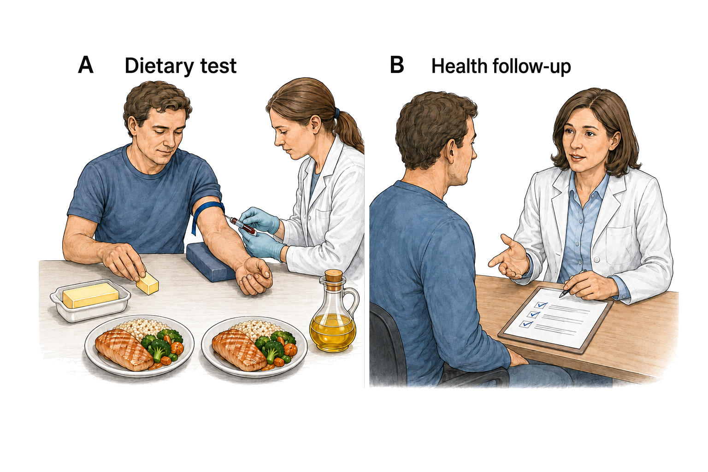
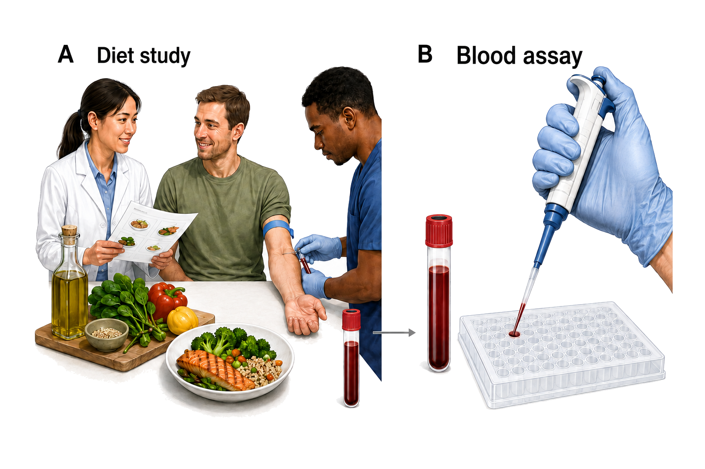
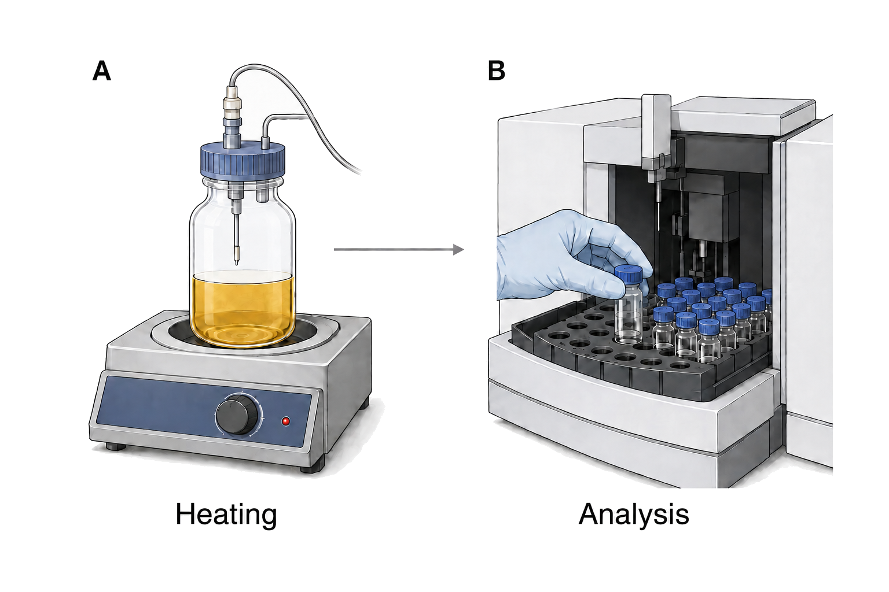

## Culinary seed oils: from dietary substitution to clinical outcomes

**Abstract** — The health effects attributed to culinary seed oils depend on the oil, the food it replaces, the conditions of preparation and the outcome measured. This narrative review connects evidence on dietary substitutions with clinical outcomes, inflammatory responses and heating-related exposures. Replacing saturated fats with unsaturated oils lowers low-density lipoprotein cholesterol, with moderate confidence in short-term effects. Some randomized-trial syntheses also suggest fewer coronary events, but omega-6-specific estimates are less certain and mortality reductions are not consistently established. Historical trials, prospective biomarker studies and cooking-oil cohorts address related but different comparisons. Common circulating inflammatory markers generally show little response to increased linoleic acid, whereas a recent dietary trial found changes in fatty-acid concentrations and stimulated blood-cell mediator production. These biochemical findings do not establish clinical harm. Heating studies document chemical degradation, but the magnitude of risk at ordinary human dietary exposures remains very uncertain. The evidence supports conclusions about specified exposures and outcomes rather than a single effect of all seed oils.

### Introduction

Culinary oils provide a concrete example of why a food's name does not fully define the exposure studied. In an analysis of fourteen oils, linoleic acid ranged from 1.6% to 79.0% of total fatty acids [Orsavova et al. 2015](https://doi.org/10.3390/ijms160612871). Oils also differ in minor components, including polyphenols and phytosterols, that may affect measured risk markers [Rosqvist & Niinistö 2024](https://doi.org/10.29219/fnr.v68.10487). Botanical origin therefore provides only part of the information needed to connect an oil to a nutritional finding. Composition, the amount consumed and the food displaced define a more specific comparison.

That comparison is central to the strongest intervention evidence. Replacing saturated fat with unsaturated fat lowers total and low-density lipoprotein cholesterol [Schwab et al. 2014](https://doi.org/10.3402/fnr.v58.25145). This result concerns a dietary replacement and a blood measurement. It does not, by itself, answer whether adding an oil has the same effect, whether one unsaturated oil is preferable to another, or whether a cholesterol change produces fewer clinical events. Those questions require evidence matching the relevant intervention and outcome.

The distinction between a measured response and a subsequent health outcome organizes this review. Human dietary trials first establish what changes when one fat source replaces another. Clinical-event studies then address whether the intervention changes disease outcomes, while prospective cohorts contribute observations over longer follow-up without randomized dietary allocation. Inflammatory and heating studies examine additional proposed routes to harm. Keeping these questions connected, but distinguishable, makes it possible to assess a broad concern about seed oils without treating every experiment as a test of the same claim.

### Dietary replacements and short-term lipid responses

The lipid evidence is clearest when the displaced food is explicit. A network meta-analysis of 54 trials reported differences in [LDL cholesterol](https://en.wikipedia.org/wiki/Low-density_lipoprotein) of −0.42 to −0.23 mmol/L per isocaloric replacement of 10% of dietary energy from butter with oils [Schwingshackl et al. 2018](https://doi.org/10.1194/jlr.p085522). These values are a range across oil-versus-butter comparisons, not a confidence interval for one oil. They quantify the replacement under study and do not establish the effect of consuming additional oil without changing the rest of the diet.

The direction agrees with a broader systematic review of replacing saturated fat with polyunsaturated or monounsaturated fat [Schwab et al. 2014](https://doi.org/10.3402/fnr.v58.25145). A review focused on linoleic acid likewise reported improvements in lipid risk markers in healthy adults [Froyen & Burns-Whitmore 2020](https://doi.org/10.3390/nu12082329). Together, these findings support moderate confidence in short-term lipid effects of the specified substitutions. Their relevance comes from the repeated comparison between fat sources, rather than from the number of reviews reporting it.

Named-oil comparisons refine that broad result. Corn oil produced a more favorable plasma lipid profile than coconut oil in a four-week crossover trial [Maki et al. 2018](https://doi.org/10.1093/jn/nxy156). Replacing dairy fat with rapeseed oil lowered serum cholesterol, triglycerides and LDL cholesterol in adults with hyperlipidaemia [Iggman et al. 2011](https://doi.org/10.1111/j.1365-2796.2011.02383.x). In another comparison, soybean-oil mayonnaise lowered total and LDL cholesterol relative to palm-olein mayonnaise, while oxidative-stress markers remained unchanged [Karupaiah et al. 2016](https://doi.org/10.1186/s12944-016-0301-9). The findings support specific lipid comparisons; the unchanged oxidative-stress measurements also show why a favorable result for one marker does not describe every biological response.

Differences among unsaturated oils pose a narrower question. A meta-analysis found lower LDL and total cholesterol with canola oil than with olive oil [Pourrajab et al. 2023](https://doi.org/10.1080/10408398.2022.2100314). However, a trial in patients referred for coronary angiography found different inflammatory-marker patterns with these oils without clear overall lipid differences [Khandouzi et al. 2020](https://doi.org/10.1186/s12944-020-01362-z). Corn oil also improved atherogenic lipids relative to extra-virgin olive oil in a controlled feeding trial [Maki et al. 2015](https://doi.org/10.1016/j.jacl.2014.10.006). The comparator remains essential even within the category of unsaturated oils, and results from selected populations do not establish a general ranking of long-term health effects.

Coconut oil further illustrates how changing the reference food changes the result. A review found lower LDL cholesterol with coconut oil than with butter, without a corresponding advantage over cis-unsaturated vegetable oils [Schwingshackl & Schlesinger 2023](https://doi.org/10.1007/s11883-023-01098-y). In a three-way randomized comparison, its LDL outcomes were more similar to olive oil than to butter [Khaw et al. 2018](https://doi.org/10.1136/bmjopen-2017-020167). Similarly, a systematic review found comparable lipid benefits from high-oleic and high-polyunsaturated oils when they replaced saturated or trans fats [Huth et al. 2015](https://doi.org/10.3945/an.115.008979). These are relationships between specified diets, rather than fixed properties of an oil considered alone.

[Figure 1](#fig-seed-oils-comparison-framework) places the dietary comparison and blood collection beside the separate question of clinical follow-up. A replacement can change a blood measurement without establishing a change in disease outcomes; clinical-event trials test that further connection.

**Figure 1. Dietary responses and clinical outcomes are distinct measurements.** Substitution trials measure lipid responses when unsaturated oils replace saturated fats [Schwab et al. 2014](https://doi.org/10.3402/fnr.v58.25145). Clinical-event syntheses assess disease outcomes, with uncertainty remaining for several omega-6-specific estimates [Hooper et al. 2018](https://doi.org/10.1002/14651858.cd011094.pub4). Panel A illustrates a dietary comparison and blood collection; panel B illustrates clinical follow-up. The scenes illustrate study concepts; they neither reconstruct a trial nor establish that lipid changes guarantee clinical benefit.

### Coronary events and mortality

Clinical-event trials connect the dietary comparison to outcomes beyond blood lipids. A synthesis of eight randomized trials, involving 13,614 participants and 1,042 coronary events, estimated fewer coronary events when polyunsaturated fat replaced saturated fat: risk ratio (RR) 0.81, with a [95% confidence interval](https://en.wikipedia.org/wiki/Confidence_interval) of 0.70–0.95 [Mozaffarian et al. 2010](https://doi.org/10.1371/journal.pmed.1000252). The estimate concerns coronary events under the studied replacement regimens, rather than every disease outcome associated with every oil.

A broader Cochrane review of increased polyunsaturated fat also concluded that coronary and cardiovascular events were probably slightly reduced, while all-cause mortality changed little or not at all [Abdelhamid et al. 2018](https://doi.org/10.1002/14651858.cd012345.pub2). The different conclusions for events and mortality can therefore coexist within one evidence body. A reduction in one type of event is not equivalent to a demonstrated reduction in deaths from all causes.

Narrowing the exposure to omega-6 makes the clinical conclusion less certain. The omega-6-specific Cochrane review found little or no difference in all-cause mortality or cardiovascular events, with wide intervals for coronary outcomes [Hooper et al. 2018](https://doi.org/10.1002/14651858.cd011094.pub4). Another analysis explicitly separated mixed omega-3/omega-6 interventions from omega-6-specific trials [Ramsden et al. 2010](https://doi.org/10.1017/s0007114510004010). Broad polyunsaturated-fat interventions consequently cannot be assumed to isolate linoleic acid. The relevant uncertainty includes what was changed in the diet, as well as how precisely the outcome was estimated.

The table and [Figure 2](#fig-seed-oils-coronary-estimates) keep these exposure definitions visible. Their aligned estimates are not a new pooled result, and review overlap was not fully reconstructed in this assessment. The reviews therefore do not count as independent replications of all their underlying trials. Confidence is higher in a possible coronary-event benefit from some replacement regimens than in a mortality benefit attributable to omega-6-rich oils specifically.

| Synthesis | Dietary contrast | Coronary finding | Mortality finding | Source |
|---|---|---|---|---|
| Substitution trials | Polyunsaturated for saturated fat | RR 0.81; 95% CI 0.70–0.95 | Coronary endpoint shown | [Mozaffarian et al. 2010](https://doi.org/10.1371/journal.pmed.1000252) |
| Broad polyunsaturated-fat review | Higher total polyunsaturated fat | Events probably slightly lower | Little or no effect | [Abdelhamid et al. 2018](https://doi.org/10.1002/14651858.cd012345.pub2) |
| Omega-6 review | Higher omega-6 | Effect uncertain | RR 1.00; 95% CI 0.88–1.12 | [Hooper et al. 2018](https://doi.org/10.1002/14651858.cd011094.pub4) |

**Figure 2. Coronary-event estimates depend on the included intervention.** The substitution-focused synthesis reported RR 0.81 (95% CI 0.70–0.95) [Mozaffarian et al. 2010](https://doi.org/10.1371/journal.pmed.1000252). Estimates were 0.87 (0.72–1.06) for the broader polyunsaturated-fat synthesis [Abdelhamid et al. 2018](https://doi.org/10.1002/14651858.cd012345.pub2) and 0.88 (0.66–1.17) for the omega-6 synthesis [Hooper et al. 2018](https://doi.org/10.1002/14651858.cd011094.pub4). Horizontal categories identify syntheses; vertical position gives risk ratios, with one indicating no difference. Whiskers show confidence intervals. Differences in exposure definitions and overlapping evidence prevent interpreting the three points as independent estimates of one identical intervention.

### Why historical trials complicate the clinical answer

Historical diet–heart trials help explain why favorable lipid findings do not settle the clinical question. In the Sydney Diet Heart Study, 458 men with recent coronary events were assigned to a safflower-oil intervention or usual care [Ramsden et al. 2013](https://doi.org/10.1136/bmj.e8707). Recovered data showed higher all-cause mortality in the intervention group, with a [hazard ratio](https://en.wikipedia.org/wiki/Hazard_ratio) (HR) of 1.62 (95% CI 1.00–2.64), and higher cardiovascular mortality, HR 1.70 (1.03–2.80) [Ramsden et al. 2013](https://doi.org/10.1136/bmj.e8707). These adverse results remain part of the clinical evidence even though other substitution analyses have more favorable coronary-event estimates.

The Minnesota Coronary Experiment provides a different, but related, limitation. Replacing saturated fat with a linoleic-acid-rich diet lowered serum cholesterol without a demonstrated reduction in all-cause mortality in the recovered analysis [Ramsden et al. 2016](https://doi.org/10.1136/bmj.i1246). The original report likewise found no difference in cardiovascular events, cardiovascular deaths or total mortality in the overall population [Frantz et al. 1989](https://doi.org/10.1161/01.atv.9.1.129). Thus the distinction between a lipid response and a clinical outcome is directly relevant to interpreting these experiments; it is not merely a theoretical caution appended to otherwise favorable results.

Their applicability also depends on the foods used. The Sydney intervention included safflower-oil margarine as well as liquid oil [Ramsden et al. 2013](https://doi.org/10.1136/bmj.e8707), while the Minnesota diets included corn-oil polyunsaturated margarine and control margarines and shortenings [Ramsden et al. 2016](https://doi.org/10.1136/bmj.i1246). These regimens changed several fat sources. Their results do not isolate an effect of a current unhydrogenated liquid oil, and the presence of historical formulations does not by itself explain away an adverse result.

That distinction matters because analyses of partially hydrogenated oils show that expected coronary effects depend on both trans-fat content and the replacement oil [Mozaffarian & Clarke 2009](https://doi.org/10.1038/sj.ejcn.1602976). A stricter trial meta-analysis also argued that apparent benefit depended on including inadequately controlled studies [Hamley 2017](https://doi.org/10.1186/s12937-017-0254-5). Intervention composition and control quality therefore remain substantive limits on attribution. The historical trials qualify the clinical conclusion; they neither erase the short-term lipid findings nor supply a universal estimate for present-day seed-oil consumption.

### Cooking-oil consumption in prospective and cross-sectional studies

Food-level observational studies address a question closer to ordinary dietary use: how reported oil consumption relates to subsequent health. In a cohort of 521,120 older US adults, corn and canola oil were not associated with higher cardiometabolic mortality per tablespoon, while modeled replacement of butter or margarine with nonhydrogenated vegetable oils was associated with lower mortality [Zhang et al. 2021](https://doi.org/10.1186/s12916-021-01961-2). These estimates describe associations within observed diets. Modeling a replacement does not randomly assign the replacement to participants.

Repeated dietary assessments offer another view of the same question. Across three US health-professional cohorts, the highest total plant-oil intake was associated with lower total mortality than the lowest intake, HR 0.84 (95% CI 0.79–0.90) [Zhang et al. 2025](https://doi.org/10.1001/jamainternmed.2025.0205). The analysis used repeated questionnaires and modeled replacements of butter with plant oils [Zhang et al. 2025](https://doi.org/10.1001/jamainternmed.2025.0205). Its food-level exposure is useful for interpreting dietary substitutions, but the observational design leaves the causal size of that substitution uncertain. The retrieved abstract supports the reported estimate and design; it does not provide the full basis for evaluating every modeling choice.

An apparently conflicting result comes from a Chinese cross-sectional analysis that associated vegetable/sesame-oil use with higher prevalent atherosclerotic cardiovascular disease than lard or other animal-fat use [Wang et al. 2023](https://doi.org/10.1016/j.cpcardiol.2022.101485). This comparison concerns prevalent disease rather than disease arising during follow-up. It cannot establish whether the oil choice preceded the illness or estimate the effect of changing oil use on subsequent incidence. The difference in design is therefore part of the interpretation, rather than a reason to place its result on the opposite side of a simple vote count.

The surrounding diet adds a further level of context. A macronutrient meta-analysis found that associations for total fat changed when analyses were stratified by fat type [Ma et al. 2024](https://doi.org/10.3390/nu16010152). An etiologic synthesis likewise related estimated effects of individual dietary components to effects of dietary patterns on cardiovascular risk factors and clinical endpoints [Micha et al. 2017](https://doi.org/10.1371/journal.pone.0175149). Food-level observations consequently contribute to a replacement-based account of the evidence, but they do not establish an isolated effect of an oil independent of the diet in which it is consumed.

### Fatty-acid biomarkers and later cardiometabolic disease

Biomarker cohorts approach dietary-fat questions through measured fatty acids rather than reported oil use. Pooled international analyses associated higher circulating or tissue linoleic acid with lower total cardiovascular disease, cardiovascular mortality and ischemic stroke [Marklund et al. 2019](https://doi.org/10.1161/circulationaha.118.038908). A later meta-analysis associated each standard-deviation increase in blood linoleic acid with lower fatal coronary disease, without a clear reduction in nonfatal disease [Ren et al. 2023](https://doi.org/10.1080/10408398.2022.2056867). The distinction between fatal and nonfatal outcomes already limits any broad description of the association as uniform cardiovascular protection.

Other cohorts add null findings for particular exposures and endpoints. The Multi-Ethnic Study of Atherosclerosis found no significant association between omega-6 fatty acids and incident cardiovascular disease [de Oliveira Otto et al. 2013](https://doi.org/10.1161/jaha.113.000506), and a Danish case-cohort study found no association between adipose-tissue linoleic acid and myocardial infarction [Nielsen et al. 2021](https://doi.org/10.1007/s00394-021-02526-y). Across eleven cohorts, linoleic- and arachidonic-acid biomarkers were not associated with incident atrial fibrillation [Garg et al. 2023](https://doi.org/10.1016/j.ajcnut.2023.09.008). These observations address different outcomes and measured compartments. Their variation does not establish a single effect common to all cardiovascular disease.

Genetic analyses test a further aspect of causal interpretation. A [Mendelian randomization](https://en.wikipedia.org/wiki/Mendelian_randomization) analysis using fatty-acid genetic-association data from more than 114,000 UK Biobank participants did not support a protective role of circulating polyunsaturated-fatty-acid concentrations against cardiovascular disease [Borges et al. 2022](https://doi.org/10.1186/s12916-022-02399-w). It also identified horizontal pleiotropy as a potential source of bias: genetic instruments may act through other lipid-related pathways [Borges et al. 2022](https://doi.org/10.1186/s12916-022-02399-w). The analysis concerns circulating concentrations rather than consumption of a named oil, so neither it nor the observational associations directly estimates a dietary substitution.

The same separation between biomarker association and dietary intervention appears in diabetes research. In pooled data from 20 cohorts and 39,740 adults, higher linoleic-acid biomarkers were associated with lower incident type 2 diabetes [Wu et al. 2017](https://doi.org/10.1016/s2213-8587%2817%2930307-8). EPIC-InterAct also found an inverse association for linoleic acid, while several less abundant omega-6 fatty acids had different directions [Forouhi et al. 2016](https://doi.org/10.1371/journal.pmed.1002094). These findings concern the individual fatty acids measured; combining them under the omega-6 label would obscure the distinctions within the study.

Randomized evidence is less decisive for diabetes diagnosis. A trial meta-analysis found unclear effects of omega-6 on diagnosis and most glucose-metabolism measures; omega-6 may have little or no effect on [glycated haemoglobin](https://en.wikipedia.org/wiki/Glycated_hemoglobin) (HbA1c) [Brown et al. 2019](https://doi.org/10.1136/bmj.l4697). By comparison, a meta-analysis of 102 controlled feeding trials found improved glucose–insulin regulation when polyunsaturated fat replaced carbohydrate or saturated fat [Imamura et al. 2016](https://doi.org/10.1371/journal.pmed.1002087). Intermediate regulation and incident diagnosis are separate endpoints, so the feeding-trial result does not supply the missing evidence for diabetes prevention.

[Figure 3](#fig-seed-oils-prospective-estimates) brings the cardiovascular and diabetes associations together while preserving their different exposure scales. The distinction from intervention evidence applies to both panels: the measured concentrations were associated with later outcomes in the studied cohorts, but do not establish what changing a particular cooking oil would do.

**Figure 3. Biomarker associations use different exposure contrasts.** Per interquintile-range increase in linoleic acid, pooled analyses reported HRs of 0.93 for total cardiovascular disease, 0.78 for cardiovascular mortality and 0.88 for ischemic stroke [Marklund et al. 2019](https://doi.org/10.1161/circulationaha.118.038908). EPIC-InterAct reported HR 0.80 per standard-deviation increase for type 2 diabetes [Forouhi et al. 2016](https://doi.org/10.1371/journal.pmed.1002094). Vertical position gives the hazard ratio and whiskers show confidence intervals; one indicates no difference. Panel A uses an interquintile-range contrast, while panel B uses a standard-deviation (SD) contrast. The categories identify distinct outcomes, and the associations are not effects of an oil intervention.

### Inflammatory pathways and circulating markers

Inflammation provides a proposed explanation for harm that is separate from the lipid and disease associations above. The biological argument often begins with arachidonic acid: some mediators derived from this omega-6 fatty acid are mainly pro-inflammatory, while linoleic and arachidonic acids have distinct physiological roles [Djuricic & Calder 2021](https://doi.org/10.3390/nu13072421). A mechanistic review links omega-6-derived eicosanoids and a high omega-6-to-omega-3 ratio with chronic disease [Patterson et al. 2012](https://doi.org/10.1155/2012/539426). Such a pathway can motivate a hypothesis, but the effect of dietary linoleic acid still depends on the response actually measured in people.

Human intervention reviews have tested common circulating markers. A systematic review found virtually no evidence that adding linoleic acid increased these markers in healthy adults [Johnson & Fritsche 2012](https://doi.org/10.1016/j.jand.2012.03.029). A later meta-analysis similarly found no significant overall change in blood inflammatory markers as dietary linoleic acid increased [Su et al. 2017](https://doi.org/10.1039/c7fo00433h). Its subgroup and meta-regression analyses nevertheless suggested that larger increases in linoleic-acid intake might increase C-reactive protein [Su et al. 2017](https://doi.org/10.1039/c7fo00433h). The overall result and that exploratory qualification belong together; neither supports treating every inflammatory pathway as unchanged.

Broader mechanistic accounts are also more varied than a uniformly pro-inflammatory description suggests. A review of omega-6 biology describes adverse, neutral and favorable signals [Innes & Calder 2018](https://doi.org/10.1016/j.plefa.2018.03.004), and a review of human evidence found that high dietary or circulating linoleic acid was not associated with stronger in-vivo or ex-vivo inflammatory responses [Fritsche 2008](https://doi.org/10.1016/j.plefa.2008.09.019). The relevant conclusion concerns the measured responses under the studied conditions. It does not require denying the existence of inflammatory mediators or assuming that their production always translates into disease.

The ratio hypothesis raises a related problem of exposure definition. A review argues that a lower omega-6-to-omega-3 ratio is broadly desirable [Simopoulos 2008](https://doi.org/10.3181/0711-mr-311), but a review of human studies found few direct clinical tests of the ratio and conflicting results [Marventano et al. 2015](https://doi.org/10.3109/09637486.2015.1077790). A ratio alone does not identify which fatty-acid intake changed. This is the same interpretive issue encountered with dietary substitutions: the actual comparison determines what the observation can establish.

### Dietary changes measured in stimulated blood samples

A recent controlled trial extends the inflammatory question beyond routine circulating markers. It compared high- and low-linoleic-acid diets for twelve weeks, using safflower-oil variants while holding alpha-linolenic-acid exposure similar [Sergeant et al. 2026](https://doi.org/10.3390/nu18111814). Of 80 randomized participants, 52 completed the intervention [Sergeant et al. 2026](https://doi.org/10.3390/nu18111814). The high-linoleic-acid arm had lower plasma eicosapentaenoic acid (EPA), an omega-3 fatty acid, and higher ratios of arachidonic-acid-derived to EPA-derived products after laboratory stimulation of whole blood [Sergeant et al. 2026](https://doi.org/10.3390/nu18111814).

The study assessed mediator production in a stimulated blood sample and explicitly did not assess clinical outcomes [Sergeant et al. 2026](https://doi.org/10.3390/nu18111814). A biochemical response under that challenge therefore answers a different question from a change in a routine circulating marker or a disease event. The result extends the evidence about fatty-acid and mediator responses without resolving the clinical significance of those responses.

Attribution also remains tied to the complete diet comparison. The authors describe substantial dietary support, no common-diet run-in and a reciprocal increase in oleic acid when linoleic acid was reduced [Sergeant et al. 2026](https://doi.org/10.3390/nu18111814). Attrition and the accompanying change in another fatty acid limit interpretation as an isolated linoleic-acid effect. Moderate confidence in the observed biochemical contrast consequently coexists with much lower confidence in predicting disease from it.

[Figure 4](#fig-seed-oils-blood-assay) follows the sample from the dietary study to the laboratory. The sample-transfer arrow connects the dietary comparison to the assay, where mediator production was measured after stimulation.

**Figure 4. A dietary comparison followed by sampled-blood analysis.** The trial evaluated mediator production after laboratory stimulation of whole blood and did not directly assess clinical outcomes [Sergeant et al. 2026](https://doi.org/10.3390/nu18111814). Panel A depicts dietary guidance and blood collection; panel B depicts handling a sample for an assay. The arrow represents sample transfer, and the plate is a schematic laboratory representation. Neither encodes response magnitudes or disease effects.

### Heating changes the exposure being studied

Heating introduces a further distinction: an oil's chemistry after degradation differs from the dietary exposure described by its original composition. In a controlled experiment, oxidation products increased across temperatures from 100°C to 200°C, and several aldehydes were highest in polyunsaturated soybean oil at 200°C [Zhuang et al. 2022](https://doi.org/10.3389/fnut.2022.913297). Storage also affected the tested oils; oxidative stability fell by about 30% after twelve months in an experiment involving refined oils [Maszewska et al. 2018](https://doi.org/10.3390/molecules23071746). Oil identity, temperature and prior condition therefore belong to the description of these experimental exposures.

A rapeseed-oil experiment makes the role of prior condition more explicit. Heating at 160°C for 120 minutes yielded up to 65 detected volatile compounds, and after 10 minutes aged oil produced seven times the hexanal amount of non-aged oil [Grebenteuch et al. 2021](https://doi.org/10.3390/foods10102417). These are measurements of compound detection and relative production under defined conditions. They do not specify the amount a person would consume or the disease risk from that amount. [Figure 5](#fig-seed-oils-heating-study) depicts the heating and analytical stages that generate such chemical evidence.

The toxicological concern has a plausible biological basis. Reviews describe aldehydic oxidation products that can form in oils, enter food and interact with biological systems [Grootveld et al. 2020](https://doi.org/10.3390/nu12040974). A narrative review also links linoleic-acid oxidation products with oxidized LDL and atherosclerotic lesions [DiNicolantonio & O’Keefe 2018](https://doi.org/10.1136/openhrt-2018-000898). These proposed connections are relevant to evaluating degraded oils, but they do not quantify the exposure–outcome relationship for ordinary unheated oil consumption.

**Figure 5. Heating and analysis of volatile products.** A rapeseed-oil experiment measured volatile compounds formed during heating [Grebenteuch et al. 2021](https://doi.org/10.3390/foods10102417). Panel A illustrates heating and headspace sampling; panel B illustrates analytical sample handling. The schematic does not encode compound quantities. Connecting the measured chemistry to human disease requires exposure and outcome evidence [Grootveld 2022](https://doi.org/10.3389/fnut.2021.711640).

Evidence about repeatedly heated oils adds hazard information without closing that gap. Reviews identify oxidation products in abused frying oils as a plausible health concern [Dobarganes & Márquez-Ruiz 2015](https://doi.org/10.1017/s0007114514002347), and an experiment found tissue injury after rats consumed repeatedly heated oil [Perumalla Venkata & Subramanyam 2016](https://doi.org/10.1016/j.toxrep.2016.08.003). The latter result concerns an animal exposure under experimental conditions. Translating it into a numerical estimate for human cooking would require information about the compounds consumed and the corresponding human outcomes.

A detailed review identifies a need for tolerable-intake values and direct epidemiological or nutritional studies [Grootveld 2022](https://doi.org/10.3389/fnut.2021.711640). The uncertainty is therefore about the connection between chemical measurements, consumed exposure and disease, rather than whether heating can alter oil chemistry. Confidence is moderate in the documented chemical changes and very low in the magnitude of clinical harm at ordinary human dietary exposures.

### Other disease outcomes and the limits of a general claim

The distinction between a biochemical response and clinical disease also applies beyond cardiometabolic outcomes. A review of linoleic acid and cancer concluded that high intake was unlikely to substantially raise breast, colorectal or prostate cancer risk, while acknowledging that a small increase could not be excluded [Zock & Katan 1998](https://doi.org/10.1093/ajcn/68.1.142). A meta-analysis of 47 randomized trials found small point estimates toward increased cancer risk with substantial uncertainty for total polyunsaturated fat and sparse omega-6-specific evidence [Hanson et al. 2020](https://doi.org/10.1038/s41416-020-0761-6). These findings leave important uncertainty about both the exposure and the clinical estimate.

A newer synthesis further separates dietary intake from circulating fatty acids. Higher circulating omega-6 was associated with lower cardiovascular and cancer incidence, while dietary omega-6 showed no detectable overall incidence association [Sadeghi et al. 2025](https://doi.org/10.1186/s12967-025-06336-2). Its dietary omega-6 subgroup results for endometrial and ovarian cancers ran toward higher risk [Sadeghi et al. 2025](https://doi.org/10.1186/s12967-025-06336-2). The different cancer sites and exposure definitions prevent treating the overall result as proof of uniform safety or the subgroup findings as a general cancer effect of seed oils.

Evidence for cognition and inflammatory bowel disease is also limited. A randomized-trial review found unclear effects of increasing omega-6 or total polyunsaturated fat on cognition [Brainard et al. 2020](https://doi.org/10.1016/j.jamda.2020.02.022). Another trial synthesis found little support for modifying inflammatory bowel disease or long-term inflammatory status by increasing omega-3, omega-6 or total polyunsaturated fat [Ajabnoor et al. 2021](https://doi.org/10.1007/s00394-020-02413-y). These outcomes extend the scope of the health question, but they do not strengthen or reverse the lipid finding. They remain separate clinical uncertainties rather than a basis for an undifferentiated verdict on all oils.

The dietary, stimulated-blood and heating experiments distinguish a directly measured response from a clinical question that remains unresolved.

| Evidence | Measured response | Remaining clinical question | Source |
|---|---|---|---|
| Dietary substitution | Lower LDL cholesterol | Mortality benefit | [Schwab et al. 2014](https://doi.org/10.3402/fnr.v58.25145), [Hooper et al. 2018](https://doi.org/10.1002/14651858.cd011094.pub4) |
| Stimulated blood assay | Changed mediator production | Clinical harm | [Sergeant et al. 2026](https://doi.org/10.3390/nu18111814) |
| Heated-oil experiment | Volatile compounds | Risk at ordinary human exposures | [Grebenteuch et al. 2021](https://doi.org/10.3390/foods10102417), [Grootveld 2022](https://doi.org/10.3389/fnut.2021.711640) |

### Conclusion

The most consistent finding concerns a specified replacement: unsaturated oils in place of saturated fats lower LDL cholesterol. Some replacement regimens may also reduce coronary events, but evidence for omega-6-specific effects is less certain and a mortality reduction is not consistently established. Historical trials and contemporary cohorts qualify that answer in different ways because their diets, populations and outcomes differ.

The same exposure-and-outcome distinction clarifies the inflammatory and heating evidence. Common circulating markers, stimulated blood-cell mediator production and clinical disease are separate measurements. A dietary trial can demonstrate a biochemical response without establishing clinical harm, just as an oil-heating experiment can document chemical degradation without determining risk at ordinary human dietary exposures. These remaining gaps limit broad claims about disease prevention or harm while leaving the better-supported short-term lipid findings intact.

**Scope and methods** — Narrative review using OpenAlex and PubMed searches recorded on 4 September 2026, with ten search angles, review and primary-study searches, recent and contrary/null searches, and bidirectional citation chasing from six central sources. This editorial rebuild uses that retained authenticated corpus rather than claiming a new literature search. Human dietary interventions and observational findings were evaluated separately from laboratory and animal studies. The review is not an exhaustive systematic review. Full texts and abstracts were used, with their original retrieval dates preserved. Crossref screening found no integrity signal in the queried metadata for included sources as of the recorded check dates; several publisher notice pages were inaccessible. Overlap between many reviews was not fully reconstructed and was not counted as independent corroboration. Certainty judgments are structured narrative assessments rather than formal ratings under the Grading of Recommendations Assessment, Development and Evaluation framework.

**Sources**

**Abdelhamid AS, Martin N, Bridges C, Brainard JS, Wang X, Brown TJ, Hanson S, Jimoh OF, Ajabnoor SM, Deane KH, Song F, Hooper L (2018)** Polyunsaturated fatty acids for the primary and secondary prevention of cardiovascular disease. *Cochrane Database of Systematic Reviews*. https://doi.org/10.1002/14651858.cd012345.pub2 · 3 claims · abstract

**Ajabnoor SM, Thorpe G, Abdelhamid A, Hooper L (2021)** Long-term effects of increasing omega-3, omega-6 and total polyunsaturated fats on inflammatory bowel disease and markers of inflammation: a systematic review and meta-analysis of randomized controlled trials. *European Journal of Nutrition*. https://doi.org/10.1007/s00394-020-02413-y · 1 claim · abstract

**Borges MC, Haycock PC, Zheng J, Hemani G, Holmes MV, Davey Smith G, Hingorani AD, Lawlor DA (2022)** Role of circulating polyunsaturated fatty acids on cardiovascular diseases risk: analysis using Mendelian randomization and fatty acid genetic association data from over 114,000 UK Biobank participants. *BMC Medicine*. https://doi.org/10.1186/s12916-022-02399-w · 2 claims · full text

**Brainard JS, Jimoh OF, Deane KHO, Biswas P, Donaldson D, Maas K, Abdelhamid AS, Hooper L, Ajabnoor S, Alabdulghafoor F, Alkhudairy L, Bridges C, Hanson S, Martin N, O'Brien A, Rees K, Song F, Thorpe G, Wang X, Winstanley L (2020)** Omega-3, Omega-6, and Polyunsaturated Fat for Cognition: Systematic Review and Meta-analysis of Randomized Trials. *Journal of the American Medical Directors Association*. https://doi.org/10.1016/j.jamda.2020.02.022 · 1 claim · abstract

**Brown TJ, Brainard J, Song F, Wang X, Abdelhamid A, Hooper L (2019)** Omega-3, omega-6, and total dietary polyunsaturated fat for prevention and treatment of type 2 diabetes mellitus: systematic review and meta-analysis of randomised controlled trials. *BMJ*. https://doi.org/10.1136/bmj.l4697 · 1 claim · full text

**de Oliveira Otto MC, Wu JHY, Baylin A, Vaidya D, Rich SS, Tsai MY, Jacobs DR, Mozaffarian D (2013)** Circulating and Dietary Omega‐3 and Omega‐6 Polyunsaturated Fatty Acids and Incidence of CVD in the Multi‐Ethnic Study of Atherosclerosis. *Journal of the American Heart Association*. https://doi.org/10.1161/jaha.113.000506 · 1 claim · full text

**DiNicolantonio JJ, O’Keefe JH (2018)** Omega-6 vegetable oils as a driver of coronary heart disease: the oxidized linoleic acid hypothesis. *Open Heart*. https://doi.org/10.1136/openhrt-2018-000898 · 1 claim · full text

**Djuricic I, Calder PC (2021)** Beneficial Outcomes of Omega-6 and Omega-3 Polyunsaturated Fatty Acids on Human Health: An Update for 2021. *Nutrients*. https://doi.org/10.3390/nu13072421 · 1 claim · full text

**Dobarganes C, Márquez-Ruiz G (2015)** Possible adverse effects of frying with vegetable oils. *British Journal of Nutrition*. https://doi.org/10.1017/s0007114514002347 · 1 claim · abstract

**Forouhi NG, Imamura F, Sharp SJ, Koulman A, Schulze MB, Zheng J, Ye Z, Sluijs I, Guevara M, Huerta JM, Kröger J, Wang LY, Summerhill K, Griffin JL, Feskens EJM, Affret A, Amiano P, Boeing H, Dow C, Fagherazzi G, Franks PW, Gonzalez C, Kaaks R, Key TJ, Khaw KT, Kühn T, Mortensen LM, Nilsson PM, Overvad K, Pala V, Palli D, Panico S, Quirós JR, Rodriguez-Barranco M, Rolandsson O, Sacerdote C, Scalbert A, Slimani N, Spijkerman AMW, Tjonneland A, Tormo MJ, Tumino R, van der A DL, van der Schouw YT, Langenberg C, Riboli E, Wareham NJ (2016)** Association of Plasma Phospholipid n-3 and n-6 Polyunsaturated Fatty Acids with Type 2 Diabetes: The EPIC-InterAct Case-Cohort Study. *PLOS Medicine*. https://doi.org/10.1371/journal.pmed.1002094 · 2 claims · full text

**Frantz ID, Dawson EA, Ashman PL, Gatewood LC, Bartsch GE, Kuba K, Brewer ER (1989)** Test of effect of lipid lowering by diet on cardiovascular risk. The Minnesota Coronary Survey. *Arteriosclerosis: An Official Journal of the American Heart Association, Inc.*. https://doi.org/10.1161/01.atv.9.1.129 · 1 claim · abstract

**Fritsche KL (2008)** Too much linoleic acid promotes inflammation—doesn’t it? *Prostaglandins, Leukotrienes and Essential Fatty Acids*. https://doi.org/10.1016/j.plefa.2008.09.019 · 1 claim · abstract

**Froyen E, Burns-Whitmore B (2020)** The Effects of Linoleic Acid Consumption on Lipid Risk Markers for Cardiovascular Disease in Healthy Individuals: A Review of Human Intervention Trials. *Nutrients*. https://doi.org/10.3390/nu12082329 · 1 claim · full text

**Garg PK, Guan W, Nomura S, Weir NL, Tintle N, Virtanen JK, Hirakawa Y, Qian F, Sun Q, Rimm E, Lemaitre RN, Jensen PN, Heckbert SR, Imamura F, Steur M, Leander K, Laguzzi F, Voortman T, Ninomiya T, Mozaffarian D, Harris WS, Siscovick DS, Tsai MY (2023)** n–6 fatty acid biomarkers and incident atrial fibrillation: an individual participant-level pooled analysis of 11 international prospective studies. *The American Journal of Clinical Nutrition*. https://doi.org/10.1016/j.ajcnut.2023.09.008 · 1 claim · abstract

**Grebenteuch S, Kroh LW, Drusch S, Rohn S (2021)** Formation of Secondary and Tertiary Volatile Compounds Resulting from the Lipid Oxidation of Rapeseed Oil. *Foods*. https://doi.org/10.3390/foods10102417 · 3 claims · full text

**Grootveld M, Percival BC, Leenders J, Wilson PB (2020)** Potential Adverse Public Health Effects Afforded by the Ingestion of Dietary Lipid Oxidation Product Toxins: Significance of Fried Food Sources. *Nutrients*. https://doi.org/10.3390/nu12040974 · 1 claim · full text

**Grootveld M (2022)** Evidence-Based Challenges to the Continued Recommendation and Use of Peroxidatively-Susceptible Polyunsaturated Fatty Acid-Rich Culinary Oils for High-Temperature Frying Practises: Experimental Revelations Focused on Toxic Aldehydic Lipid Oxidation Products. *Frontiers in Nutrition*. https://doi.org/10.3389/fnut.2021.711640 · 3 claims · full text

**Hamley S (2017)** The effect of replacing saturated fat with mostly n-6 polyunsaturated fat on coronary heart disease: a meta-analysis of randomised controlled trials. *Nutrition Journal*. https://doi.org/10.1186/s12937-017-0254-5 · 1 claim · full text

**on behalf of the PUFAH group, Hanson S, Thorpe G, Winstanley L, Abdelhamid AS, Hooper L (2020)** Omega-3, omega-6 and total dietary polyunsaturated fat on cancer incidence: systematic review and meta-analysis of randomised trials. *British Journal of Cancer*. https://doi.org/10.1038/s41416-020-0761-6 · 1 claim · full text

**Hooper L, Al-Khudairy L, Abdelhamid AS, Rees K, Brainard JS, Brown TJ, Ajabnoor SM, O'Brien AT, Winstanley LE, Donaldson DH, Song F, Deane KH (2018)** Omega-6 fats for the primary and secondary prevention of cardiovascular disease. *Cochrane Database of Systematic Reviews*. https://doi.org/10.1002/14651858.cd011094.pub4 · 5 claims · abstract

**Huth PJ, Fulgoni VL, Larson BT (2015)** A Systematic Review of High-Oleic Vegetable Oil Substitutions for Other Fats and Oils on Cardiovascular Disease Risk Factors: Implications for Novel High-Oleic Soybean Oils. *Advances in Nutrition*. https://doi.org/10.3945/an.115.008979 · 1 claim · full text

**Iggman D, Gustafsson IB, Berglund L, Vessby B, Marckmann P, Risérus U (2011)** Replacing dairy fat with rapeseed oil causes rapid improvement of hyperlipidaemia: a randomized controlled study. *Journal of Internal Medicine*. https://doi.org/10.1111/j.1365-2796.2011.02383.x · 1 claim · abstract

**Imamura F, Micha R, Wu JHY, de Oliveira Otto MC, Otite FO, Abioye AI, Mozaffarian D (2016)** Effects of Saturated Fat, Polyunsaturated Fat, Monounsaturated Fat, and Carbohydrate on Glucose-Insulin Homeostasis: A Systematic Review and Meta-analysis of Randomised Controlled Feeding Trials. *PLOS Medicine*. https://doi.org/10.1371/journal.pmed.1002087 · 1 claim · full text

**Innes JK, Calder PC (2018)** Omega-6 fatty acids and inflammation. *Prostaglandins, Leukotrienes and Essential Fatty Acids*. https://doi.org/10.1016/j.plefa.2018.03.004 · 1 claim · abstract

**Johnson GH, Fritsche K (2012)** Effect of Dietary Linoleic Acid on Markers of Inflammation in Healthy Persons: A Systematic Review of Randomized Controlled Trials. *Journal of the Academy of Nutrition and Dietetics*. https://doi.org/10.1016/j.jand.2012.03.029 · 1 claim · abstract

**Karupaiah T, Chuah KA, Chinna K, Matsuoka R, Masuda Y, Sundram K, Sugano M (2016)** Comparing effects of soybean oil- and palm olein-based mayonnaise consumption on the plasma lipid and lipoprotein profiles in human subjects: a double-blind randomized controlled trial with cross-over design. *Lipids in Health and Disease*. https://doi.org/10.1186/s12944-016-0301-9 · 1 claim · full text

**Khandouzi N, Zahedmehr A, Nasrollahzadeh J (2020)** Effects of canola or olive oil on plasma lipids, lipoprotein-associated phospholipase A2 and inflammatory cytokines in patients referred for coronary angiography. *Lipids in Health and Disease*. https://doi.org/10.1186/s12944-020-01362-z · 1 claim · full text

**Khaw KT, Sharp SJ, Finikarides L, Afzal I, Lentjes M, Luben R, Forouhi NG (2018)** Randomised trial of coconut oil, olive oil or butter on blood lipids and other cardiovascular risk factors in healthy men and women. *BMJ Open*. https://doi.org/10.1136/bmjopen-2017-020167 · 1 claim · full text

**Ma Y, Zheng Z, Zhuang L, Wang H, Li A, Chen L, Liu L (2024)** Dietary Macronutrient Intake and Cardiovascular Disease Risk and Mortality: A Systematic Review and Dose-Response Meta-Analysis of Prospective Cohort Studies. *Nutrients*. https://doi.org/10.3390/nu16010152 · 1 claim · full text

**Maki KC, Lawless AL, Kelley KM, Kaden VN, Geiger CJ, Dicklin MR (2015)** Corn oil improves the plasma lipoprotein lipid profile compared with extra-virgin olive oil consumption in men and women with elevated cholesterol: Results from a randomized controlled feeding trial. *Journal of Clinical Lipidology*. https://doi.org/10.1016/j.jacl.2014.10.006 · 1 claim · abstract

**Maki KC, Hasse W, Dicklin MR, Bell M, Buggia MA, Cassens ME, Eren F (2018)** Corn Oil Lowers Plasma Cholesterol Compared with Coconut Oil in Adults with Above-Desirable Levels of Cholesterol in a Randomized Crossover Trial. *The Journal of Nutrition*. https://doi.org/10.1093/jn/nxy156 · 1 claim · full text

**Marklund M, Wu JHY, Imamura F, Del Gobbo LC, Fretts A, de Goede J, Shi P, Tintle N, Wennberg M, Aslibekyan S, Chen TA, de Oliveira Otto MC, Hirakawa Y, Eriksen HH, Kröger J, Laguzzi F, Lankinen M, Murphy RA, Prem K, Samieri C, Virtanen J, Wood AC, Wong K, Yang WS, Zhou X, Baylin A, Boer JMA, Brouwer IA, Campos H, Chaves PHM, Chien KL, de Faire U, Djoussé L, Eiriksdottir G, El-Abbadi N, Forouhi NG, Michael Gaziano J, Geleijnse JM, Gigante B, Giles G, Guallar E, Gudnason V, Harris T, Harris WS, Helmer C, Hellenius ML, Hodge A, Hu FB, Jacques PF, Jansson JH, Kalsbeek A, Khaw KT, Koh WP, Laakso M, Leander K, Lin HJ, Lind L, Luben R, Luo J, McKnight B, Mursu J, Ninomiya T, Overvad K, Psaty BM, Rimm E, Schulze MB, Siscovick D, Skjelbo Nielsen M, Smith AV, Steffen BT, Steffen L, Sun Q, Sundström J, Tsai MY, Tunstall-Pedoe H, Uusitupa MIJ, van Dam RM, Veenstra J, Monique Verschuren WM, Wareham N, Willett W, Woodward M, Yuan JM, Micha R, Lemaitre RN, Mozaffarian D, Risérus U (2019)** Biomarkers of Dietary Omega-6 Fatty Acids and Incident Cardiovascular Disease and Mortality. *Circulation*. https://doi.org/10.1161/circulationaha.118.038908 · 2 claims · abstract

**Marventano S, Kolacz P, Castellano S, Galvano F, Buscemi S, Mistretta A, Grosso G (2015)** A review of recent evidence in human studies of n-3 and n-6 PUFA intake on cardiovascular disease, cancer, and depressive disorders: does the ratio really matter? *International Journal of Food Sciences and Nutrition*. https://doi.org/10.3109/09637486.2015.1077790 · 1 claim · abstract

**Maszewska M, Florowska A, Dłużewska E, Wroniak M, Marciniak-Lukasiak K, Żbikowska A (2018)** Oxidative Stability of Selected Edible Oils. *Molecules*. https://doi.org/10.3390/molecules23071746 · 1 claim · full text

**Micha R, Shulkin ML, Peñalvo JL, Khatibzadeh S, Singh GM, Rao M, Fahimi S, Powles J, Mozaffarian D (2017)** Etiologic effects and optimal intakes of foods and nutrients for risk of cardiovascular diseases and diabetes: Systematic reviews and meta-analyses from the Nutrition and Chronic Diseases Expert Group (NutriCoDE). *PLOS ONE*. https://doi.org/10.1371/journal.pone.0175149 · 1 claim · full text

**Mozaffarian D, Clarke R (2009)** Quantitative effects on cardiovascular risk factors and coronary heart disease risk of replacing partially hydrogenated vegetable oils with other fats and oils. *European Journal of Clinical Nutrition*. https://doi.org/10.1038/sj.ejcn.1602976 · 1 claim · abstract

**Mozaffarian D, Micha R, Wallace S (2010)** Effects on Coronary Heart Disease of Increasing Polyunsaturated Fat in Place of Saturated Fat: A Systematic Review and Meta-Analysis of Randomized Controlled Trials. *PLoS Medicine*. https://doi.org/10.1371/journal.pmed.1000252 · 3 claims · full text

**Nielsen MH, Frydenberg M, Bork CS, Venø SK, Tjønneland A, Schmidt EB, Overvad K, Jakobsen MU (2021)** Linoleic acid in adipose tissue and the risk of myocardial infarction: a case–cohort study. *European Journal of Nutrition*. https://doi.org/10.1007/s00394-021-02526-y · 1 claim · abstract

**Orsavova J, Misurcova L, Ambrozova J, Vicha R, Mlcek J (2015)** Fatty Acids Composition of Vegetable Oils and Its Contribution to Dietary Energy Intake and Dependence of Cardiovascular Mortality on Dietary Intake of Fatty Acids. *International Journal of Molecular Sciences*. https://doi.org/10.3390/ijms160612871 · 1 claim · full text

**Patterson E, Wall R, Fitzgerald GF, Ross RP, Stanton C (2012)** Health Implications of High Dietary Omega-6 Polyunsaturated Fatty Acids. *Journal of Nutrition and Metabolism*. https://doi.org/10.1155/2012/539426 · 1 claim · full text

**Perumalla Venkata R, Subramanyam R (2016)** Evaluation of the deleterious health effects of consumption of repeatedly heated vegetable oil. *Toxicology Reports*. https://doi.org/10.1016/j.toxrep.2016.08.003 · 1 claim · full text

**Pourrajab B, Sharifi-Zahabi E, Soltani S, Shahinfar H, Shidfar F (2023)** Comparison of canola oil and olive oil consumption on the serum lipid profile in adults: a systematic review and meta-analysis of randomized controlled trials. *Critical Reviews in Food Science and Nutrition*. https://doi.org/10.1080/10408398.2022.2100314 · 1 claim · abstract

**Ramsden CE, Hibbeln JR, Majchrzak SF, Davis JM (2010)** n-6 Fatty acid-specific and mixed polyunsaturate dietary interventions have different effects on CHD risk: a meta-analysis of randomised controlled trials. *British Journal of Nutrition*. https://doi.org/10.1017/s0007114510004010 · 1 claim · abstract

**Ramsden CE, Zamora D, Leelarthaepin B, Majchrzak-Hong SF, Faurot KR, Suchindran CM, Ringel A, Davis JM, Hibbeln JR (2013)** Use of dietary linoleic acid for secondary prevention of coronary heart disease and death: evaluation of recovered data from the Sydney Diet Heart Study and updated meta-analysis. *BMJ*. https://doi.org/10.1136/bmj.e8707 · 3 claims · full text

**Ramsden CE, Zamora D, Majchrzak-Hong S, Faurot KR, Broste SK, Frantz RP, Davis JM, Ringel A, Suchindran CM, Hibbeln JR (2016)** Re-evaluation of the traditional diet-heart hypothesis: analysis of recovered data from Minnesota Coronary Experiment (1968-73). *BMJ*. https://doi.org/10.1136/bmj.i1246 · 2 claims · full text

**Ren XL, Liu Y, Chu WJ, Li ZW, Zhang SS, Zhou ZL, Tang J, Yang B (2023)** Blood levels of omega-6 fatty acids and coronary heart disease: a systematic review and metaanalysis of observational epidemiology. *Critical Reviews in Food Science and Nutrition*. https://doi.org/10.1080/10408398.2022.2056867 · 1 claim · abstract

**Rosqvist F, Niinistö S (2024)** Fats and oils – a scoping review for Nordic Nutrition Recommendations 2023. *Food & Nutrition Research*. https://doi.org/10.29219/fnr.v68.10487 · 1 claim · full text

**Sadeghi R, Norouzzadeh M, HasanRashedi M, Jamshidi S, Ahmadirad H, Alemrajabi M, Vafa M, Teymoori F (2025)** Dietary and circulating omega-6 fatty acids and their impact on cardiovascular disease, cancer risk, and mortality: a global meta-analysis of 150 cohorts and meta-regression. *Journal of Translational Medicine*. https://doi.org/10.1186/s12967-025-06336-2 · 2 claims · full text

**Schwab U, Lauritzen L, Tholstrup T, Haldorsson TI, Riserus U, Uusitupa M, Becker W (2014)** Effect of the amount and type of dietary fat on cardiometabolic risk factors and risk of developing type 2 diabetes, cardiovascular diseases, and cancer: a systematic review. *Food & Nutrition Research*. https://doi.org/10.3402/fnr.v58.25145 · 4 claims · full text

**Schwingshackl L, Bogensberger B, Benčič A, Knüppel S, Boeing H, Hoffmann G (2018)** Effects of oils and solid fats on blood lipids: a systematic review and network meta-analysis. *Journal of Lipid Research*. https://doi.org/10.1194/jlr.p085522 · 1 claim · full text

**Schwingshackl L, Schlesinger S (2023)** Coconut Oil and Cardiovascular Disease Risk. *Current Atherosclerosis Reports*. https://doi.org/10.1007/s11883-023-01098-y · 1 claim · full text

**Sergeant S, Easter LH, Mustin T, Ivester P, Legins JA, Seeds MC, Standage-Beier CS, Cox A, Furdui CM, Hallmark B, Chilton FH (2026)** Effect of Dietary Linoleic Acid Intake on Eicosapentaenoic Acid Status and Lipoxygenase-Mediated Oxylipin Biosynthesis in Healthy Adults: A Randomized Controlled Trial. *Nutrients*. https://doi.org/10.3390/nu18111814 · 7 claims · full text

**Simopoulos AP (2008)** The Importance of the Omega-6/Omega-3 Fatty Acid Ratio in Cardiovascular Disease and Other Chronic Diseases. *Experimental Biology and Medicine*. https://doi.org/10.3181/0711-mr-311 · 1 claim · abstract

**Su H, Liu R, Chang M, Huang J, Wang X (2017)** Dietary linoleic acid intake and blood inflammatory markers: a systematic review and meta-analysis of randomized controlled trials. *Food & Function*. https://doi.org/10.1039/c7fo00433h · 2 claims · abstract

**Wang B, Tian G, Zhang Q (2023)** Vegetable Oil or Animal Fat Oil, Which is More Conducive to Cardiovascular Health Among the Elderly in China? *Current Problems in Cardiology*. https://doi.org/10.1016/j.cpcardiol.2022.101485 · 1 claim · abstract

**Wu JHY, Marklund M, Imamura F, Tintle N, Ardisson Korat AV, de Goede J, Zhou X, Yang WS, de Oliveira Otto MC, Kröger J, Qureshi W, Virtanen JK, Bassett JK, Frazier-Wood AC, Lankinen M, Murphy RA, Rajaobelina K, Del Gobbo LC, Forouhi NG, Luben R, Khaw KT, Wareham N, Kalsbeek A, Veenstra J, Luo J, Hu FB, Lin HJ, Siscovick DS, Boeing H, Chen TA, Steffen B, Steffen LM, Hodge A, Eriksdottir G, Smith AV, Gudnason V, Harris TB, Brouwer IA, Berr C, Helmer C, Samieri C, Laakso M, Tsai MY, Giles GG, Nurmi T, Wagenknecht L, Schulze MB, Lemaitre RN, Chien KL, Soedamah-Muthu SS, Geleijnse JM, Sun Q, Harris WS, Lind L, Ärnlöv J, Riserus U, Micha R, Mozaffarian D (2017)** Omega-6 fatty acid biomarkers and incident type 2 diabetes: pooled analysis of individual-level data for 39 740 adults from 20 prospective cohort studies. *The Lancet Diabetes & Endocrinology*. https://doi.org/10.1016/s2213-8587%2817%2930307-8 · 1 claim · abstract

**Zhang Y, Zhuang P, Wu F, He W, Mao L, Jia W, Zhang Y, Chen X, Jiao J (2021)** Cooking oil/fat consumption and deaths from cardiometabolic diseases and other causes: prospective analysis of 521,120 individuals. *BMC Medicine*. https://doi.org/10.1186/s12916-021-01961-2 · 1 claim · full text

**Zhang Y, Chadaideh KS, Li Y, Li Y, Gu X, Liu Y, Guasch-Ferré M, Rimm EB, Hu FB, Willett WC, Stampfer MJ, Wang DD (2025)** Butter and Plant-Based Oils Intake and Mortality. *JAMA Internal Medicine*. https://doi.org/10.1001/jamainternmed.2025.0205 · 2 claims · abstract

**Zhuang Y, Dong J, He X, Wang J, Li C, Dong L, Zhang Y, Zhou X, Wang H, Yi Y, Wang S (2022)** Impact of Heating Temperature and Fatty Acid Type on the Formation of Lipid Oxidation Products During Thermal Processing. *Frontiers in Nutrition*. https://doi.org/10.3389/fnut.2022.913297 · 1 claim · full text

**Zock PL, Katan MB (1998)** Linoleic acid intake and cancer risk: a review and meta-analysis. *The American Journal of Clinical Nutrition*. https://doi.org/10.1093/ajcn/68.1.142 · 1 claim · abstract

**Receipts**

*82 cited sentences · 90 source checks · 49 supported at full text · 25 at abstract · 16 partial · 0 contradicted — every pair's verbatim quote is in `seed-oils-receipts.md`.*
