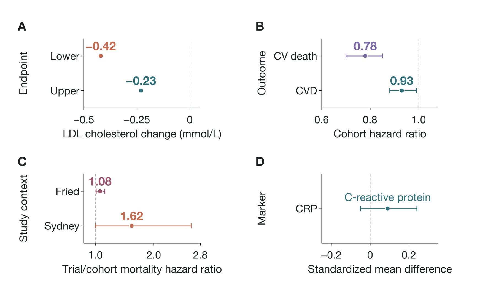
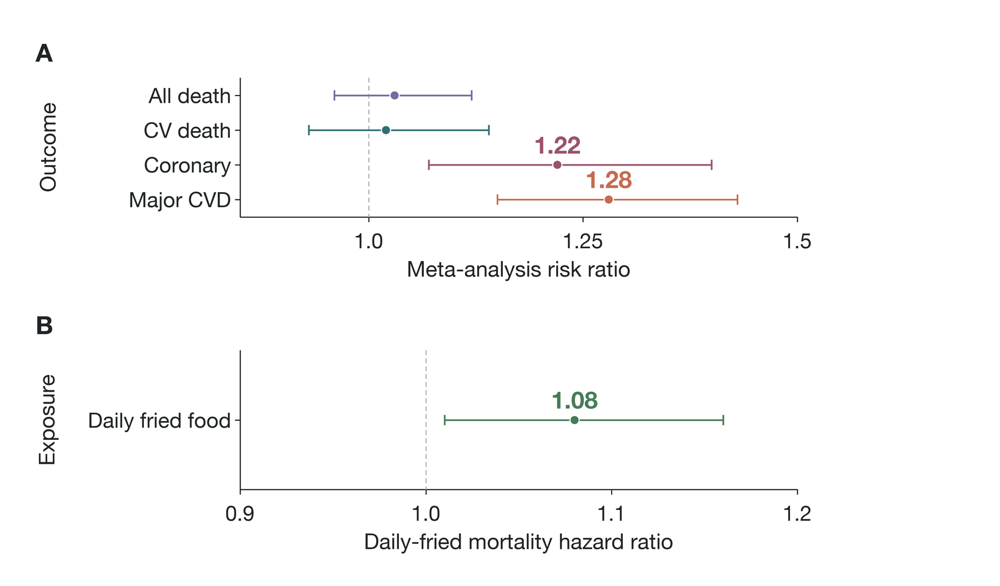

## Are seed oils really bad for you?

**Abstract** — Ordinary culinary use of non-hydrogenated seed oils is not supported as a general health hazard. When these oils replace butter or other saturated-fat-rich foods, controlled trials consistently lower low-density lipoprotein cholesterol; randomized feeding studies also show modest improvements in several glucose-insulin measures. Large prospective biomarker studies associate linoleic acid with lower, not higher, cardiovascular and diabetes risk. The strongest contrary evidence comes from recovered analyses of two old coronary trials, but their mixed interventions, incomplete records, secondary-prevention settings, and possible trans-fat exposure limit their application to current liquid oils. Chemistry and observational evidence justify a separate boundary for repeatedly heated oil and fried-food dietary patterns. The practical conclusion therefore depends on the comparator and the cooking history: replacing saturated fat with fresh unsaturated oil is generally favorable, whereas adding excess energy or repeatedly reusing frying oil is not the intervention tested by the favorable evidence.

### Introduction

“Seed oil” is a culinary category, not a single chemical exposure. Soybean, corn, sunflower, safflower, cottonseed, grapeseed, rice-bran, and rapeseed oils differ in linoleic acid, oleic acid, alpha-linolenic acid, minor compounds, refining, and thermal stability. Even within one oil, high-oleic and conventional varieties can differ materially. Reviews that compare oils therefore preserve their identities rather than treating seed origin as an exposure [Rosqvist & Niinistö 2024](https://doi.org/10.29219/fnr.v68.10487), [Wang 2018](https://doi.org/10.1016/j.plefa.2018.05.003).

The controversy usually joins four separate propositions: linoleic acid promotes inflammation; replacing saturated fat lowers cholesterol without improving health; modern omega-6 intake creates a harmful imbalance; and heat turns PUFA-rich oil into toxic products. Each proposition has some plausible evidence. None, however, answers the broad question until the comparator, dose, processing history, and outcome are specified. A spoonful of fresh soybean oil replacing butter, a hydrogenated margarine used in 1968, and oil held in a commercial fryer for repeated cycles are not interchangeable interventions.

The decisive pattern across the literature is comparison dependence. Controlled feeding trials can ask what happens when one nutrient replaces another. Long cohorts can ask whether habitual intake or a circulating biomarker predicts later disease. Mechanistic studies can show that a pathway exists. Old event trials can reveal where expected benefits failed to appear. These designs answer different questions, and the apparent contradictions become smaller when each is kept within its evidential limits [Schwab et al. 2014](https://doi.org/10.3402/fnr.v58.25145), [Erkkilä et al. 2008](https://doi.org/10.1016/j.plipres.2008.01.004), [Wang 2018](https://doi.org/10.1016/j.plefa.2018.05.003).

| Evidence | Best inference | Main limit |
|---|---|---|
| Feeding trials | Causal markers [Imamura et al. 2016](https://doi.org/10.1371/journal.pmed.1002087) | Short |
| Event trials | Clinical effects [Hooper et al. 2020](https://doi.org/10.1002/14651858.cd011737.pub2) | Heterogeneous |
| Cohorts | Associations [Marklund et al. 2019](https://doi.org/10.1161/circulationaha.118.038908) | Confounding |

This hierarchy matters because the broadest claims demand the hardest outcomes. A short feeding trial can identify a causal LDL response without establishing mortality. A cohort can test whether long-term biomarker patterns resemble that response without removing all confounding. An old event trial can challenge an expected benefit while still leaving uncertainty about the oil, food matrix, and trans-fat content actually delivered. Agreement across these imperfect layers is more informative than treating any one design as decisive.

Taken together, the evidence favors fresh unsaturated-oil replacement while locating the main uncertainty in old coronary trials, fried-food exposure, and inflammatory boundaries ([Figure 1](#fig-whole-answer)).

**Figure 1. Replacement evidence is favorable or neutral; the important exceptions are bounded.** Panel A maps LDL-cholesterol change (mmol/L) on the x-axis and the modeled upper and lower range endpoints on the y-axis. Panel B maps cohort hazard ratios against cardiovascular outcomes; panel C maps all-cause-mortality hazard ratios against the Sydney-trial and daily fried-food cohort contexts; panel D maps standardized mean difference against C-reactive protein. Horizontal whiskers in panels B–D are 95% confidence intervals; panel A’s points are range endpoints, not confidence limits [Schwingshackl et al. 2018](https://doi.org/10.1194/jlr.p085522), [Marklund et al. 2019](https://doi.org/10.1161/circulationaha.118.038908), [Ramsden et al. 2013](https://doi.org/10.1136/bmj.e8707), [Sun et al. 2019](https://doi.org/10.1136/bmj.k5420), [Su et al. 2017](https://doi.org/10.1039/c7fo00433h).

The panels deliberately do not share a single vertical scale. Their job is to show the direction and boundary of each evidence stream: lower LDL under replacement; prospective and combined-event estimates at or below no difference; a contrary estimate from Sydney and an adverse fried-food association; and standard inflammatory markers centered near zero. The figure therefore summarizes the answer without pretending that a cholesterol difference, a hazard ratio, and a standardized biomarker effect are interchangeable quantities.

### Unsaturated oils lower atherogenic cholesterol when they replace saturated fats

The most secure causal finding is also the narrowest. In a network meta-analysis of 54 randomized trials, safflower, sunflower, rapeseed, flaxseed, corn, olive, soybean, palm, and coconut oils all lowered [low-density lipoprotein](https://en.wikipedia.org/wiki/Low-density_lipoprotein) (LDL) cholesterol relative to butter, with modeled differences of approximately 0.23–0.42 mmol/L per 10% energy exchange [Schwingshackl et al. 2018](https://doi.org/10.1194/jlr.p085522). The ranking varied, but the central contrast was consistent: oils richer in unsaturated fatty acids generally performed better than butter for LDL.

Individual feeding studies support that direction. Replacing commercial partially hydrogenated fat with vegetable oil improved lipoproteins [Vega-López et al. 2009](https://doi.org/10.1016/j.atherosclerosis.2009.03.039). Exchanging common foods to lower saturated fat and raise unsaturated fat reduced total and LDL cholesterol in free-living adults [Ulven et al. 2016](https://doi.org/10.1017/s0007114516003445). Controlled comparisons of polyunsaturated and saturated fats found lower LDL and, in some interventions, less liver fat under the polyunsaturated diet [Bjermo et al. 2012](https://doi.org/10.3945/ajcn.111.030114), [Larsen et al. 2021](https://doi.org/10.1002/mnfr.202100633). These trials vary in food provision, duration, and background diet, but the direction of the LDL response is not an isolated result.

The change does not imply that every lipid marker improves or that the oil with the highest rank is clinically superior. HDL cholesterol and triglycerides show smaller, less consistent differences. LDL particle size also changes with total carbohydrate, saturated fat, weight, and measurement method; lower LDL under a PUFA-rich diet does not consistently conceal a shift toward a uniformly worse particle pattern [Froyen 2021](https://doi.org/10.1186/s12944-021-01501-0), [Hodson et al. 2001](https://doi.org/10.1038/sj.ejcn.1601234). The stable inference is simpler: replacing saturated fat with unsaturated oil lowers the concentration of a causal atherogenic lipoprotein.

The consistently negative LDL change is the robust result, whereas treatment-ranking probabilities distinguish individual oils less securely ([Figure 2](#fig-lipid-replacement)).

**Figure 2. Unsaturated oils lower LDL relative to butter, but fine rankings remain uncertain.** Panel A maps LDL-cholesterol change (mmol/L) on the x-axis against the modeled upper and lower range endpoints on the y-axis for a 10%-of-energy exchange. Panel B maps treatment-ranking probability (%) on the x-axis against LDL and total-cholesterol outcomes on the y-axis; the Safflower and Rapeseed lines are rankings, not effect sizes [Schwingshackl et al. 2018](https://doi.org/10.1194/jlr.p085522), [Bjermo et al. 2012](https://doi.org/10.3945/ajcn.111.030114).

That evidence also clarifies the relevant action. The trials do not show that pouring additional oil onto an unchanged diet improves health. They estimate substitution: one energy source leaves while another enters. Energy surplus, weight gain, and an ultra-processed food matrix can dominate the fatty-acid contrast. The lipid result is strong because the comparison is explicit.

### Cardiovascular events probably improve less dramatically than LDL cholesterol

Clinical outcomes are directionally favorable but less certain. A Cochrane synthesis of 15 long-term trials, approximately 59,000 participants, found that reducing saturated fat lowered combined cardiovascular events by 21% (risk ratio 0.79, 95% [confidence interval](https://en.wikipedia.org/wiki/Confidence_interval) 0.66–0.93). The estimated number needed to treat was about 56 for primary prevention over roughly four years [Hooper et al. 2020](https://doi.org/10.1002/14651858.cd011737.pub2). Greater cholesterol reduction explained much of the heterogeneity, which links the clinical result to the feeding evidence.

Mortality did not show the same clarity. The pooled all-cause mortality estimate was 0.96 (0.90–1.03), and cardiovascular mortality was 0.95 (0.80–1.12). Myocardial infarction and stroke estimates were also less precise. A synthesis limited specifically to higher omega-6 intake found little or no difference in all-cause mortality or total cardiovascular events and judged several outcome estimates low or very low certainty [Hooper et al. 2018](https://doi.org/10.1002/14651858.cd011094.pub4). Thus, the event literature supports modest prevention rather than a dramatic mortality claim.

What replaced saturated fat also varied. Some interventions raised [polyunsaturated fat](https://en.wikipedia.org/wiki/Polyunsaturated_fat); others increased carbohydrate, changed total diet, or combined advice with supplied foods. Cohort substitution models similarly find that replacing butter, processed meat, or eggs with plant foods is associated with different effect sizes because the departing food matters [Neuenschwander et al. 2023](https://doi.org/10.1186/s12916-023-03093-1). A presidential advisory interpreted the totality as favoring unsaturated fats, but it is guidance based on a synthesis, not a new randomized experiment [Sacks et al. 2017](https://doi.org/10.1161/cir.0000000000000510).

| Evidence | Estimate | Reading |
|---|---|---|
| Lower SFA | RR 0.79 [Hooper et al. 2020](https://doi.org/10.1002/14651858.cd011737.pub2) | Benefit |
| Higher omega-6 | RR 0.97 [Hooper et al. 2018](https://doi.org/10.1002/14651858.cd011094.pub4) | Uncertain |
| Butter→olive oil | SHR 0.96 [Neuenschwander et al. 2023](https://doi.org/10.1186/s12916-023-03093-1) | Small |

The clinical evidence therefore neither proves that a particular seed oil prevents death nor supports the claim that these oils are generally cardiotoxic. It places the largest confidence on LDL lowering, moderate confidence on combined cardiovascular-event reduction under replacement, and lower confidence on mortality.

Clinical outcomes follow a graded pattern: combined cardiovascular events favor replacement, pooled mortality remains near no difference, and the recovered Sydney trial remains contrary evidence ([Figure 3](#fig-clinical-events)).

**Figure 3. Cardiovascular-event benefit is modest; mortality remains uncertain.** In panel A, the first three rows are saturated-fat-reduction estimates for combined cardiovascular events, all-cause mortality, and cardiovascular mortality; the fourth is a separate higher-omega-6 estimate for cardiovascular events. The x-axis reports randomized risk ratios and the y-axis reports outcomes. Panel B maps the Sydney-trial hazard ratio against all-cause mortality. Horizontal whiskers are 95% confidence intervals; 1.0 denotes no difference [Hooper et al. 2020](https://doi.org/10.1002/14651858.cd011737.pub2), [Hooper et al. 2018](https://doi.org/10.1002/14651858.cd011094.pub4), [Ramsden et al. 2013](https://doi.org/10.1136/bmj.e8707).

### Two recovered coronary trials remain important contrary evidence

The Minnesota Coronary Experiment replaced saturated fat with corn oil and polyunsaturated margarine in institutions. Serum cholesterol fell by 13.8% in the intervention group versus 1.0% in controls, yet mortality did not improve. Among participants exposed for at least a year, greater cholesterol reduction was associated with higher mortality [Ramsden et al. 2016b](https://doi.org/10.1136/bmj.i1246). The Sydney Diet Heart Study, conducted in men after a coronary event, reported higher all-cause mortality in the safflower-oil arm (17.6% vs 11.8%; [hazard ratio](https://en.wikipedia.org/wiki/Hazard_ratio) 1.62, 95% CI 1.00–2.64) [Ramsden et al. 2013](https://doi.org/10.1136/bmj.e8707).

These findings cannot be dismissed because they are inconvenient. They show that a favorable intermediate marker does not guarantee a favorable outcome, especially within a specific population and intervention. They also justify the wider confidence intervals around event-level conclusions.

They do not, however, cleanly identify harm from current non-hydrogenated liquid oils. Minnesota had incomplete recovery, short exposure for many participants, substantial institutional turnover, and limited information about the full intervention. Sydney was small, restricted to men with recent coronary disease, and had imbalances and adherence uncertainty. Both used study margarines from an era when trans-fat content was a material concern. Industrial trans fats independently raise the LDL:HDL ratio; a quantitative review estimated an increase of 0.055 for each 1% of energy replacing cis monounsaturated fat [Brouwer et al. 2010](https://doi.org/10.1371/journal.pone.0009434), [Gebauer et al. 2015](https://doi.org/10.3945/ajcn.115.116129).

The proper synthesis is not that trans fat explains away every adverse result. Its uncertain presence is one of several reasons these trials do not isolate cis linoleic acid. The trials remain contrary evidence about old, complex diet-heart interventions; they are not a direct randomized test of a bottle of contemporary soybean or sunflower oil used once at home.

### Prospective biomarkers point away from general cardiovascular harm

A harmonized analysis of 30 prospective studies included 68,659 participants and 15,198 cardiovascular events. Higher circulating or tissue linoleic acid was associated with lower total cardiovascular disease (hazard ratio 0.93, 95% CI 0.88–0.99), cardiovascular mortality (0.78, 0.70–0.85), and ischemic stroke (0.88, 0.79–0.98) across the interquintile range. Coronary disease was borderline at 0.94 (0.88–1.00), and arachidonic acid did not predict higher risk [Marklund et al. 2019](https://doi.org/10.1161/circulationaha.118.038908).

Across prospective biomarker datasets, cardiovascular, mortality, stroke, coronary, and diabetes estimates cluster at or below no difference ([Figure 4](#fig-cohort-estimates)).

**Figure 4. Prospective biomarkers point neutral to favorable.** The x-axis reports cohort hazard ratios; the y-axis identifies cardiovascular, mortality, stroke, coronary, and diabetes outcomes. Cardiovascular estimates compare the interquintile linoleic-acid range; diabetes is per standard-deviation plasma linoleic acid. Horizontal whiskers are 95% confidence intervals, and 1.0 denotes no difference [Marklund et al. 2019](https://doi.org/10.1161/circulationaha.118.038908), [Forouhi et al. 2016](https://doi.org/10.1371/journal.pmed.1002094).

Other cohorts broadly agree. Circulating linoleic acid predicted lower total and cause-specific mortality in a US cohort [Wu et al. 2014](https://doi.org/10.1161/circulationaha.114.011590). Biomarker-based analyses associated higher PUFA status with fewer cardiovascular events in older populations [Marklund et al. 2015](https://doi.org/10.1161/circulationaha.115.015607). Adipose-tissue and circulating-fatty-acid studies also tend toward inverse or null associations rather than harm [Bork et al. 2025](https://doi.org/10.1016/j.ajcnut.2025.01.029), [Liu et al. 2025b](https://doi.org/10.1016/j.clnu.2025.01.034). Recent prospective work on plant versus animal fat intake points in the same direction [Zhao et al. 2024](https://doi.org/10.1001/jamainternmed.2024.3799), [Liu et al. 2025a](https://doi.org/10.1016/j.ajcnut.2024.11.012).

Association remains association. A circulating proportion is influenced by intake, absorption, metabolism, and the denominator of other fatty acids. Healthy dietary patterns and socioeconomic factors can confound the relationship. Biomarker studies reduce food-frequency-report error, but they do not create randomization. Their value is convergence: if ordinary linoleic-acid exposure were a large general cardiovascular toxin, repeated inverse associations across countries and measurement compartments would be difficult to reconcile with that claim.

The convergence is not absolute. Some individual outcomes and cohorts are null, and estimates may differ by baseline disease or metabolic state [Owen et al. 2016](https://doi.org/10.1007/s00394-015-0979-x), [Bork et al. 2025](https://doi.org/10.1016/j.ajcnut.2025.01.029). The observational evidence rules against a large class-wide hazard more strongly than it proves a protective causal effect.

### Glucose metabolism distinguishes linoleic acid from its downstream metabolites

Randomized feeding studies provide causal evidence on metabolic markers. A meta-analysis of 102 trials and 4,220 adults modeled isocaloric exchanges among saturated fat, monounsaturated fat, PUFA, and carbohydrate. Replacing 5% of energy from saturated fat with PUFA lowered fasting glucose by 0.04 mmol/L (95% CI 0.01–0.07), improved glycated hemoglobin and insulin resistance, and increased insulin-secretion capacity [Imamura et al. 2016](https://doi.org/10.1371/journal.pmed.1002087). The changes were modest but consistently unfavorable to the proposition that PUFA replacement impairs glucose control.

Large cohorts extend that result. In EPIC-InterAct, with 12,132 incident diabetes cases, plasma linoleic acid was associated with lower diabetes incidence (hazard ratio 0.80 per standard deviation, 95% CI 0.77–0.83). Arachidonic acid was null, while gamma-linolenic acid and several downstream metabolites were positively associated [Forouhi et al. 2016](https://doi.org/10.1371/journal.pmed.1002094). A pooled biomarker analysis across international cohorts likewise found lower diabetes risk with linoleic acid [Wu et al. 2017](https://doi.org/10.1016/s2213-8587%2817%2930307-8).

The molecular family does not move as one block. In a Chinese cohort, erythrocyte gamma-linolenic acid predicted higher diabetes incidence, whereas linoleic and arachidonic acid were null [Miao et al. 2020](https://doi.org/10.2337/dc20-0631). In postmenopausal US women, red-cell linoleic acid was also null, while desaturase ratios and palmitic acid predicted risk [Harris et al. 2016](https://doi.org/10.1371/journal.pone.0147894). Genetic variation in fatty-acid desaturation can modify metabolic and inflammatory responses to a linoleic-rich diet [Lankinen et al. 2019](https://doi.org/10.1093/ajcn/nqy287), [Lankinen et al. 2021](https://doi.org/10.1002/mnfr.202001004).

That pattern defeats a common simplification. “Omega-6” names precursors, products, and relative concentrations with different associations. A higher downstream metabolite may reflect altered enzyme activity or emerging metabolic disease, not a harmful dose of dietary seed oil. Trials of longer duration remain sparse, and a broad PUFA diabetes review found insufficient omega-6-specific incidence evidence [Brown et al. 2019](https://doi.org/10.1136/bmj.l4697), [Mousavi et al. 2021](https://doi.org/10.2337/dc21-0438). The combined result is moderate support for favorable or neutral glucose effects, not proof that more is always better.

### Controlled human studies do not show generalized inflammation

The inflammatory hypothesis begins with valid biochemistry. Linoleic acid can enter pathways that produce [oxylipins](https://en.wikipedia.org/wiki/Oxylipin), and arachidonic-acid metabolites can be pro-inflammatory or pro-resolving. But substrate availability does not dictate a single clinical direction because conversion is regulated, products oppose one another, and tissues differ.

Human trials mostly fail to show the predicted generalized response. A meta-analysis of 30 randomized studies involving 1,377 adults found no material change in [C-reactive protein](https://en.wikipedia.org/wiki/C-reactive_protein) (standardized mean difference 0.09, 95% CI −0.05 to 0.24), tumor necrosis factor (−0.01, −0.19 to 0.17), interleukin-6 (0.11, −0.07 to 0.29), fibrinogen, or adhesion molecules when linoleic acid increased [Su et al. 2017](https://doi.org/10.1039/c7fo00433h). An earlier systematic review reached the same conclusion [Johnson & Fritsche 2012](https://doi.org/10.1016/j.jand.2012.03.029). A recent double-blind crossover study also found no broad inflammatory signature unique to plant n-6 supplementation [Grytten et al. 2025](https://doi.org/10.1016/j.jlr.2025.100770).

Near-zero estimates with confidence intervals spanning zero argue against a generalized rise in standard systemic inflammatory markers ([Figure 5](#fig-inflammation-boundary)).

**Figure 5. Standard inflammatory markers remain near no difference.** The x-axis reports standardized mean difference; the y-axis identifies C-reactive protein, tumor necrosis factor, and interleukin-6. Horizontal whiskers are 95% confidence intervals, and zero denotes no difference. All three intervals cross zero [Su et al. 2017](https://doi.org/10.1039/c7fo00433h), [Johnson & Fritsche 2012](https://doi.org/10.1016/j.jand.2012.03.029).

This is not evidence that no tissue-specific effect exists. A small, uncontrolled pilot in women with metabolic syndrome found altered oxylipins and higher adiponectin without worse glycemia or standard inflammation [Cole et al. 2020](https://doi.org/10.1093/cdn/nzaa136). Animal feeding experiments show tissue-specific changes in pain-related lipid mediators when linoleic acid rises [Ramsden et al. 2016a](https://doi.org/10.1177/1744806916636386). Exercise, carbohydrate availability, genotype, and background omega-3 intake also change the circulating oxylipin response [Nieman et al. 2019](https://doi.org/10.1371/journal.pone.0213676), [Gabbs et al. 2021](https://doi.org/10.1093/jn/nxaa294).

The human marker evidence supports a narrow statement: ordinary increases in dietary linoleic acid do not consistently raise standard systemic inflammatory markers. It cannot exclude specialized effects in pain, a susceptible genotype, or a tissue that blood measurements poorly capture. Mechanistic possibility remains a reason for targeted trials, not a substitute for them.

### The omega-6:omega-3 ratio compresses away the useful information

A ratio of 12 can mean abundant omega-6 with adequate omega-3, moderate omega-6 with deficient omega-3, or low amounts of both. Those diets need not have the same physiology. The ratio also merges linoleic acid, gamma-linolenic acid, arachidonic acid, alpha-linolenic acid, EPA, and DHA despite their different sources and associations.

Stable-isotope studies show that only part of dietary linoleic acid proceeds through long-chain conversion, and conversion responds to background fatty acids [Hussein et al. 2005](https://doi.org/10.1194/jlr.m400225-jlr200), [Del Prado et al. 2001](https://doi.org/10.1093/ajcn/74.2.242). Position papers and mechanistic reviews have therefore shifted emphasis toward adequate absolute intake of each essential family rather than a universal ratio target [Jackson et al. 2024](https://doi.org/10.1186/s12944-024-02246-2), [Rosqvist & Niinistö 2024](https://doi.org/10.29219/fnr.v68.10487). Some literature continues to argue for a lower ratio, especially in defined clinical contexts [Noori et al. 2011](https://doi.org/10.1053/j.ajkd.2011.03.017). That disagreement is partly semantic: lowering a ratio by increasing omega-3 may help even when lowering omega-6 would not.

The ratio can still describe an experimental diet. It is weak as a population-wide verdict on seed oils because it cannot say which side of the fraction is inadequate. Absolute amounts, food sources, and clinical outcome are the more informative variables.

### Repeated high-temperature frying is a distinct and credible boundary

Heat changes oil. Unsaturated fatty acids undergo peroxidation, and prolonged high temperatures generate aldehydes, polymers, and other lipid-oxidation products. The rate depends on unsaturation, antioxidants, oxygen, temperature, food moisture, and reuse. Chemical studies consistently show degradation during severe or repeated frying [Grootveld 2022](https://doi.org/10.3389/fnut.2021.711640), [Hu et al. 2024](https://doi.org/10.1016/j.foodres.2023.113725), [Olivero-David et al. 2011](https://doi.org/10.1021/jf1048063). Reviews of frying chemistry also document that flavor chemistry and degradation evolve together rather than at one universal smoke-point threshold [Chang et al. 2020](https://doi.org/10.1080/10408398.2019.1575792).

The hazard is biologically credible, but the human dose-response is poorly defined. Animal studies of thermally abused oil show adverse effects under controlled exposures, including tumor-metastasis and organ-injury signals [Cam et al. 2019](https://doi.org/10.1158/1940-6207.capr-18-0220), [Liu et al. 2026](https://doi.org/10.1002/exp.20240073). Such models identify possible mechanisms; they do not establish that occasional home sautéing causes the same outcome. Human studies rarely measure actual aldehyde intake, absorbed dose, reuse history, and long-term disease together.

Oil composition matters. Extra-virgin olive oil combines a more monounsaturated profile with phenolic antioxidants and often resists oxidation better than highly polyunsaturated refined oils [Lanza & Ninfali 2020](https://doi.org/10.3390/antiox9010041). High-oleic seed-oil varieties also differ from conventional ones [Rosqvist & Niinistö 2024](https://doi.org/10.29219/fnr.v68.10487). Yet “more stable” is not identical to “healthier in every use,” because LDL effects, flavor, cost, and the displaced food remain relevant.

The reasonable boundary is therefore operational: fresh liquid oil and repeatedly reused frying oil should not inherit one risk estimate. Avoiding prolonged reuse is supported by chemistry even though a precise clinical threshold is not available.

### Fried-food cohorts cannot isolate seed oil, but they should not be ignored

In 106,966 postmenopausal women, daily fried-food consumption was associated with higher all-cause mortality (hazard ratio 1.08, 95% CI 1.01–1.16), with stronger estimates for fried chicken and fried fish [Sun et al. 2019](https://doi.org/10.1136/bmj.k5420). A dose-response meta-analysis associated the highest fried-food intake with major cardiovascular events (risk ratio 1.28, 95% CI 1.15–1.43) and coronary disease (1.22, 1.07–1.40), but not clearly with cardiovascular mortality (1.02, 0.93–1.14) or all-cause mortality (1.03, 0.96–1.12) [Qin et al. 2021](https://doi.org/10.1136/heartjnl-2020-317883).

Fried-food epidemiology separates higher major cardiovascular and coronary-event estimates from near-null pooled mortality estimates ([Figure 6](#fig-heating-boundary)).

**Figure 6. Fried-food associations are outcome-specific.** Panel A maps meta-analysis risk ratios on the x-axis against cardiovascular and mortality outcomes on the y-axis. Panel B maps a cohort hazard ratio against daily fried-food exposure for all-cause mortality. Horizontal whiskers are 95% confidence intervals; 1.0 denotes no difference. The exposure is the whole frying system [Qin et al. 2021](https://doi.org/10.1136/heartjnl-2020-317883), [Sun et al. 2019](https://doi.org/10.1136/bmj.k5420).

These cohorts measure a dietary behavior. Frying oil may be fresh or repeatedly used; foods differ in starch, meat, breading, sodium, energy density, and portion size. Restaurant use can involve different temperatures and oils than home use. Frequent consumers also differ in smoking, activity, income, and the rest of their diet. Adjustment reduces but does not eliminate those differences [Nahab et al. 2016](https://doi.org/10.1017/s136898001600152x), [Mozaffarian 2005](https://doi.org/10.1001/archinte.165.2.200).

The studies therefore cannot show that linoleic acid caused the association. They do show that “seed oils are safe” is too broad if it is used to defend every fried-food pattern. The unfavorable exposure is the whole frying system. That boundary coexists with favorable evidence for fresh oil replacing saturated fat because the interventions are not the same.

### Cancer and mortality evidence does not support one class-wide hazard

A recent global meta-analysis of 150 prospective publications found that higher dietary or circulating omega-6 measures were generally associated with lower cardiovascular disease, cancer incidence, and all-cause mortality. Associations varied by cancer site: some lung and prostate estimates were inverse, while ovarian and endometrial estimates were positive [Sadeghi et al. 2025](https://doi.org/10.1186/s12967-025-06336-2). A breast-cancer meta-analysis did not establish a uniform linoleic-acid hazard [Zhou et al. 2016](https://doi.org/10.1017/s136898001500289x). A systematic review of linoleic acid and mortality likewise found inverse or null associations overall [Li et al. 2020](https://doi.org/10.1093/ajcn/nqz349).

Newer biomarker analyses remain mixed in magnitude but do not reveal a general mortality penalty [Liu et al. 2025b](https://doi.org/10.1016/j.clnu.2025.01.034), [Bork et al. 2025](https://doi.org/10.1016/j.ajcnut.2025.01.029). The widest cohort studies of plant oils and butter report lower mortality associated with plant oils, especially under modeled replacement [Zhang et al. 2025](https://doi.org/10.1001/jamainternmed.2025.0205). These results align with the cardiovascular biomarker evidence but retain the usual observational limitations.

Cancer requires site-specific interpretation. Hormone-sensitive tissues, adiposity, food source, and measurement error can produce different associations. An umbrella review that combined observational and Mendelian-randomization evidence found that many proposed fatty-acid biomarkers lacked convincing causal support for colorectal cancer [Zhang et al. 2020](https://doi.org/10.1002/cam4.3051). Reviews of omega-6 exposure and colorectal cancer similarly emphasize uncertainty rather than a single directional effect [Atashi et al. 2025](https://doi.org/10.1038/s41387-025-00367-w).

The most defensible conclusion is negative in scope but affirmative in meaning: the available human evidence places ordinary seed-oil intake within the range of common dietary fats, not within a demonstrated class of carcinogens. That does not turn every site-specific association into reassurance; it requires each cancer claim to be tested on its own evidence.

### Oil identity and food context still matter

Rejecting a class-wide toxicity claim does not make all oils equivalent. Rapeseed oil contains alpha-linolenic acid; conventional safflower and sunflower oils can be high in linoleic acid; high-oleic variants shift toward monounsaturated fat; unrefined oils retain different minor compounds. Network rankings for LDL differ, although indirect comparisons limit fine ordering [Schwingshackl et al. 2018](https://doi.org/10.1194/jlr.p085522).

Olive oil provides a useful comparator. In a prospective analysis within PREDIMED, the highest versus lowest olive-oil intake was associated with lower cardiovascular risk (hazard ratio 0.65, 95% CI 0.47–0.89) [Guasch-Ferré et al. 2014](https://doi.org/10.1186/1741-7015-12-78). US cohorts associated at least 7 g/day with lower dementia-related mortality (0.72, 0.64–0.81) [Tessier et al. 2024](https://doi.org/10.1001/jamanetworkopen.2024.10021). Its phenolic matrix affects gene expression and oxidation chemistry, features not shared equally by refined seed oils [Herrera-Marcos et al. 2017](https://doi.org/10.3390/nu9050472).

Those favorable olive-oil data cannot be borrowed as proof for every seed oil. Nor do they make a seed oil harmful. They show that food-level evidence is more specific than fatty-acid evidence. A person choosing an oil can legitimately consider culinary temperature, flavor, alpha-linolenic acid, phenolics, and price while recognizing that replacing butter with an unsaturated oil is the better-supported cardiovascular contrast [Ke et al. 2024](https://doi.org/10.1039/d3fo05246j), [Guasch-Ferré et al. 2022](https://doi.org/10.1016/j.jacc.2021.10.041).

The broader diet remains decisive. An oil eaten with vegetables, legumes, and whole grains enters a different food pattern from oil embedded in fried ultra-processed food. Cohort substitution analyses find large benefits when processed meat is replaced by nuts, legumes, or whole grains because the replacement changes far more than fatty acids [Neuenschwander et al. 2023](https://doi.org/10.1186/s12916-023-03093-1), [English et al. 2021](https://doi.org/10.1001/jamanetworkopen.2021.22277). Seed origin is rarely the variable with the greatest explanatory power.

### Specific clinical contexts prevent a blanket benefit claim

Migraine is the clearest human example. In a 16-week randomized trial of 182 adults, both high-EPA/DHA diets increased the antinociceptive mediator 17-HDHA; the diet that also lowered linoleic acid produced the largest reductions in headache days. The prespecified HIT-6 quality-of-life differences, however, were not statistically significant [Ramsden et al. 2021](https://doi.org/10.1136/bmj.n1448). Because both omega-3 and linoleic acid changed, the trial cannot assign the clinical effect to linoleic-acid reduction alone.

Pain biology provides a plausible mechanism. Controlled rat feeding raised linoleic-derived pronociceptive mediators and reduced several omega-3-derived antinociceptive mediators in a tissue-specific manner [Ramsden et al. 2016a](https://doi.org/10.1177/1744806916636386). Human oxylipin interventions also show that background genotype and diet alter pathway responses [Lankinen et al. 2019](https://doi.org/10.1093/ajcn/nqy287), [Caligiuri et al. 2017](https://doi.org/10.1152/ajpheart.00201.2017). These findings justify further pain-specific research, not a general cardiovascular toxicity verdict.

Other conditions require the same discipline. Blood pressure meta-analyses, metabolic-syndrome studies, and cancer cohorts ask distinct questions and often test supplements or whole foods rather than ordinary oil replacement [Hajihashemi et al. 2023](https://doi.org/10.1080/10408398.2021.1973364), [Jang & Park 2020](https://doi.org/10.1016/j.clnu.2019.03.032), [Mann et al. 2018](https://doi.org/10.1016/j.plefa.2017.11.002). Individual allergy, an advised therapeutic diet, or energy restriction can also alter the choice without changing the population-level evidence.

Thus, “generally safe when replacing saturated fat” is not the same as “universally beneficial at every dose.” It is a calibrated answer for the broad population question. Disease-specific treatment should use disease-specific evidence.

### Conclusion

The cross-cutting pattern is comparator and processing dependence. Randomized feeding trials consistently show that unsaturated oils lower LDL cholesterol when they replace butter or other saturated-fat-rich foods. Metabolic trials show small favorable changes rather than insulin toxicity. Prospective biomarker studies associate linoleic acid with neutral or lower cardiovascular, diabetes, and mortality risk. These three lines of evidence make a general class-wide harm claim unlikely.

Uncertainty remains where the evidence is weakest: clinical mortality, modern oil-specific event trials, realistic repeated-heating dose-response, and a few disease-specific pathways. The recovered Minnesota and Sydney trials are an essential caution against translating a biomarker directly into survival. Repeated frying is an essential caution against treating oil as chemically unchanged under every use. Neither caution overturns the evidence for ordinary replacement, because each describes a different exposure.

The answer is therefore practical and specific. Non-hydrogenated seed oils need not be avoided as a class when they replace saturated-fat-rich foods. Fresh oil, reasonable culinary use, and an energy-balanced dietary pattern fit the favorable evidence. Repeatedly reused frying oil, excess-energy addition, and claims based only on an omega ratio do not. A contemporary long-term trial that characterizes oil composition, trans fat, heating, adherence, and clinical events would narrow the remaining uncertainty; until then, what the oil replaces and how it is used are more informative than the fact that it came from a seed.

**Sources**

**Atashi N, Eshaghian N, Anjom-Shoae J, Askari G, Asadi M, Sadeghi O (2025)** Dietary intake and tissue biomarkers of omega-6 fatty acids and risk of colorectal cancer in adults: a systematic review and dose-response meta-analysis of prospective cohort studies. *Nutrition & Diabetes*. https://doi.org/10.1038/s41387-025-00367-w

**Bjermo H, Iggman D, Kullberg J, Dahlman I, Johansson L, Persson L, Berglund J, Pulkki K, Basu S, Uusitupa M, Rudling M, Arner P, Cederholm T, Ahlström H, Risérus U (2012)** Effects of n-6 PUFAs compared with SFAs on liver fat, lipoproteins, and inflammation in abdominal obesity: a randomized controlled trial. *The American Journal of Clinical Nutrition*. https://doi.org/10.3945/ajcn.111.030114

**Bork C, Dahm CC, Calder PC, Lundbye-Christensen S, Olsen A, Overvad K, Schmidt EB (2025)** Adipose tissue content of ω-6 polyunsaturated fatty acids and all-cause mortality: A Danish prospective cohort study. *The American Journal of Clinical Nutrition*. https://doi.org/10.1016/j.ajcnut.2025.01.029

**Brouwer IA, Wanders AJ, Katan MB (2010)** Effect of Animal and Industrial Trans Fatty Acids on HDL and LDL Cholesterol Levels in Humans – A Quantitative Review. *PLoS ONE*. https://doi.org/10.1371/journal.pone.0009434 Correction: [10.1371/annotation/c4cf3127-89b2-4d58-abf3-ab0746342a90](https://doi.org/10.1371/annotation/c4cf3127-89b2-4d58-abf3-ab0746342a90).

**Brown TJ, Brainard J, Song F, Wang X, Abdelhamid A, Hooper L (2019)** Omega-3, omega-6, and total dietary polyunsaturated fat for prevention and treatment of type 2 diabetes mellitus: systematic review and meta-analysis of randomised controlled trials. *BMJ*. https://doi.org/10.1136/bmj.l4697

**Caligiuri SPB, Parikh M, Stamenkovic A, Pierce GN, Aukema HM (2017)** Dietary modulation of oxylipins in cardiovascular disease and aging. *American Journal of Physiology-Heart and Circulatory Physiology*. https://doi.org/10.1152/ajpheart.00201.2017

**Cam A, Oyirifi AB, Liu Y, Haschek WM, Iwaniec UT, Turner RT, Engeseth NJ, Helferich WG (2019)** Thermally Abused Frying Oil Potentiates Metastasis to Lung in a Murine Model of Late-Stage Breast Cancer. *Cancer Prevention Research*. https://doi.org/10.1158/1940-6207.capr-18-0220

**Chang C, Wu G, Zhang H, Jin Q, Wang X (2020)** Deep-fried flavor: characteristics, formation mechanisms, and influencing factors. *Critical Reviews in Food Science and Nutrition*. https://doi.org/10.1080/10408398.2019.1575792

**Cole RM, Puchala S, Ke JY, Abdel-Rasoul M, Harlow K, O’Donnell B, Bradley D, Andridge R, Borkowski K, Newman JW, Belury MA (2020)** Linoleic Acid–Rich Oil Supplementation Increases Total and High-Molecular-Weight Adiponectin and Alters Plasma Oxylipins in Postmenopausal Women with Metabolic Syndrome. *Current Developments in Nutrition*. https://doi.org/10.1093/cdn/nzaa136

**Del Prado M, Villalpando S, Elizondo A, Rodríguez M, Demmelmair H, Koletzko B (2001)** Contribution of dietary and newly formed arachidonic acid to human milk lipids in women eating a low-fat diet. *The American Journal of Clinical Nutrition*. https://doi.org/10.1093/ajcn/74.2.242

**English LK, Ard JD, Bailey RL, Bates M, Bazzano LA, Boushey CJ, Brown C, Butera G, Callahan EH, de Jesus J, Mattes RD, Mayer-Davis EJ, Novotny R, Obbagy JE, Rahavi EB, Sabate J, Snetselaar LG, Stoody EE, Van Horn LV, Venkatramanan S, Heymsfield SB (2021)** Evaluation of Dietary Patterns and All-Cause Mortality. *JAMA Network Open*. https://doi.org/10.1001/jamanetworkopen.2021.22277

**Erkkilä A, de Mello VDF, Risérus U, Laaksonen DE (2008)** Dietary fatty acids and cardiovascular disease: An epidemiological approach. *Progress in Lipid Research*. https://doi.org/10.1016/j.plipres.2008.01.004

**Forouhi NG, Imamura F, Sharp SJ, Koulman A, Schulze MB, Zheng J, Ye Z, Sluijs I, Guevara M, Huerta JM, Kröger J, Wang LY, Summerhill K, Griffin JL, Feskens EJM, Affret A, Amiano P, Boeing H, Dow C, Fagherazzi G, Franks PW, Gonzalez C, Kaaks R, Key TJ, Khaw KT, Kühn T, Mortensen LM, Nilsson PM, Overvad K, Pala V, Palli D, Panico S, Quirós JR, Rodriguez-Barranco M, Rolandsson O, Sacerdote C, Scalbert A, Slimani N, Spijkerman AMW, Tjonneland A, Tormo MJ, Tumino R, van der A DL, van der Schouw YT, Langenberg C, Riboli E, Wareham NJ (2016)** Association of Plasma Phospholipid n-3 and n-6 Polyunsaturated Fatty Acids with Type 2 Diabetes: The EPIC-InterAct Case-Cohort Study. *PLOS Medicine*. https://doi.org/10.1371/journal.pmed.1002094

**Froyen E (2021)** The effects of fat consumption on low-density lipoprotein particle size in healthy individuals: a narrative review. *Lipids in Health and Disease*. https://doi.org/10.1186/s12944-021-01501-0

**Gabbs M, Zahradka P, Taylor CG, Aukema HM (2021)** Time Course and Sex Effects of α-Linolenic Acid-Rich and DHA-Rich Supplements on Human Plasma Oxylipins: A Randomized Double-Blind Crossover Trial. *The Journal of Nutrition*. https://doi.org/10.1093/jn/nxaa294

**Gebauer SK, Destaillats F, Dionisi F, Krauss RM, Baer DJ (2015)** Vaccenic acid and trans fatty acid isomers from partially hydrogenated oil both adversely affect LDL cholesterol: a double-blind, randomized controlled trial. *The American Journal of Clinical Nutrition*. https://doi.org/10.3945/ajcn.115.116129

**Grootveld M (2022)** Evidence-Based Challenges to the Continued Recommendation and Use of Peroxidatively-Susceptible Polyunsaturated Fatty Acid-Rich Culinary Oils for High-Temperature Frying Practises: Experimental Revelations Focused on Toxic Aldehydic Lipid Oxidation Products. *Frontiers in Nutrition*. https://doi.org/10.3389/fnut.2021.711640

**Grytten E, Laupsa-Borge J, Cetin K, Bohov P, Nordrehaug JE, Skorve J, Berge RK, Strand E, Bjørndal B, Nygård OK, Rostrup E, Mellgren G, Dankel SN (2025)** Inflammatory markers after supplementation with marine n-3 or plant n-6 PUFAs: A randomized double-blind crossover study. *Journal of Lipid Research*. https://doi.org/10.1016/j.jlr.2025.100770

**Guasch-Ferré M, Hu FB, Martínez-González MA, Fitó M, Bulló M, Estruch R, Ros E, Corella D, Recondo J, Gómez-Gracia E, Fiol M, Lapetra J, Serra-Majem L, Muñoz MA, Pintó X, Lamuela-Raventós RM, Basora J, Buil-Cosiales P, Sorlí JV, Ruiz-Gutiérrez V, Martínez JA, Salas-Salvadó J (2014)** Olive oil intake and risk of cardiovascular disease and mortality in the PREDIMED Study. *BMC Medicine*. https://doi.org/10.1186/1741-7015-12-78

**Guasch-Ferré M, Li Y, Willett WC, Sun Q, Sampson L, Salas-Salvadó J, Martínez-González MA, Stampfer MJ, Hu FB (2022)** Consumption of Olive Oil and Risk of Total and Cause-Specific Mortality Among U.S. Adults. *Journal of the American College of Cardiology*. https://doi.org/10.1016/j.jacc.2021.10.041

**Hajihashemi P, Feizi A, Heidari Z, Haghighatdoost F (2023)** Association of omega-6 polyunsaturated fatty acids with blood pressure: A systematic review and meta-analysis of observational studies. *Critical Reviews in Food Science and Nutrition*. https://doi.org/10.1080/10408398.2021.1973364

**Harris WS, Luo J, Pottala JV, Margolis KL, Espeland MA, Robinson JG (2016)** Red Blood Cell Fatty Acids and Incident Diabetes Mellitus in the Women’s Health Initiative Memory Study. *PLOS ONE*. https://doi.org/10.1371/journal.pone.0147894

**Herrera-Marcos L, Lou-Bonafonte J, Arnal C, Navarro M, Osada J (2017)** Transcriptomics and the Mediterranean Diet: A Systematic Review. *Nutrients*. https://doi.org/10.3390/nu9050472

**Hodson L, Skeaff C, Chisholm WA (2001)** The effect of replacing dietary saturated fat with polyunsaturated or monounsaturated fat on plasma lipids in free-living young adults. *European Journal of Clinical Nutrition*. https://doi.org/10.1038/sj.ejcn.1601234

**Hooper L, Al-Khudairy L, Abdelhamid AS, Rees K, Brainard JS, Brown TJ, Ajabnoor SM, O'Brien AT, Winstanley LE, Donaldson DH, Song F, Deane KH (2018)** Omega-6 fats for the primary and secondary prevention of cardiovascular disease. *Cochrane Database of Systematic Reviews*. https://doi.org/10.1002/14651858.cd011094.pub4

**Hooper L, Martin N, Jimoh OF, Kirk C, Foster E, Abdelhamid AS (2020)** Reduction in saturated fat intake for cardiovascular disease. *Cochrane Database of Systematic Reviews*. https://doi.org/10.1002/14651858.cd011737.pub2

**Hu Q, Zhang J, He L, Wei L, Xing R, Yu N, Huang W, Chen Y (2024)** Revealing oxidative degradation of lipids and screening potential markers of four vegetable oils during thermal processing by pseudotargeted oxidative lipidomics. *Food Research International*. https://doi.org/10.1016/j.foodres.2023.113725

**Hussein N, Ah-Sing E, Wilkinson P, Leach C, Griffin BA, Millward DJ (2005)** Long-chain conversion of [13C]linoleic acid and α-linolenic acid in response to marked changes in their dietary intake in men. *Journal of Lipid Research*. https://doi.org/10.1194/jlr.m400225-jlr200

**Imamura F, Micha R, Wu JHY, de Oliveira Otto MC, Otite FO, Abioye AI, Mozaffarian D (2016)** Effects of Saturated Fat, Polyunsaturated Fat, Monounsaturated Fat, and Carbohydrate on Glucose-Insulin Homeostasis: A Systematic Review and Meta-analysis of Randomised Controlled Feeding Trials. *PLOS Medicine*. https://doi.org/10.1371/journal.pmed.1002087

**Jackson KH, Harris WS, Belury MA, Kris-Etherton PM, Calder PC (2024)** Beneficial effects of linoleic acid on cardiometabolic health: an update. *Lipids in Health and Disease*. https://doi.org/10.1186/s12944-024-02246-2

**Jang H, Park K (2020)** Omega-3 and omega-6 polyunsaturated fatty acids and metabolic syndrome: A systematic review and meta-analysis. *Clinical Nutrition*. https://doi.org/10.1016/j.clnu.2019.03.032

**Johnson GH, Fritsche K (2012)** Effect of Dietary Linoleic Acid on Markers of Inflammation in Healthy Persons: A Systematic Review of Randomized Controlled Trials. *Journal of the Academy of Nutrition and Dietetics*. https://doi.org/10.1016/j.jand.2012.03.029

**Ke Y, Fan H, Zhao Y, Fu X, Wang M, Gao Y, Chen Y, Huo W, Zhang W, Wang L, Wu Y, Li X, Zhang D, Hu F, Zhang M, Sun L, Lu J, Hu D (2024)** Olive oil intake and cardiovascular disease, cancer, and all-cause mortality: a systematic review and dose–response meta-analysis of prospective cohort studies. *Food & Function*. https://doi.org/10.1039/d3fo05246j

**Lankinen MA, Fauland A, Shimizu BI, Ågren J, Wheelock CE, Laakso M, Schwab U, Pihlajamäki J (2019)** Inflammatory response to dietary linoleic acid depends on FADS1 genotype. *The American Journal of Clinical Nutrition*. https://doi.org/10.1093/ajcn/nqy287

**Lankinen MA, de Mello VD, Meuronen T, Sallinen T, Ågren J, Virtanen KA, Laakso M, Pihlajamäki J, Schwab U (2021)** The FADS1 Genotype Modifies Metabolic Responses to the Linoleic Acid and Alpha‐linolenic Acid Containing Plant Oils–Genotype Based Randomized Trial FADSDIET2. *Molecular Nutrition & Food Research*. https://doi.org/10.1002/mnfr.202001004

**Lanza B, Ninfali P (2020)** Antioxidants in Extra Virgin Olive Oil and Table Olives: Connections between Agriculture and Processing for Health Choices. *Antioxidants*. https://doi.org/10.3390/antiox9010041

**Larsen SV, Holven KB, Christensen JJ, Flatberg A, Rundblad A, Leder L, Blomhoff R, Telle‐Hansen V, Kolehmainen M, Carlberg C, Myhrstad MC, Thoresen M, Ulven SM (2021)** Replacing Saturated Fat with Polyunsaturated Fat Modulates Peripheral Blood Mononuclear Cell Gene Expression and Pathways Related to Cardiovascular Disease Risk Using a Whole Transcriptome Approach. *Molecular Nutrition & Food Research*. https://doi.org/10.1002/mnfr.202100633

**Li J, Guasch-Ferré M, Li Y, Hu FB (2020)** Dietary intake and biomarkers of linoleic acid and mortality: systematic review and meta-analysis of prospective cohort studies. *The American Journal of Clinical Nutrition*. https://doi.org/10.1093/ajcn/nqz349

**Liu X, Ao Y, Li Y, Liu H, Ye H, Song X, Lin X, Zheng Y, Wan X, Zhuang P, Zhang Y, Jiao J (2025b)** Circulating fatty acid profiles impact total, cardiovascular disease, and cancer mortality in a population-based prospective cohort study. *Clinical Nutrition*. https://doi.org/10.1016/j.clnu.2025.01.034

**Liu Y, Gu X, Li Y, Rimm EB, Willett WC, Stampfer MJ, Hu FB, Wang DD (2025a)** Changes in fatty acid intake and subsequent risk of all-cause and cause-specific mortality in males and females: a prospective cohort study. *The American Journal of Clinical Nutrition*. https://doi.org/10.1016/j.ajcnut.2024.11.012

**Liu Y, Lu M, Du Y, Xu J, Fan M, Xue C, Liu Y (2026)** Time‐of‐Day Defines the Risk of Thermally Abused Frying Oil to Renal Injury by Modulating the Diurnal Dynamics of Oxylipins. *Exploration*. https://doi.org/10.1002/exp.20240073

**Mann JD, Faurot KR, MacIntosh B, Palsson OS, Suchindran CM, Gaylord SA, Lynch C, Johnston A, Maiden K, Barrow DA, Hibbeln JR, Ramsden CE (2018)** A sixteen-week three-armed, randomized, controlled trial investigating clinical and biochemical effects of targeted alterations in dietary linoleic acid and n-3 EPA+DHA in adults with episodic migraine: Study protocol. *Prostaglandins, Leukotrienes and Essential Fatty Acids*. https://doi.org/10.1016/j.plefa.2017.11.002

**Marklund M, Leander K, Vikström M, Laguzzi F, Gigante B, Sjögren P, Cederholm T, de Faire U, Hellénius ML, Risérus U (2015)** Polyunsaturated Fat Intake Estimated by Circulating Biomarkers and Risk of Cardiovascular Disease and All-Cause Mortality in a Population-Based Cohort of 60-Year-Old Men and Women. *Circulation*. https://doi.org/10.1161/circulationaha.115.015607

**Marklund M, Wu JHY, Imamura F, Del Gobbo LC, Fretts A, de Goede J, Shi P, Tintle N, Wennberg M, Aslibekyan S, Chen TA, de Oliveira Otto MC, Hirakawa Y, Eriksen HH, Kröger J, Laguzzi F, Lankinen M, Murphy RA, Prem K, Samieri C, Virtanen J, Wood AC, Wong K, Yang WS, Zhou X, Baylin A, Boer JMA, Brouwer IA, Campos H, Chaves PHM, Chien KL, de Faire U, Djoussé L, Eiriksdottir G, El-Abbadi N, Forouhi NG, Michael Gaziano J, Geleijnse JM, Gigante B, Giles G, Guallar E, Gudnason V, Harris T, Harris WS, Helmer C, Hellenius ML, Hodge A, Hu FB, Jacques PF, Jansson JH, Kalsbeek A, Khaw KT, Koh WP, Laakso M, Leander K, Lin HJ, Lind L, Luben R, Luo J, McKnight B, Mursu J, Ninomiya T, Overvad K, Psaty BM, Rimm E, Schulze MB, Siscovick D, Skjelbo Nielsen M, Smith AV, Steffen BT, Steffen L, Sun Q, Sundström J, Tsai MY, Tunstall-Pedoe H, Uusitupa MIJ, van Dam RM, Veenstra J, Monique Verschuren WM, Wareham N, Willett W, Woodward M, Yuan JM, Micha R, Lemaitre RN, Mozaffarian D, Risérus U (2019)** Biomarkers of Dietary Omega-6 Fatty Acids and Incident Cardiovascular Disease and Mortality. *Circulation*. https://doi.org/10.1161/circulationaha.118.038908

**Miao Z, Lin JS, Mao Y, Chen GD, Zeng FF, Dong HL, Jiang Z, Wang J, Xiao C, Shuai M, Gou W, Fu Y, Imamura F, Chen YM, Zheng JS (2020)** Erythrocyte n-6 Polyunsaturated Fatty Acids, Gut Microbiota, and Incident Type 2 Diabetes: A Prospective Cohort Study. *Diabetes Care*. https://doi.org/10.2337/dc20-0631

**Mousavi SM, Jalilpiran Y, Karimi E, Aune D, Larijani B, Mozaffarian D, Willett WC, Esmaillzadeh A (2021)** Dietary Intake of Linoleic Acid, Its Concentrations, and the Risk of Type 2 Diabetes: A Systematic Review and Dose-Response Meta-analysis of Prospective Cohort Studies. *Diabetes Care*. https://doi.org/10.2337/dc21-0438

**Mozaffarian D (2005)** Fish Consumption and Stroke Risk in Elderly Individuals. *Archives of Internal Medicine*. https://doi.org/10.1001/archinte.165.2.200

**Nahab F, Pearson K, Frankel MR, Ard J, Safford MM, Kleindorfer D, Howard VJ, Judd S (2016)** Dietary fried fish intake increases risk of CVD: the REasons for Geographic And Racial Differences in Stroke (REGARDS) study. *Public Health Nutrition*. https://doi.org/10.1017/s136898001600152x

**Neuenschwander M, Stadelmaier J, Eble J, Grummich K, Szczerba E, Kiesswetter E, Schlesinger S, Schwingshackl L (2023)** Substitution of animal-based with plant-based foods on cardiometabolic health and all-cause mortality: a systematic review and meta-analysis of prospective studies. *BMC Medicine*. https://doi.org/10.1186/s12916-023-03093-1

**Nieman DC, Gillitt ND, Chen GY, Zhang Q, Sakaguchi CA, Stephan EH (2019)** Carbohydrate intake attenuates post-exercise plasma levels of cytochrome P450-generated oxylipins. *PLOS ONE*. https://doi.org/10.1371/journal.pone.0213676

**Noori N, Dukkipati R, Kovesdy CP, Sim JJ, Feroze U, Murali SB, Bross R, Benner D, Kopple JD, Kalantar-Zadeh K (2011)** Dietary Omega-3 Fatty Acid, Ratio of Omega-6 to Omega-3 Intake, Inflammation, and Survival in Long-term Hemodialysis Patients. *American Journal of Kidney Diseases*. https://doi.org/10.1053/j.ajkd.2011.03.017

**Olivero-David R, Paduano A, Fogliano V, Vitaglione P, Bastida S, González-Muñoz MJ, Benedí J, Sacchi R, Sánchez-Muniz FJ (2011)** Effect of Thermally Oxidized Oil and Fasting Status on the Short-Term Digestibility of Ketolinoleic Acids and Total Oxidized Fatty Acids in Rats. *Journal of Agricultural and Food Chemistry*. https://doi.org/10.1021/jf1048063

**Owen AJ, Magliano DJ, O’Dea K, Barr ELM, Shaw JE (2016)** Polyunsaturated fatty acid intake and risk of cardiovascular mortality in a low fish-consuming population: a prospective cohort analysis. *European Journal of Nutrition*. https://doi.org/10.1007/s00394-015-0979-x

**Qin P, Zhang M, Han M, Liu D, Luo X, Xu L, Zeng Y, Chen Q, Wang T, Chen X, Zhou Q, Li Q, Qie R, Wu X, Li Y, Zhang Y, Wu Y, Hu D, Hu F (2021)** Fried-food consumption and risk of cardiovascular disease and all-cause mortality: a meta-analysis of observational studies. *Heart*. https://doi.org/10.1136/heartjnl-2020-317883

**Ramsden CE, Zamora D, Leelarthaepin B, Majchrzak-Hong SF, Faurot KR, Suchindran CM, Ringel A, Davis JM, Hibbeln JR (2013)** Use of dietary linoleic acid for secondary prevention of coronary heart disease and death: evaluation of recovered data from the Sydney Diet Heart Study and updated meta-analysis. *BMJ*. https://doi.org/10.1136/bmj.e8707

**Ramsden CE, Zamora D, Majchrzak-Hong S, Faurot KR, Broste SK, Frantz RP, Davis JM, Ringel A, Suchindran CM, Hibbeln JR (2016b)** Re-evaluation of the traditional diet-heart hypothesis: analysis of recovered data from Minnesota Coronary Experiment (1968-73). *BMJ*. https://doi.org/10.1136/bmj.i1246

**Ramsden CE, Ringel A, Majchrzak-Hong SF, Yang J, Blanchard H, Zamora D, Loewke JD, Rapoport SI, Hibbeln JR, Davis JM, Hammock BD, Taha AY (2016a)** Dietary linoleic acid-induced alterations in pro- and anti-nociceptive lipid autacoids. *Molecular Pain*. https://doi.org/10.1177/1744806916636386

**Ramsden CE, Zamora D, Faurot KR, MacIntosh B, Horowitz M, Keyes GS, Yuan ZX, Miller V, Lynch C, Honvoh G, Park J, Levy R, Domenichiello AF, Johnston A, Majchrzak-Hong S, Hibbeln JR, Barrow DA, Loewke J, Davis JM, Mannes A, Palsson OS, Suchindran CM, Gaylord SA, Mann JD (2021)** Dietary alteration of n-3 and n-6 fatty acids for headache reduction in adults with migraine: randomized controlled trial. *BMJ*. https://doi.org/10.1136/bmj.n1448

**Rosqvist F, Niinistö S (2024)** Fats and oils – a scoping review for Nordic Nutrition Recommendations 2023. *Food & Nutrition Research*. https://doi.org/10.29219/fnr.v68.10487

**Sacks FM, Lichtenstein AH, Wu JHY, Appel LJ, Creager MA, Kris-Etherton PM, Miller M, Rimm EB, Rudel LL, Robinson JG, Stone NJ, Van Horn LV (2017)** Dietary Fats and Cardiovascular Disease: A Presidential Advisory From the American Heart Association. *Circulation*. https://doi.org/10.1161/cir.0000000000000510 Correction: [10.1161/cir.0000000000000529](https://doi.org/10.1161/cir.0000000000000529).

**Sadeghi R, Norouzzadeh M, HasanRashedi M, Jamshidi S, Ahmadirad H, Alemrajabi M, Vafa M, Teymoori F (2025)** Dietary and circulating omega-6 fatty acids and their impact on cardiovascular disease, cancer risk, and mortality: a global meta-analysis of 150 cohorts and meta-regression. *Journal of Translational Medicine*. https://doi.org/10.1186/s12967-025-06336-2

**Schwab U, Lauritzen L, Tholstrup T, Haldorsson TI, Riserus U, Uusitupa M, Becker W (2014)** Effect of the amount and type of dietary fat on cardiometabolic risk factors and risk of developing type 2 diabetes, cardiovascular diseases, and cancer: a systematic review. *Food & Nutrition Research*. https://doi.org/10.3402/fnr.v58.25145

**Schwingshackl L, Bogensberger B, Benčič A, Knüppel S, Boeing H, Hoffmann G (2018)** Effects of oils and solid fats on blood lipids: a systematic review and network meta-analysis. *Journal of Lipid Research*. https://doi.org/10.1194/jlr.p085522

**Su H, Liu R, Chang M, Huang J, Wang X (2017)** Dietary linoleic acid intake and blood inflammatory markers: a systematic review and meta-analysis of randomized controlled trials. *Food & Function*. https://doi.org/10.1039/c7fo00433h

**Sun Y, Liu B, Snetselaar LG, Robinson JG, Wallace RB, Peterson LL, Bao W (2019)** Association of fried food consumption with all cause, cardiovascular, and cancer mortality: prospective cohort study. *BMJ*. https://doi.org/10.1136/bmj.k5420

**Tessier AJ, Cortese M, Yuan C, Bjornevik K, Ascherio A, Wang DD, Chavarro JE, Stampfer MJ, Hu FB, Willett WC, Guasch-Ferré M (2024)** Consumption of Olive Oil and Diet Quality and Risk of Dementia-Related Death. *JAMA Network Open*. https://doi.org/10.1001/jamanetworkopen.2024.10021

**Ulven SM, Leder L, Elind E, Ottestad I, Christensen JJ, Telle-Hansen VH, Skjetne AJ, Raael E, Sheikh NA, Holck M, Torvik K, Lamglait A, Thyholt K, Byfuglien MG, Granlund L, Andersen LF, Holven KB (2016)** Exchanging a few commercial, regularly consumed food items with improved fat quality reduces total cholesterol and LDL-cholesterol: a double-blind, randomised controlled trial. *British Journal of Nutrition*. https://doi.org/10.1017/s0007114516003445

**Vega-López S, Matthan NR, Ausman LM, Ai M, Otokozawa S, Schaefer EJ, Lichtenstein AH (2009)** Substitution of vegetable oil for a partially-hydrogenated fat favorably alters cardiovascular disease risk factors in moderately hypercholesterolemic postmenopausal women. *Atherosclerosis*. https://doi.org/10.1016/j.atherosclerosis.2009.03.039

**Wang DD (2018)** Dietary n-6 polyunsaturated fatty acids and cardiovascular disease: Epidemiologic evidence. *Prostaglandins, Leukotrienes and Essential Fatty Acids*. https://doi.org/10.1016/j.plefa.2018.05.003

**Wu JHY, Lemaitre RN, King IB, Song X, Psaty BM, Siscovick DS, Mozaffarian D (2014)** Circulating Omega-6 Polyunsaturated Fatty Acids and Total and Cause-Specific Mortality. *Circulation*. https://doi.org/10.1161/circulationaha.114.011590

**Wu JHY, Marklund M, Imamura F, Tintle N, Ardisson Korat AV, de Goede J, Zhou X, Yang WS, de Oliveira Otto MC, Kröger J, Qureshi W, Virtanen JK, Bassett JK, Frazier-Wood AC, Lankinen M, Murphy RA, Rajaobelina K, Del Gobbo LC, Forouhi NG, Luben R, Khaw KT, Wareham N, Kalsbeek A, Veenstra J, Luo J, Hu FB, Lin HJ, Siscovick DS, Boeing H, Chen TA, Steffen B, Steffen LM, Hodge A, Eriksdottir G, Smith AV, Gudnason V, Harris TB, Brouwer IA, Berr C, Helmer C, Samieri C, Laakso M, Tsai MY, Giles GG, Nurmi T, Wagenknecht L, Schulze MB, Lemaitre RN, Chien KL, Soedamah-Muthu SS, Geleijnse JM, Sun Q, Harris WS, Lind L, Ärnlöv J, Riserus U, Micha R, Mozaffarian D (2017)** Omega-6 fatty acid biomarkers and incident type 2 diabetes: pooled analysis of individual-level data for 39 740 adults from 20 prospective cohort studies. *The Lancet Diabetes & Endocrinology*. https://doi.org/10.1016/s2213-8587%2817%2930307-8

**Zhang X, Gill D, He Y, Yang T, Li X, Monori G, Campbell H, Dunlop M, Tsilidis KK, Timofeeva M, Theodoratou E (2020)** Non‐genetic biomarkers and colorectal cancer risk: Umbrella review and evidence triangulation. *Cancer Medicine*. https://doi.org/10.1002/cam4.3051

**Zhang Y, Chadaideh KS, Li Y, Li Y, Gu X, Liu Y, Guasch-Ferré M, Rimm EB, Hu FB, Willett WC, Stampfer MJ, Wang DD (2025)** Butter and Plant-Based Oils Intake and Mortality. *JAMA Internal Medicine*. https://doi.org/10.1001/jamainternmed.2025.0205

**Zhao B, Gan L, Graubard BI, Männistö S, Fang F, Weinstein SJ, Liao LM, Sinha R, Chen X, Albanes D, Huang J (2024)** Plant and Animal Fat Intake and Overall and Cardiovascular Disease Mortality. *JAMA Internal Medicine*. https://doi.org/10.1001/jamainternmed.2024.3799

**Zhou Y, Wang T, Zhai S, Li W, Meng Q (2016)** Linoleic acid and breast cancer risk: a meta-analysis. *Public Health Nutrition*. https://doi.org/10.1017/s136898001500289x
