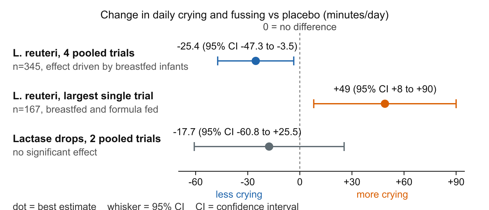

## The crying with no cause

*One baby in five cries inconsolably through its first months — healthy, well fed, nothing a doctor can find. Seventy years on, the best-supported treatment works only for some babies, some of the time.*

Since paediatrician Morris Wessel's work in the 1950s, colic has meant the "rule of threes": crying or fussing at least three hours a day, three days a week, for three weeks, in an otherwise healthy, well-fed infant [Gutiérrez-Castrellón et al. 2017](https://doi.org/10.1097/md.0000000000009375). The modern [Rome IV](https://en.wikipedia.org/wiki/Rome_process) criteria, the field's consensus rulebook, dropped the stopwatch: prolonged crying without obvious cause, in a thriving infant [Benninga et al. 2016](https://doi.org/10.1053/j.gastro.2016.02.016).

The two most rigorous community surveys put the incidence between 5% and 19%, with no link to sex, social class, or feeding type [Lucassen 2001](https://doi.org/10.1136/adc.84.5.398). Crying peaks around six weeks and fades by three to four months [Gutiérrez-Castrellón et al. 2017](https://doi.org/10.1097/md.0000000000009375). "Self-limiting" is cold comfort at 3 a.m. Mothers reporting over twenty minutes of inconsolable crying a day had four times the odds of depressive symptoms after birth ([odds ratio](https://en.wikipedia.org/wiki/Odds_ratio) 4.0, 95% [confidence interval](https://en.wikipedia.org/wiki/Confidence_interval) 2.0–8.1) [Radesky et al. 2013](https://doi.org/10.1542/peds.2012-3316); in a Dutch survey of 3,259 families, 5.6% of parents admitted having smothered, slapped, or shaken their baby because of its crying [Reijneveld et al. 2004](https://doi.org/10.1016/s0140-6736%2804%2917191-2). Does anything work?

### The suspect in the gut

For decades the prime suspects were gas, temperament, and anxious parenting; none was convicted [Zeevenhooven et al. 2018](https://doi.org/10.1038/s41575-018-0008-7). The investigation turned to the [gut microbiota](https://en.wikipedia.org/wiki/Human_gastrointestinal_microbiota) — the trillions of bacteria in a newborn's intestine. In a 65-infant case-control study, colicky babies had elevated faecal [calprotectin](https://en.wikipedia.org/wiki/Calprotectin) — a protein marking gut inflammation — whatever their feeding mode, plus fewer of the *Bifidobacterium* species thought to keep the infant gut calm [Rhoads et al. 2018](https://doi.org/10.1016/j.jpeds.2018.07.042). In 118 colicky infants whose stool was sequenced, bacterial groups tracked with crying severity, and the baseline mix partly predicted who would still cry a month on [Loughman et al. 2021](https://doi.org/10.1017/s2040174420000227). A stranger lead: children who were colicky babies had five- to six-fold higher odds of [migraine](https://en.wikipedia.org/wiki/Migraine) (odds ratio 6.5, 95% CI 4.6–8.9) in a meta-analysis — some colic may be an early pain syndrome, not a gut problem at all [Gelfand et al. 2015](https://doi.org/10.1177/0333102414534326). The honest summary: mechanisms are plural, evidence suggestive, no single cause established [Zeevenhooven et al. 2018](https://doi.org/10.1038/s41575-018-0008-7).

### Five drops a day

Could topping up the flora help? That hope made a [probiotic](https://en.wikipedia.org/wiki/Probiotic) — live bacteria, five oily drops a day — the centre of colic research. The strain is *[Lactobacillus reuteri](https://en.wikipedia.org/wiki/Limosilactobacillus_reuteri)* DSM 17938: a network meta-analysis of 32 randomised trials covering 2,242 infants ranked it the best-supported of nine treatment approaches, ahead of dietary changes, drugs, herbs, and manipulation [Gutiérrez-Castrellón et al. 2017](https://doi.org/10.1097/md.0000000000009375), [Anabrees et al. 2013](https://doi.org/10.1186/1471-2431-13-186). The most careful accounting pooled raw data from 345 infants in four double-blind trials: at day 21, probiotic babies cried or fussed 25 minutes less per day (adjusted mean difference −25.4, 95% CI −47.3 to −3.5), with a breastfed [number needed to treat](https://en.wikipedia.org/wiki/Number_needed_to_treat) of just 2.6 [Sung et al. 2018](https://doi.org/10.1542/peds.2017-1811).

### The Australian spoiler

Then Melbourne researchers ran the largest, most rigorous trial yet: 167 infants — crucially, formula-fed as well as breastfed — same strain, same dose, double-blinded, with a validated cry diary [Sung et al. 2014](https://doi.org/10.1136/bmj.g2107). The probiotic failed. At one month the treated babies actually fussed *more* than the placebo group (49 minutes a day, 95% CI 8–90), the excess concentrated in formula-fed infants, with no benefit for sleep, maternal mental health, or gut inflammation markers [Sung et al. 2014](https://doi.org/10.1136/bmj.g2107). The pooled individual-level data reconcile it: benefit in breastfed infants, none in formula-fed — an oddity nobody has explained — plotted in [Figure 1](#fig-colic-treatments) [Sung et al. 2018](https://doi.org/10.1542/peds.2017-1811). Europe's paediatric gastroenterology society now recommends the strain for breastfed colicky babies, and nothing for the rest [Szajewska et al. 2023](https://doi.org/10.1097/mpg.0000000000003633).

The rest of the treatment shelf is thinner. In systematic reviews the anti-gas staple simethicone showed no benefit, nor did proton pump inhibitors [Ellwood et al. 2020](https://doi.org/10.1136/bmjopen-2019-035405). A Cochrane review found dietary changes — hypoallergenic formulas, low-allergen maternal diets — backed only by low-quality evidence [Gordon et al. 2018](https://doi.org/10.1002/14651858.cd011029.pub2). Lactase drops made no significant difference in pooled trials (mean difference −17.7 minutes a day, 95% CI −60.8 to 25.5) [Kozłowska‐Jalowska et al. 2024](https://doi.org/10.1002/jpn3.12144). Chiropractic and osteopathic manipulation seemed to reduce crying, but the effect evaporated in trials where parents were blinded [Dobson et al. 2012](https://doi.org/10.1002/14651858.cd004796.pub2).

| What parents try | Best evidence says | Certainty |
|---|---|---|
| *L. reuteri* DSM 17938 (breastfed) | ~25 min/day less crying; NNT 2.6 [Sung et al. 2018](https://doi.org/10.1542/peds.2017-1811) | Moderate |
| *L. reuteri* DSM 17938 (formula-fed) | No benefit; possibly more fussing [Sung et al. 2014](https://doi.org/10.1136/bmj.g2107) | Moderate |
| Dietary change | Possible effect, low-quality trials [Gordon et al. 2018](https://doi.org/10.1002/14651858.cd011029.pub2) | Low |
| Lactase drops | No significant effect [Kozłowska‐Jalowska et al. 2024](https://doi.org/10.1002/jpn3.12144) | Low |
| Simethicone | No benefit [Ellwood et al. 2020](https://doi.org/10.1136/bmjopen-2019-035405) | Moderate |
| Spinal manipulation | No effect in blinded trials [Dobson et al. 2012](https://doi.org/10.1002/14651858.cd004796.pub2) | Low |

**Figure 1. The best colic treatment helps some babies — and failed its biggest test.** Each whisker is one experiment's verdict in minutes of crying per day versus placebo: the probiotic ahead in pooled trials, behind in the largest, lactase astride zero — three populations, three verdicts, not one average [Sung et al. 2018](https://doi.org/10.1542/peds.2017-1811), [Sung et al. 2014](https://doi.org/10.1136/bmj.g2107), [Kozłowska‐Jalowska et al. 2024](https://doi.org/10.1002/jpn3.12144).

### The verdict, for now

Circle back to that bureaucratic definition: its one unqualified truth is that colic ends, by three to four months, in virtually all infants [Gutiérrez-Castrellón et al. 2017](https://doi.org/10.1097/md.0000000000009375), [Hjern et al. 2020](https://doi.org/10.1111/apa.15247). Adolescents with a colic history report more indigestion-type complaints (adjusted odds ratio 2.49, 95% CI 1.18–5.25) [Zeevenhooven et al. 2024](https://doi.org/10.1111/apa.17215), but long-term evidence shows associations — gut complaints, migraine-type headaches — rather than proven lasting harm [Indrio et al. 2023](https://doi.org/10.3390/nu15030615) — which is why every guideline starts with reassurance, not a prescription [Ellwood et al. 2020](https://doi.org/10.1136/bmjopen-2019-035405). What would settle it is a trial big enough to say *which* babies the bacteria help and why breast milk matters; until then, the most evidence-based treatment remains the calendar.

**Sources**

**Anabrees J, Indrio F, Paes B, AlFaleh K (2013)** Probiotics for infantile colic: a systematic review. *BMC Pediatrics*. https://doi.org/10.1186/1471-2431-13-186

**Benninga MA, Nurko S, Faure C, Hyman PE, St. James Roberts I, Schechter NL (2016)** Childhood Functional Gastrointestinal Disorders: Neonate/Toddler. *Gastroenterology*. https://doi.org/10.1053/j.gastro.2016.02.016

**Dobson D, Lucassen PL, Miller JJ, Vlieger AM, Prescott P, Lewith G (2012)** Manipulative therapies for infantile colic. *Cochrane Database of Systematic Reviews*. https://doi.org/10.1002/14651858.cd004796.pub2

**Ellwood J, Draper-Rodi J, Carnes D (2020)** Comparison of common interventions for the treatment of infantile colic: a systematic review of reviews and guidelines. *BMJ Open*. https://doi.org/10.1136/bmjopen-2019-035405

**Gelfand AA, Goadsby PJ, Allen IE (2015)** The relationship between migraine and infant colic: A systematic review and meta-analysis. *Cephalalgia*. https://doi.org/10.1177/0333102414534326

**Gordon M, Biagioli E, Sorrenti M, Lingua C, Moja L, Banks SS, Ceratto S, Savino F (2018)** Dietary modifications for infantile colic. *Cochrane Database of Systematic Reviews*. https://doi.org/10.1002/14651858.cd011029.pub2

**Gutiérrez-Castrellón P, Indrio F, Bolio-Galvis A, Jiménez-Gutiérrez C, Jimenez-Escobar I, López-Velázquez G (2017)** Efficacy of Lactobacillus reuteri DSM 17938 for infantile colic. *Medicine*. https://doi.org/10.1097/md.0000000000009375

**Hjern A, Lindblom K, Reuter A, Silfverdal S (2020)** A systematic review of prevention and treatment of infantile colic. *Acta Paediatrica*. https://doi.org/10.1111/apa.15247

**Indrio F, Dargenio VN, Francavilla R, Szajewska H, Vandenplas Y (2023)** Infantile Colic and Long-Term Outcomes in Childhood: A Narrative Synthesis of the Evidence. *Nutrients*. https://doi.org/10.3390/nu15030615

**Kozłowska‐Jalowska A, Stróżyk A, Horvath A, Szajewska H (2024)** Effect of lactase supplementation on infant colic: Systematic review of randomized controlled trials. *Journal of Pediatric Gastroenterology and Nutrition*. https://doi.org/10.1002/jpn3.12144

**Loughman A, Quinn T, Nation ML, Reichelt A, Moore RJ, Van TTH, Sung V, Tang MLK (2021)** Infant microbiota in colic: predictive associations with problem crying and subsequent child behavior. *Journal of Developmental Origins of Health and Disease*. https://doi.org/10.1017/s2040174420000227

**Lucassen PLBJ (2001)** Systematic review of the occurrence of infantile colic in the community. *Archives of Disease in Childhood*. https://doi.org/10.1136/adc.84.5.398

**Radesky JS, Zuckerman B, Silverstein M, Rivara FP, Barr M, Taylor JA, Lengua LJ, Barr RG (2013)** Inconsolable Infant Crying and Maternal Postpartum Depressive Symptoms. *Pediatrics*. https://doi.org/10.1542/peds.2012-3316

**Reijneveld SA, van der Wal MF, Brugman E, Hira Sing RA, Verloove-Vanhorick SP (2004)** Infant crying and abuse. *The Lancet*. https://doi.org/10.1016/s0140-6736%2804%2917191-2

**Rhoads JM, Collins J, Fatheree NY, Hashmi SS, Taylor CM, Luo M, Hoang TK, Gleason WA, Van Arsdall MR, Navarro F, Liu Y (2018)** Infant Colic Represents Gut Inflammation and Dysbiosis. *The Journal of Pediatrics*. https://doi.org/10.1016/j.jpeds.2018.07.042

**Sung V, Hiscock H, Tang MLK, Mensah FK, Nation ML, Satzke C, Heine RG, Stock A, Barr RG, Wake M (2014)** Treating infant colic with the probiotic Lactobacillus reuteri: double blind, placebo controlled randomised trial. *BMJ*. https://doi.org/10.1136/bmj.g2107

**Sung V, D’Amico F, Cabana MD, Chau K, Koren G, Savino F, Szajewska H, Deshpande G, Dupont C, Indrio F, Mentula S, Partty A, Tancredi D (2018)** Lactobacillus reuteri to Treat Infant Colic: A Meta-analysis. *Pediatrics*. https://doi.org/10.1542/peds.2017-1811

**Szajewska H, Berni Canani R, Domellöf M, Guarino A, Hojsak I, Indrio F, Lo Vecchio A, Mihatsch WA, Mosca A, Orel R, Salvatore S, Shamir R, van den Akker CHP, van Goudoever JB, Vandenplas Y, Weizman Z, ESPGHAN Special Interest Group on Gut Microbiota and Modifications, Canani RB, Guarino A, Dinleyci EC, Domellöf M, Indrio F, Hojsak I, Gutiierez P, Kolacek S, Mihatsch WA, Mosca A, Orel R, Salvatore S, Shamir R, Szajewska H, Vandenplas Y, van den Akker CHP, van Goudoever JB, Weizman Z (2023)** Probiotics for the Management of Pediatric Gastrointestinal Disorders. *Journal of Pediatric Gastroenterology and Nutrition*. https://doi.org/10.1097/mpg.0000000000003633

**Zeevenhooven J, Browne PD, L’Hoir MP, de Weerth C, Benninga MA (2018)** Infant colic: mechanisms and management. *Nature Reviews Gastroenterology & Hepatology*. https://doi.org/10.1038/s41575-018-0008-7

**Zeevenhooven J, Zeevenhooven L, Biesbroek A, Schappin R, Vlieger AM, van Sleuwen BE, L'Hoir MP, Benninga MA (2024)** Functional gastrointestinal disorders, quality of life, and behaviour in adolescents with history of infant colic. *Acta Paediatrica*. https://doi.org/10.1111/apa.17215

